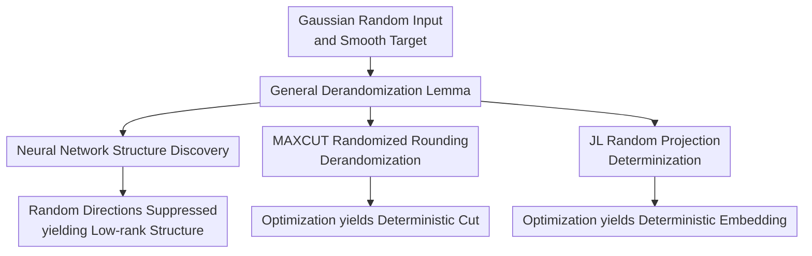

# A Derandomization Framework for Structure Discovery: Applications in Neural Networks and Beyond

**Conference**: ICLR2026  
**OpenReview**: [https://openreview.net/forum?id=dtIf5HsOIn](https://openreview.net/forum?id=dtIf5HsOIn)  
**Code**: https://github.com/TPMT26/StructureDiscovery  
**Area**: learning theory  
**Keywords**: structure discovery, derandomization, second-order stationary point, implicit regularization, Johnson-Lindenstrauss

## TL;DR
This paper proposes a general derandomization lemma based on $\rho$-SOSP, proving that under Gaussian inputs, smooth targets, and minimal weight regularization, second-order stationary points automatically suppress random linear components. This mechanism explains the low-rank structure discovery of first-layer weights in neural networks and extends to deterministic constructions for MAXCUT rounding and Johnson-Lindenstrauss embeddings.

## Background & Motivation
**Background**: A long-standing problem in neural network theory is explaining why models learn low-dimensional effective structures from high-dimensional random inputs. The teacher-student setting is a common framework for studying this: labels depend only on a low-dimensional "teacher" subspace, while the student network starts training from high-dimensional inputs. If the trained first-layer weights primarily reside in the teacher subspace, the network is said to have discovered the hidden structure.

**Limitations of Prior Work**: Existing works like Mousavi-Hosseini et al. have demonstrated the emergence of low-rank structures in two-layer networks under SGD and strong regularization. However, these conditions are restrictive: the network architecture is limited, partial parameters are frozen, and loss functions or training dynamics require special handling. Moreover, they often rely on strong regularization to suppress irrelevant directions, making the conclusion appear more as a property of a specific training algorithm and model family rather than a universal mechanism for structure discovery.

**Key Challenge**: The core objective is to explain "why irrelevant random directions vanish upon reaching a reasonable stationary point," rather than focusing on "why a specific SGD trajectory vanishes under strong regularization." Looking only at first-order stationary points, high-rank saddle points and poor optima may still exist. Furthermore, if regularization is too strong, it becomes difficult to distinguish whether structure discovery arises from the target geometry or from artificially forcing weights to be small.

**Goal**: The authors reframe the problem as an abstract derandomization task: given a target such as $\mathbb{E}_x[g_\theta(Wx+b)]+\lambda\|W\|_F^2$, can it be shown that $W$ must be small as long as the solution is optimized to an approximate second-order stationary point? In neural networks, $W$ corresponds to first-layer weights in directions orthogonal to the teacher subspace; in MAXCUT and JL, $W$ corresponds to the variance or random matrix components in randomized rounding or projections.

**Key Insight**: A critical observation is that second-order stationary points (SOSPs) require not only a small gradient but also the absence of significant negative curvature in the Hessian. This condition excludes many saddle points that first-order conditions cannot. The authors further utilize Stein's Lemma to connect the first-order conditions regarding random input $x$ with the second-order curvature regarding bias $b$, yielding a unified conclusion that "random linear terms are suppressed at second-order stationary points."

**Core Idea**: By using $\rho$-SOSP and a minimal $\lambda\|W\|_F^2$ regularization, the authors decouple "structure discovery" from specific SGD trajectories. They prove that any sufficiently second-order stable solution will automatically "derandomize," effectively reducing the weights of random directions in the objective to near zero.

## Method

### Overall Architecture
The technical roadmap of the paper is not to design a new network but to prove a transferable theoretical template. First, a general derandomization lemma is proved: for Gaussian random variables $x$ and the objective $f(W,b;\theta)=\mathbb{E}_x[g_\theta(Wx+b)]+\lambda\|W\|_F^2$, any $\rho$-SOSP will result in a small $\|W\|_F$. Then, the irrelevant subspaces in neural networks, randomized rounding in MAXCUT, and random projections in JL are rewritten into this form.

Here, "derandomization" is not simply fixing the random seed, but rather optimizing distribution parameters (mean and variance/weights) so that the solution naturally collapses to a deterministic or low-randomness state at second-order stability. For neural networks, this manifests as the first-layer weights in the orthogonal teacher subspace approaching zero. For combinatorial optimization and dimensionality reduction, it means constructions originally dependent on random rounding/projections can be replaced by optimized deterministic objects.

### Key Designs
**1. $\rho$-SOSP Derandomization Lemma: Suppressing Random Linear Terms via Second-Order Stability**

The core object of the paper is:
$$
f(W,b;\theta)=\mathbb{E}_x[g_\theta(Wx+b)]+\lambda\|W\|_F^2,
$$
where $x\sim\mathcal{N}(0,I_d)$, $W\in\mathbb{R}^{k\times d}$, $b\in\mathbb{R}^k$, and $g_\theta$ is a smooth function with a Lipschitz Hessian. The authors define a $\rho$-SOSP as a point satisfying $\|\nabla f(x^*)\|_2\le \rho$ and $\lambda_{\min}(\nabla^2 f(x^*))\ge -\sqrt{K\rho}$, where $K$ is the Hessian Lipschitz constant. This definition is stronger than a first-order stationary point as it requires no significant direction of downward curvature.

Key Lemma 3.1 concludes that as long as $\lambda>\sqrt{K\rho}/2$, any $\rho$-SOSP satisfies:
$$
\|W\|_F \le \frac{\rho}{2\lambda-\sqrt{K\rho}}.
$$
When $\rho=0$, a perfect SOSP directly implies $W=0$. The intuition behind the proof is that Stein's Lemma relates the first-order derivative in the $W$ direction to the second-order derivative in the $b$ direction under Gaussian input. If $W$ is still large, either the gradient is not small enough, or the Hessian will exhibit sufficient negative curvature, violating the $\rho$-SOSP condition. The role of the minimal regularization term is not to force weights down through heavy penalties, but to break the degeneracy when $g_\theta(Wx+b)$ is completely insensitive to certain $W$, allowing second-order conditions to select low-randomness solutions.

**2. Trainable Bias: Explaining Structure Discovery with Weak Regularization**

Past analyses often froze the bias for simplification, but this work argues that such an approach makes the problem unnatural. A one-dimensional toy example illustrates this: if the goal is to fit a constant $1$ using $\mathrm{ReLU}^3(wx+b)$, requiring $w\to0$ with frozen $b=0$ necessitates strong regularization. However, if $b$ is trainable, the model can explain the output via $b\to1$, allowing $w$ to shrink to zero even under minimal regularization.

The implication here is significant: structure discovery is not about "all parameters being suppressed," but rather "irrelevant directions coupled with random inputs being suppressed." Since the bias does not carry input randomness, allowing it to be trained lets the model express necessary constants or low-dimensional signals, while regularization only needs to act slightly on the random directions in $W$. Because the $\rho$-SOSP is defined jointly for all parameters, the authors can allow networks of arbitrary depth/width with all parameters trainable.

**3. Neural Network Structure Discovery: Re-characterizing Irrelevant Subspaces**

In the teacher-student setting, labels $y=h(Ux;\epsilon)$ depend only on the low-dimensional teacher subspace $U=\mathrm{span}(u_1,\ldots,u_k)$. For the student's first-layer weights $W$, the authors decompose each row into a parallel component $W_\parallel$ and an orthogonal component $W_\perp$, such that:
$$
Wx+b = W_\parallel x_\parallel + W_\perp x_\perp + b.
$$
Since the label only depends on $x_\parallel$, the irrelevant random perturbation is introduced by $W_\perp x_\perp$. The authors rewrite the regularized risk as:
$$
R(W_\perp,b;\theta')=\mathbb{E}_{x_\perp}[\ell'_{\theta'}(W_\perp x_\perp+b)]+\lambda\|W_\perp\|_F^2,
$$
which fits perfectly into the form of Lemma 3.1.

Theorem 4.1 then shows that in smooth networks with smooth losses and Gaussian inputs, any $\rho$-SOSP satisfies:
$$
\|W_\perp\|_F \le \frac{\rho}{2\lambda-\sqrt{K\rho}}.
$$
In other words, upon training to a sufficiently good SOSP, the first-layer weights will align with the teacher subspace, forming a low-rank structure. Theorem 4.2 further connects this to Perturbed Gradient Descent (PGD): by choosing $\lambda=(\sqrt{K\rho}+\Delta)/2$, PGD reaches a point where $\|W_\perp\|_F<\varepsilon$ in polynomial steps. For non-smooth ReLU, the paper utilizes a smooth approximation $\mathrm{ReLU}_\iota(x)=\frac{1}{\iota}\log(1+e^{\iota x})$.

**4. Cross-domain Applications: Turning the "Variance Component" into an Optimizable Variable**

The most interesting aspect is that Lemma 3.1 is not limited to neural networks. For MAXCUT, the Goemans-Williamson algorithm solves an SDP and then samples Gaussian vectors $z$ for random hyperplane rounding. This paper introduces a mean $\mu$, optimizes the expected cut objective with a smooth indicator, and lets the random rounding component collapse near an SOSP. Theorem 5.2 proves the resulting deterministic cut still achieves $\mathrm{OPT}(\alpha-O(\epsilon))$, where $\alpha=0.878$ is the classic GW approximation factor.

For Johnson-Lindenstrauss (JL) embeddings, the traditional approach samples from a random Gaussian matrix. The authors instead optimize a matrix distribution $A\sim\mathcal{N}(M, \Sigma)$, penalizing the probability that the maximum distortion exceeds a threshold, with a regularization term pulling $\Sigma\to 0$. Theorem 5.5 shows the optimized mean $M$ satisfies the JL guarantee with distortion $O(\epsilon)$. These applications demonstrate that any randomized algorithm that can be expressed as "random linear term + smooth expected target + weak regularization" can potentially be derandomized via optimization.

### Loss & Training
The paper does not propose a new loss function but analyzes a class of regularized expected objectives. The core regularizer is always $\lambda\|W\|_F^2$ or its equivalent for variance components, with the key requirement being $\lambda>\sqrt{K\rho}/2$. This means that to use smaller regularization, a more precise $\rho$-SOSP is required; the authors emphasize that $\rho$ can be treated as a precision parameter, trading optimization steps for weaker regularization.

For optimization, the paper primarily references Perturbed Gradient Descent (PGD): adding noise when the gradient norm is small but the point is near a saddle, thereby escaping negative curvature and converging to a $\rho$-SOSP with high probability. In NN experiments, the authors use PGD with Gaussian noise injected into $W$ and $b$ when the gradient is less than $10^{-6}$, training for $10,000$ steps with a first-layer weight decay coefficient of $10^{-5}$.

## Key Experimental Results

### Main Results
The primary contribution is theoretical, with experiments serving as phenomenological verification. The core theoretical/applied results are summarized below.

| Scenario | Setting | Conclusion (Ours) | Baseline / Previous Result | Significance |
|----------|---------|-------------------|----------------------------|--------------|
| General Derandomization | $\mathbb{E}_x[g_\theta(Wx+b)]+\lambda\|W\|_F^2$, $x\sim\mathcal{N}(0,I)$ | Any $\rho$-SOSP satisfies $\|W\|_F\le \rho/(2\lambda-\sqrt{K\rho})$ | First-order points cannot exclude high-randomness saddles | Unified lemma for the entire paper |
| NN Structure Discovery | Smooth NN of arbitrary size, all parameters trainable | $\|W_\perp\|_F<\varepsilon$, first-layer weights align with teacher subspace | Previous work limited to 2-layer NN, strong reg., frozen params | Relaxes conditions for structure discovery |
| MAXCUT | Derandomization of post-SDP random rounding | Deterministic cut is at least $\mathrm{OPT}(0.878-O(\epsilon))$ | GW random rounding guarantees $0.878$ | Matches classic factor up to smoothing error |
| JL Embedding | Optimizing projection distribution $A\sim\mathcal{N}(M,\Sigma)$ | Returns deterministic $M$ satisfying JL guarantee, distortion $O(\epsilon)$ | Standard Gaussian projection gives high-prob. guarantee | Transitions from existence to learnable construction |

### Ablation Study
Rather than modular ablations, the paper uses toy examples to demonstrate the necessity of key conditions.

| Configuration | Key Metric | Description |
|---------------|------------|-------------|
| Frozen bias, toy constant target | Requires large $\lambda$ for $w^*\to0$ | Frozen bias forces $w$ to explain constants that could be handled by bias, requiring strong reg. to suppress. |
| Trainable bias, toy constant target | $w^*\to0$ under very small $\lambda$, $b$ absorbs constant | Supports the view of "suppressing random directions while retaining non-random expression." |
| NN Single-index experiment | $d=2$, width $h=1000$, $T=10000$, $\lambda=10^{-5}$ | Rows of the first-layer weight matrix align from random initialization to the principal subspace $\theta=\frac{1}{\sqrt{2}}(1,1)^\top$. |
| MAXCUT Appendix Exp | Random graph $m=15$, edge prob $0.6$, exact OPT cut = 41 | Optimization converges to the brute-force optimal cut; classic random baseline $\approx 36$. |
| JL Appendix Exp | $n=100, d=500, k=30$, optimizing $M, \Sigma$ | Max distortion decreases steadily, outperforming the mean and min of 1000 standard random Gaussian projections. |

### Key Findings
- Structure discovery can be decoupled from "specific training dynamics": any solution that is a sufficiently good $\rho$-SOSP will suppress random directions.
- Trainable bias is not a detail but a necessity for weak regularization; freezing bias mistakenly frames structure discovery as a strong regularization phenomenon.
- For NN, the paper proves structure discovery but not final generalization; the link between low-rank structure and generalization relies on existing literature.
- Both MAXCUT and JL experiments show that the optimization process causes variance/randomness to decrease gradually, consistent with the theoretical picture of derandomization via second-order stability.

## Highlights & Insights
- Explaining structure discovery via $\rho$-SOSP is elegant: while first-order points only guarantee a "small gradient," SOSPs exclude significant saddle points, making them better descriptors of stable solutions reached by gradient methods.
- Stein's Lemma acts as a bridge: it connects first-order derivatives from Gaussian inputs to second-order curvature in the bias direction, making "disappearing randomness" a provable bound on $\|W\|_F$ rather than just an intuition.
- The shift from "strong regularization leads to low-rank" to "minimal regularization + second-order stability leads to low-rank" is insightful, suggesting that implicit regularization should be analyzed via the landscape's stable point set rather than just the algorithm.
- The MAXCUT and JL applications present a unified perspective: many randomized algorithms sample from a distribution family; by treating distribution parameters as optimizable variables, the process may naturally collapse toward deterministic good solutions.

## Limitations & Future Work
- The framework relies heavily on the Gaussian input assumption, as Stein's Lemma is the core tool. Extending this to non-Gaussian or discrete distributions is not straightforward.
- NN results require smoothness and Hessian Lipschitz conditions. While GELU or smoothed ReLU fit, many modern components do not strictly satisfy these.
- The paper proves structure discovery, not end-to-end generalization. While a small $W_\perp$ implies dimensionality reduction, converting this into finite-sample generalization bounds requires additional assumptions.
- Experiments are small-scale: $d=2$ for NN, 15-node graphs for MAXCUT. They illustrate the theory but do not yet prove the framework's utility as an algorithmic tool in large-scale practical training.
- Future directions include replacing Gaussian assumptions with more general score-function conditions and connecting structure discovery bounds directly to sample complexity.

## Related Work & Insights
- **vs Mousavi-Hosseini et al. 2023**: Previous work showed low-rank structure in two-layer networks under strong regularization and SGD. This work relaxes the conditions to arbitrary NN depth, all parameters trainable, any smooth loss, and minimal regularization.
- **vs Implicit Regularization Theory**: Traditional theory analyzes GD/SGD trajectories toward min-norm or max-margin solutions. This work is a landscape-level result, proving that the set of stable points itself possesses low-randomness structures.
- **vs Goemans-Williamson Rounding**: GW uses random hyperplanes to convert SDP solutions to cuts. This work parameterizes and optimizes that randomness, providing the first optimization-based derandomization view that matches the $0.878$ factor.
- **vs Johnson-Lindenstrauss Projection**: Standard JL emphasizes high-probability distance preservation. This work optimizes the projection distribution parameters so variance vanishes, leading to a data-dependent deterministic projection.

## Rating
- Novelty: ⭐⭐⭐⭐⭐ Unified explanation of NN structure, MAXCUT, and JL via a single $\rho$-SOSP derandomization lemma is highly original.
- Experimental Thoroughness: ⭐⭐⭐ Theoretical proofs are solid, but experiments are limited to small-scale diagnostic verifications.
- Writing Quality: ⭐⭐⭐⭐ The main line of reasoning is clear and theorem relationships are well-defined.
- Value: ⭐⭐⭐⭐⭐ Offers significant insights for both learning theory and randomized algorithm derandomization.

<!-- RELATED:START -->

## Related Papers

- [\[ICLR 2026\] Some Neural Networks Inherently Preserve Subspace Clustering Structure](some_neural_networks_inherently_preserve_subspace_clustering_structure.md)
- [\[ICLR 2026\] Why High-Rank Neural Networks Also Generalize?: An Algebraic Framework Based on RKHS](why_high-rank_neural_networks_generalize_an_algebraic_framework_with_rkhss.md)
- [\[ICLR 2026\] The Logical Expressiveness of Topological Neural Networks](the_logical_expressiveness_of_topological_neural_networks.md)
- [\[ICLR 2026\] From Neural Networks to Logical Theories: The Correspondence between Fibring Modal Logics and Fibring Neural Networks](from_neural_networks_to_logical_theories_the_correspondence_between_fibring_moda.md)
- [\[ICLR 2026\] Reducing Symmetry Increase in Equivariant Neural Networks](reducing_symmetry_increase_in_equivariant_neural_networks.md)

<!-- RELATED:END -->
