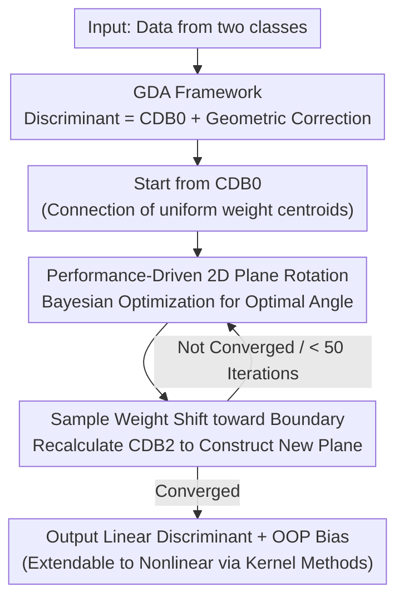

# A Generalized Geometric Theoretical Framework of Centroid Discriminant Analysis for Linear Classification of Multi-dimensional Data

**Conference**: ICLR 2026  
**OpenReview**: [https://openreview.net/forum?id=bp9DOHb1mk](https://openreview.net/forum?id=bp9DOHb1mk)  
**Code**: To be confirmed  
**Area**: Learning Theory / Linear Classifiers / Discriminant Analysis  
**Keywords**: Geometric Discriminant Analysis, Centroid Discriminant Basis, Linear Classification, Bayesian Optimization, Scalability

## TL;DR
This paper proposes a unified theoretical framework called Geometric Discriminant Analysis (GDA), which views a class of linear classifiers as a "connection between two class centroids (CDB0) + geometric corrections under different constraints." It proves that MDC and LDA are special cases of this framework. Based on this, a new classifier, CDA, is designed. Starting from CDB0, CDA performs "performance-driven rotations" on a series of 2D planes using Bayesian optimization. This approach reduces training complexity from cubic (LDA/SVM) to quadratic, achieving better performance, scalability, and stability than LDA/SVM/LR across 27 real-world datasets.

## Background & Motivation
**Background**: Despite the dominance of neural networks, linear classifiers remain preferred in many scenarios. They perform comparably to CNNs on high-dimensional data (e.g., predicting Alzheimer’s from brain MRI), train quickly, resist overfitting, and offer interpretable decision boundaries. Mainstream linear classifiers rely on different principles: the Minimum Distance Classifier (MDC) uses the perpendicular bisector of two centroids with the lowest training complexity $O(NM)$; Fisher Linear Discriminant (LDA) maximizes the between-to-within variance ratio with $O(NM^2+M^3)$ complexity; linear SVM seeks the maximum margin with an original complexity of $O(N^3)$; and Logistic Regression (LR) is based on statistical likelihood.

**Limitations of Prior Work**: High-performance methods like LDA and SVM are computationally expensive (cubic complexity), making them impractical for large-scale data. Conversely, MDC, which has the lowest complexity, suffers from limited performance due to its overly simple decision boundaries. While various methods exist, a unified perspective to understand "what exactly they are correcting" is missing.

**Key Challenge**: A long-standing trade-off exists between scalability and predictive performance—efficient methods are inaccurate, while accurate methods are expensive.

**Goal**: (1) Establish a geometric theoretical framework capable of unifying various linear classifiers; (2) design a new classifier within this framework that balances performance and scalability.

**Key Insight**: The authors observe that any binary linear discriminant can be decomposed into a "basis" plus several "corrections." The most natural basis is the vector connecting the centroids of the two classes—termed the Centroid Discriminant Basis 0 (CDB0). Different classifiers essentially overlay geometric corrections (intuitively understood as rotations of CDB0) onto this basis under specific constraints.

**Core Idea**: Use "CDB0 + geometric corrections" to uniformly describe linear classifiers (GDA framework), then implement this correction process as an efficient, interpretable, quadratic-complexity algorithm (CDA) using "performance-driven 2D plane rotations + Bayesian optimization."

## Method

### Overall Architecture
The work consists of two layers: the GDA theoretical framework and the CDA algorithm.

The core assertion of GDA is that for binary classification, any linear discriminant $w$ can be expressed as the sum of the centroid discriminant basis $w_{\text{CDB0}}$ and several geometric correction terms:

$$w_{\text{GD}} = \gamma\,(w_{\text{CDB0}} + C_1 w_{\text{CDB0}} + C_2 w_{\text{CDB0}} + \cdots + C_n w_{\text{CDB0}})$$

Where $w_{\text{CDB0}}=[\Delta\mu_x,\Delta\mu_y]^T$ is the unit vector pointing from the negative class centroid to the positive class centroid (calculated using uniform sample weights, i.e., arithmetic means). $\gamma\neq 0$ is a scale-independent normalization constant (discriminant directions are scale-invariant in GDA), and $C_i$ are geometric correction operators of various orders. Different classifiers impose different constraints on $C_i$: MDC sets all corrections to zero (the discriminant is CDB0 itself); LDA retains only the first-order basis term and a second-order covariance correction $C_1$, with higher-order terms set to zero.

CDA is a specific algorithm constructed within the GDA framework. Starting from CDB0, it iteratively rotates the discriminant direction on a series of 2D planes toward the direction with the "highest performance score." The final discriminant can be mapped back to the GDA standard form $w^{(n)}_{\text{CDA}}=\gamma(w_{\text{CDB0}}+C_1 w_{\text{CDB0}})$, where $C_1=\prod_n A_{\text{cda}}-I$ is the correction operator accumulated from $n$ single-step rotation operators $A_{\text{cda}}$.

### Key Designs

**1. GDA Theoretical Framework: Unifying Linear Classifiers as "Centroid Connection + Geometric Correction"**

This design addresses the pain point that the variety of linear classifier forms makes it difficult to understand their intrinsic connections. The authors perform a clean algebraic derivation starting from LDA. LDA maximizes the ratio of between-class to within-class variance after projection $S=\sigma_b^2/\sigma_w^2=(w^T\nu_1-w^T\nu_0)^2/\big(w^T(\Sigma_0+\Sigma_1)w\big)$, where the optimal solution satisfies $N\Sigma\gamma w_{\text{LD}}=\nu_1-\nu_0$, i.e., $w_{\text{LD}}=\gamma\Sigma^{-1}(\mu_1-\mu_0)$. Substituting the inverse of the $2\times2$ covariance $\Sigma=\Sigma_0+\Sigma_1$, and letting $c_{xy}=\sigma_{xy}^2/\sigma_{yy}^2$ and $c_{xx/yy}=\sigma_{xx}^2/\sigma_{yy}^2-1$, the variance ratio solution can be compressed into:

$$w_{\text{GD}}=w_{\text{LD}}=\gamma\Big(\begin{bmatrix}\Delta\mu_x\\\Delta\mu_y\end{bmatrix}+\begin{bmatrix}0 & -c_{xy}\\ -c_{xy} & c_{xx/yy}\end{bmatrix}\begin{bmatrix}\Delta\mu_x\\\Delta\mu_y\end{bmatrix}\Big)=\gamma(w_{\text{CDB0}}+C_{\text{correction}}\,w_{\text{CDB0}})$$

This shows that the LDA discriminant equals CDB0 plus a geometric correction determined by the covariance, which can be intuitively understood as a rotation of CDB0. Degenerating various assumptions reveals other classifiers: when variances of two variables are equal ($c_{xx/yy}=0$) and class covariances are identical, $c_{xy}$ becomes the within-class Pearson correlation $r_{xy}$. If $r_{xy}=0$ (or classes are symmetric such that $c_{xy}=0$), then $w_{\text{LD}}=[\Delta\mu_x,\Delta\mu_y]^T=w_{\text{CDB0}}$, which is exactly MDC (excluding bias). The value of this derivation lies in quantifying why LDA is more accurate than MDC: LDA applies an additional covariance-related rotation correction to CDB0. This generalizes to a framework (Eq. 10) that can overlay any number of correction terms with arbitrary constraints. GDA itself is a framework and does not provide global convergence guarantees; such guarantees must be proven for each instantiated classifier.

**2. CDA: Performance-Driven Continuous 2D Plane Rotations**

While GDA provides the "correction = rotation" perspective, it does not specify how to find the optimal rotation. CDA starts the discriminant direction from CDB0 and continuously rotates it on a sequence of 2D planes in directions with a high probability of better performance. Here, CDB is generalized as a unit vector of the difference between weighted centroids (CDB0 is a special case with uniform weights). All possible weights span the search space for CDB. Each rotation occurs within a 2D plane spanned by two vectors: the first vector, CDB1 (equal to CDB0 in the first round), and the second vector, CDB2, recalculated from shifted sample weights. The optimal rotation angle within the plane is searched using Bayesian Optimization (BO). The resulting optimal discriminant is recorded as CDA and serves as CDB1 for the next round. The key is that each rotation step explicitly selects and refines the direction that maximizes the performance score, making the optimization objective transparent and providing CDA with intrinsic interpretability. Training stops when either 50 iterations are reached or the coefficient of variation (CV) of the last 10 performance scores falls below a threshold (convergence). BO single-parameter search is $O(Z^3)$ (where $Z$ is the number of sampling evaluations). CDA allows the number of BO samples to grow from 4 to a maximum of 10 over iterations. The authors also suggest Fibonacci search as a faster alternative (CDA-Fibonacci) for large-scale data.

**3. Performance Score and Optimal Operating Point (OOP) Bias Search**

A discriminant direction requires a bias to define a decision boundary. Since rotation depends on the criterion of "which direction is better," both rely on the same performance score. CDA sorts sample projections along the discriminant line and takes the midpoints between every two adjacent projections as candidate boundaries. For $N$ samples, there are $N-1$ candidates; the best one is the Optimal Operating Point (OOP). The evaluation uses a performance score $(\text{Fscore}_{\text{pos}}+\text{Fscore}_{\text{neg}}+\text{AC}_{\text{score}})/3$, which balances sensitivity, recall, and specificity. The AC-score provides a fairer evaluation of the bias model under class imbalance. OOP search can be completed in $O(N\log N)$ time, allowing any vector in the CDB space to be assigned a performance score, making "performance-driven rotation" an actionable goal.

**4. Sample Weight Shift Strategy**

To construct the next rotation plane (CDB2), the crucial observation is that samples projected near the decision boundary (OOP) are most likely to overlap with the other class and be misclassified; thus, they should receive higher weights. In each round, distances $d_i=|q_i-\text{oop}|$ are calculated and inverted as $d^r=|d-\min(d)-\max(d)|$ to give more weight to points near the boundary. Since only relative weights matter, L2 normalization is applied, and weights are smoothed over rounds: $\alpha=\alpha\odot d^r/\lVert\alpha\odot d^r\rVert_2$ (where $\odot$ is the element-wise product). Recalculating the difference between centroids using these shifted weights yields CDB2, which spans the new 2D rotation plane with the current CDB1. Intuitively, this causes CDA to focus on difficult boundary samples, gradually rotating the discriminant to improve their classification—this is the source of CDA's superior accuracy over CDB0 while maintaining similar scalability on large data.

### Loss & Training
- **Finalization**: On the optimal plane, CDA uses a null-model statistical test with 100 random CDB lines to refine the discriminant direction.
- **Multi-class**: Employs Error-Correcting Output Codes (ECOC) with one-versus-one encoding (more likely to be linearly separable), with a hinge-loss.
- **Complexity**: CDA overall has quadratic time complexity, lower than the cubic complexity of LDA/SVM. The average number of iterations per dataset is approximately 29.33 (a small constant not affecting complexity order).
- **Nonlinear Extension**: CDA can be naturally extended to a nonlinear version (nCDA) via kernel methods. The primary computational bottleneck is kernel matrix construction (common to all kernel methods), while the core CDA algorithm remains efficient.

## Key Experimental Results

### Main Results (27 Real-World Datasets)
Comparison targets include LDA, five SVM variants (original SVM, dual/primal fast SVM from Liblinear, SVM-SGD, fast SVM with BO tuning), and fast LR, along with the CDB0 baseline (equivalent to MDC with OOP bias). Data cover standard images (MNIST/CIFAR/SVHN), medical images, and chemical property predictions, split 4:1 for training/testing. The final model is an unweighted ensemble of 5-fold cross-validation models.

| Evaluation Metric | Index | CDA Performance | Comparison |
|--------|------|------|------|
| Multi-class AUROC Top-2 Count | More is better | **17 / 27** datasets in Top-2 | Outperforms all other linear classifiers |
| Multi-class AUROC Average Rank | Smaller is better | **≈3.3 (Best)** | Followed by Fast SVM-BO and SVM |
| Large Dataset Training Speed Rank | Smaller is better | CDA leads | SVM types rank very low and are impractical on large data |
| Scalability (Time vs Data, log-log slope) | Flatter is better | Similar to CDB0 | Surpasses SVM-primal/SGD on large data |

On 1.3 million mouse brain single-cell data nodes (taking the top two classes), CDA-Fibonacci outperformed Fast SVM in both classification AUROC and training speed as sample size increased, demonstrating higher efficiency and scalability than the flagship SVM.

### Nonlinear Kernel CDA (3 Difficult Datasets)

| Dataset | Method | AUROC | ACscore |
|--------|------|-------|---------|
| SVHN subset (Image) | CDA | 0.615 | 0.423 |
|  | **nCDA** | **0.777** | **0.731** |
|  | nLDA | 0.786 | 0.743 |
| ClinTox (Chemical, Binary) | CDA | 0.567 | 0.351 |
|  | **nCDA** | **0.625** | **0.460** |
|  | nLDA | 0.605 | 0.409 |
| Fracture 3D (Medical Image) | CDA | 0.518 | 0.279 |
|  | **nCDA** | **0.625** | **0.577** |

Kernel CDA achieved the best results in 2 out of 3 datasets (with a small gap to nLDA in SVHN) and showed significant improvement over linear CDA, proving the effectiveness of kernelization for complex data.

### Key Findings
- The performance gain of CDA over CDB0 comes from the synergy of three components: generalized centroids with non-uniform weights, the sample weight shift strategy, and Bayesian optimization rotation; this is achieved with almost no sacrifice in scalability.
- **Convergence**: For tasks converging within 50 rounds, the number of iterations is significantly negatively correlated with performance (Pearson $R=-0.48$, suggesting harder tasks need more rounds), indicating 50 rounds is a necessary limit. Beyond 50 rounds, the correlation is weak ($R=0.184$). The distribution of ps-scores under a 50-round limit vs. a 150-round limit is nearly identical (Wilcoxon signed-rank test $p=0.398$), proving no systematic benefit to exceeding 50 rounds.
- CDA can also be used to initialize linear layers or terminal MLPs in neural networks, outperforming random initialization.

## Highlights & Insights
- **The unified "CDB0 + geometric correction" perspective is elegant**: Algebraically compressing the LDA variance ratio solution into "centroid connection + covariance rotation" allows MDC and LDA to fall naturally as degenerate special cases of a single framework. Translating a "statistical criterion" into a "geometric rotation" is insightful.
- **Performance-driven rotation + BO is the key to turning the framework into an algorithm**: While GDA claims "correction = rotation," CDA uses explicit maximization of performance scores via 2D plane rotations to create an executable, interpretable, quadratic-complexity algorithm. The transparency of the optimization objective at each step is valuable for "interpretable linear classifiers."
- **The "boundary sample weighting" concept is transferable**: Assigning higher weights to samples near the decision boundary to construct the next rotation direction aligns with the intuition of focusing on hard samples in boosting or SVMs. This can be transferred to other geometric methods requiring iterative boundary refinement.

## Limitations & Future Work
- **Kernel CDA is still limited by the kernel matrix bottleneck**: The authors admit the kernelized version inherits the overhead of kernel matrix construction shared by all kernel methods. The nonlinear version underwent only "preliminary testing" (3 datasets, with SVHN restricted to a 24,000 subset due to time constraints).
- **Theoretical guarantees are at the classifier level, not the framework level**: The GDA framework does not provide global performance or convergence guarantees; these must be proven for each instantiation (CDA's convergence proof is in the Appendix). The "generality" of the framework is more descriptive than prescriptive.
- **Dependence on 1D rotation optimizer**: The main text uses BO (requiring log transformation for stability), while Fibonacci search is used for large scales. The trade-offs between performance and speed across different optimizers require situational selection.
- **Kernel CDA is not necessarily optimal**: nCDA was not the absolute best across all 3 difficult test datasets (slightly trailing nLDA on SVHN). The nonlinear extension serves more as a "feasibility verification."

## Related Work & Insights
- **vs MDC**: MDC use a perpendicular bisector between centroids (CDB0 with no correction). It has the lowest complexity but suffers from performance limits due to simple boundaries. CDA rotates CDB0 based on performance, significantly improving accuracy while maintaining similar scalability.
- **vs LDA**: LDA is a special case in the GDA framework applying only a "covariance variance-ratio correction" with cubic complexity. CDA approximates or exceeds its performance with iterative rotation at quadratic complexity.
- **vs SVM**: SVM solves for the maximum margin with cubic complexity (near-quadratic for fast implementations). On large data, its iterations increase with difficulty, slowing it down. CDA converges in roughly 29 iterations on average, surpassing fast SVM in both performance and speed on large-scale data.
- **vs PLSDA/LR**: In the Appendix, comparison with PLSDA (a strong linear method in chemometrics/genomics) and fast LR showed CDA to have better comprehensive performance in terms of accuracy, scalability, and stability.

## Rating
- Novelty: ⭐⭐⭐⭐⭐ High. Unifying linear classifiers under "centroid connection + geometric correction" and designing a new algorithm accordingly is a fresh and self-consistent perspective.
- Experimental Thoroughness: ⭐⭐⭐⭐ Solid. 27 real-world datasets, million-scale single-cell data, and extensive convergence/optimizer analysis. However, kernel CDA testing is preliminary.
- Writing Quality: ⭐⭐⭐⭐ Good. Theoretical derivations are clear and diagrams are rich, though heavy notation and Appendix citations may be challenging for some readers.
- Value: ⭐⭐⭐⭐ High. Provides a practical tool and theoretical perspective that balances performance and scalability at a time when "interpretable linear classifiers" are regaining attention.

<!-- RELATED:START -->

## Related Papers

- [\[ICLR 2026\] High-dimensional Analysis of Synthetic Data Selection](high-dimensional_analysis_of_synthetic_data_selection.md)
- [\[ICLR 2026\] Larger Datasets Can Be Repeated More: A Theoretical Analysis of Multi-Epoch Scaling in Linear Regression](larger_datasets_can_be_repeated_more_a_theoretical_analysis_of_multi-epoch_scali.md)
- [\[ICLR 2026\] High-Dimensional Analysis of Single-Layer Attention for Sparse-Token Classification](high-dimensional_analysis_of_single-layer_attention_for_sparse-token_classificat.md)
- [\[ICLR 2026\] Robustness of Probabilistic Models to Low-Quality Data: A Multi-Perspective Analysis](robustness_of_probabilistic_models_to_low-quality_data_a_multi-perspective_analy.md)
- [\[ICLR 2026\] Learning under Quantization for High-Dimensional Linear Regression](learning_under_quantization_for_high-dimensional_linear_regression.md)

<!-- RELATED:END -->
