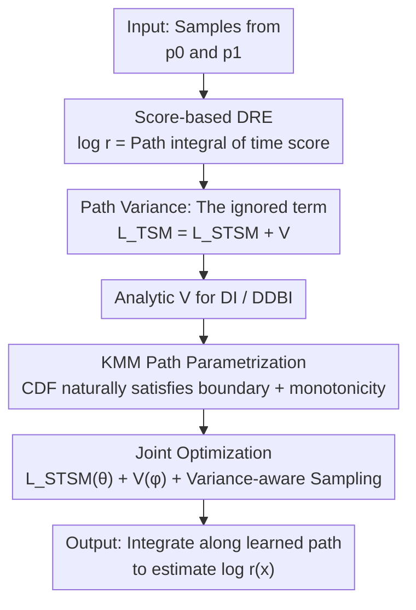

# A Minimum Variance Path Principle for Accurate and Stable Score-Based Density Ratio Estimation

**Conference**: ICLR2026  
**OpenReview**: [https://openreview.net/forum?id=vf16PZJWD1](https://openreview.net/forum?id=vf16PZJWD1)  
**Code**: TBD (the paper claims "code for MVP" is open-sourced)  
**Area**: Learning Theory / Probabilistic Methods / Density Ratio Estimation  
**Keywords**: Density Ratio Estimation, Score Matching, Path Variance, Learnable Interpolation Path, Kumaraswamy Mixture Model

## TL;DR
This paper identifies the root of the "theoretical path-invariance vs. practical path-sensitivity" paradox in score-based density ratio estimation as a neglected term—the **path variance** of the score function. The authors propose the Minimum Variance Path (MVP) principle to explicitly incorporate this term into the objective and use the Kumaraswamy Mixture Model to parametrize the path as a learnable function, achieving more accurate and stable density ratio estimation across multiple challenging benchmarks.

## Background & Motivation
**Background**: Density Ratio Estimation (DRE, estimating $r(x)=p_1(x)/p_0(x)$) is a foundational component for $f$-divergence estimation, mutual information (MI) estimation, causal inference, domain adaptation, and LLM alignment. When two distributions have little overlap (the "density-chasm" problem), classical methods like KLIEP and Noise Contrastive Estimation (NCE) fail. Recent breakthroughs involve continuous **score-based methods**, which express the log-density ratio as a path integral of a time-dependent score function along a smooth interpolation path from $p_0$ to $p_1$: $\log r(x)=\int_0^1 s^{(t)}(x,t)\,dt$.

**Limitations of Prior Work**: Theoretically, such methods are **path-invariant**—integration along any smooth path should recover the exact target. However, in practice, when using neural networks to approximate scores, performance is **highly sensitive** to path selection (preliminary experiments in Fig.1a show that Linear, Föllmer, Trigonometric, and VP paths yield vastly different estimates). This creates a paradox where theory suggests any path works, but practice shows that results collapse if the path is changed. Current works rely on manually selected paths via heuristics without a principled selection basis.

**Key Challenge**: The authors point to a gap between the "ideal objective" and the "computable objective" that is typically ignored as a constant. The ideal objective is the mean squared error between the true score and the model score (time score matching loss $L_{\text{TSM}}$), which is non-computable. Practice uses a computable surrogate obtained through integration by parts—sliced time score matching $L_{\text{STSM}}$. The two differ by a path-dependent term, which was previously discarded as a constant since the path was fixed. The authors prove that this discarded term is precisely the **dominant factor** driving performance differences across paths.

**Goal**: (1) Formally identify what this missing term is; (2) Derive computable closed-form expressions for it; (3) Transform the path into a learnable object to directly minimize this term, eliminating manual path selection.

**Core Idea**: The missing term is the **path variance** of the true score $V=\int_0^1 \mathrm{Var}_{p_t}(\partial_t \log p_t)\,dt$. By parametrizing the path using a Kumaraswamy Mixture Model (KMM), the intractable problem of "searching for the optimal path in function space" is converted into low-dimensional optimization over KMM parameters, allowing the path to adapt to the data distribution.

## Method

### Overall Architecture
The MVP (Minimum Variance Path) aims to solve the core issue: score-based DRE only optimizes the computable loss $L_{\text{STSM}}$ while missing the path variance $V$ from the ideal loss $L_{\text{TSM}}$. MVP compensates for this missing half. Starting from error upper bounds, it proves that the ideal objective = computable loss + path variance. It then derives closed-form expressions for $V$ for two common interpolation classes (DI and DDBI). Using KMM, the paths $\alpha(t), \beta(t)$ are parametrized as learnable functions that naturally satisfy boundary and monotonicity constraints. Finally, the score model parameters $\theta$ and path parameters $\phi$ are optimized jointly using the total objective $\mathcal{L}_{\text{total}}=\lambda_1 L_{\text{STSM}}(\theta)+\lambda_2 V[\alpha_\phi,\beta_\phi]$. The inference stage remains identical to standard DRE: integrating the learned time score along the path to obtain $\log\hat r(x)$.

### Key Designs

**1. Path Variance: The missing half of the Score Matching loss**

This addresses the paradox of "theoretical path-invariance vs. practical path-sensitivity." The authors first provide an upper bound for the estimation error $\Delta(x)=|\log r(x)-\log\hat r(x)|^2$ (Lemma 4.1). In the special case of $n=\infty, m=1$, this bound is proportional to the integrated squared error, which is the ideal time score matching loss $L_{\text{TSM}}(\theta)=\mathbb{E}_{p(t)p_t(x)}|\epsilon(x,t)|^2$. Since $L_{\text{TSM}}$ cannot be optimized directly, $L_{\text{STSM}}$ is used as a surrogate. There exists an **exact algebraic identity** between them:

$$L_{\text{TSM}}(\theta)=L_{\text{STSM}}(\theta)+\int_0^1 \mathbb{E}_{p_t(x)}\,|\partial_t \log p_t(x)|^2\,dt.$$

Theorem 4.2 further proves that the second moment on the right is **exactly the path variance** $V\triangleq\int_0^1 \mathrm{Var}_{p_t(x)}(\partial_t \log p_t(x))\,dt$, thus bounding the estimation error by $\mathbb{E}_{p_1}[\Delta(x)]\le e^L\big(L_{\text{STSM}}(\theta)+V\big)$. This is the "Aha!" moment: path variance is not an optional regularization term, but a core component of the ideal objective that was discarded under the fixed-path assumption. Optimizing $L_{\text{STSM}}$ without $V$ explains why changing paths leads to disparate results. ⚠️ The authors honestly emphasize that minimizing $V$ is treated as a **principled heuristic** (to encourage path smoothness and indirectly lower the Lipschitz constant $L$) rather than a strict guarantee of a tighter error bound.

**2. Closed-form Path Variance: Converting intractable functionals into computable integrals**

Minimizing $V$ directly is difficult as it depends on the unknown true time score $\partial_t\log p_t$. This design contributes analytical forms for two standard interpolation types that depend **only on path coefficients and data distribution moments** (Proposition 4.3). For Deterministic Interpolation (DI) $x_t=\alpha(t)x_0+\beta(t)x_1$, and assuming $p_0$ is a standard Gaussian:

$$V_{\text{DI}}[\alpha,\beta]=\int_0^1\!\Big(\tfrac{2d\,\dot\alpha(t)^2}{\alpha(t)^2}+\tfrac{\dot\beta(t)^2}{\alpha(t)^2}\,\mathbb{E}_{p_1}\|x_1\|^2\Big)dt.$$

For Dequantized Diffusion Bridge Interpolation (DDBI, which relaxes the Gaussian assumption on $p_0$ and is better suited for MI/f-divergence estimation), a corresponding closed-form $V_{\text{DDBI}}$ is provided under the noise schedule $\sigma_t^2=t(1-t)\gamma^2+(\alpha^2+\beta^2)\varepsilon$. These analytical expressions involve only $\alpha, \beta$, their derivatives, and second-order data moments, allowing direct estimation via Monte Carlo. This is the key technical contribution that makes the method feasible—transforming functional search into gradient descent on a differentiable objective.

**3. KMM Path Parametrization: Building boundaries and monotonicity "into the structure"**

With a computable $V$, a path function family is needed that is both flexible and satisfies constraints. A valid schedule $\alpha(t)$ must have $\alpha(0)=1, \alpha(1)=0$ and be monotonically decreasing. Instead of using hard constraints, the authors choose a function class that **naturally satisfies these properties**: the CDF $F(t)$ of any distribution defined on $[0,1]$ monotonically rises from 0 to 1, thus $\alpha(t)=1-F(t)$ automatically drops from 1 to 0. To achieve sufficient expressivity (as a single distribution is unimodal), a **Kumaraswamy Mixture Model (KMM)** is used:

$$F_\phi(t)=\sum_{k=1}^K w_k\big(1-(1-t^{a_k})^{b_k}\big),\qquad \alpha_\phi(t)=1-F_\phi(t),\ \dot\alpha_\phi(t)=-p_\phi(t).$$

Kumaraswamy is chosen over the common Beta distribution because its CDF is a simple closed-form and its derivative computation is efficient and stable. The constructed $\alpha_\phi$ guarantees boundary conditions, monotonicity, and infinite differentiability (smooth probability flow). The coupled $\beta_\phi$ is derived via affine ($\alpha+\beta=1$) or spherical ($\alpha^2+\beta^2=1$) constraints. Constraints on parameters $\phi=\{w_k, a_k, b_k\}$ (weights sum to 1, shape parameters are positive) are reparametrized using softmax/softplus into unconstrained latent variables $\hat\phi$, enabling gradient-based optimization. Consequently, an infinite-dimensional functional search is compressed into low-dimensional KMM parameter optimization.

**4. Joint Optimization and Variance-Aware Time Sampling: Stabilizing training**

Path parameters $\phi$ and score model parameters $\theta$ are jointly optimized using $\mathcal{L}_{\text{total}}=\lambda_1 L_{\text{STSM}}(\theta)+\lambda_2 V[\alpha_\phi,\beta_\phi]$. However, there is a risk: empirical estimation of $L_{\text{STSM}}$ depends on samples $x_t$ from the current path $p_t$. If the path causes score instability, the estimate fluctuates. An **alternating scheme** is used: after updating path parameters by minimizing $V$, a variance-aware time sampler $p(t)\propto 1/(\mathrm{Var}_{p_t}(\partial_t\log p_t)+\varepsilon)$ is refreshed. This biases sampling toward time steps with lower score variance, reducing gradient noise and improving the reliability of the stochastic estimate of $L_{\text{STSM}}$. This step does not directly minimize $L_{\text{STSM}}$ with respect to the path but stabilizes optimization by controlling the variance dependence on $p_t$.

### Loss & Training
The total objective is $\mathcal{L}_{\text{total}}=\lambda_1 L_{\text{STSM}}(\theta)+\lambda_2 V[\alpha_\phi,\beta_\phi]$, where $\theta$ (score model) and $\phi$ (KMM path) are trained jointly. Path optimization (Algorithm 2) involves: sampling time steps → obtaining KMM parameters via reparametrization → calculating $\alpha, \beta$, and derivatives → Monte Carlo estimation of $V$ → autograd backprop to update $\hat\phi$. Inference (Algorithm 1) involves averaging the time score along $I$ integration steps: $\log\hat r(x)=\frac1I\sum_{i=0}^I s^{(t)}_{\theta^\star}(x,t_i)$.

## Key Experimental Results

### Main Results
Evaluation covers $f$-divergence/MI estimation and density estimation. Baselines include a set of fixed path schedules (Linear / VP / Cosine / Föllmer / Trigonometric).

| Task | Data/Setting | Metric | Best Fixed Path | MVP (Ours) |
|------|-----------|------|-------------|-----------|
| MI (High-dim, High-diff) | $d=160$, MI=40 | MSE↓ | 4.18 (Trigonometric) | **1.02** (affine) |
| $f$-divergence (Pathological) | Gamma–Exp, corr=1.8 | MSE↓ | 0.0066 (Linear) | **0.0004** (spherical) |
| Density Estimation (Tabular) | BSDS300 | NLL↓ | −131.90 (VP) | **−143.97** (spherical) |
| Density Estimation (Tabular) | MINIBOONE | NLL↓ | 18.25 (VP) | **17.81** (spherical) |

On high-dimensional, high-difference MI tasks, fixed paths like Föllmer and Cosine collapse as $d$ and MI increase (MSE spiking to double digits at $d=160$); MVP maintains MSE=1.02. On BSDS300, MVP reduces NLL by over 10 points compared to strong baselines.

### Ablation Study

| Configuration | Key Metric | Description |
|------|---------|------|
| KMM components $K=1$ | MI MSE 1.32 / BSDS NLL −48.51 | Unimodal is too rigid; clearly worst performance. |
| $K=2$ | 1.09 / −145.44 | Significant improvement. |
| $K=5$ (Recommended) | **1.02** / −143.97 | Best overall trade-off. |
| $K=8$ | 2.32 / −143.60 | Overfitting the path variance objective; performance degrades. |

Path constraints (affine vs. spherical) are data-dependent hyperparameters: affine is better for low-dim/high-diff but simple geometry (POWER, GAS, Gaussian MI); spherical is more robust for high-dim/complex/non-Gaussian data (HEPMASS, MINIBOONE, BSDS300).

### Key Findings
- Path variance $V$ is the dominant factor for performance differences: fixed paths ignore it, leading to instability; explicitly minimizing it eliminates path sensitivity.
- The number of KMM components has a "sweet spot": $K\in[2,5]$ is robust, while too many ($K=8$) leads to overfitting of the variance objective.
- Learned paths change more smoothly near boundaries $t\in\{0,1\}$, suppressing instantaneous velocity peaks in time scores and enhancing numerical stability—this is the intuition behind why MVP is both accurate and stable.

## Highlights & Insights
- **Reducing "Empirical Paradox" to a Precise Identity**: $L_{\text{TSM}}=L_{\text{STSM}}+V$ cleanly defines the missing term in a provable and computable way, providing a strong theoretical narrative.
- **Closed-form Path Variance as the Enabler**: Many theoretical "principles" fail due to non-computability. This paper derives analytic $V$ for DI/DDBI, turning the principle into an actual optimizable objective.
- **Encapsulating Constraints within Function Families**: Constructing $\alpha$ via $1-F(t)$ ensures boundaries, monotonicity, and smoothness by design, avoiding unstable constraint enforcement like Lagrange multipliers. This "scheduling via CDFs" trick is transferable to diffusion noise schedules or flow matching reparametrization.
- **Learnable Paths as a Mature Idea Mapped to DRE**: While generative modeling evolved from fixed VP/cosine to learnable schedules, this paper marks the first systematic introduction of the "adaptive path" principle to density ratio estimation.

## Limitations & Future Work
- The authors acknowledge that minimizing $V$ is a **heuristic proxy** and not strictly equivalent to minimizing the true estimation error, and the control of the Lipschitz constant $L$ is empirical.
- The closed-form $V$ for DI depends on the assumption that $p_0$ is standard Gaussian; although DDBI relaxes this, analytic solutions are still limited to these specific families.
- Path constraints (affine/spherical) must be selected as hyperparameters based on the task; there is currently no automatic selection mechanism.
- Evaluation is concentrated on low-to-mid dimensional tabular data and MI/synthetic geometry datasets, lacking verification on high-dimensional perceptual data like images.

## Related Work & Insights
- **vs. DRE-∞ (Choi et al., 2022)**: DRE-∞ continuousizes the discrete ratios of TRE and introduces time score matching along fixed smooth paths but ignores the difference between $L_{\text{TSM}}$ and $L_{\text{STSM}}$; Ours proves this difference is path variance and optimizes it.
- **vs. DDBI (Chen et al., 2025c)**: DDBI uses dequantized diffusion bridges to relax Gaussian assumptions on $p_0$, but paths remain fixed; MVP learns the path directly and can use DDBI as a vehicle.
- **vs. Conditional Probability Paths (Yu et al., 2025)**: They use path smoothness (Lipschitz) to bound divergence-form estimation errors; Lemma 4.1 in this paper provides a direct bound on the log-ratio squared error and decomposes total error to specifically handle the previously unaddressed $V$ term.
- **vs. Learnable Diffusion Scheduling (Kingma et al., 2021)**: Learning schedules in generative models usually maximizes the ELBO; MVP's objective is the path variance within the DRE error bound, targeting estimation rather than generation.

## Rating
- Novelty: ⭐⭐⭐⭐⭐ Reduces the path-sensitivity paradox to a provable missing term (path variance) and introduces optimal path learning to DRE for the first time.
- Experimental Thoroughness: ⭐⭐⭐⭐ Covers MI/$f$-divergence/density estimation with ablations on $K$ and constraints, but lacks high-dimensional perceptual data.
- Writing Quality: ⭐⭐⭐⭐⭐ Progresses logically from paradox to identity to closed-form solutions to parametrization; honestly distinguishes between "guarantees" and "heuristics."
- Value: ⭐⭐⭐⭐ Provides a general principled selection basis for score-based estimation, transferable to divergence estimation, alignment, and generative scheduling.

<!-- RELATED:START -->

## Related Papers

- [\[ICLR 2026\] Score-Based Density Estimation from Pairwise Comparisons](score-based_density_estimation_from_pairwise_comparisons.md)
- [\[ICLR 2026\] Minimax-Optimal Aggregation for Density Ratio Estimation](minimax-optimal_aggregation_for_density_ratio_estimation.md)
- [\[ICLR 2026\] Weak Correlations as the Underlying Principle for Linearization of Gradient-Based Learning Systems](weak_correlations_as_the_underlying_principle_for_linearization_of_gradient-base.md)
- [\[ICLR 2026\] The Coverage Principle: How Pre-Training Enables Post-Training](the_coverage_principle_how_pre-training_enables_post-training.md)
- [\[ICLR 2026\] Convergence Dynamics of Over-Parameterized Score Matching for a Single Gaussian](convergence_dynamics_of_over-parameterized_score_matching_for_a_single_gaussian.md)

<!-- RELATED:END -->
