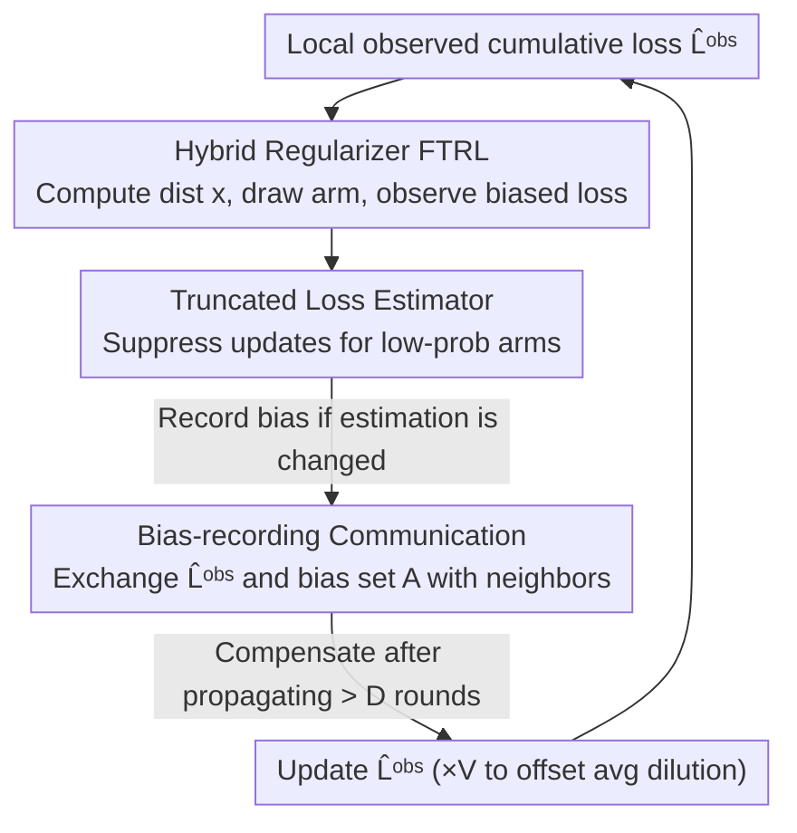

# A Near-Optimal Best-of-Both-Worlds Algorithm for Federated Bandits

**Conference**: ICLR2026  
**OpenReview**: [https://openreview.net/forum?id=Lkndkxeemx](https://openreview.net/forum?id=Lkndkxeemx)  
**Code**: TBD (Source code included in supplementary materials)  
**Area**: Online Learning Theory / Multi-Armed Bandits  
**Keywords**: Federated Bandits, Best-of-Both-Worlds, FTRL, Delayed Feedback, Regret Bound

## TL;DR
This paper proposes FEDFTRL—the first algorithm in federated multi-armed bandits to simultaneously achieve near-optimal individual regret bounds for both stochastic and adversarial environments. The core approach involves reinterpreting the "information delay induced by decentralized communication" as "delayed feedback bandits," and utilizing FTRL with a hybrid regularizer paired with a truncated loss estimator and a bias-recording communication scheme, reducing the adversarial regret from the previous SOTA $O(T^{2/3})$ to $O(T^{1/2})$.

## Background & Motivation
**Background**: Multi-armed bandits (MAB) represent the most fundamental setting in online learning. Inspired by the federated learning paradigm where "multiple heterogeneous agents share no raw data and collaborate to train a model," much recent work has extended MAB to federated environments. In this setting, $V$ agents each select one of $K$ arms per round; each agent only observes rewards with local bias (heterogeneity-induced) and communicates only with neighbors on a graph $G$. The goal is to collaboratively identify the "globally optimal arm" $k^\ast$ (defined by the average loss of all agents) and maximize the collective cumulative reward. Note the strong heterogeneity: different agents can receive different rewards for the same arm at the same time, and no single agent can identify the globally optimal arm solely through local biased observations.

**Limitations of Prior Work**: Previous research on federated bandits strictly followed the traditional "stochastic vs. adversarial" dichotomy. On the stochastic side (e.g., Gossip UCB by Zhu et al. 2021, DRBB-bandit by Zhang et al. 2025), near-optimal $O\!\big(\sum_{k\neq k^\ast}\frac{\log T}{V\Delta_k}\big)$ bounds are achievable. On the adversarial side, the only work is FEDEXP3 by Yi & Vojnovic (2023), which formalized doubly-adversarial federated bandits but only achieved a regret bound of $O(T^{2/3})$, falling short of the standard $O(T^{1/2})$ for single-agent adversarial bandits.

**Key Challenge**: Real-world environments are rarely purely stochastic or purely adversarial, and the specific nature is often unknown a priori. It is impossible to know beforehand whether to choose a stochastic or an adversarial algorithm. This is precisely what the Best-of-Both-Worlds (BOBW) line of work in single-agent bandits addresses—a single algorithm without parameter tuning that is near-optimal in both environments. However, no BOBW results existed for the federated setting. The difficulties arise from two federated-specific factors: (i) agents communicate only with neighbors, so information from distant agents takes several rounds to arrive, essentially acting as **feedback delay**; (ii) local observations are **biased**, and directly applying single-agent BOBW loss estimators would cause the action distributions of different agents to diverge.

**Goal**: To design an anytime algorithm (without knowing $T$ in advance) for federated heterogeneous bandits that simultaneously achieves near-optimal individual regret bounds for both stochastic and adversarial regimes, specifically improving the adversarial bound from $O(T^{2/3})$ to $O(T^{1/2})$.

**Key Insight / Core Idea**: Treat the decentralized communication delay as a "delayed feedback bandit" problem. This allows the reuse of the sophisticated analysis of hybrid regularizers and learning rate scheduling from delayed feedback FTRL (Zimmert & Seldin 2020; Masoudian et al. 2022). Additionally, a **truncated loss estimator** is designed to suppress distribution divergence caused by heterogeneous bias, paired with a **bias-recording communication scheme** to compensate for the truncation bias post-hoc. In short: use a "delayed feedback perspective + truncated estimator + bias-compensation communication" to transform federated heterogeneity into a standard problem solvable by BOBW-FTRL.

## Method

### Overall Architecture
FEDFTRL is a **decentralized routine running locally on each agent** (Algorithm 1). Inputs are a doubly-stochastic communication matrix $P$ and graph diameter $D$. In each round, agent $v$ performs a sequence of actions: "compute distribution → sample arm → observe loss → construct two loss estimators → exchange messages with neighbors → update cumulative loss estimates → process delay compensation." The design revolves around a unified view: **treating the information delay caused by neighbor-only communication as a delayed feedback bandit**, thereby allowing the application of hybrid regularizers from delayed feedback FTRL.

Specifically, each agent computes the current arm distribution on the simplex $\Delta^{K-1}$ using the following FTRL subproblem:

$$x_{v,t} = \arg\min_{x\in\Delta^{K-1}}\big\{\langle x, \hat L^{\mathrm{obs}}_{v,t}\rangle + F_t(x)\big\},$$

where the regularizer is a **hybrid regularizer** of $1/2$-Tsallis entropy ($-2\eta_t^{-1}\sum_k\sqrt{x_k}$) and negative entropy ($\gamma_t^{-1}\sum_k x_k(\log x_k-1)$):

$$F_t(x) = -2\eta_t^{-1}\sum_{k=1}^K\sqrt{x_k} + \gamma_t^{-1}\sum_{k=1}^K x_k(\log x_k - 1).$$

The two learning rates function as "stochastic-optimal" and "adversarial/delay-optimal" roles—$\eta_t^{-1}=4\sqrt{Vt}+169V^2D$ handles the Tsallis term (providing $\log T$ adaptation in the stochastic regime), while $\gamma_t^{-1}=8V\sqrt{C^P_t\, t/\log K}+\dots$ handles the negative entropy term and absorbs the communication topology delay $C^P_t$ into the schedule, which is key for BOBW. Here $C^P_t$ is the **topology delay** defined in this paper:

$$C^P_t = \frac{\min\{\log(Vt),\sqrt{V}\}}{1-\sigma_2(P)} + 2 + D,$$

where $\sigma_2(P)$ is the second largest singular value of the communication matrix (mixing speed) and $D$ is the graph diameter, characterizing how long it takes for information to diffuse across the network.

The following diagram illustrates the local workflow per round; the three stages labeled "Design N" represent the key contributions:

### Key Designs

**1. Hybrid Regularizer FTRL from a Delayed Feedback Perspective: Transforming "Neighbor Communication Delay" into Analyzable Delayed Feedback**

The most difficult aspect of the federated setting is decentralized communication: for agent $v$, the current cumulative loss estimate $\hat L^{\mathrm{obs}}_{v,t}$ contains information from distant agents that has been averaged via multiple rounds of gossip, making these feedbacks effectively "delayed." This paper does not treat delay as a nuisance to be patched but directly adopts the hybrid regularizer framework of delayed feedback bandits. The Tsallis term ensures an instance-dependent $\log T$ bound in the stochastic regime, while the negative entropy term absorbs delay and adversarial effects. The key innovation is explicitly incorporating the topology delay $C^P_t$ into the scheduling of $\gamma_t^{-1}=8V\sqrt{C^P_t t/\log K}+\dots$, allowing regularization strength to adapt to "how slowly the network mixes"—denser networks (smaller $\sigma_2(P)$ and $D$) result in smaller delays and weaker regularization. Because delay is explicitly modeled in the learning rate, the adversarial regime regret is tightened from $O(T^{2/3})$ in FEDEXP3 to $O(T^{1/2})$.

**2. Truncated Loss Estimator: Using a Denominator Lower Bound to Prevent Explosive Updates and Pin Agent Distributions Together**

Local observation bias causes standard Inverse Probability Weighting (IPW) unbiased estimators $\hat\ell_{v,t}(k)=\frac{\ell_{v,t}(k_{v,t})\mathbb I(k=k_{v,t})}{x_{v,t}(k)}$ to explode when $x_{v,t}(k)$ is very small, further pushing the action distributions of different agents apart. This paper constructs a **truncated variant** by adding a lower bound to the denominator:

$$\tilde\ell_{v,t}(k) = \frac{\ell_{v,t}(k_{v,t})\,\mathbb I(k=k_{v,t})}{\max\{x_{v,t}(k),\, 12V C^P_t \gamma_t\}}.$$

Using $\tilde\ell$ instead of $\hat\ell$ for cumulative loss updates ensures that rare arm draws do not trigger excessive updates, thereby keeping the probability distributions of all agents approximately aligned. This alignment is the cornerstone of the analysis—it directly supports Lemma 1, which states that any two agents' arm probabilities differ by at most a factor of $3/2$, allowing collective regret to be translated into individual regret. The cost is that truncation introduces systematic bias relative to the population average loss, which is addressed by Design 3.

**3. Bias-recording Communication Scheme + ×V Offset: Compensating Truncation Bias Post-hoc Without Raw Observation Leakage**

Under federated constraints, raw observations cannot be shared, but the bias introduced by truncation must be corrected to avoid deviating from the population average loss. The approach is: whenever truncation actually alters the estimated value ($\hat\ell_{v,t}(k_{v,t})\neq\tilde\ell_{v,t}(k_{v,t})$), the agent adds a bias record $\langle v,t,k_{v,t},w_{v,t}\rangle$ ($w_{v,t}=\hat\ell-\tilde\ell$) to a bias set $A_v$, which propagates through the network alongside gossip messages. Once a record has propagated for more than $D$ rounds ($t-s>D$, meaning all agents have received it), the correction $w_{u,s}$ is added back to $\hat L^{\mathrm{obs}}_{v,t+1}(k)$. This ensures bias compensation does not re-introduce distribution misalignment between agents. Additionally, the $\times V$ factor in the cumulative loss update $\hat L^{\mathrm{obs}}_{v,t+1}=\sum_{u:(u,v)\in E}P_{u,v}\hat L^{\mathrm{obs}}_{u,t}+V\tilde\ell_{v,t}$ is used to offset the dilution of feedback caused by gossip averaging, ensuring that the "information volume" is not thinned out by consensus. This scheme incurs an expected communication overhead of only $O(K)$ per agent per round.

### Loss & Training
This work is a theoretical algorithm; rather than a training loss, the focus is on regret bounds (Theorem 1). In the adversarial regime, the individual regret of each agent $v$ satisfies:

$$R_T(v)\le 13\sqrt{KT/V} + 13\sqrt{C^P_T T\log K} + 156\sqrt{D} + 72D(K-1)^{1/3}\log K + 24C^P_T\log K,$$

where the lead terms are $O\!\big(\sqrt{KT/V}+\sqrt{C^P_T T\log K}\big)=O(T^{1/2})$. In the stochastic regime, it achieves instance-dependent logarithmic bounds:

$$R_T(v)\le \sum_{k\neq k^\ast}\frac{51\log T}{V\Delta_k} + \sum_{k\neq k^\ast}\frac{90C^P_T}{\Delta_k\log K} + 56D\sqrt{(K-1)\log K} + 11C^P_T\log K.$$

Both bounds are within low-order polynomial factors of their respective lower bounds (Remark 1 matches the lower bound for $C^P_T$ by constructing $P$ via the max-degree trick). The core proof technique (Section 5) involves a novel approach to individual regret: first, Lemma 1 proves $x_{u,t}(k)\le\frac32 x_{v,t}(k)$ for any two agents, thus $R_T(v)\le\frac{3}{2V}\sum_u R_T(u)$, reducing individual regret to collective regret. Then, it "flattens" the federated problem into a single agent's interaction over $VT$ rounds (introducing shifted cumulative losses $\hat L_{v,t}=\sum_{s<t}Vm_s+(v-1)m_t$ so that instantaneous estimates $m_t$ appear sequentially), decomposing the collective regret into (A) Bregman divergence / (B) Delayed feedback (via Zimmert & Seldin 2020) / (C) Telescoping terms. This "population-before-individual" route is a key technical contribution.

## Key Experimental Results

Experiments were conducted on synthetic and real-world (MovieLens) datasets across three network topologies (Complete Graph, $\sqrt V\times\sqrt V$ Grid, Random Geometric Graph RGG-0.5), comparing against FEDEXP3, Gossip UCB, DRBB-bandit, and IND-FTRL (where agents run Tsallis-FTRL independently without communication). Results are averaged over 50 runs, with practical learning rates set to $\eta_t^{-1}=0.1\sqrt{Vt}$ and $\gamma_t^{-1}=8V\sqrt{C^P_t t/\log K}$.

### Main Results

| Dataset | Setting | Baselines | Results |
|--------|------|---------|------|
| Synthetic ($T{=}3000,V{=}16,K{=}20$, $\mu_{v,k}\!\sim\!U[0,1]$, feedback $\mathcal N(\mu,0.01)$ clipped to $[0,1]$) | Three topologies | FEDEXP3 / Gossip UCB / DRBB-bandit / IND-FTRL | FEDFTRL achieves the lowest average regret across all settings (Figure 1); IND-FTRL fails to achieve sublinear regret due to biased local feedback |
| MovieLens ($T{=}3000,V{=}3963,K{=}20$, genre as arm, loss $\ell_{v,t}(k){=}(5.5-r^j_v(k))/5$) | Three topologies | Same as above | FEDFTRL significantly outperforms all baselines (Figure 2) |

### Ablation Study

| Configuration | Variation | Description |
|------|------|------|
| FEDFTRL ($\varepsilon{=}1.0$) | Default $C^P_t$ | Complete method |
| FEDFTRL-$\varepsilon$ ($\varepsilon\in\{0.1,0.5,5,10\}$) | $C^P_t$ scaled by $\varepsilon$ | Method remains sublinear even with misestimated $C^P_t$; regret is largely insensitive to this parameter (Figure 3/4) |

### Key Findings
- **Communication is Necessary for Sublinear Regret**: IND-FTRL (no communication) fails to achieve sublinear regret under heterogeneous local feedback, highlighting the necessity of the proposed communication scheme.
- **Robustness to Topology Parameter $C^P_t$**: FEDFTRL maintains sublinear regret even when $C^P_t$ is misspecified by a factor of $0.1\sim10$, showing that precise estimation of topology delay is not strictly required.
- **Consistency Across Topologies**: Consistent results across Complete, Grid, and RGG graphs validate the design of absorbing topology effects into the learning rate via $C^P_t$.

## Highlights & Insights
- **Translating Communication Delay into Delayed Feedback**: The most elegant step is the perspective shift—treating decentralized communication's inherent delay as delayed feedback. This allows the integration of mature delayed feedback FTRL toolchains, tightening the adversarial bound from $T^{2/3}$ to $T^{1/2}$. This "re-envisioning" insight is transferable to other multi-agent online learning problems with communication delays.
- **Decoupled Design of Truncation + Compensation**: Truncation ensures "alignment" (keeping agent distributions together for population-to-individual regret translation), while $D$-round delayed bias recording ensures "unbiasedness." These two decoupled mechanisms are simple yet effective for handling "heterogeneous bias + privacy constraints."
- **Population-First Analysis Paradigm**: Analyzing collective regret first and then using distribution alignment to divide by $V$ for individual bounds is cleaner than analyzing single agents directly. This provides a reusable template for similar multi-agent bandit analysis.
- **$\times V$ Anti-dilution**: Using a simple constant factor to counteract information dilution from gossip consensus is a critical yet easily overlooked engineering detail.

## Limitations & Future Work
- **Polylog Gaps in Adversarial Bounds**: The authors acknowledge a low-order polynomial gap between the upper and lower bounds in the adversarial regime; narrowing this gap is a clear future work.
- **Unique Optimal Arm Assumption**: To simplify presentation, a unique $k^\ast$ is assumed. Extension to multiple optimal arms would require Ito (2021b)'s techniques and was not detailed.
- **Dependency on Known $P$ and $D$**: The algorithm takes the doubly-stochastic matrix $P$ and diameter $D$ as inputs. How to adapt to dynamic topologies where $D$ is hard to obtain is not discussed (though experiments show robustness to $C^P_t$ misspecification, $D$ enters the compensation logic $t-s>D$).
- **Communication Scalability with $K$**: $O(K)$ communication per round might become a bottleneck for massive arm spaces (e.g., large-scale recommendation). Exploring sparsified bias recording could be beneficial.

## Related Work & Insights
- **vs. FEDEXP3 (Yi & Vojnovic, 2023)**: FEDEXP3 first formalized doubly-adversarial federated bandits but only for the adversarial case with $O(T^{2/3})$ regret. FEDFTRL tightens this to $O(T^{1/2})$ and covers the stochastic regime, marking the first federated BOBW.
- **vs. Gossip UCB / DRBB-bandit (Stochastic side)**: These achieve near-optimal/optimal log-regret in stochastic settings but provide no guarantees for adversarial environments. FEDFTRL matches their $O\!\big(\sum_{k\neq k^\ast}\frac{\log T}{V\Delta_k}\big)$ performance while maintaining adversarial robustness.
- **vs. Single-agent BOBW (Zimmert & Seldin 2021 etc., Tsallis-INF / FTRL)**: This work extends single-agent BOBW-FTRL to "heterogeneous feedback + decentralized communication." The core increments are the truncated estimator, bias-compensation communication, and the population-first individual regret analysis.
- **vs. Delayed Feedback Bandits (Zimmert & Seldin 2020; Masoudian et al. 2022)**: While borrowing the hybrid regularizer and learning rate scheduling, this work innovates by modeling "network communication delay" as the source of delay and defining $C^P_t$ for scheduling.

## Rating
- Novelty: ⭐⭐⭐⭐⭐ First federated BOBW algorithm; delayed feedback perspective and population-first analysis are significant new ideas.
- Experimental Thoroughness: ⭐⭐⭐⭐ Synthetic + real data + three topologies + sensitivity ablation. Sufficient for a theory paper, though missing variance/confidence intervals on plots.
- Writing Quality: ⭐⭐⭐⭐⭐ Motivation, algorithm, and proof sketches are clearly layered; regret vs. lower bound comparison tables are intuitive.
- Value: ⭐⭐⭐⭐ Opens the BOBW line for federated/decentralized online learning; components are transferable, though practical deployment is constrained by known topology assumptions.

<!-- RELATED:START -->

## Related Papers

- [\[ICLR 2026\] Near Optimal Robust Federated Learning Against Data Poisoning Attack](near_optimal_robust_federated_learning_against_data_poisoning_attack.md)
- [\[ICML 2025\] Near Optimal Best Arm Identification for Clustered Bandits](../../ICML2025/learning_theory/near_optimal_best_arm_identification_for_clustered_bandits.md)
- [\[ICLR 2026\] Ads that Stick: Near-Optimal Ad Optimization through Psychological Behavior Models](ads_that_stick_near-optimal_ad_optimization_through_psychological_behavior_model.md)
- [\[ICLR 2026\] Best-of-N through the Smoothing Lens: KL Divergence and Regret Analysis](best-of-n_through_the_smoothing_lens_kl_divergence_and_regret_analysis.md)
- [\[ICLR 2026\] Best-of-Majority: Minimax-Optimal Strategy for Pass@k Inference Scaling](best-of-majority_minimax-optimal_strategy_for_passk_inference_scaling.md)

<!-- RELATED:END -->
