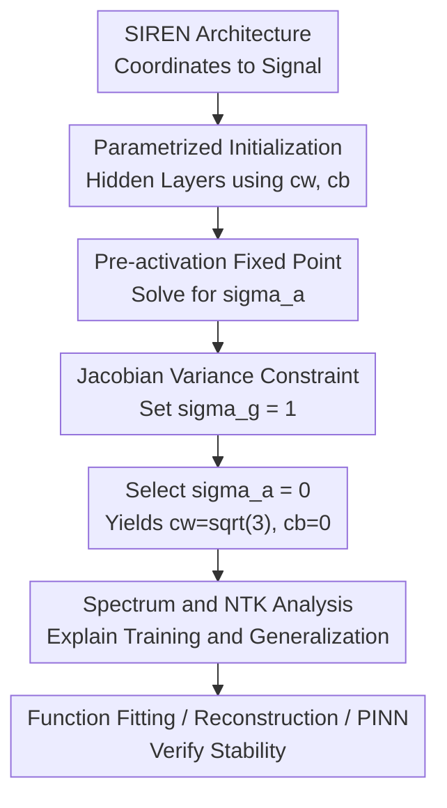

# A New Initialization to Control Gradients in Sinusoidal Neural Networks

**Conference**: ICLR 2026  
**OpenReview**: [https://openreview.net/forum?id=92d74WdgtG](https://openreview.net/forum?id=92d74WdgtG)  
**Code**: Yes (experimental code provided in supplementary materials)  
**Area**: Learning Theory  
**Keywords**: SIREN, Implicit Neural Representation, Initialization, Gradient Stability, Neural Tangent Kernel  

## TL;DR

This paper derives a set of closed-form initialization parameters for the sinusoidal activation network SIREN. By simultaneously controlling the pre-activation distribution, inter-layer Jacobian variance, and spectral expansion, it reduces gradient explosion and spurious high-frequency noise in deep sinusoidal neural networks for tasks such as function fitting, image/audio/video reconstruction, and PINNs.

## Background & Motivation

**Background**: Implicit neural representation (INR) typically maps coordinates $x$ to signal values $f(x)$ using neural networks, representing image pixels, audio waveforms, 3D fields, or PDE solutions. Standard MLPs tend to learn low frequencies before high frequencies (spectral bias). Therefore, sinusoidal activation networks like SIREN, along with Fourier features and positional encoding, are widely used to enhance high-frequency representation capabilities.

**Limitations of Prior Work**: SIREN's performance depends on the $\sin(\cdot)$ activation and the first-layer frequency parameter $\omega_0$, but it is highly sensitive to initialization. Original SIREN initialization ensures pre-activations stay within an appropriate range but lacks precise constraints on the Jacobian variance during backpropagation. In deep networks, gradients may grow exponentially, leading to spurious high-frequency textures during interpolation, or decay, leading to slow training and spectral collapse.

**Key Challenge**: INRs require sufficient high-frequency expressivity but must prevent deep sinusoidal compositions from diffusing energy into modes beyond the Nyquist sampling frequency. Initialization must ensure that parameter and input gradients do not vanish prematurely while avoiding placing the network in a high-frequency explosion regime that causes aliasing.

**Goal**: The authors decompose the problem into three interrelated sub-problems: first, determine the distribution of pre-activations $z_\ell$ as width and depth increase; second, determine how the variance of the inter-layer Jacobian $J_\ell=\partial h_\ell/\partial h_{\ell-1}$ changes with initialization; and third, analyze how these statistics affect training speed and generalization through the Fourier spectrum and NTK.

**Key Insight**: Approaching from the *edge of chaos* perspective, the study moves beyond empirical tuning of $\omega_0$ or approximate SIREN initialization by solving fixed-point equations for sinusoidal activations. The analytical forms of $\mathbb{E}[\sin^2 z]$ and $\mathbb{E}[\cos^2 z]$ under Gaussian inputs allow for more explicit initialization curves than those available for general activation functions.

**Core Idea**: Fixed-point analysis is used to derive a weight-bias initialization curve satisfying $\sigma_g=1$. A specific point $(c_w,c_b)=(\sqrt{3},0)$ where $\sigma_a=0$ is selected to maintain both gradient stability and depth-independent initial spectral truncation in deep SIRENs.

## Method

### Overall Architecture

The method provides a set of theoretical and practical rules for SIREN initialization rather than a new architectural module. Given a standard SIREN, weight and bias sampling scales for hidden layers are redefined using two parameters $c_w, c_b$. The optimal choice $(c_w,c_b)=(\sqrt{3},0)$ is justified via pre-activation fixed points, Jacobian variance, and NTK dynamics.

The workflow defines a family of candidate initializations, derives the fixed point of pre-activation variance $\sigma_a^2$ in the mean-field limit, and constrains the normalized variance of Jacobian entries $\sigma_g=1$ to prevent gradient instability. Finally, Fourier spectrum and NTK analyses explain why $\sigma_a=0$ is preferred over $\sigma_a=1$ on this critical curve.

### Key Designs

**1. Replacing Approximate Variance Preservation with Pre-activation Fixed Points**

Original SIREN initialization aims for pre-activations to follow $\mathcal{N}(0,1)$ based on approximations that ignore the precise effect of bias on deep fixed points. This paper initializes hidden layers as $W_\ell\sim U(-c_w/\sqrt{N},c_w/\sqrt{N})$ and $b_\ell\sim\mathcal{N}(0,c_b^2)$, studying the limit distribution of $z_\ell=W_\ell h_{\ell-1}+b_\ell$.

Since sine is an odd function, zero mean is preserved. In the wide-limit, pre-activations tend toward Gaussian. Given $z\sim\mathcal{N}(0,\sigma^2)$, then $\mathrm{Var}[\sin(z)]=\frac{1}{2}(1-e^{-2\sigma^2})$, leading to the recurrence:

$$
\sigma_\ell^2=\frac{c_w^2}{6}(1-e^{-2\sigma_{\ell-1}^2})+c_b^2.
$$

The fixed point $\sigma_a^2$ can be solved using the Lambert W function, explicitly linking $(c_w,c_b)$ to the deep pre-activation distribution and providing solvable constraints for gradient control.

**2. Constraining Gradient Propagation via $\sigma_g=1$**

Stabilizing forward activations is insufficient; training depends on how gradients pass through sinusoidal compositions. The paper calculates the entry variance of the inter-layer Jacobian $J_\ell=\mathrm{diag}(\cos z_\ell)W_\ell$, resulting in the normalized limit:

$$
\sigma_g^2=\frac{c_w^2}{6}(1+e^{-2\sigma_a^2}).
$$

Parameter gradient variance scales approximately by $N^{-1}(\sigma_g^2)^{L-\ell-1}$, and input gradient variance by $\omega_0^2(\sigma_g^2)^{L-2}$. If $\sigma_g>1$, depth leads to gradient explosion and high-frequency noise; if $\sigma_g<1$, gradients vanish. Setting $\sigma_g=1$ yields a closed-form weight-bias relationship:

$$
c_b=\sqrt{1-\frac{c_w^2}{3}-\frac{1}{2}\log\left(\frac{6}{c_w^2}-1\right)}.
$$

**3. Selecting $\sigma_a=0$ to Suppress Depth-Induced Spectral Expansion**

On the $\sigma_g=1$ curve, the authors compare $\sigma_a=1$ (similar to SIREN's intuition) and $\sigma_a=0$ (the recommended choice). The latter gives $(c_w,c_b)=(\sqrt{3},0)$. While $\sigma_a=0$ might seem to reduce nonlinearity, it ensures deep $\sin(z)$ behaves linearly, preventing energy from diffusing into higher Fourier modes across layers.

This addresses a pathology in deep SIRENs: while standard initialization fits training points quickly, the spectrum broadens with depth, causing aliasing. The $\sigma_a=0$ fixed point acts as a gentle constraint where early layers retain expressivity while deep layers avoid uncontrolled high-frequency generation.

**4. Linking Initialization and Training via NTK**

The study uses the Neural Tangent Kernel (NTK) to explain training dynamics. Under linearized approximations, residuals decay along NTK eigenvectors at rates determined by eigenvalues $\lambda_i$. Low-frequency modes generally correspond to larger eigenvalues.

The authors find that original SIREN initialization caused exponential growth in NTK trace and input gradients, which increased training speed but mixed high frequencies into low-order eigenvectors, causing noise. The $\sigma_a=0$ initialization maintains clearer Fourier alignment below $\omega_0$, allowing $\omega_0$ to naturally align with the Nyquist frequency of the input.

### Loss & Training

The training objective remains the standard supervised loss for INRs:

$$
\mathcal{L}(\theta)=\frac{1}{|I|}\sum_{i\in I}\|\Psi_\theta(x_i)-y_i\|_2^2.
$$

For PINN experiments, the loss includes PDE residuals and boundary conditions: $\lambda_f\|\mathcal{N}[\Psi_\theta]-f\|^2+\lambda_b\|\mathcal{B}[\Psi_\theta]-g\|^2$. The proposed initialization is applied before training: the first layer uses $\omega_0$ for frequency range control, while hidden layers use $U(-\sqrt{3}/\sqrt{N},\sqrt{3}/\sqrt{N})$ with zero bias.

Most tasks use Adam ($LR=10^{-4}$ or $3\times10^{-5}$) for 5,000 to 10,000 epochs. ERA-5 video tasks use Reduce-on-Plateau and AMP. Performance gains are attributed to the initialization rather than additional training techniques.

## Key Experimental Results

### Main Results

Experiments cover synthetic functions, image fitting, audio fitting, ERA-5 wind field video reconstruction, image denoising, and PINNs.

| Task/Scenario | Main Baselines | Performance of Ours | Prior Methods Performance | Key Conclusions |
|---|---|---|---|---|
| 1D/2D/3D Multi-scale Function Fitting | Original SIREN, WIRE, FINER, Tanh+Fourier-Xavier, ReLU+PE | Lowest or tied for lowest generalization error; stable as depth increases. | Original SIREN fits training well but generalizes poorly; WIRE/FINER unstable at great depths. | Controlling gradients and spectrum is more important than just increasing frequency expressivity. |
| Deep Image Fitting ($L=10, N=256$) | Various INR architectures | Cleaner 128x128 fitting and 512x512 interpolation. | Original SIREN, WIRE, FINER show significant noise or artifacts. | $\sigma_a=0$ suppresses spurious high frequencies during discrete sampling. |
| Audio Fitting | 7s audio, downsampled training, $w_0\approx 7000$ | Superior SNR/MSE in generalization tasks. | $\sigma_a=1$ trains well but generalizes slightly worse; others have larger errors. | Initialization impacts continuous signal interpolation quality. |
| ERA-5 Video Reconstruction | Space-time coordinates INR | Better generalization on complex geometry and spatiotemporal data. | Sitzmann and $\sigma_a=1$ show noise; FINER/WIRE unstable at depth. | Method scales beyond low-dimensional synthetic functions. |

### Ablation Study

Ablations compare $\sigma_a=0$, $\sigma_a=1$, standard Sitzmann, and PyTorch default initializations.

| Configuration | Key Metrics/Phenomena | Description |
|---|---|---|
| SIREN $\sigma_a=0$ (Ours) | $\sigma_g=1$, input gradients remain $O(1)$ with depth, spectrum restricted below $w_0$. | Recommended point; balances gradient stability and spectral control. |
| SIREN $\sigma_a=1$ | $\sigma_g=1$, but spectrum still expands significantly with depth. | Gradient stability does not guarantee spectral stability; generalization is weaker than $\sigma_a=0$. |
| Original Sitzmann | Empirically $\sigma_g\approx\sqrt{1.2}$, NTK trace and gradients grow exponentially. | Fast training but prone to spurious high frequencies and noise. |
| PyTorch Default | $\sigma_g<1$, gradients vanish with depth, spectrum collapses. | Leads to under-expression or slow training regime. |
| Small Width ($N=32$) | Proposed init still reduces noise, but overall performance limited by width. | Theory is based on infinite width; bias remains at small widths. |
| Large Depth ($L=40$) | $\sigma_a=0$ further improves performance and reduces noise. | Supports the claim that depth does not have to sacrifice generalization. |

### Key Findings

- It is insufficient to only set $\sigma_g=1$; while $\sigma_a=1$ stabilizes gradients, energy still expands with depth. $\sigma_a=0$ is necessary to constrain the initial spectrum.
- NTK analysis shows original SIREN's average eigenvalues grow exponentially, increasing early training speed at the cost of explosive input gradients and noise. The proposed initialization stabilizes these dynamics.
- In image denoising, the proposed initialization has higher training loss but better clean image SNR/MSE, indicating it acts as a spectral regularizer.
- For PINNs, the initialization significantly reduces instability and noise in 2D Navier-Stokes and heat equations, providing reliable derivatives compared to original SIREN.

## Highlights & Insights

- **Theoretical Rigor**: Converts SIREN initialization from empirical tuning to a closed-form condition using analytical expectations of sinusoidal activations.
- **Spectrum vs. Gradient Stability**: Distinguishes between gradient stability and spectral stability, showing that only specific points on the stable-gradient curve prevent spectral expansion.
- **NTK Perspective**: Explains that the "fast training" of original SIREN often comes at the cost of incorrect high-frequency components.
- **Practicality for PINNs**: Provides a more stable starting point for physical fields where high-order derivatives are sensitive to input gradient noise.

## Limitations & Future Work

- Theory relies on infinite width/depth and mean-field assumptions; deviations occur in small networks.
- The method controls variance but does not achieve full dynamical isometry (singular value distribution of the total Jacobian could still be improved).
- The "slow convergence" mechanism of $\sigma_a=0$ is observed but not fully explained theoretically regarding its balance with nonlinearity.
- Experiments could be expanded to larger scales like NeRF, 3D SDF, or coordinate compression.
- For PINNs, the coupling between initialization and complex PDE loss terms or boundary weights warrants further study.

## Related Work & Insights

- **vs. Original SIREN**: Maintains architecture but re-derives hidden layer weights/biases for theoretical control over gradients and spectrum.
- **vs. Fourier Features**: While Fourier features fix frequencies at the input, this method controls spectral expansion resulting from deep compositions within the network.
- **vs. Xavier/Kaiming**: Provides an exact version of variance preservation for sinusoidal activations, accounting for input gradients and spectral implications unique to INRs.
- **vs. FINER/WIRE**: Whereas other methods use flexible periodic or wavelet activations, this work suggests that stronger frequency expression necessitates more reliable initialization to avoid aliasing.

## Rating

- Novelty: ⭐⭐⭐⭐☆ Closed-form SIREN initialization from the edge-of-chaos perspective is precise, though building on existing initialization theory.
- Experimental Thoroughness: ⭐⭐⭐⭐☆ Broad coverage across signals and PDEs; however, many quantitative results are sequestered in the appendix.
- Writing Quality: ⭐⭐⭐⭐☆ Clear theoretical line; some minor notation inconsistencies between the main text and appendix.
- Value: ⭐⭐⭐⭐⭐ Highly practical for INR and PINN users, offering a near-zero-cost replacement for default initialization that solves deep generalization issues.

<!-- RELATED:START -->

## Related Papers

- [\[ICLR 2026\] Overparametrization bends the landscape: BBP transitions at initialization in simple Neural Networks](overparametrization_bends_the_landscape_bbp_transitions_at_initialization_in_sim.md)
- [\[ICLR 2026\] The Logical Expressiveness of Topological Neural Networks](the_logical_expressiveness_of_topological_neural_networks.md)
- [\[ICLR 2026\] From Neural Networks to Logical Theories: The Correspondence between Fibring Modal Logics and Fibring Neural Networks](from_neural_networks_to_logical_theories_the_correspondence_between_fibring_moda.md)
- [\[ICLR 2026\] Separable Neural Networks: Approximation Theory, NTK Regime, and Preconditioned Gradient Descent](separable_neural_networks_approximation_theory_ntk_regime_and_preconditioned_gra.md)
- [\[ICLR 2026\] Reducing Symmetry Increase in Equivariant Neural Networks](reducing_symmetry_increase_in_equivariant_neural_networks.md)

<!-- RELATED:END -->
