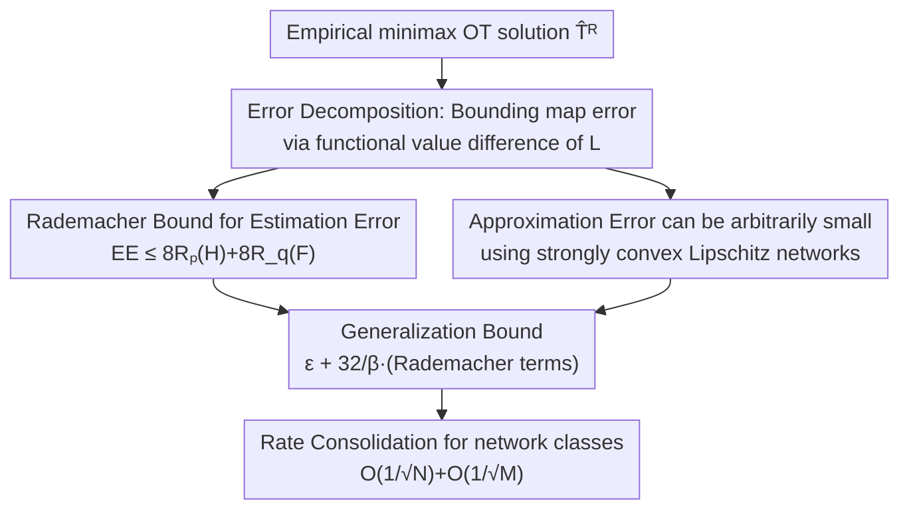

# A Statistical Learning Perspective on Semi-dual Adversarial Neural Optimal Transport Solvers

**Conference**: ICLR2026  
**OpenReview**: [https://openreview.net/forum?id=FJTdyG8jeJ](https://openreview.net/forum?id=FJTdyG8jeJ)  
**Code**: https://github.com/milenagazdieva/StatOT (Available)  
**Area**: Learning Theory / Optimal Transport / Generative Models  
**Keywords**: Optimal Transport, minimax solvers, generalization error, Rademacher complexity, semi-dual

## TL;DR
This paper provides the missing statistical learning theory for a class of generative methods that use adversarial minimax solvers for quadratic optimal transport: it proves that the generalization error between the learned transport map and the true OT map can be decomposed into estimation error + approximation error. The estimation error is controlled solely by the Rademacher complexity of the network function classes, while the approximation error can be made arbitrarily small by choosing appropriate networks, thereby providing the first $O(1/\sqrt{N})$ convergence guarantee.

## Background & Motivation

**Background**: Neural optimal transport (neural OT) is a prominent branch of generative modeling, applied in tasks such as domain translation, super-resolution, and computational biology. Its mainstream approach involves formulating the OT problem in its **semi-dual form** and employing an adversarial **minimax solver** to simultaneously learn a dual potential $\varphi$ and a transport map $T$—structurally resembling the min-max optimization of GANs. Representative works include NOT by Korotin et al. and the OT-based generators by Rout et al.

**Limitations of Prior Work**: These minimax OT solvers perform well in practice but **lack statistical learning theoretical support**. The fundamental concern—"How far is the learned map $\widehat{T}$ from the true OT map $T^*$ given finite samples and finite network capacity? Will it converge as the sample size increases?"—has remained unanswered. Existing theoretical analyses (Makkuva, Rout, etc.) only provide "duality gap" bounds, which use the value of the functional $\mathcal{L}(\varphi,T)$ to upper bound the error without **revealing specific statistical convergence rates**.

**Key Challenge**: While statistical rates have been established for non-minimax semi-dual solvers (e.g., where the map is defined as the gradient of the dual potential $\nabla\varphi$), the minimax form is **inherently more difficult**. Its optimization objective involves **two** variables—the transport map $T$ and the independent dual variable $\varphi$. This constitutes a saddle-point problem, which is theoretically far more complex than single-variable minimization; thus, non-minimax conclusions cannot be directly applied.

**Goal**: For minimax OT solvers under quadratic cost ($c(x,y)=\tfrac12\|x-y\|_2^2$, corresponding to Wasserstein-2), this paper aims to "decompose, bound, and provide rates" for the generalization error $\mathbb{E}_{X,Y}\|T^*-\widehat{T}\|^2_{L^2(p)}$.

**Key Insight**: The authors adopt the classic decomposition from statistical learning theory: any error between an "empirical optimal solution vs. the true optimal solution" can be divided into **approximation error** (due to the restricted capacity of the function class) and **estimation error** (due to the use of empirical measures instead of true measures). The challenge lies in the nested optimization of the minimax objective ($\min_\varphi\max_T$), requiring each layer to have its errors separately defined and controlled.

**Core Idea**: The generalization error of the minimax problem is upper-bounded by the **difference in functional values** of $\mathcal{L}$ (which is easier to analyze than map differences). It is then proven that the combined inner and outer estimation errors are controlled solely by the **Rademacher complexity** of the network classes, while the approximation errors can be made arbitrarily small by choosing suitable network classes (strongly convex + Lipschitz + ICNN/ReLU). Combining these results yields a generalization error $\le \varepsilon + 32/\beta\cdot(\text{Rademacher terms})$, which simplifies to $O(1/\sqrt N)+O(1/\sqrt M)$ for specific network classes.

## Method

### Overall Architecture

This is a **purely theoretical** paper; the "method" consists of a chain of interconnected proofs. The objective is to estimate the average $L^2$ error between the learned map $\widehat{T}^R$ (optimized within restricted network classes $R$) and the true OT map $T^*$:

$$\mathbb{E}_{X,Y}\big\|\widehat{T}^R-T^*\big\|^2_{L^2(p)}.$$

The research focuses on the empirical minimax problem solved in practice:

$$\min_{\theta\in\Theta}\max_{\omega\in\Omega}\ \frac1N\sum_{n}\big[\langle x_n,T_\omega(x_n)\rangle-\varphi_\theta(T_\omega(x_n))\big]+\frac1M\sum_m \varphi_\theta(y_m),$$

where $\varphi_\theta$ is the dual potential and $T_\omega$ is the transport map, both represented by neural networks; the true distributions $p, q$ are replaced by empirical distributions $\widehat p, \widehat q$. The proof proceeds in three stages: **(1) Error Decomposition**—upper-bounding the map error by four error terms of the functional $\mathcal L$; **(2) Term-wise Bounding**—controlling estimation error via Rademacher complexity and approximation error via network approximation capabilities; **(3) Rate Consolidation**—assembling the generalization error bound and simplifying it to收敛率 $1/\sqrt{N}, 1/\sqrt{M}$ for specific network classes.

### Key Designs

**1. Error Decomposition: Bounding map error by functional value difference (Theorem 4.1)**

Directly analyzing $\|\widehat T^R-T^*\|_{L^2(p)}$ is difficult as it is a pointwise difference between two maps. The authors' critical step is to **upper bound it by the value difference of the functional $\mathcal L(\varphi,T)$**—since functional values are scalars, they are additive and decomposable, making them much easier to handle. Specifically, they define four error quantities: inner/outer **approximation errors** $\mathcal E^A_{\text{In}}, \mathcal E^A_{\text{Out}}$ (characterizing the gap between restricted optimization and unconstrained optima), and inner/outer **estimation errors** $\mathcal E^E_{\text{In}}, \mathcal E^E_{\text{Out}}$ (the expected difference between empirical optima and true optimal values). Under the assumption that the outer function class $\mathcal F$ consists of $\beta$-strongly convex functions, they obtain:

$$\mathbb{E}_{X,Y}\big\|\widehat T^R-T^*\big\|^2_{L^2(p)}\le \frac{4}{\beta}\Big(\mathcal E^E_{\text{In}}+3\mathcal E^A_{\text{In}}+\mathcal E^E_{\text{Out}}+\mathcal E^A_{\text{Out}}\Big).$$

The strong convexity assumption acts as a lever to translate "functional value proximity" into "map proximity"—without strong convexity (lower bound curvature $\beta$), the functional difference would not constrain the map difference. This step converts a saddle-point geometric problem into the additive analysis of four scalar errors.

**2. Rademacher Bound for Estimation Error: Dependence solely on network capacity (Theorem 4.2)**

Estimation error arises from substituting the true measures $p, q$ with empirical measures $\widehat p, \widehat q$ from finite samples. The authors prove that the sum of the inner and outer estimation errors is controlled by two **Rademacher complexities**:

$$\mathcal E^E=\mathcal E^E_{\text{In}}+\mathcal E^E_{\text{Out}}\le 8\,\mathcal R_{p,N}(\mathcal H)+8\,\mathcal R_{q,M}(\mathcal F),$$

where $\mathcal H=\{h(x)=\langle x,T(x)\rangle-\varphi(T(x)):T\in\mathcal T,\varphi\in\mathcal F\}$ is a function class that "couples" the map and the potential. The significance of this result is that **the error depends only on the statistical capacity of the network classes used**, regardless of the specific shape of the data distribution. Since Rademacher complexity, covering numbers, and VC dimensions for common networks (ReLU MLP, ICNN) are well-studied, this bound is "computable" rather than purely existential.

**3. Arbitrarily Small Approximation Error: Network selection (Theorems 4.3 / 4.6)**

Approximation error arises because optimizing within restricted network classes $\mathcal F, \mathcal T$ might not represent the true saddle point $(\varphi^*, T^*)$. The authors prove this can be minimized arbitrarily for both components. For the **Inner Layer** (Theorem 4.3): If the outer class $\mathcal F$ is Lipschitz, $\beta$-strongly convex, and totally bounded under the Lipschitz norm, there exists a family of neural networks $\mathcal T$ such that $\mathcal E^A_{\text{In}}(\mathcal F, \mathcal T) < \varepsilon$. Proposition 4.4 identifies a feasible $\mathcal F$: a $K$-layer ICNN with CELU activation plus a quadratic term $\varphi+\beta\|\cdot\|^2/2$. For the **Outer Layer** (Theorem 4.6 + Corollary 4.7): When the true potential $\varphi^*$ is $\beta$-strongly convex, there exists a totally bounded class $\mathcal F$ such that $\mathcal E^A_{\text{Out}}(\mathcal F) \le \varepsilon$. This assumption on $\varphi^*$ is not overly restrictive—Remark 4.8 uses Caffarelli's regularity theory to show that $\varphi^*$ is automatically $\beta$-strongly convex if $p, q$ have strictly positive, bounded, and Hölder continuous densities on convex compact supports.

**4. Generalization Bound and Convergence Rate: Achieving $O(1/\sqrt N)$ (Theorem 4.9 / Corollary 4.10)**

Combining the Rademacher bound for estimation error and the "arbitrarily small" approximation error back into the decomposition of Theorem 4.1 yields the Main Theorem: When $\varphi^*$ is $\beta$-strongly convex, for any $\varepsilon > 0$, there exist network classes $\mathcal F, \mathcal T$ such that:

$$\mathbb{E}_{X,Y}\big\|T^*-\widehat T^R\big\|^2_{L^2(p)}\le \varepsilon+\frac{32}{\beta}\big(\mathcal R_{p,N}(\mathcal H)+\mathcal R_{q,M}(\mathcal F)\big).$$

This demonstrates that **practitioners can make the generalization error arbitrarily small by selecting appropriate function classes**. Corollary 4.10 further specifies that for the aforementioned networks, Rademacher complexity can be replaced by bounds depending only on sample size:

$$\mathbb{E}_{X,Y}\big\|T^*-\widehat T^R\big\|^2_{L^2(p)}\le \varepsilon+O\!\Big(\tfrac{1}{\sqrt N}\Big)+O\!\Big(\tfrac{1}{\sqrt M}\Big).$$

This is the central conclusion: given correct network choices and sufficient samples, the generalization error of minimax OT solvers converges at the $1/\sqrt N$ rate—providing the **first** learnability guarantee with a specific statistical rate for this class of methods.

## Key Experimental Results

As a theoretical work, the experiments serve to "confirm that theoretical bounds hold in practice" using the Wasserstein-2 benchmark provided by Korotin et al. (2021b). Two sets of experiments were designed to examine cases where the generalization error is dominated either by **estimation error** or **approximation error**.

### Main Results (Estimation Error, §5.1)

The potential $\varphi$ was fixed to the same architecture as the ground truth (approximation error $\approx 0$), and $T$ was a ReLU MLP. Dimensions $D=2, 4$ were used with sample sizes from $10^2$ to $2\times10^4$.

| Setup | Variable | Observed Convergence Behavior | Theoretical Comparison |
|------|------|------|------|
| Estimation error dominated (§5.1) | Sample sizes $N,M$: $10^2 \to 2\times10^4$ | Log-error vs log-N/M is approximately linear, slope $\lesssim -0.5$ | Consistent with Cor. 4.10's $O(1/\sqrt N)$ |
| Approximation error dominated (§5.2) | Network width ($\max H_\varphi$ 4→64, $\max H_T$ 1→8), Samples $\approx 10M$ | Width increase $\to$ monotonic error decrease | Matches expectations for approximation capacity |

### Ablation Study (Approximation Error, §5.2)

Using approximately 10 million samples to make estimation error negligible, the authors used shallower architectures (potential hidden layers $\max H_\varphi$ from 4 to 64, map hidden layers $\max H_T$ from 1 to 8) to observe error variation with network width.

### Key Findings
- **Estimation error slope $\lesssim-0.5$** directly corresponds to the theoretical $1/\sqrt N$ rate, providing empirical evidence that the bound is tight.
- **Approximation error decreases monotonically with width**, reaching its minimum when the potential network aligns with the ground truth width (64), validating Theorems 4.3 and 4.6.
- The authors acknowledge that in complex real-world scenarios, the theoretical bounds **might not hold** due to optimization errors from specific training processes, which this analysis does not cover.

## Highlights & Insights
- **Conversion of saddle-point error to scalar functional difference**: Theorem 4.1 uses strong convexity to relate map difference to functional difference, bypassing direct treatment of minimax geometry. This framework is transferable to the generalization analysis of other adversarial (GAN-like) objectives.
- **Minimax Estimation/Approximation Dichotomy**: The paper provides a complete template for separately defining and bounding approximation and estimation errors for both "inner $\max_T$ and outer $\min_\varphi$" layers.
- **Grounding theoretical assumptions in architectures**: Instead of abstract function classes, the theory specifies concrete implementations: "ICNN (CELU) + quadratic term $\to$ strongly convex potential" and "ReLU MLP $\to$ map class." Caffarelli regularity connects the "strongly convex $\varphi^*$" requirement to standard distribution properties.

## Limitations & Future Work
- **Limited to Quadratic Cost**: Conclusions rely on the Wasserstein-2 cost. Extensions to general cost functions or broader OT forms (e.g., unbalanced OT, entropic OT) are noted as future directions.
- **Exclusion of Optimization Error**: The analysis assumes the empirical optima $\widehat\varphi^R, \widehat T^R$ can be reached. However, actual minimax training using SGD-like algorithms involves instabilities or non-convergence (optimization error) not accounted for here.
- **Rate and Constants**: The generalization bound includes a $32/\beta$ factor, which becomes loose when the strong convexity constant $\beta$ is small. Furthermore, experiments are limited to low-dimensional ($D=2,4$) Gaussian mixtures; high-dimensional behavior lacks large-scale empirical validation.

## Related Work & Insights
- **vs. Non-minimax Semi-dual OT (Hütter & Rigollet 2021; Gunsilius 2022)**: These works analyze single-variable optimization where the map is the gradient $\nabla\varphi$. This paper addresses the **minimax** objective where map $T$ and potential $\varphi$ are learned separately, presenting a significantly harder saddle-point problem that requires a new analytical approach.
- **vs. Duality Gap Analysis (Makkuva 2020; Rout 2022)**: While prior works used functional values to bound map errors, they **did not provide specific statistical rates**. Ours extends this by relating errors to Rademacher complexity and sample size, offering $O(1/\sqrt N)$ learnability.
- **vs. Other OT Statistical Analyses**: Works on entropic or unbalanced OT study different targets. This paper fills the specific gap for the statistical theory of minimax semi-dual neural OT solvers.

## Rating
- Novelty: ⭐⭐⭐⭐⭐ First to provide generalization guarantees with specific statistical rates for minimax semi-dual neural OT solvers.
- Experimental Thoroughness: ⭐⭐⭐ Experiments serve as theoretical verification only, limited to low-dimensional benchmarks.
- Writing Quality: ⭐⭐⭐⭐ Logical chain from decomposition to rate consolidation is clear; assumptions are well-documented.
- Value: ⭐⭐⭐⭐ Establishes the theoretical foundation for popular neural OT methods; the framework is reusable for future extensions.

<!-- RELATED:START -->

## Related Papers

- [\[ICLR 2026\] Slicing Wasserstein over Wasserstein via Functional Optimal Transport](slicing_wasserstein_over_wasserstein_via_functional_optimal_transport.md)
- [\[ICLR 2026\] Online Conformal Prediction with Adversarial Semi-bandit Feedback via Regret Minimization](online_conformal_prediction_with_adversarial_semi-bandit_feedback_via_regret_min.md)
- [\[ICLR 2026\] Test-Time Verification via Optimal Transport: Coverage, ROC, & Sub-Optimality](test-time_verification_via_optimal_transport_coverage_roc_sub-optimality.md)
- [\[ICLR 2026\] Transformers as Measure-Theoretic Associative Memory: A Statistical Perspective and Minimax Optimality](transformers_as_measure-theoretic_associative_memory_a_statistical_perspective_a.md)
- [\[ICLR 2026\] Bandit Learning in Matching Markets Robust to Adversarial Corruptions](bandit_learning_in_matching_markets_robust_to_adversarial_corruptions.md)

<!-- RELATED:END -->
