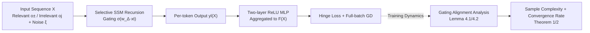

# A Theoretical Analysis of Mamba's Training Dynamics: Filtering Relevant Features for Generalization in State Space Models

**Conference**: ICLR 2026  
**OpenReview**: [https://openreview.net/forum?id=hvpKqEYJjj](https://openreview.net/forum?id=hvpKqEYJjj)  
**Code**: To be confirmed  
**Area**: learning theory  
**Keywords**: Mamba, Selective State Space Models, Training Dynamics, Generalization Analysis, Feature Learning, Gating Mechanism  

## TL;DR
This paper provides the first characterization of the Gradient Descent (GD) training dynamics of Mamba (a selective SSM with input-dependent gating) from a feature learning perspective. It proves that under two types of structured data, the gating vector $w_\Delta$ automatically aligns with class-relevant features and suppresses irrelevant ones. The authors provide non-asymptotic sample complexity and convergence rate bounds, theoretically answering "when and why Mamba can learn and generalize efficiently."

## Background & Motivation
- **Background**: Selective State Space Models (SSMs) like Mamba have approached or even surpassed Transformers in tasks across language, vision, graphs, and audio with linear complexity, sparking renewed interest in non-attention architectures. However, the theoretical foundation for their success remains weak.
- **Limitations of Prior Work**: Existing SSM theories almost exclusively focus on "approximation/expressivity"—proving that SSM+MLP is a universal approximator, that Mamba is more expressive than diagonal SSMs, or that H3/GLA implicitly performs preconditioned GD during in-context learning. These results only suggest the "existence" of good representations but do not address whether these capabilities can be **actually achieved through practical training**, nor do they touch upon generalization analysis.
- **Key Challenge**: The gating in Mamba is a **multiplicative, across-token cumulative, and token-order sensitive** recursive structure (unlike the additive weighting of attention). This makes analyzing its training dynamics significantly more difficult than gated linear attention. Furthermore, Mamba is empirically sensitive to hyperparameters, making "when it converges and generalizes" a non-trivial question.
- **Goal**: Establish the first theoretical analysis of training dynamics and generalization guarantees for a simplified but representative Mamba block (single-layer single-head selective SSM + two-layer MLP, trained with GD) and clarify the specific role of the gating mechanism.
- **Key Insight (Feature Learning + Gating Alignment)**: By modeling data as a structured combination of "class-relevant features + class-irrelevant padding features + token-level noise," the paper tracks the gradient evolution of the gating vector $w_\Delta$ along various feature directions. It proves that $w_\Delta$ spontaneously "amplifies the relevant and suppresses the irrelevant," formalizing the role of Mamba’s selection mechanism as an "attention-like feature selector."

## Method

### Overall Architecture
The analysis focuses on a minimal model that preserves the essence of gating: an input sequence passes through a single-layer selective SSM to produce per-token outputs $y_l(X)$, which are then aggregated by a two-layer ReLU MLP into a scalar prediction $F(X)$. The model is trained for binary classification using hinge loss and full-batch GD. The theoretical characterization proceeds in two stages: first, analyzing the alignment dynamics of $w_\Delta$ along different feature directions under two typical structured data types (Lemma 4.1/4.2), and then providing the sample complexity and iteration counts required to achieve zero generalization error (Theorem 1/2).

### Key Designs

**1. Structured Data Model: Anchoring signals via "Relevant, Confusing, and Irrelevant" tokens.** A set of orthogonal bases $O=\{o_+, o_-, o_3,\dots,o_d\}$ is used, where $o_+, o_-$ are discriminative features and others are irrelevant padding. Each token is a pattern plus Gaussian noise $x_l = o + \xi$. Two complementary label generation mechanisms are designed: In **Majority Voting Data**, labels are determined by the proportion of relevant tokens (in positive samples, noisy variants of $o_+$ are relevant and $o_-$ are confusing, vice versa for negative samples), mirroring the intuition of "multiple foreground patches voting for a category." In **Local Concentration Data**, each sequence contains two $o_+$ and two $o_-$, and the label is determined by the **spatial/temporal concentration** of relevant tokens (positive samples have two $o_+$ close together and two $o_-$ spread out, i.e., $\Delta L^+_{o_+} \ll \Delta L^+_{o_-}$), corresponding to scenarios in object detection/captioning where "decisive content is concentrated locally." This model translates abstract "selectivity" into geometric quantities trackable via gradients.

**2. Gating Alignment: Proving $w_\Delta$ amplifies relevant and suppresses irrelevant features.** The core technical contribution is the term-by-term decomposition of the gating vector's gradient updates, tracking the projection evolution along each $o$ direction. For **Majority Voting**, Lemma 4.1 proves that after training, the gating aligns positively with the two discriminative features $\langle w_\Delta^{(T)}, o_+\rangle \ge \frac{\eta T}{8L^2}\Theta((\alpha_r L - \alpha_c L)^2)$, while alignment with irrelevant features is pushed to $\tilde O(1/\text{poly}(d))$—meaning the gating explicitly acts as a feature selector. For **Local Concentration**, the mechanism is subtler: since relevant and confusing tokens are equal in number, majority effects cannot be exploited. Lemma 4.2 proves instead that the gating **actively pushes the irrelevant directions toward strongly negative gradients**: $\langle w_\Delta^{(T)}, o_j\rangle \le -\frac{\eta T c'_3}{16L}[(\tfrac12)^{\Delta L^+_{o_+}-2}-(\tfrac12)^{\Delta L^-_{o_+}-2}][\cdots]$, while relevant directions stay near zero. Both mechanisms induce effective sparsity in activations by prioritizing informative tokens.

**3. Generalization Guarantees: Translating data structure into sample complexity.** Based on the alignment results, Theorems 1 and 2 provide non-asymptotic bounds. For **Majority Voting**, given width $m\ge d^2\log q$ and noise $\tau < O(1/d)$, zero generalization error is reached when $N \ge \Omega\big(\frac{d}{\eta^2(\alpha_r-\alpha_c)^2}\big)$ and $T=\Theta\big(\frac{1}{\eta(\alpha_r-\alpha_c)^2}\big)$—bounds improve as the gap $\alpha_r-\alpha_c$ between relevant and confusing features increases. For **Local Concentration**, $N\ge\Omega\big(\frac{L^2 d}{\eta^2((1/2)^{\Delta L^+_{o_+}}-(1/2)^{\Delta L^-_{o_+}})^2}\big)$, with faster convergence when relevant features are more locally concentrated ($\Delta L^+_{o_+}\ll\Delta L^-_{o_+}$). Notably, while Transformers can learn majority voting (Li et al. 2023a), they lack such guarantees for local concentration data, highlighting Mamba's unique advantage in exploiting token order/locality.

## Key Experimental Results
Synthetic experiments are conducted solely to validate the theory.

### Main Results

| Figure | Object of Validation | Observation | Corresponding Theory |
|----|---------|------|---------|
| Fig.1 | Majority Voting Convergence | Increasing the voting gap $\alpha_r-\alpha_c$ consistently reduces required epochs. | Eq. (13)(14) |
| Fig.2 | Majority Voting Alignment | Cosine similarity between $w_\Delta$ and relevant features rises steadily; irrelevant ones remain flat. | Lemma 4.1 |
| Fig.3 | Local Concentration Convergence | Larger distance $\Delta L$ between relevant tokens leads to slower convergence. | Eq. (19)(20) |
| Fig.4 | Local Concentration Alignment | Similarity is negative for both, but near-zero for relevant and strongly negative for irrelevant. | Lemma 4.2 |

### Key Findings
- Gating behavior differs across data types but serves the same goal: Majority voting relies on "amplifying relevant signals," while local concentration relies on "suppressing irrelevant signals." Both tilt model capacity toward the most informative tokens.
- Both convergence speed and sample complexity are governed by "discriminative structure strength" (voting gap or concentration difference) and token noise $\tau$. Stronger signals and lower noise lead to faster learning—consistent with all experimental trends.

## Highlights & Insights
- **First Mamba Training Dynamics + Generalization Analysis**: While previous SSM theories focused on "existence of representation," this work answers whether training can actually find it and how many samples/iterations are required, moving analysis from approximation to optimization and generalization.
- **Formalization of Gating as a Feature Selector**: The authors use gradient projection dynamics to precisely characterize the intuition that "Mamba allocates capacity to important patterns," providing a mechanistic explanation similar yet fundamentally different (multiplicative vs. additive) to attention.
- **Revealing Mamba's Locality Advantage**: By constructing the local concentration model, the paper proves Mamba can utilize token order/concentration for learning, whereas Transformers lack generalization guarantees under the same conditions—providing a theoretical basis for "when to choose SSMs."
- **Handling Multiplicative Recursion**: The paper overcomes the analytical difficulty of multiplicative gating across tokens by decomposing diagonal terms $\beta^{(l)}_{s,s}$ and off-diagonal terms $\beta^{(l)}_{s,s+1}$ and tracking the impact of token positions on the dynamics.

## Limitations & Future Work
- **Significant Model Simplification**: The analysis is restricted to a minimal Mamba block (single-layer, single-head, no residual/LayerNorm) + 2-layer MLP, omitting key components of the actual architecture like depth, multi-head attention, and normalization.
- **Idealized Data Model**: Orthogonal features plus Gaussian noise for binary classification is a standard setup in feature learning theory but remains distant from the complex dependency structures of real-world sequences.
- **Future Work**: Extending this analysis to multi-layer, multi-head Mamba, richer data models, and hybrid architectures (e.g., Gated Transformers, Mamba-Transformer hybrids) represents important next steps.

## Related Work & Insights
- **SSM Theory**: From S4 to Mamba’s input-dependent gating. Prior work focused on approximation (Nishikawa & Suzuki 2025; Huang et al. 2025), long-range dependencies, and Transformer comparisons; this work fills the gap in training dynamics.
- **Optimization/Generalization for SSMs**: Honarpisheh et al. (2025) provided Rademacher complexity bounds, and Slutzky et al. (2024) studied implicit bias in teacher-student settings, but neither included Mamba’s input-dependent gating.
- **Feature Learning Framework**: This work follows the shift from NTK to feature learning (Li et al. 2023a/2024b), extending structured data models from attention to gated recursive architectures.
- **Insight**: The "multiplicative selection" mechanism of gating might be the core differentiator for SSMs. Understanding it is crucial for designing hybrid architectures and explaining hyperparameter sensitivity.

## Rating
- **Novelty**: ⭐⭐⭐⭐⭐ First analysis of Mamba training dynamics with input-dependent gating; introduces a novel local concentration data model.
- **Experimental Thoroughness**: ⭐⭐⭐ Purely synthetic data; validates theoretical trends without real-world tasks (acceptable for a theory-focused paper).
- **Writing Quality**: ⭐⭐⭐⭐ Clear progression from takeaways (T1-T3) through data models to lemmas/theorems; technical challenges are well-articulated.
- **Value**: ⭐⭐⭐⭐ Provides a foundational answer to "how Mamba learns/generalizes and its superiority over Transformers," guiding future selective SSM design.

<!-- RELATED:START -->

## Related Papers

- [\[ICLR 2026\] Theoretical Analysis of Contrastive Learning under Imbalanced Data: From Training Dynamics to a Pruning Solution](theoretical_analysis_of_contrastive_learning_under_imbalanced_data_from_training.md)
- [\[ICLR 2026\] On the Expressiveness of State Space Models via Temporal Logics](on_the_expressiveness_of_state_space_models_via_temporal_logics.md)
- [\[ICLR 2026\] Reshaping Reasoning in LLMs: A Theoretical Analysis of RL Training Dynamics through Pattern Selection](reshaping_reasoning_in_llms_a_theoretical_analysis_of_rl_training_dynamics_throu.md)
- [\[ICLR 2026\] Quotient-Space Diffusion Models](quotient-space_diffusion_models.md)
- [\[ICLR 2026\] The Expressive Limits of Diagonal SSMs for State-Tracking](the_expressive_limits_of_diagonal_ssms_for_state-tracking.md)

<!-- RELATED:END -->
