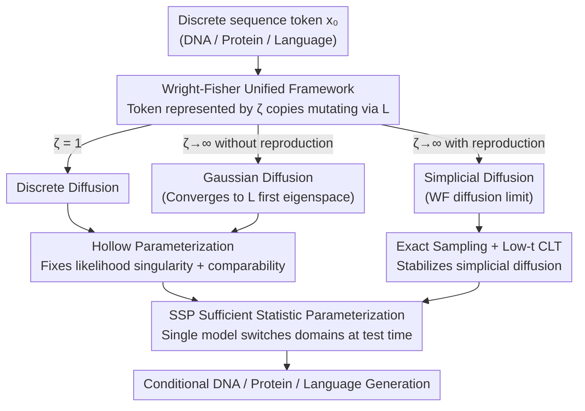

# A Unification of Discrete, Gaussian, and Simplicial Diffusion

**Conference**: ICLR2026  
**OpenReview**: [https://openreview.net/forum?id=1taAXRcm21](https://openreview.net/forum?id=1taAXRcm21)  
**Code**: https://github.com/yucenli/unify-diffusion (Available)  
**Area**: Diffusion Models / Generative Model Theory  
**Keywords**: Discrete Diffusion, Gaussian Diffusion, Simplicial Diffusion, Wright-Fisher Model, Sequence Generation

## TL;DR
This paper proves that three seemingly unrelated discrete sequence generation methods—discrete, Gaussian, and simplicial diffusion—are actually different parameterized limits of the **Wright-Fisher model** from population genetics. Using this unified theory, it stabilizes simplicial diffusion (which previously suffered from numerical divergence, achieving SOTA in conditional DNA generation) and allows a single network to switch between the three diffusion domains arbitrarily at test time.

## Background & Motivation
**Background**: To generate discrete sequences such as DNA, proteins, or natural language using diffusion models, practitioners face three mutually incompatible paths: (1) **Discrete Diffusion**—directly introducing "mutations" as noise in the discrete token space, which has the most natural domain; (2) **Gaussian Diffusion**—embedding tokens into Euclidean space $\mathbb{R}^r$ for Brownian motion, benefiting from the most mature sampling/training algorithms; (3) **Simplicial Diffusion**—performing diffusion on the probability simplex, theoretically an "ideal combination" that retains continuous algorithms while staying in the natural space.

**Limitations of Prior Work**: Since each method has its own algorithmic and theoretical structure, practitioners often choose based on intuition. Two fundamental comparison problems remain unsolved: ① **Likelihood Incomparability**—it is generally believed that "continuous-space likelihood and discrete-space likelihood cannot be directly compared" (because the Gaussian diffusion ELBO has a singularity as $t \to 0$ and the integral diverges, requiring an artificial $t_{\min}$; the comparison then involves the continuous density $\log p(x_{t_{\min}})$ rather than the discrete probability $p(x_0)$), yet the calculated numerical values are often curiously close. ② **Hyperparameter Incomparability**—discrete diffusion uses mutation rate matrices $L$, while Gaussian diffusion uses embedding functions $\text{emb}$, making it impossible to cross-design between them. Worse, simplicial diffusion is **numerically extremely unstable** in practice: sampling requires expensive Jacobi/CIR SDE simulations, and loss calculations "blow up" at small $t$.

**Key Challenge**: The root cause is the lack of a unified mathematical framework capable of comparing all three types—one that explains why their likelihoods are similar and allows mature tools from one domain to be transferred to others. Previous unification attempts only held for 1D specific cases, and some claims (e.g., Sahoo et al. 2025) suggesting "Gaussian diffusion yields discrete diffusion via argmax" were mathematically incorrect as the Markov property fails after the argmax operation.

**Key Insight**: The authors discovered that these three diffusions correspond to a classic model in population genetics—the **Wright-Fisher (WF) model**: a population of size $\zeta$ evolves through mutation and reproduction across generations.

**Core Idea**: Represent each token in a sequence by $\zeta$ copies, allowing each to evolve according to a mutation matrix $L$. When $\zeta=1$, it becomes discrete diffusion; as $\zeta \to \infty$ without reproduction, it converges to Gaussian diffusion; as $\zeta \to \infty$ with reproduction, it converges to simplicial diffusion. All three become limits of the same process, unifying their likelihoods, hyperparameters, and algorithms.

## Method

### Overall Architecture
This work combines "Theory + Implementation": first, it builds a unified framework using the Wright-Fisher population genetics model, proving the three diffusions are limits of the same process (Sections 4 & 5). It then uses this framework to resolve long-standing comparison issues and fixes numerical pathologies in simplicial diffusion (Section 5). Finally, it proposes a parameterization (SSP) that allows a single network to switch between any diffusion domain at test time (Section 6).

The mechanism can be viewed as follows: duplicate a token $x_0$ into $\zeta$ copies, each evolving independently via a continuous-time Markov mutation matrix $L$. The noisy state $\vec{x}_t$ is the normalized count vector of these $\zeta$ copies (residing on the simplex). By adjusting $\zeta$ and the presence of "reproduction," one can slide continuously between the three types:

### Key Designs

**1. Wright-Fisher Unified Framework: Unifying all three in one population model**

To address the lack of a shared mathematical framework, the authors represent each token as $\zeta$ copies (e.g., for $\zeta=4$, $x_0 = \texttt{C}$ is represented as $\texttt{CCCC}$). Each copy evolves independently via matrix $L$, making $\vec{x}_t$ a normalized count vector $\vec{x}_{t,b} = \#\{b \text{ in } x_t\} / \zeta$, which naturally lies on the simplex. At $\zeta=1$, this is standard discrete diffusion. Theorem 4.1 proves that as $\zeta \to \infty$, $\vec{x}_t$ tends towards a stationary distribution $\vec{\pi}$ by the Law of Large Numbers, and follows a Gaussian distribution around $\vec{\pi}$ by the Central Limit Theorem. Decomposing the noise into "signal + noise," we get $\vec{x}_t - \vec{\pi} \approx e^{-\tau_t^\zeta}P_1\vec{x}_0 + \tfrac{1}{\sqrt{\zeta}}\mathcal{N}(0,\Sigma)$. With proper time scaling $\tau_t^\zeta = \tfrac{1}{2}\log(\zeta e^{-2\tau_t} - \zeta + 1)$, this **converges exactly to Gaussian diffusion**, and its ELBO converges accordingly. A profound byproduct: limit Gaussian diffusion only occurs in the **slowest-decaying first eigenspace** of $L$. This provides a closed-form formula for embeddings: $\text{emb}(x_0) = Q_1(\vec{x}_0/\sqrt{\vec{\pi}})$.

**2. Hollow Parameterization: Making Likelihoods comparable and removing ELBO singularities**

Theorem 4.1 presents a paradox: theoretically, discrete diffusion with $\zeta = 10^{100}$ is indistinguishable from Gaussian diffusion on a computer, yet the Gaussian ELBO limit is infinite. The authors explain that $\vec{x}_t$ trajectories have a "near-deterministic low-$t$ phase." At initialization, the reverse network "cannot see who $x_0$ is," leading to a mismatch with the deterministic path. The solution is simple: weigh the network output by the evidence of each $x_0$: $q_\theta(x_0 \mid x_t, t) \propto p(x_t \mid x_0, t) q_\theta(x_0)$. In high dimensions, this is equivalent to the **hollow predictor** $q_\theta(x_0^d \mid x_t, t) \propto p(x_t^d \mid x_0^d, t) q_\theta(x_0^d \mid x_t^{-d}, t)$. This parameterization **removes the ELBO singularity**, allowing discrete and Gaussian likelihoods to be compared on the same scale for the first time.

**3. Stable Simplicial Diffusion: Fixing numerical issues via genetics literature**

Adding reproduction to the $\zeta$ population and letting $\zeta \to \infty$ yields the WF diffusion limit derived by Kimura (1955). This is precisely the forward process of simplicial diffusion. With this unification, the two major issues—expensive sampling and small-$t$ loss explosion—can be resolved:
- **Sampling**: Instead of expensive SDE simulations, the authors use the exact formula from Jenkins & Spanò (2017), sampling $\vec{x}_t$ from $\text{Dirichlet}(\psi\vec{\pi} + m\vec{x}_0)$.
- **Loss**: The heuristic score loss is replaced by the correctly scaled ELBO derived in this paper using the metric $\text{diag}(\vec{x}_t) - \vec{x}_t\vec{x}_t^\top$.
- **Small-t Instability**: A Central Limit Theorem approximation is used when $\tau_t < 0.05$ to replace the infinite series that fails to converge at small $t$.

**4. SSP Sufficient Statistic Parameterization: Domain switching at test time**

Usually, practitioners must fix the diffusion domain before training. The authors note that predicting $x_0^d$ is essentially integrating over unseen $x_0^{-d}$ based on the likelihood of $x_t^{-d}$. By normalizing this "evidence" into a vector $\vec{\phi}(x_t, t)$, Proposition 6.1 proves $p(x_0^d \mid x_t^{-d}, t)$ can be written as a function $F^d(\vec{\phi})$, which is **independent of the specific diffusion process and $t$**. Thus, $\vec{\phi}$ is a sufficient statistic. By parameterizing the network as $F_\theta^d(\vec{\phi}, \dots)$, the model can be trained by alternating between different domains per batch, resulting in a single model that can sample in any domain (discrete/Gaussian/simplicial) at test time.

## Key Experimental Results

### Main Results: Conditional DNA Generation (Simplicial SOTA)
Task: Sequence length $D=500$, vocabulary $B=4$. Conditional generation guided by chromatin accessibility profiles. Lower ELBO is better (nats/position):

| Model | ELBO (DNA, ↓) | Note |
| :--- | :--- | :--- |
| Trivial Uniform Model | 1.39 | Predicts uniform tokens |
| Avdeyev et al. (2023) Old Simplicial | 8.0 (12.7 pre-train) | Numerically unstable |
| **Ours (Stable Simplicial)** | **1.30** | Superior fit, far exceeds previous methods |

Fig. 5 shows that the samples generated by ours align much better with the target accessibility profiles, with average RMSE significantly lower than flow matching or random baselines.

### Ablation Study: SSP Unified Model vs. Specialized Models
Comparing the SSP unified model with models trained specifically for a single domain:

| Modality / Metric | Domain | Specialized Model | SSP Unified Model |
| :--- | :--- | :--- | :--- |
| Protein NLL (↓) | Disc / Gauss / Simp | 2.41 / 2.29 / 2.46 | 2.41 / 2.30 / 2.47 |
| Protein pLDDT (↑) | Foldability | 40.7 / 44.4 / 41.1 | 41.8 / 43.8 / 40.7 |
| Language NLL (↓) | Disc / Gauss | 3.46 / 4.57 | 3.55 / 4.18 |
| Language Perplexity (↓) | Disc / Gauss | 100.7 / 144.8 | 122.8 / 105.5 |

The unified model performs nearly on par with specialized models.

### Key Findings
- **Likelihoods are only comparable under specific circumstances**: It depends on the hollow parameterization choice. This corrects the old belief that continuous and discrete likelihoods are inherently incomparable.
- **Simplicial instability is not inevitable**: Its root is the divergence of infinite series at low $t$, which is solved here using exact sampling and CLT approximations from population genetics.
- **Unified models lose almost no performance**: An SSP network approximates specialized models in all three domains, removing the burden of domain selection before training.

## Highlights & Insights
- **The interdisciplinary bridge**: Mapping diffusion models to the Wright-Fisher model imports decades of genetics literature on stable sampling and series approximations into generative modeling.
- **Elegant limit perspective**: Discrete ($\zeta=1$), Gaussian ($\zeta \to \infty$ without reproduction), and Simplicial ($\zeta \to \infty$ with reproduction) are unified by a single "population size" knob.
- **Hollow parameterization as a reusable trick**: It removes ELBO singularities without architecture changes, simply by reweighting network outputs.
- **Sufficient statistics $\vec{\phi}$**: Separating the "diffusion domain" from the network allows for potential transfer across hyperparameters and even unseen modalities.

## Limitations & Future Work
- The framework does not yet include reflected diffusion, flow matching, or diffusions with insertions/deletions.
- Simplicial diffusion is difficult to scale to large vocabularies ($B \approx 3 \times 10^4$ in NLP), leaving it as the current engineering bottleneck for language tasks.
- Main experiments used biological sequences and small-scale language/MNIST; empirical evidence for large-scale LLM modeling is still needed.

## Related Work & Insights
- **vs. Winkler et al. (2024)**: They only connected 1D unbiased cases; this work provides a rigorous multi-dimensional proof and identifies the dominant eigenspace.
- **vs. Sahoo et al. (2025)**: They argued discrete ELBO is superior via argmax, but the authors here show the Markov property fails in their proof; this paper establishes a mathematically sound comparison instead.
- **vs. Avdeyev et al. (2023)**: Their simplicial diffusion was unstable and computationally expensive; this work utilizes proper ELBO scaling and exact sampling to surpass flow matching in stability and performance.

## Rating
- Novelty: ⭐⭐⭐⭐⭐ 
- Experimental Thoroughness: ⭐⭐⭐⭐ 
- Writing Quality: ⭐⭐⭐⭐⭐ 
- Value: ⭐⭐⭐⭐⭐ 

<!-- RELATED:START -->

## Related Papers

- [\[ICLR 2026\] Information Estimation with Discrete Diffusion](information_estimation_with_discrete_diffusion.md)
- [\[ICLR 2026\] Diffusion Bridge Variational Inference for Deep Gaussian Processes](diffusion_bridge_variational_inference_for_deep_gaussian_processes.md)
- [\[ICLR 2026\] Quotient-Space Diffusion Models](quotient-space_diffusion_models.md)
- [\[ICLR 2026\] Characterizing the Discrete Geometry of ReLU Networks](characterizing_the_discrete_geometry_of_relu_networks.md)
- [\[ICLR 2026\] A Sharp KL Convergence Analysis for Diffusion Models under Minimal Assumptions](a_sharp_kl_convergence_analysis_for_diffusion_models_under_minimal_assumptions.md)

<!-- RELATED:END -->
