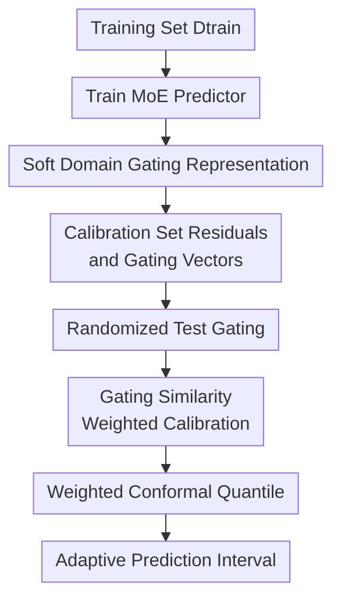

# Adaptive Conformal Prediction via Mixture-of-Experts Gating Similarity

**Conference**: ICLR2026  
**OpenReview**: [https://openreview.net/forum?id=vCmnu4q8C3](https://openreview.net/forum?id=vCmnu4q8C3)  
**Code**: TBD  
**Area**: Learning Theory / Uncertainty Estimation  
**Keywords**: Conformal Prediction, Mixture-of-Experts, Uncertainty Estimation, Weighted Calibration, Latent Domain Adaptation

## TL;DR
This paper proposes MoE-CP, which utilizes the gating probabilities of a Mixture-of-Experts (MoE) model as soft domain memberships. By weighting calibration residuals based on gating similarity, it allows prediction intervals to adaptively widen or narrow according to the noise and residual distributions of latent subgroups while maintaining marginal coverage guarantees for conformal prediction.

## Background & Motivation
**Background**: The primary appeal of conformal prediction (CP) lies in its distribution-free coverage guarantees: as long as the training, calibration, and test samples satisfy exchangeability, one can construct prediction intervals using quantiles of nonconformity scores from the calibration set, ensuring the new sample label falls into the interval with at least $1-\alpha$ probability. Standard split conformal prediction typically aggregates all calibration residuals to obtain a global quantile, which is simple to implement and theoretically sound, making it widely used for regression uncertainty estimation.

**Limitations of Prior Work**: Real-world data is often not a homogeneous population. In medical scenarios, noise varies across different hospitals and patient groups; in autonomous driving or sensor data, different weather, roads, and modalities introduce distinct error patterns. In multi-modal or large language model systems, data may contain multiple latent sub-domains without explicit labels. Standard CP only guarantees coverage in an average sense, potentially producing intervals that are too wide for low-noise domains and too narrow for high-noise domains. In other words, it may appear valid overall but is not necessarily reliable for specific subgroups.

**Key Challenge**: To achieve closer to conditional coverage, a test point should primarily reference calibration samples that "lie within the same residual mechanism." However, strict conditional coverage is unattainable without assumptions, and many datasets lack usable domain labels. Existing localized conformal prediction can weight calibration points based on distance in the original feature space, but many dimensions in high-dimensional features may be irrelevant to the error mechanism—Euclidean proximity does not necessarily equate to being in "the same prediction difficulty or latent domain."

**Goal**: The authors aim to solve three intertwined problems: first, identifying latent subgroups without explicit domain labels; second, transforming this soft domain structure into weights for calibration residuals to allow intervals to adapt to local error distributions; and third, maintaining the critical coverage guarantees of conformal prediction.

**Key Insight**: The paper observes that MoE models naturally partition inputs among different experts. The probability vector $\pi(x)$ output by the gating network can be interpreted as a soft membership of samples to various latent experts/domains. Compared to computing distances in the original feature space, gating probabilities emerge from within the predictive model and are more sensitive to task errors and expert specialization, making them better metrics for determining "which calibration samples are similar to the test sample."

**Core Idea**: Use the gating probability vectors from an MoE instead of explicit domain labels or raw feature distances. Perform similarity weighting on calibration residuals in the gating space to construct conformal prediction intervals that are both marginally valid and adaptive to latent heterogeneous domains.

## Method
### Overall Architecture
MoE-CP first trains an MoE regressor on the training set, obtaining both a point prediction $\hat{\mu}(x)$ and a gating probability $\pi(x)$ for each input. Absolute residuals are then computed on the calibration set. During testing, the gating probability of the test point is compared with those of each calibration point: closer calibration points receive higher weights in the weighted quantile calculation. The final interval is a prediction interval centered at the point prediction with a radius determined by the weighted conformal quantile.

In terms of implementation, while MoE-CP uses the absolute residual $S_i=|Y_i-\hat{\mu}(X_i)|$ as the nonconformity score in main experiments, the framework is not tied to a single score. By replacing the residual score with a conformalized quantile score or a distributional conformity score, the gating weighted layer can still be preserved. The paper's theoretical and experimental focus remains on the clearer regression interval version.

### Key Designs
**1. Soft domain gating representation: Replacing manual labels with MoE internal routing**

An MoE model consists of $K$ expert functions $\mu_k(x)$ and a gating network. For an input $x$, the gating network outputs logits $\ell_k(x)$, which are passed through a softmax to obtain expert probabilities:

$$
\pi_k(x)=\frac{\exp(\ell_k(x))}{\sum_{j=1}^{K}\exp(\ell_j(x))},\quad \sum_{k=1}^{K}\pi_k(x)=1.
$$

The final point prediction is a weighted average of expert outputs: $\hat{\mu}(x)=\sum_{k=1}^{K}\pi_k(x)\mu_k(x)$. The key here is not just that MoE can fit complex functions, but that $\pi(x)$ provides an interpretable soft domain coordinate for each sample: if two samples are strongly routed to the same set of experts, they likely operate under a similar residual mechanism.

This design transforms "domain identification" from an external labeling problem into an internal model representation issue. Traditional Mondrian conformal or group-conditional calibration requires known domain labels; localized CP using raw feature distances can be diluted by irrelevant dimensions. MoE gating sits in between: it is a continuous probability vector rather than a hard label, and it represents a latent regime trained by the prediction task rather than just raw input distance.

**2. Randomized test gating: Preserving conformal validity for local weighting**

Directly using the deterministic gating vector $\pi(X_{n+1})$ of a test point to weight calibration points may not automatically satisfy the symmetry required for weighted conformal theory. Drawing from randomized localized conformal prediction, the paper applies multinomial randomization to the test point gating:

$$
\tilde{L}\sim \mathrm{Multinomial}(\tau,\pi(X_{n+1})),\quad \tilde{\pi}(X_{n+1})=\frac{\tilde{L}}{\tau}.
$$

The temperature parameter $\tau$ controls the intensity of randomization. At small $\tau$, sampling noise is higher, leading to weights closer to conservative, dispersed localization; at large $\tau$, $\tilde{\pi}$ is closer to the original $\pi$, indicating higher confidence in the MoE's learned domain structure. The paper notes two extremes: as $\tau\to 0$, it degrades toward the uniform weights of standard split CP; as $\tau\to\infty$, weights might over-concentrate, potentially leading to a small effective calibration sample size and wider intervals.

**3. Gating similarity weighted calibration: Moving residual quantiles with latent domains**

Given calibration gating $\pi(X_i)$ and randomized test gating $\tilde{\pi}(X_{n+1})$, MoE-CP defines weights using divergence between probability vectors:

$$
w_i=\exp\{-\tau D(\tilde{\pi}(X_{n+1}),\pi(X_i))\},
$$

which are then normalized among $n$ calibration points and the $+\infty$ placeholder for the test point itself:

$$
\tilde{w}_i=\frac{w_i}{\sum_{j=1}^{n+1}w_j}.
$$

If a calibration point's gating distribution is close to the test point's, it has low divergence and high weight. If it is routed to a different set of experts, its influence is suppressed. Finally, the weighted empirical distribution $\sum_{i=1}^{n}\tilde{w}_i\delta_{S_i}+\tilde{w}_{n+1}\delta_{+\infty}$ is constructed, and the $(1-\alpha)$ quantile $Q_{1-\alpha}$ is used for the interval:

$$
\hat{C}^{\mathrm{MoE}}_n(X_{n+1})=\{y\in\mathbb{R}: |y-\hat{\mu}(X_{n+1})|\le Q_{1-\alpha}\}.
$$

**4. Effectiveness and conditional adaptability analysis: Layering guarantees**

The theoretical section establishes the baseline: under sample exchangeability and using KL or cross-entropy divergence, MoE-CP conditioned on the randomized gating satisfies:

$$
\mathbb{P}\{Y_{n+1}\in \hat{C}^{\mathrm{MoE}}_n(X_{n+1})\mid \tilde{\pi}(X_{n+1})\}\ge 1-\alpha,
$$

ensuring standard conformal coverage after marginalization. Furthermore, if the conditional distribution of nonconformity scores can be represented as a mixture of latent domains $S_i\mid X_i\sim\sum_{k=1}^{K}\pi_k^*(X_i)f_k^*$, MoE-CP approaches domain-adaptive calibration as the MoE better captures the true domain structure.

### Loss & Training
The MoE predictor is trained end-to-end on $D_{\mathrm{train}}$, optimizing experts and the gating network simultaneously using regression losses (MSE). Synthetic experiments use $K=3, \tau=150$, with experts and gates as three-layer feedforward networks (32 units per layer, dropout 0.1) trained for 600 epochs. Real-world experiments use $K=2, \tau=100$, 64-unit layers, trained for 2000 epochs.

## Key Experimental Results

### Main Results
Experiments were conducted on synthetic data and two real datasets (Bike-sharing and Temperature) with $\alpha=0.1$.

| Dataset / Setting | Metric | MoECP | Comparison Methods Overall | Conclusion |
|--------------------|--------|-------|----------------------------|------------|
| Synthetic, 3 domains | Marginal coverage | ~0.90 | All methods generally satisfied coverage | MoECP maintains target coverage |
| Synthetic, 3 domains | Interval length | Shortest | SCP+CC, RLCP, PCP significantly wider | MoECP is most efficient |
| Bike-sharing | Marginal / worst-slice coverage | Both ~0.90 | RLCP, PCP slightly conservative | MoECP does not sacrifice reliability |
| Bike-sharing | Interval length | Shortest (~1.0) | Most methods were wider | More efficient on heterogeneous real data |
| Temperature | Interval length | Shortest (1.0 - 1.1) | Competitive methods were longer | Gating weights improve efficiency |

### Ablation Study
- **Divergence Choice**: KL, Renyi, Jeffreys, Hellinger, Euclidean, and Cosine all yielded marginal coverage near 0.90, showing stability across similarity metrics.
- **Temperature $\tau$**: Coverage and worst-slice coverage remained stable across $\tau \in [50, 300]$, indicating the method is not overly sensitive to this hyperparameter.
- **Number of Experts $K$**: For small sample sizes, smaller $K$ results in shorter intervals as it prevents the effective calibration sample size from becoming too small.

### Key Findings
- MoECP's primary advantage is achieving the same coverage target with shorter intervals that adapt to domains.
- Gating similarity is more effective than raw feature distance for capturing residual mechanisms, especially when functional forms and noise levels shift across domains.
- KL divergence is the recommended default due to its strong theoretical grounding and experimental stability.

## Highlights & Insights
- Interpreting MoE gating probabilities as latent domain coordinates makes "domain-adaptive conformal calibration without labels" actionable.
- The method balances the marginal validity of CP with the practical need for conditional-like adaptability.
- Randomized gating is not just a heuristic but a theoretical bridge that allows weighted conformal coverage proofs to hold.
- This approach is portable to any model with routing (MTL task routers, Multi-modal routers, LLM MoE).

## Limitations & Future Work
- **Ours** relies on the MoE gating actually capturing the noise/regime of the residuals. If experts are partitioned by mean prediction rather than error patterns, adaptability may be limited.
- Exact finite-sample guarantees are strongest for KL/Cross-entropy; other divergences rely on asymptotic arguments.
- Current experiments are on a medium scale; performance on massive sparse MoEs or LLMs remains to be explored.
- The assumption of an exchangeable population limits the method's direct application to severe distribution shifts or non-exchangeable time series.

## Related Work & Insights
- **vs Standard Split CP**: Standard CP uses a global quantile; MoE-CP uses local weights for better efficiency.
- **vs Mondrian / Group-conditional CP**: Those require explicit labels; MoE-CP discovers latent regimes through soft gating.
- **vs RLCP**: RLCP uses raw feature distance; MoE-CP uses learned gating space which is lower-dimensional and task-relevant.
- **vs PCP**: PCP requires fitting mixture models which can be computationally heavy; MoE-CP uses a single forward pass of a pre-trained gating network.

## Rating
- Novelty: ⭐⭐⭐⭐
- Experimental Thoroughness: ⭐⭐⭐⭐
- Writing Quality: ⭐⭐⭐⭐
- Value: ⭐⭐⭐⭐

<!-- RELATED:START -->

## Related Papers

- [\[ICML 2026\] Enhancing Conformal Prediction via Class Similarity](../../ICML2026/learning_theory/enhancing_conformal_prediction_via_class_similarity.md)
- [\[ICLR 2026\] Conformal Prediction for Long-Tailed Classification](conformal_prediction_for_long-tailed_classification.md)
- [\[ICLR 2026\] Distribution-informed Online Conformal Prediction](distribution-informed_online_conformal_prediction.md)
- [\[ICLR 2026\] Singleton-Optimized Conformal Prediction](singleton-optimized_conformal_prediction.md)
- [\[ICLR 2026\] Softmax is not Enough (for Adaptive Conformal Classification)](softmax_is_not_enough_for_adaptive_conformal_classification.md)

<!-- RELATED:END -->
