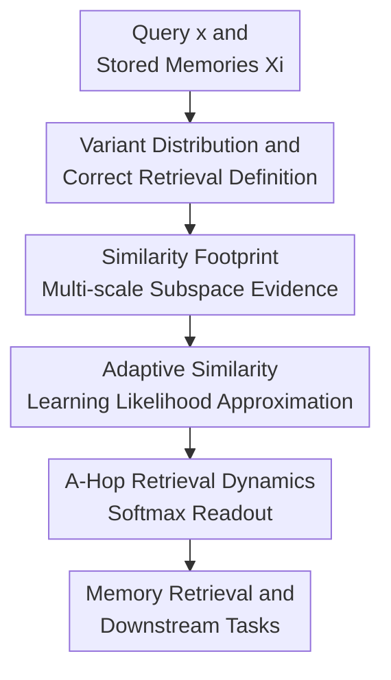

# Adaptive Hopfield Network: Rethinking Similarities in Associative Memory

**Conference**: ICLR2026  
**OpenReview**: [https://openreview.net/forum?id=HKSp4U69dy](https://openreview.net/forum?id=HKSp4U69dy)  
**Code**: https://anonymous.4open.science/r/Adaptive-Hopfield-Network-C137/  
**Area**: Learning Theory / Associative Memory / Hopfield Networks  
**Keywords**: Associative Memory, Hopfield Networks, Adaptive Similarity, Variant Distribution, Correct Retrieval  

## TL;DR
This paper redefines associative memory retrieval from "being sufficiently close to a stored pattern" to "finding the source memory most likely to have generated the current query." By constructing an adaptive Hopfield network (A-Hop) with a learnable similarity footprint, it significantly outperforms fixed-similarity Hopfield variants on tasks involving mixed noise, occlusion, bias, and multi-class classification.

## Background & Motivation
**Background**: Hopfield networks are classic content-addressable memory systems. They store a set of patterns $\Xi=[\xi_1,\ldots,\xi_N]$. Given a noisy or partial query $x$, the model returns a memory pattern through similarity scoring, a separation function, and a readout step. Modern Hopfield networks (MHN) establish a connection with the attention mechanism, utilizing inner product similarity and softmax separation to write retrieval as $T(x)=\Xi\operatorname{softmax}(\Xi^\top x)$. Subsequent works introduced sparsemax, kernel modulation, etc., to improve capacity or sparsity.

**Limitations of Prior Work**: Existing theories often use $\epsilon$-retrieval to evaluate success, which simply checks if the retrieved result $y$ is close to *some* stored pattern $\xi$. This criterion indicates the result lies near the memory set but does not guarantee it is "the correct one." If query $x$ is a variant generated from a specific memory in a certain context, the correct answer should be the source memory most likely to generate $x$, not necessarily the closest one in terms of Euclidean distance or inner product.

**Key Challenge**: The root problem is that "similarity" itself is context-dependent. The paper provides an intuitive example: the word "click" can be semantically close to "tap," phonetically close to "clique," or orthographically close to "clock." Fixed inner product or Euclidean distance pre-defines a unique similarity, failing to adapt to whether the task requires semantic, acoustic, or visual robustness.

**Goal**: The authors aim to provide a more rigorous definition of correct retrieval and design a Hopfield network capable of learning similarity from context samples. Specifically, it addresses three questions: how queries are generated from stored memories; what defines retrieval of the correct source; and how the model approximates this source discrimination without knowing the analytical form of the generation distribution.

**Key Insight**: The query is viewed as a generated variant of a stored pattern $\xi_k$, and a variant distribution $V(\Xi)$ is introduced to describe the joint distribution of $(\xi, x)$. Consequently, correct retrieval is no longer about "closeness" but about "maximizing the posterior $p_V(\xi\mid x)$." Under uniform or estimable priors, this translates to comparing the likelihood $p_V(x\mid \xi)$.

**Core Idea**: Use a learnable adaptive similarity to approximate the unknown generation likelihood $p_V(x\mid\xi)$, then integrate this similarity into the Hopfield retrieval dynamics. This allows associative memory to retrieve based on the correct source rather than fixed geometric distances.

## Method

### Overall Architecture
The logic of A-Hop is divided into two layers: a theoretical layer that defines "correct retrieval" via variant distributions, and a model layer that extracts evidence from subspace relationships between queries and memories using a similarity footprint to learn an adaptive similarity function. A-Hop retains the interpretable framework of "similarity scoring → separation → readout" but replaces the fixed $\xi^\top x$ with a learned $s(\xi,x)$.

The model takes a set of stored patterns $\Xi$ and a query $x$ as input, and outputs a weighted readout memory representation $y$. The key difference from Modern Hopfield Networks lies in the similarity: A-Hop calculates footprints of multiple base similarities for each candidate memory $\xi_k$, combines them into logits via learnable weights, and obtains the predicted probability of each memory being the source using softmax.

### Key Designs
**1. Variant Distribution and Correct Retrieval: Redefining "Neighbors" as "Most Likely Sources"**

Traditional $\epsilon$-retrieval only checks $\|y-\xi\|_2\leq\epsilon$, which can misidentify "retrieving a valid memory" as "retrieving the correct memory." The first key design models query $x$ as a variant of $\xi$ generated under a context mechanism, using $V(\Xi)$ for the joint distribution of $(\xi, x)$. Correct retrieval requires that the closest stored pattern to the result equals the source with the maximum posterior: $\arg\min_{\xi'\in\Xi}\|y-\xi'\|_2=\arg\max_{\xi'\in\Xi}p_V(\xi'\mid x)$.

This definition traces "what similarity should be" back to the generation mechanism. By Bayesian decomposition, if the prior $p_V(\xi)$ is uniform, comparing $p_V(\xi\mid x)$ is equivalent to comparing $p_V(x\mid\xi)$. Thus, ideal similarity should reflect "the likelihood of this memory generating the current query." The paper illustrates that for noisy, masked, and biased variants, the likelihood shapes are entirely different, and no fixed similarity can handle all scenarios simultaneously.

**2. Similarity Footprint: Subspace Evidence Instead of Scalar Similarity**

Since the true $p_V(x\mid\xi)$ is usually unknown, the paper constructs learnable surrogate evidence using a similarity footprint. Given a decomposable base similarity (e.g., negative squared Euclidean distance or dot product), it first computes dimension-wise similarities $q_i=\operatorname{sim}(\xi_i,x_i)$, sorts them in descending order as $\tilde q$, and takes the cumulative sum to get a $d$-dimensional vector $\operatorname{ftpt}_{\operatorname{sim}}(\xi,x)=U\tilde q$.

The intuition is clear: a single scalar tells the model "overall similarity," but not which dimensions are trustworthy versus occluded. The sorted $k$-optimal similarity asks "how similar are $x$ and $\xi$ considering only the $k$ most consistent dimensions." Under occlusion, corrupted dimensions naturally fall to the end of the sorted sequence; under noise, the model learns global combinations; under bias, weights can learn matching patterns post-shift.

**3. Adaptive Similarity and A-Hop: Learning Reliable Footprint Dimensions**

The similarity is expressed as a learnable linear combination $s_{\operatorname{sim}}(\xi,x)=w^\top\operatorname{ftpt}_{\operatorname{sim}}(\xi,x)$. The main model utilizes both negative squared distance and dot product footprints, aggregated via learnable scalars $\beta_{\operatorname{dis}},\beta_{\operatorname{dot}}$: $s(\xi,x)=\beta_{\operatorname{dis}}s_{\operatorname{dis}}(\xi,x)+\beta_{\operatorname{dot}}s_{\operatorname{dot}}(\xi,x)$. This design keeps parameter counts low, forcing the model to learn only which subspace scales are trustworthy and which base similarity fits the current context.

Incorporated into the Hopfield network, the dynamics are $y=T(x)=\Xi\operatorname{softmax}(s(\Xi,x))$. During training, $(\xi_k,x)$ pairs are sampled from the variant distribution, the $k$-th softmax probability is treated as $\tilde p_V(x\mid\xi_k)$, and a cross-entropy loss is minimized: $\mathcal L=\mathbb E_{(\xi_k,x)\sim V(\Xi)}[-\log \tilde p_V(x\mid\xi_k)]$.

**4. Theoretical Guarantee and Energy Function: Retaining Interpretable Dynamics**

The paper proves that A-Hop achieves optimal correct retrieval across three classic variant types. For noisy variants, ideal similarity degrades to variance-weighted negative distance; for masked variants, sorting identifies undamaged dimensions; for biased variants, the model learns similarity corrections.

The energy function $E(x)=-\operatorname{lse}(s(\Xi,x))$ is also analyzed. Under isotropic noisy and biased variants, the energy decreases monotonically along the retrieval process, converging to a lower bound. A-Hop thus retains the interpretability of Hopfield networks as energy models, performing retrieval in an energy landscape shaped by adaptive similarity.

### Loss & Training
The core objective is to align the similarity-based softmax distribution with the true source labels. 

The training loss is $\mathcal L(\Xi,V)=\mathbb E_{(\xi_k,x)\sim V(\Xi)}[-\log \tilde p_V(x\mid\xi_k)]$. In memory retrieval experiments, the authors use Adam for 200 epochs with a learning rate of 0.1. In downstream tasks, A-Hop is embedded in classification networks where weights are updated via classification loss. The complexity of a single similarity calculation increases from $O(d)$ to $O(d \log d)$ due to sorting, but GPU inference is only approximately 15% to 30% slower.

## Key Experimental Results

### Main Results
The paper covers memory retrieval (Synthetic/MNIST), tabular classification, image classification, and multi-instance learning. A-Hop excels in high-intensity mixed variant retrieval.

| Dataset / Setting | Metric | Ours (A-Hop) | Best Hopfield Baseline | Gain |
|--------|------|------|----------|------|
| Synthetic, diff 0.4 | Accuracy ↑ | 0.724±0.02 | 0.521±0.02 (U2-Hop) | +0.203 |
| Synthetic, diff 0.5 | Accuracy ↑ | 0.360±0.02 | 0.195±0.03 (M-Hop) | +0.165 |
| MNIST, diff 0.6 | Accuracy ↑ | 0.939±0.01 | 0.878±0.01 (U2-Hop) | +0.061 |
| MNIST, diff 0.7 | Accuracy ↑ | 0.849±0.01 | 0.661±0.02 (M-Hop) | +0.188 |

In tabular classification, A-Hop as a memory-based classifier consistently outperforms M-Hop and U2-Hop, approaching the performance of XGBoost.

| Dataset | Metric | Ours (A-Hop) | M-Hop | U2-Hop | Note |
|--------|------|------|------|--------|------|
| Adult | Accuracy ↑ | 0.8634 | 0.8080 | 0.8172 | Near XGBoost 0.8640 |
| Heart | Accuracy ↑ | 0.7315 | 0.6325 | 0.6473 | Significantly superior |

### Ablation Study
Ablations verify the importance of the footprint structure. Comparing configurations with/without sorting and the $U$ matrix shows that combining both yields the best results.

| Configuration | Synthetic d=0.4 Accuracy ↑ | Description |
|------|---------|------|
| No Sort, No $U$ | 0.5172±0.034 | Similar to standard similarity |
| No Sort, With $U$ | 0.5444±0.007 | Cumulative but lacks dimension reordering |
| With Sort, No $U$ | 0.6928±0.034 | Sorting is a key factor |
| With Sort, With $U$ | 0.7280±0.034 | Full footprint is optimal |

### Key Findings
- A-Hop's advantage is most pronounced in masked and biased scenarios where fixed distances cannot distinguish between "irrelevant/occluded dimensions" and "mismatched sources."
- Sorting is more critical than the triangular accumulation, though the full footprint is most stable.
- In image classification and multi-instance learning, A-Hop consistently outperforms other Hopfield variants, serving as a robust differentiable memory layer.
- Multimodal experiments in the appendix show A-Hop maintains high accuracy (0.988) at 1024 concepts, while other methods decay.

## Highlights & Insights
- **Value**: Shifts the evaluation of associative memory from geometric proximity to probabilistic source discrimination.
- The similarity footprint is a concise yet powerful design that maintains interpretability while adding multi-scale subspace evidence with minimal parameters.
- It unifies noisy, masked, and biased variants under one framework, demonstrating that correct similarity sometimes requires ignoring certain dimensions rather than penalizing all dimensions equally.
- It suggests that if query-key similarity in attention is fixed, the model assumes a single matching semantic. A-Hop allows similarity itself to be learnable and context-constrained.

## Limitations & Future Work
- Theoretical guarantees focus on standardized variants (noisy, masked, biased). Real-world non-linear shifts or semantic drifts may require more complex footprints.
- The model requires training samples from the variant distribution; scenarios with sparse labels or shifting mechanisms might limit performance.
- Sorting increases complexity from $O(Nd)$ to $O(Nd \log d)$, necessitating approximation or pre-screening for extremely large memory banks.

## Related Work & Insights
- **vs. Modern Hopfield Network**: MHN uses fixed softmax inner products. A-Hop retains the softmax readout but generates logits from learnable footprints, making it robust to non-standard variants.
- **vs. Sparse/Universal/Kernelized Hopfield**: These methods primarily modify separation or modulation. A-Hop targets the similarity definition directly.
- **Insight**: In any retrieval system, one should first determine what kind of "variant" the query is. If queries involve occlusion or style transfer, similarity should be designed around that generative process rather than defaulting to inner products.

## Rating
- Novelty: ⭐⭐⭐⭐⭐ (Redefining correct retrieval via variant distributions).
- Experimental Thoroughness: ⭐⭐⭐⭐ (Broad coverage of tasks and ablations).
- Writing Quality: ⭐⭐⭐⭐ (Clear motivation and strong theoretical grounding).
- Value: ⭐⭐⭐⭐⭐ (Significant implications for learnable/interpretable similarity).

<!-- RELATED:START -->

## Related Papers

- [\[ICLR 2026\] Dynamical properties of dense associative memory](dynamical_properties_of_dense_associative_memory.md)
- [\[ICLR 2026\] A Biologically Plausible Dense Associative Memory with Exponential Capacity](a_biologically_plausible_dense_associative_memory_with_exponential_capacity.md)
- [\[ICLR 2026\] Transformers as Measure-Theoretic Associative Memory: A Statistical Perspective and Minimax Optimality](transformers_as_measure-theoretic_associative_memory_a_statistical_perspective_a.md)
- [\[ICLR 2026\] Softmax is not Enough (for Adaptive Conformal Classification)](softmax_is_not_enough_for_adaptive_conformal_classification.md)
- [\[ICLR 2026\] Adaptive Conformal Prediction via Mixture-of-Experts Gating Similarity](adaptive_conformal_prediction_via_mixture-of-experts_gating_similarity.md)

<!-- RELATED:END -->
