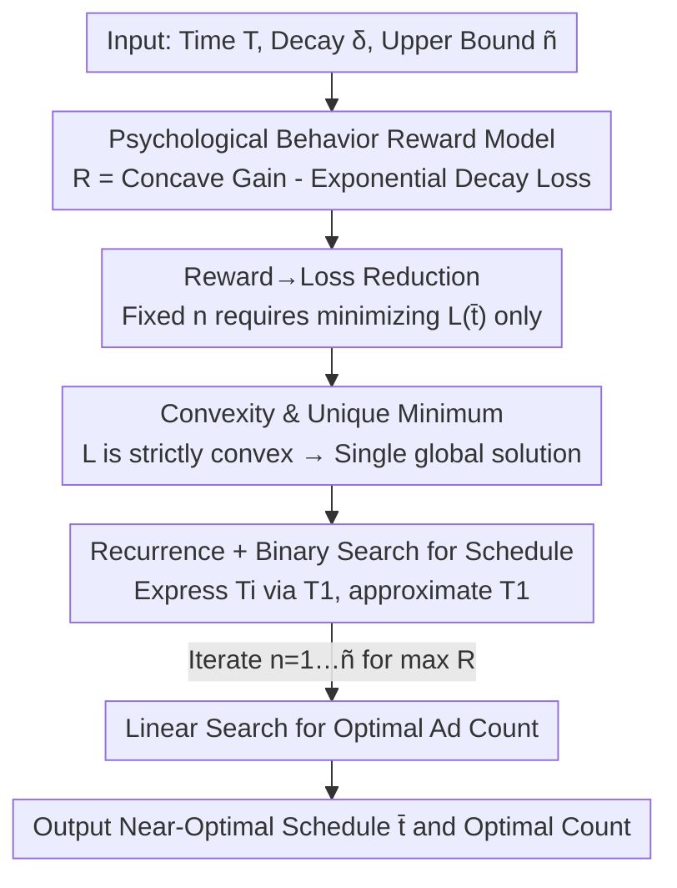

# Ads that Stick: Near-Optimal Ad Optimization through Psychological Behavior Models

**Conference**: ICLR2026  
**OpenReview**: [https://openreview.net/forum?id=A8wfXZkoMs](https://openreview.net/forum?id=A8wfXZkoMs)  
**Code**: https://anonymous.4open.science/r/Ads-that-Stick-5E13  
**Area**: Learning Theory / Online Optimization / Computational Advertising  
**Keywords**: Ad Scheduling, Psychological Behavior Models, Near-Optimal Algorithms, Convex Optimization, Operant Conditioning

## TL;DR
This paper incorporates three psychological effects—"mere exposure," "hedonic adaptation," and "operant conditioning"—into a continuous-time ad reward model. It demonstrates that when the number of ads is fixed, the optimal schedule is determined solely by the decay loss of "operant conditioning." The authors provide a quasi-linear time, near-optimal scheduling algorithm with exponentially small error, revealing that common heuristics like "uniform spacing" are actually suboptimal in many scenarios.

## Background & Motivation
**Background**: Digital advertising determines "when and how many ads to show" in video/audio streams, push notifications, and sponsored content within sessions. However, mainstream industry scheduling still relies on simple heuristics—uniform spacing, front-loading, frequency caps—or short-sighted strategies that treat each exposure as independent.

**Limitations of Prior Work**: These heuristics ignore the dynamic evolution of users' **long-term** interests. Extensive empirical evidence in behavioral psychology (Singh 1994; Sahni 2015; Curmei 2022) indicates that the intervals and frequency of ads significantly affect memory retention and fatigue. Current methods lack a reward model capable of explaining these phenomena and fail to answer "exactly at what moments ads should be placed." The few efforts to move beyond heuristics (such as modeling scheduling as a reinforcement learning problem) result in policies that are difficult to interpret or implement.

**Key Challenge**: Repeated exposure is a **double-edged sword** for user interest. The first few exposures bring a positive "freshness boost" (mere exposure) but quickly saturate (hedonic adaptation with diminishing marginal utility). Conversely, overly dense exposure leads to negative fatigue (operant conditioning) due to memory and attention depletion. These positive and negative forces fluctuate over time and frequency, making "placement" a genuine optimization problem rather than an arbitrary interval rule.

**Goal**: The paper decomposes the problem into two sub-questions: (Q1) Can a **theoretical reward model** be designed to characterize user psychological behavior, such that its optimal strategy aligns with empirical findings and its parameters are adjustable? (Q2) Under such a model, can the optimal ad schedule be **efficiently computed**?

**Key Insight**: The authors follow the categorization of three psychological effects by Curmei et al. They model the first two positive effects as a "concave function of the number of exposures" and the negative operant conditioning as "exponential time decay" (motivated by the Ebbinghaus forgetting curve). A key observation is that when the number of ads is fixed, the positive term becomes a constant independent of time, thus collapsing the scheduling problem into a convex optimization involving only decay loss.

**Core Idea**: The ad schedule is formulated as "Concave Exposure Gain − Exponentially Decaying Fatigue Loss." The authors prove that the loss is strictly convex with a unique minimum. Using recurrence and binary search, they approximate this minimum in quasi-linear time, obtaining a near-optimal schedule with exponentially small error.

## Method

### Overall Architecture
Given a time interval $[0,T]$, $n+1$ homogeneous ads are to be scheduled at times $\bar t=(t_0,t_1,\dots,t_n)$, where $t_0=0$, $t_n=T$, and $t_i\le t_{i+1}$. The reward for the $i$-th ad is divided into two parts:

$$R(\bar t,i)=B(i)-\gamma\sum_{j<i}\delta^{\,t_i-t_j}.$$

Here, $B(i)$ is a **concave function** of the "number of ads already shown" (e.g., a sigmoid $B(i)=\tfrac{1}{1+e^{-ci}}$), capturing the positive boost of mere exposure and the diminishing marginal utility of hedonic adaptation. The second term is **exponential time decay**, where $\delta\in[0,1]$ controls the strength of operant conditioning—ads placed at $t_j$ previously cause the current reward at $t_i$ to decay by $\delta^{t_i-t_j}$, with $\gamma>0$ as a scaling constant. Total reward is $R(\bar t)=\sum_i R(\bar t,i)$.

The solution follows a pipeline of "dimensionality reduction, then recurrence, then binary search": first, prove that maximizing reward for a fixed $n$ is equivalent to minimizing the decay-only loss $L$; next, prove $L$ is strictly convex with a unique minimum; then, express all time points in terms of the first internal time $T_1$; finally, perform a binary search on $T_1$ to recover the schedule and a linear search for the optimal $n$.

### Key Designs

**1. Three-Effect Reward Model: Mapping Psychology to "Concave Gain - Exponential Decay"**

Addressing the lack of interpretable reward models, the authors condense three validated psychological effects into a compact expression. Positive mere exposure and hedonic adaptation are merged into $B(i)$, a concave function of exposure count—where concavity corresponds to "diminishing marginal returns." The negative operant conditioning (fatigue) is modeled via exponential decay $\delta^{t_i-t_j}$, directly motivated by the Ebbinghaus forgetting curve's assumption of exponential memory decay. This also aligns with classical goodwill-stock models and exponential discounting in control theory. The elegance lies in using a single parameter $\delta$ to encode different psychological states: a small $\delta$ implies weak influence from past exposures, while a large $\delta$ indicates strong long-term memory leading to rapid annoyance.

**2. Reward→Loss Reduction: Decoupling Schedule from Ad Count**

This is the pivotal point of the paper. Expanding the total reward:

$$R(\bar t)=\Big(\sum_{i=0}^{n}B(i)\Big)-\gamma\sum_{j<i}\delta^{\,t_i-t_j}.$$

The first term $\sum_i B(i)$ depends only on the **number** of ads and is independent of the **timing**; $\gamma$ is merely a scaling factor. Consequently, once $n$ is fixed, the scheduling problem reduces to minimizing the loss $L(\bar t)=\sum_{j<i}\delta^{\,t_i-t_j}$. This observation cleanly decouples the "where to place" optimization from the "how many to show" question.

**3. Strict Convexity and Unique Minimum: Global Optimality via Local Conditions**

To guarantee finding the global optimum, the authors prove that the loss $L$ is **strictly convex** over the feasible domain $D=\{t_i:0\le t_i\le T,\ t_i\le t_{i+1},\ t_0=0,\ t_n=T\}$. Thus, there is at most one minimum, and a local minimum is the global minimum (Theorem 4.2). The proof utilizes variable substitution, showing any optimal solution must have $t_0=0$ and $t_n=T$ (Lemma 4.1), and maps the problem to an equivalent one using time differences $a_{ij}=t_i-t_j$ as variables.

**4. Recurrence + Binary Search: Near-Optimal Schedule Recovery**

To efficiently solve the schedule without high-dimensional equation systems, the authors introduce $T_i:=\delta^{t_i}$ and prove all moments can be expressed in closed form using the **first internal moment** $T_1$:

$$T_i=\frac{T_1^{\,i}}{(1+T_1)^{\,i-1}},\qquad \frac{T_1^{\,n}}{(1+T_1)^{\,n-2}}=T_n=\delta^T.$$

The degrees of freedom for the entire schedule collapse into the scalar $T_1$. The right equation provides a monotonic function of $T_1$, which can be approximated via **binary search** on $[\delta^T, 1]$. The final result (Corollary 4.8) gives the approximation accuracy for each moment: choosing $\epsilon=\tfrac{1}{2^n}\cdot\tfrac{\log(1/\delta)}{2\ln 2}$ yields

$$t_i^{*}-\frac{1}{2^n}\le t_i\le t_i^{*}+\frac{1}{2^n},$$

meaning the gap to the optimal schedule **shrinks exponentially with $n$**.

### A Complete Example
Given $T=20$ and 7 ads, varying $\delta$ from 0 to 1 shows the evolution of the schedule (Figure 1a): when $\delta\le 0.4$, the algorithm places ads **almost equidistantly**—fatigue is weak, making uniform spacing nearly optimal. As $\delta$ increases beyond 0.4, ads begin to **diverge toward the boundaries**: half cluster near $t=0$ and half near $t=20$. When $\delta\to 1$, most ads occupy the two ends. This trajectory from uniform to "corner-heavy" scheduling (Observation 5.1) theoretically explains the empirical observation that "placing ads at the beginning and end is more effective" and limits it to scenarios with "strong user memory (high $\delta$)."

## Key Experimental Results

### Main Results
In a video streaming scenario with $n+1=15$, $T=100$, and $\delta>0.9$ (real-world $\delta\approx0.98$), three baselines are compared:

| Configuration | δ Range | Performance | Description |
|------|--------|------|------|
| Uniform Spacing | Small δ | Good | Fatigue is weak; uniform is near-optimal |
| Corner (Half at 0, half at T) | δ→1 | Good | Boundary clustering dominates at high δ |
| Random (Fixed ends, random middle) | Any | Poor | Lacks structure |
| **Ours (Near-Optimal)** | All δ | **Always Optimal** | Leads all baselines by ≥10% when δ≈0.98 |

The core conclusion: no single fixed heuristic is optimal across all $\delta$. Uniform is only good for small $\delta$, and Corner is only good for large $\delta$, while the proposed strategy is **adaptive to $\delta$**.

### Ablation Study / Analysis

| Experiment | Key Finding | Description |
|------|---------|------|
| Loss vs. Ad Count | $L^\#(2(n+1))\approx 2L^\#(n+1)$ | Loss grows approximately linearly with the number of ads |
| Loss vs. δ Sensitivity | Loss spikes when δ goes from 0.9→0.99 | Extremely sensitive in the high δ region; stable below δ≈0.7 |
| Optimal Ad Count | Reward curve is unimodal | Under sigmoid $B(i)$, exposure gain dominates initially, then fatigue takes over |

### Key Findings
- **Heuristic optimality depends on $\delta$**: Uniform spacing is not universally optimal; it only performs well when memory decay is weak (small $\delta$).
- **High $\delta$ region is critical**: The sharp rise in loss from $\delta=0.9$ to $0.99$ indicates that real-world scenarios ($\delta\approx0.98$) fall into the most sensitive range for scheduling.
- **Optimal ad count is searchable**: Reward follows a unimodal curve, allowing for linear search to determine the ideal number of ads.

## Highlights & Insights
- **Translating Psychology to Optimization**: By modeling mere exposure/hedonic adaptation as concave functions and operant conditioning as exponential decay, the authors create an interpretable framework transferable to recommendation or push-notification fatigue scenarios.
- **Dimensionality Reduction Lever**: Discovering that the positive term is constant for a fixed $n$ is the most significant step, decoupling the complex "frequency × timing" problem.
- **Theoretical Grounding of Industry Intuition**: The "ads at the start and end" rule of thumb is proven to be the optimal solution for high $\delta$, while also identifying its boundaries.
- **Exponentially Small Error Guarantee**: The precision $|t_i-t_i^*|\le 1/2^n$ is mathematically elegant for scheduling problems, achieved in quasi-linear time.

## Limitations & Future Work
- **Stationary Reward Assumption**: The model assumes rewards are generally stationary (suitable for continuous streams) and does not directly apply to **seasonal or non-stationary** rewards (e.g., holidays).
- **Homogeneous Ad Assumption**: The paper assumes ads are identical. Heterogeneous ads (varying values/durations) are only partially addressed in an appendix extension.
- **Acquisition of $\delta$**: The strategy relies heavily on $\delta$. The paper does not provide an algorithm to estimate $\delta$ from real user data or account for its drift over time.
- **Simulation-based Validation**: Experiments are based on simulations using the proposed reward model. Real-world A/B testing is needed to verify the model's approximation of true user behavior.

## Related Work & Insights
- **vs. Nerlove & Arrow (Goodwill-stock model)**: Classical models treat ads as investments in "goodwill" that depreciate, often resulting in strategies that "stack all ads at the beginning." This work adds an explicit fatigue term to capture the phase transition to "corner-heavy" scheduling.
- **vs. RL-based Scheduling**: RL methods are general but produce "black-box" policies. This work uses a structured convex model to obtain interpretable scheduling laws.
- **vs. Leqi 2021 (Satiation / Restless Bandits)**: That work uses linear dynamical systems for satiation. This paper focuses on continuous-time deterministic scheduling and the **optimal moment distribution** phase transition.

## Rating
- Novelty: ⭐⭐⭐⭐⭐ First to map three psychological effects into a continuous-time optimized reward model with phase-transition analysis.
- Experimental Thoroughness: ⭐⭐⭐ Simulations clearly verify the theory, but lacks real-world platform A/B data.
- Writing Quality: ⭐⭐⭐⭐ Logical flow from modeling to reduction to algorithms is clean and well-supported by intuition.
- Value: ⭐⭐⭐⭐ Provides an interpretable, adjustable framework for ad/push scheduling with theoretical bounds on heuristics.

<!-- RELATED:START -->

## Related Papers

- [\[ICLR 2026\] A Near-Optimal Best-of-Both-Worlds Algorithm for Federated Bandits](a_near-optimal_best-of-both-worlds_algorithm_for_federated_bandits.md)
- [\[ICLR 2026\] Near Optimal Robust Federated Learning Against Data Poisoning Attack](near_optimal_robust_federated_learning_against_data_poisoning_attack.md)
- [\[ICLR 2026\] Near-Optimal Sample Complexity Bounds for Constrained Average-Reward MDPs](near-optimal_sample_complexity_bounds_for_constrained_average-reward_mdps.md)
- [\[ICLR 2026\] Diffusion Language Models are Provably Optimal Parallel Samplers](diffusion_language_models_are_provably_optimal_parallel_samplers.md)
- [\[ICLR 2026\] Online Inventory Optimization in Non-Stationary Environment](online_inventory_optimization_in_non-stationary_environment.md)

<!-- RELATED:END -->
