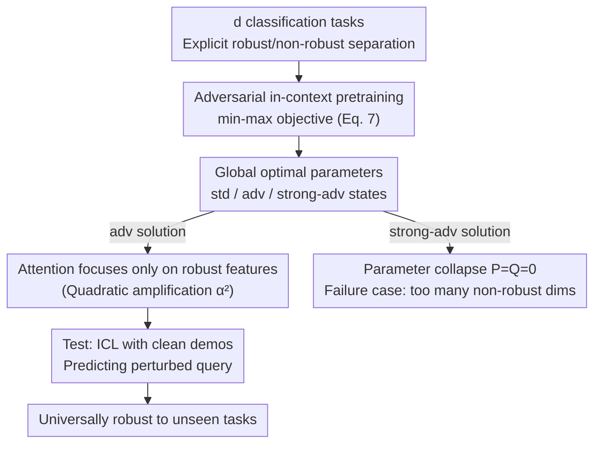

# Adversarially Pretrained Transformers May Be Universally Robust In-Context Learners

**Conference**: ICLR 2026  
**OpenReview**: [https://openreview.net/forum?id=11eHIPnWDx](https://openreview.net/forum?id=11eHIPnWDx)  
**Code**: https://github.com/s-kumano/universally-robust-in-context-learner  
**Area**: Learning Theory / Adversarial Robustness / In-Context Learning  
**Keywords**: Adversarial Training, In-Context Learning, Linear Transformer, Robust Features, Universal Robustness

## TL;DR
This paper provides the first theoretical analysis showing that a single-layer linear Transformer, adversarially pretrained on multiple classification tasks, can achieve adversarial robustness on unseen new classification tasks using only clean in-context learning (ICL) examples—without any additional adversarial training or adversarial examples, as the model learns to adaptively focus on "robust features."

## Background & Motivation
**Background**: Adversarial training is currently the most effective and almost only reliable defense against adversarial attacks—it minimizes classification loss under worst-case perturbations (min–max optimization). However, this comes at an extremely high computational cost and must be performed for each specific task. Meanwhile, using foundation models with lightweight fine-tuning for downstream tasks has become a standard paradigm.

**Limitations of Prior Work**: These two lines of research haven't converged. Adversarial training is "task-customized": a robust model trained for task A is no longer robust when transferred to task B. Consequently, every downstream task desiring robustness must pay the expensive adversarial training bill again. Most "alternative defenses" attempting to bypass this cost were later proven to offer only spurious robustness.

**Key Challenge**: Can there be a "universally robust foundation model"—where the cost of adversarial training is paid once during pretraining, and any subsequent downstream task "inherits" robustness for free? This direction is tempting, but because adversarial pretraining is expensive and multiple empirical evaluations are impractical, its feasibility has remained largely unexplored.

**Goal**: To theoretically answer whether "adversarially pretrained Transformers can act as universally robust foundation models," characterize the conditions for this to hold, reveal the source of this robustness, and identify remaining fundamental challenges.

**Key Insight**: The authors leverage the classic framework of "robust vs. non-robust features" (Ilyas/Tsipras et al.)—robust features are class-discriminative and human-understandable (e.g., shape), while non-robust features are imperceptible to humans but statistically correlated with labels and thus predictive (e.g., texture). Adversarial vulnerability is believed to stem from models relying on non-robust features. The authors explicitly incorporate this distinction into the data distribution assumptions and analyze a **tractable** minimal model: in-context learning in a single-layer linear Transformer.

**Core Idea**: In short—adversarial pretraining pushes the attention parameters of the single-layer linear Transformer toward a solution that "only attends to robust features in each task." Consequently, at test time, it can provide robust predictions for perturbed queries using only clean examples via ICL, and this robustness generalizes across all tasks.

## Method

### Overall Architecture
This paper does not propose a new network but builds a **tractable theoretical sandbox** to clarify the causal chain of "adversarial pretraining → in-context learning → universal robustness." The setting is: on $d$ different binary classification task distributions $\{D^{tr}_c\}_{c=1}^d$, a **single-layer linear Transformer** is trained using an in-context loss with adversarial perturbations. During testing, faced with a potentially different new distribution $D^{te}$, the model receives $N$ **clean** examples $\{(x_n,y_n)\}$ as a prompt to predict an $\ell_\infty$-perturbed query $x_{N+1}+\Delta$. The method centers on three questions: (1) what data model separates robust/non-robust features; (2) what the global optimal parameters of adversarial pretraining look like; and (3) why these parameters yield universal robustness and when they fail.

The input sequence is arranged into a matrix, concatenating feature examples, labels, and the query:

$$Z_\Delta := \begin{pmatrix} x_1 & \cdots & x_N & x_{N+1}+\Delta \\ y_1 & \cdots & y_N & 0 \end{pmatrix} \in \mathbb{R}^{(d+1)\times(N+1)}$$

The single-layer linear Transformer is defined as $f(Z_\Delta;P,Q) = \frac{1}{N} P Z_\Delta M Z_\Delta^\top Q Z_\Delta$, where $P$ is the value matrix, $Q$ is the product of key and query matrices, and the mask $M$ prevents tokens from attending to themselves. The final prediction for the query is read from the bottom-right element $[f]_{d+1,N+1}$. The conceptual flow is as follows:

### Key Designs

**1. Explicitly Writing "Robust/Non-Robust Features" into the Data Distribution**

To theoretically discuss "which features the model should attend to," the features must be separable in the data. The authors construct a training distribution (Assumption 3.1): in the $c$-th task, the $c$-th dimension is the **robust feature**, directly equal to the label $x_c=y$; every other dimension is a **non-robust feature**, where the correlation with the label is bounded by a small constant $\lambda<1$ (e.g., $x_i\sim U([0,\lambda])$ when $y=1$). Thus, each task has a "one-dimension strong signal + multi-dimension weak signal" structure, mimicking the "shape (robust) vs. texture (non-robust)" dichotomy in real images. The test distribution (Assumption 3.2) is more general, allowing $d_{rob}$ robust features, $d_{vul}$ non-robust features, and $d_{irr}$ **irrelevant features** (simulating zeroed-out corner pixels in MNIST), with mild constraints on scale ($\alpha,\beta,\gamma$) and higher-order moments.

**2. Adversarial In-Context Pretraining Objective**

The objective binds "adversarial" and "in-context learning" together. The min–max objective (Eq. 7) used is:

$$\min_{P,Q\in[0,1]^{(d+1)\times(d+1)}} \mathbb{E}_{c,\,\{(x_n,y_n)\}\sim D^{tr}_c}\Big[\max_{\text{\textbardbl}\Delta\text{\textbardbl}_\infty\le\epsilon} -y_{N+1}\,[f(Z_\Delta;P,Q)]_{d+1,N+1}\Big]$$

The inner $\max$ applies the worst-case perturbation $\Delta$ to the query (budget $\epsilon \approx \lambda$, enough to shift non-robust features but not robust ones). The outer $\min$ learns parameters under this worst case. Crucially, the examples $\{(x_n,y_n)\}$ are **clean**; only the query is attacked—forcing the Transformer to learn "extracting generalizable structures from clean examples to withstand attacks on queries," rather than memorizing a specific task.

**3. Closed-Form Characterization and "Failure Cases"**

Due to the non-linearity of self-attention and the inner max, objective (7) is non-linear and non-convex. The authors use Lemma 3.3 to transform it into a maximization problem over a binary vector $b\in\{0,1\}^{d+1}$, then use symmetry to derive the global optimal solution (Theorem 3.4), categorized into three states based on $\epsilon$: **Standard state** ($\epsilon=0$), where $Q_{std}$ uses all features; **Adversarial state** ($\epsilon=\frac{1+(d-1)\lambda/2}{d}$), where $Q_{adv}$ is diagonal, meaning attention **only picks out robust features** and ignores others; and **Strong adversarial state** (large $\epsilon$), where parameters collapse to $P=Q=0$. This third state is a **failure case**: if the perturbation is too large, the only global optimum is a useless zero model—meaning a "universally robust classifier exists, but a universally robust single-layer linear Transformer does not." This occurs when non-robust dimensions $d-1$ far outnumber robust ones ($d\gtrsim 1/\lambda^2$).

**4. Source of Universal Robustness: Quadratic Focusing on Robust Features**

This is the "Aha!" moment. The authors compare the performance of pretraining types on the test distribution. The standard model (Theorem 3.5) extracts robust and non-robust features **linearly** at scales $d_{rob}\alpha$ and $d_{vul}\beta$, thus failing when $d_{vul}\gtrsim\frac{\alpha}{\beta}d_{rob}$. Irrelevant features $d_{irr}$ aggravate this vulnerability. The adversarial model (Theorem 3.6) provides a **lower bound**: it extracts features at a **quadratic scale** $d_{rob}\alpha^2$ and $d_{vul}\beta^2$. Since robust features are larger ($\alpha^2\gg\beta^2$), quadratic amplification **automatically suppresses weights on non-robust features**—relaxing the robustness condition to $d_{vul}\lesssim(\frac{\alpha}{\beta})^2 d_{rob}$. For $\alpha=160/255,\beta=8/255$, the robust margin increases about 20 times.

**5. Two Fundamental Challenges: Accuracy-Robustness Trade-off and Sample Hunger**

Consistent with two long-standing problems in robust classification: first, the **accuracy-robustness trade-off** (Theorem 3.7): if robust features only correlate with labels at probability $p>0.5$, the adversarial model will have lower clean accuracy than standard models because it discards predictive non-robust features. Second, **sample hunger** (Theorem H.1): in low signal-to-noise scenarios ($p\to0.5$) with few samples, the adversarial model requires **many more in-context examples** to reach the same clean accuracy as the standard model.

## Key Experimental Results

Experiments verify **theoretical predictions** using SGD to optimize the in-context loss (7) with $d=20, \lambda=0.1$. The learned heatmaps (Fig. 1) match the std/adv/strong-adv structures in Theorem 3.4.

### Main Results: Clean/Robust Accuracy of Standard vs. Adversarial Pretraining (%)

Using parameters from Theorem 3.4 on synthetic and real data (averaging 45 binary pairs for 10-class sets); "Value = Clean Acc / Robust Acc":

| Model | $D^{tr}$ | $D^{te}$ | MNIST | F-MNIST | CIFAR-10 |
|-------|----------|----------|-------|---------|----------|
| Standard Pretrain | 100 / 0 | 100 / 0 | 94 / 4 | 91 / 20 | 68 / 21 |
| Adversarial Pretrain | 100 / **100** | 99 / **95** | 93 / **72** | 89 / **62** | 64 / **34** |

### Analysis Table: Theory ↔ Empirical Correspondence

| Phenomenon | Theory | Evidence |
|------------|--------|----------|
| Std model: High clean, zero robust | Theorem 3.5 (Linear extraction) | 0% robust accuracy on $D^{te}$ |
| Adv model: Robust on **unseen** dist | Theorem 3.6 (Quadratic focusing) | 95% robust on $D^{te}$, 72% on MNIST |
| Adv model: Lower clean accuracy | Theorem 3.7 (Trade-off) | CIFAR-10 clean: 64% vs 68% |

### Key Findings
- **Universal Robustness**: The adversarial model, using only clean ICL examples, boosts robust accuracy on $D^{te}$ and MNIST/CIFAR-10 (unseen during training) from single digits to 34–95% without any downstream adversarial training.
- **Quadratic vs. Linear Scaling**: The core mechanism is $\alpha^2\gg\beta^2$, expanding the robust margin $\sim$20x compared to the standard model.
- **Trade-off is Real**: Adversarial clean accuracy is consistently lower (e.g., 64% on CIFAR-10), validating Theorem 3.7.

## Highlights & Insights
- **Proved "Universally Robust Foundation Models"**: Used the minimal tractable model to provide closed-form global optima, making a credible first step for an empirically expensive problem.
- **"Quadratic Amplification" Intuition**: Adversarial training is explained as shifting feature extraction from linear $d_{rob}\alpha$ to quadratic $d_{rob}\alpha^2$, automatically weighting robust features.
- **Honest Limitations**: Explicitly noted the collapse to a zero model under strong noise and the unavoidable trade-offs between accuracy and robustness.

## Limitations & Future Work
- **Limitations**: The data assumption uses a **hard binary** split of robust/non-robust features; the model is a single-layer linear Transformer without softmax; tasks are limited to classification under $\ell_\infty$ perturbations.
- **Self-identified limitations**: Experiments are small-scale (binary pairs, 3 datasets). The cost of adversarial pretraining is pushed to a "centralized authority" assumption without technical cost reduction.
- **Improvement Ideas**: Generalizing to multi-layer/softmax attention, non-classification tasks, and exploring smarter example weighting to mitigate sample hunger.

## Related Work & Insights
- **vs. Classic Adversarial Training (Madry et al.)**: They train for single-task robustness; this paper proves "universal robustness" via adversarial pretraining + ICL.
- **vs. Robust/Non-robust Hypotheses (Ilyas et al.)**: This paper **incorporates these hypotheses into a provable model** and quantifies the "quadratic amplification" mechanism.
- **vs. ICL Theory for Linear Transformers (Ahn et al.)**: They analyze how ICL implements gradient descent; this paper adds the **adversarial robustness** dimension for the first time.

## Rating
- Novelty: ⭐⭐⭐⭐⭐ First proof that adversarially pretrained Transformers work as universal robust foundation models.
- Experimental Thoroughness: ⭐⭐⭐ Small scale, but appropriate for a purely theoretical paper.
- Writing Quality: ⭐⭐⭐⭐ Clear mapping between assumptions, theorems, and results.
- Value: ⭐⭐⭐⭐ Provides a clear mechanistic explanation for the "universal robustness" direction.

<!-- RELATED:START -->

## Related Papers

- [\[ICLR 2026\] In-Context Algorithm Emulation in Fixed-Weight Transformers](in-context_algorithm_emulation_in_fixed-weight_transformers.md)
- [\[ICLR 2026\] Transformers with Endogenous In-Context Learning: Bias Characterization and Mitigation](transformers_with_endogenous_in-context_learning_bias_characterization_and_mitig.md)
- [\[ICLR 2026\] Continuum Transformers Perform In-Context Learning by Operator Gradient Descent](continuum_transformers_perform_in-context_learning_by_operator_gradient_descent.md)
- [\[ICLR 2026\] Critical Attention Scaling in Long-Context Transformers](critical_attention_scaling_in_long-context_transformers.md)
- [\[ICLR 2026\] Transformers Learn Latent Mixture Models In-Context via Mirror Descent](transformers_learn_latent_mixture_models_in-context_via_mirror_descent.md)

<!-- RELATED:END -->
