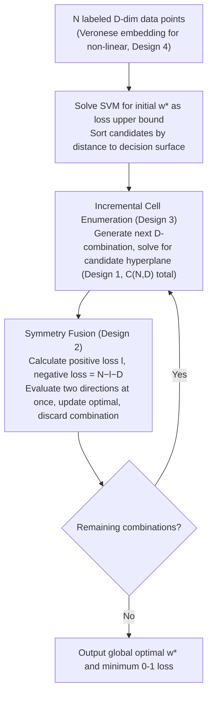

# An Efficient, Provably Optimal Algorithm for the 0-1 Loss Linear Classification Problem

**Conference**: ICLR 2026  
**arXiv**: [2306.12344](https://arxiv.org/abs/2306.12344)  
**Code**: None (Implemented based on PyTorch)  
**Area**: Others  
**Keywords**: 0-1 loss, Linear classification, Exact algorithm, Hyperplane arrangement, Combinatorial optimization  

## TL;DR
Proposes the Incremental Cell Enumeration (ICE) algorithm, the first standalone algorithm with a formal proof that can exactly solve the global optimum of the 0-1 loss linear classification problem in $O(N^{D+1})$ time, with extensions to polynomial hypersurface classification.

## Background & Motivation

**Background**: Linear classification is the most fundamental machine learning problem, with a long history starting from Linear Discriminant Analysis (LDA) in 1936. For linearly separable data, methods like SVM and logistic regression work effectively; however, for linearly non-separable data, exactly minimizing the 0-1 loss (i.e., minimizing the number of misclassifications) is NP-hard.

**Limitations of Prior Work**: Existing methods rely on surrogate loss functions (e.g., hinge loss, logistic loss), which cannot guarantee finding the global optimum of the 0-1 loss. While Mixed-Integer Programming (MIP) solvers (e.g., Gurobi) can solve it exactly, these are general-purpose solvers that lack deep exploitation of the problem's structure. Although Branch-and-Bound (BnB) methods have been attempted, they lack formal proofs of correctness and exhibit extremely high worst-case complexity.

**Key Challenge**: According to Vapnik's generalization bounds, lower training error and simpler models should lead to better generalization. The VC dimension of a linear model is only $D+1$, making it one of the simplest classifiers. However, due to the inability to precisely optimize 0-1 loss, the theoretical prediction of whether "exact solutions truly generalize better" has remained unverified.

**Goal**: How to efficiently and accurately solve the 0-1 loss linear classification problem? What is the relationship between the three seemingly contradictory complexity analyses: Cover's counting theorem, Murthy's $2^D \binom{N}{D}$ analysis, and Nguyen-Sanner's $\binom{N}{D}$ observation? Do exact solutions truly overfit?

**Key Insight**: Starting from hyperplane arrangement and oriented matroid theory, use point-hyperplane dual transformation to establish the combinatorial and incidence relationships between data points and linear binary classification.

**Core Idea**: Transform the classification problem into a cell enumeration problem of hyperplane arrangements via dual transformation. Prove that global optimality can be found by enumerating only $\binom{N}{D}$ hyperplanes passing through $D$ data points, and implement efficient enumeration using an incremental combinatorial generator.

## Method

### Overall Architecture
Given $N$ labeled data points in $D$ dimensions, the goal is to find a linear classifier that minimizes the 0-1 loss. The challenge is that the parameter space is continuous and infinite, while the 0-1 loss is piecewise constant and non-differentiable with respect to parameters, rendering gradient-based methods ineffective. The core insight of ICE is to transform the "search for the optimal hyperplane in an infinite continuous parameter space" into "combinatorial enumeration in finite dual arrangement cells" via point-hyperplane duality. A classification theorem then narrows the candidates to $\binom{N}{D}$ hyperplanes passing through $D$ data points. Finally, symmetry is used to evaluate both directions of each hyperplane at once, and an incremental generator discards combinations after use to keep the search memory-efficient and GPU-parallelizable. The algorithm starts with an initial upper bound from SVM and iteratively evaluates candidates to tighten the bound until the global optimum is found.

### Key Designs

**1. Point-Hyperplane Duality and 0-1 Loss Classification Theorem: Compressing Infinite Search into $\binom{N}{D}$ Candidates**

Directly searching for the optimal hyperplane in parameter space is difficult because the parameters are continuous and 0-1 loss is piecewise constant. Duality provides a discretization pivot: each data point $x_i$ is mapped to a hyperplane in the dual space, and conversely, a candidate classifier corresponds to a point in the dual space. These dual hyperplanes partition the space into cells; all classifiers within the same cell yield **identical** classification results and thus have the same 0-1 loss. Thus, infinite continuous hyperplanes are compressed into finite equivalence classes (Theorem 1, 2). The 0-1 Loss Classification Theorem (Theorem 3) further restricts the candidates: any classifier achieving optimal 0-1 loss can be translated and rotated to pass through $D$ data points without changing its classification results. This compresses the search space to $\binom{N}{D}$ hyperplanes. This theorem reconciles three complexity theories: Cover's $O(N^D)$, Murthy's $2^D\binom{N}{D}$, and Nguyen–Sanner's $\binom{N}{D}$.

**2. Symmetry Fusion Theorem: Two Evaluations for the Price of One**

Every hyperplane passing through $D$ points has two normal directions (positive and negative), corresponding to two complementary classifiers. A naive approach evaluates both. This work proves (Theorem 5) that if the 0-1 loss in the positive direction is $l$, the loss in the negative direction is exactly $N - l - D$. The $D$ points on the boundary are not counted as misclassifications in either case, and the remaining $N-D$ points are partitioned complementarily. This halves the number of required evaluations.

**3. Incremental Cell Enumeration (ICE Algorithm): Constant-Memory Generation**

Storing all $\binom{N}{D}$ combinations before evaluation would lead to memory explosion. ICE uses sequential incremental generation: it iterates through points and builds $D$-combinations incrementally. Once a hyperplane is solved and its 0-1 loss is evaluated (Design 2), the combination is **immediately discarded**. The total time complexity remains $O(N^{D+1})$, but memory complexity is reduced to $O(N^G)$ (where $G$ is the batch size), independent of the total combinations, allowing execution on standard GPU memory.

**4. Extension to Polynomial Hypersurface Classification: Veronese Embedding**

The linear classification theorem holds for linear boundaries. This work uses a $K$-order Veronese embedding to map $D$-dimensional data into a high-dimensional space spanned by monomials. A polynomial hypersurface in the original space becomes a linear hyperplane in the high-dimensional space (Theorem 4, Corollary 1). Thus, ICE can be applied directly to the embedded space $\rho_K(\mathcal{D})$ to find exact non-linear decision boundaries.

### Loss & Training
ICE does not optimize a surrogate loss; it targets the 0-1 loss (misclassification count) directly. Implementation-wise, an SVM solution serves as the initial upper bound. Candidate hyperplanes are sorted by their distance to the SVM decision surface $|\bm{w}^\top\bm{x}|$ and enumerated incrementally: combinations near the decision boundary are more likely to improve the upper bound, aiding early pruning. The process is fully vectorized in PyTorch for GPU acceleration.

## Key Experimental Results

### Main Results

| Dataset | $N$ | $D$ | ICE(%) | SVM(%) | LR(%) | LDA(%) |
|--------|-----|-----|--------|--------|-------|--------|
| HA | 283 | 3 | **77.03** | 72.08 | 73.14 | 73.85 |
| CA | 72 | 5 | **80.6** | 77.2 | 73.6 | 75.0 |
| CR | 89 | 6 | **95.51** | 91.10 | 89.89 | 89.89 |
| VP | 704 | 2 | **97.30** | 96.88 | 96.59 | 96.59 |
| BT | 502 | 4 | **78.69** | 74.50 | 75.50 | 74.10 |

### Ablation Study

| Method | Time ($N=150, D=3$) | Description |
|------|------|------|
| ICE | 1.2s | Polynomial complexity |
| BnB | ~317 years | Exponential complexity |

### Key Findings
- ICE achieves the highest training accuracy across all datasets, and higher training accuracy leads to better test generalization, countering the conventional view that "exact solutions necessarily overfit."
- Actual running time aligns closely with theoretical analysis.

## Highlights & Insights
- Unifies three seemingly contradictory combinatorial analyses by Cover, Murthy, and Nguyen-Sanner.
- Halves the search space using 0-1 loss symmetry.
- Makes optimal linear classifiers a reality for small-scale data in high-stakes applications (medicine, criminal justice).

## Limitations & Future Work
- Complexity is exponential relative to dimension $D$, limiting practical use to low-dimensional data.
- Requires pre-processing for general position assumptions.
- Significant room for further GPU parallelization.

## Related Work & Insights
- **vs SVM/LR/LDA**: These methods optimize surrogate losses and cannot guarantee 0-1 loss optimality.
- **vs BnB**: ICE provides the first proof of PCS correctness with lower practical complexity.
- **vs MIP Solvers**: General solvers have unstable performance, while ICE provides deterministic complexity guarantees.

## Rating
- Novelty: ⭐⭐⭐⭐⭐ First standalone algorithm for exact 0-1 loss classification with formal proofs.
- Experimental Thoroughness: ⭐⭐⭐ Datasets are relatively small and low-dimensional.
- Writing Quality: ⭐⭐⭐⭐ Rigorous theoretical derivation.
- Value: ⭐⭐⭐⭐ Practical value in interpretable AI and high-stakes decision-making scenarios.

<!-- RELATED:START -->

## Related Papers

- [\[ICLR 2026\] Diffusion Language Models are Provably Optimal Parallel Samplers](diffusion_language_models_are_provably_optimal_parallel_samplers.md)
- [\[ICLR 2026\] A Generalized Geometric Theoretical Framework of Centroid Discriminant Analysis for Linear Classification of Multi-dimensional Data](a_generalized_geometric_theoretical_framework_of_centroid_discriminant_analysis_.md)
- [\[ICLR 2026\] Practical Estimation of the Optimal Classification Error with Soft Labels and Calibration](practical_estimation_of_the_optimal_classification_error_with_soft_labels_and_ca.md)
- [\[ICLR 2026\] Know When to Abstain: Optimal Selective Classification with Likelihood Ratios](know_when_to_abstain_optimal_selective_classification_with_likelihood_ratios.md)
- [\[ICLR 2026\] Efficient Testing for Correlation Clustering: Improved Algorithms and Optimal Bounds](efficient_testing_for_correlation_clustering_improved_algorithms_and_optimal_bou.md)

<!-- RELATED:END -->
