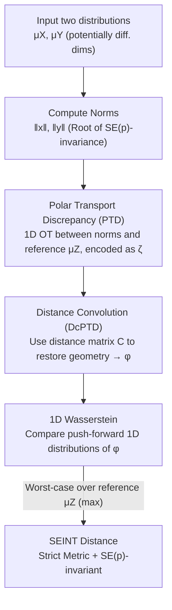

# SEINT: An Efficient SE(p)-Invariant Transport Metric Driven by Polar Transport Discrepancy-based Representation

**Conference**: ICLR 2026  
**OpenReview**: [https://openreview.net/forum?id=oyxExc7TEl](https://openreview.net/forum?id=oyxExc7TEl)  
**Code**: https://github.com/junyilin559/SEINT  
**Area**: Learning Theory / Optimal Transport / Geometric Invariant Metrics  
**Keywords**: Optimal Transport, SE(p)-invariance, Metric Learning, Point Clouds, Molecule Generation

## TL;DR
This paper proposes SEINT, a distribution distance that is strictly invariant to translation and rotation (the Special Euclidean group $SE(p)$) and proven to be a true metric (satisfying the triangle inequality). It utilizes training-free "Polar Transport Discrepancy (PTD)" to encode high-dimensional distributions into 1D scalar features, then restores intrinsic geometric information using "Distance Convolutional PTD (DcPTD)." By computing the Wasserstein distance in 1D, the complexity is reduced from $O(n^3)\sim O(n^4)$ of GW to $O(n\log n)\sim O(n^2)$. Effectiveness is validated on point cloud classification (100% accuracy) and 3D molecule generation (SOTA stability).

## Background & Motivation

**Background**: Optimal Transport (OT) and the Wasserstein distance are powerful tools for comparing probability distributions, but the standard Wasserstein distance lacks **geometric invariance**. For objects like molecules or 3D point clouds where "shape matters but absolute coordinates do not," it is desirable for the metric to remain invariant under rigid transformations—specifically the Special Euclidean group $SE(p) = SO(p)\ltimes\mathbb{R}^p$ (rotation + translation). Rotating or moving the same molecule should not change the distance.

**Limitations of Prior Work**: Existing $SE(p)$-invariant OT methods are categorized into three types, each with significant trade-offs (see Table 1 in the original paper):

- **Extrinsic Strategies**: Jointly optimize an orthogonal matrix to align two distributions (e.g., EMDG, Wasserstein Procrustes). These require repeated OT solving, with complexity as high as $O(n^3\log n)$. Speed-up attempts (e.g., RISGW projection to 1D) **sacrifice metric properties** (failing the triangle inequality).
- **Intrinsic Strategies**: Directly compare metric space structures (Gromov-Hausdorff, Gromov-Wasserstein). While naturally $SE(p)$-invariant and capable of cross-space comparison, GW complexity ranges from $O(n^3)$ to $O(n^4)$ or is even NP-hard. Rapid approximations (Quantized/Sampled GW) **lose metric properties**.
- **Representation Strategies**: Extract $SE(p)$-invariant features before comparison (e.g., Spherical Harmonics SHR, Rotation-Invariant Transformer RIT). These perform well empirically, but the representation process **discards geometric information**, resulting in a pseudometric rather than a true metric.

**Key Challenge**: No current approach simultaneously achieves "computational efficiency + strict metric properties + cross-isometry-class comparison." Representation-based methods yield only pseudometrics because extracting features alone discards intrinsic distance information—Gromov theory establishes that **intrinsic distance information is indispensable for constructing true isometry-invariant metrics**.

**Goal**: Design an $SE(p)$-invariant metric that achieves all three: (1) low complexity for large-scale application; (2) strict adherence to metric axioms (especially the triangle inequality); (3) ability to compare distributions in spaces of different dimensions (cross-space).

**Key Insight**: Inspiration is drawn from "optimal transport in polar coordinates." Since rotation and translation do not change the norm of a point relative to the origin (assuming centralized distributions), the **norm** itself is a natural $SE(p)$ invariant. Constructing 1D features around the norm reduces the high-dimensional invariance problem to 1D OT, which is fast and metric-preserving. To recover the information lost by using only the norm, a **distance matrix** convolution is applied to reintegrate intrinsic geometry.

**Core Idea**: Use "Polar Transport Discrepancy (PTD) (1D OT features on the norm side) + Distance Convolutional PTD (DcPTD) (recovering intrinsic distance)" to encode distributions into 1D scalar fields, then compute the 1D Wasserstein distance. This ensures $SE(p)$-invariance and true metric properties while compressing complexity to near-linear.

## Method

### Overall Architecture

SEINT operates on "measure Banach space" triplets $(X,\|\cdot\|_X,\mu_X)$, where $X$ is a complete normed vector space and $\mu_X$ is a probability measure. A standardization preprocessing step is assumed—distributions are centered and isometries map the base point 0 to 0—thereby **filtering out translation differences**, leaving only rotation/isometry to be addressed.

Given two such spaces, the SEINT pipeline follows four sequential steps (corresponding to Fig. 2 in the paper):

1. **Norm Calculation**: Calculate $\|x_i\|_X$ for each sample $x_i$. The norm is invariant under rotation/translation, forming the root of the invariance.
2. **PTD (Polar Transport Discrepancy)**: Under the optimal transport coupling between a 1D reference distribution $\mu_Z$ and the "norm distribution $\leftrightarrow \mu_Z$," each sample is encoded as a 1D scalar $\zeta(x_i)$.
3. **DcPTD (Distance Convolution)**: Use the sample distance matrix $C_X$ to perform a convolution/matrix multiplication on the PTD features to obtain $\phi(x_i)$, restoring intrinsic geometry. This step is the key for transforming a "pseudometric into a true metric."
4. **1D Wasserstein**: Push forward the DcPTD features to 1D distributions and compute their 1D Wasserstein distance (which has a fast closed-form sorting solution). Take the worst-case (max) over the reference distributions $\mu_Z$ to obtain the SEINT distance.

### Key Designs

**1. Polar Transport Discrepancy (PTD): Encoding High-Dimensional Points as Invariant Scalars**

The difficulty lies in comparing high-dimensional distributions efficiently while maintaining rotation invariance. PTD focuses only on the **norm**, a natural invariant. Given a 1D reference measure $\mu_Z \in \mathcal{P}(\mathbb{R})$ and cost $c(x,z)=\big|\,\|x\|_X-z\,\big|$, this is equivalent to solving 1D OT between the "norm distribution $\|X\|_X$" and $\mu_Z$. Let $\Pi^*_{X,Z}$ be the set of optimal couplings. By disintegrating the coupling into conditional measures $\pi^*_{Z|X=x}$, PTD encodes each sample into a non-negative scalar:

$$\zeta_{\pi^*_{X,Z}}(x):=\int_{\mathbb{R}}\big|\,\|x\|_X-z\,\big|\,d\pi^*_{Z|X=x}(z).$$

This offers two benefits: it is **training-free** (computed via OT without neural networks) and **generates multiple features** (by varying $\mu_Z$ or optimal couplings). However, PTD alone is a pseudometric as it only considers the norm and **discards relative geometry between samples**.

**2. Distance Convolutional PTD (DcPTD): Restoring Intrinsic Geometry**

This step addresses the flaw in PTD. Gromov theory indicates that true isometry-invariant metrics require intrinsic distance information. DcPTD therefore "convolves" PTD features with sample distances $d_X(x,x')$:

$$\phi_{\pi^*_{X,Z}}(x):=\int_X d_X(x,x')\,\zeta_{\pi^*_{X,Z}}(x')\,d\mu_X(x').$$

DcPTD possesses two proven properties: **(1) Isometric Consistency**—for any isometry $f:X\to Y$, $\phi_{\pi^*_{X,Z}}(x)=\phi_{\pi^*_{Y,Z}}(f(x))$, ensuring strict invariance; **(2) Dimension Agnosticism**—the output is always a non-negative scalar on the real line regardless of input dimension. This enables **cross-space comparison** by mapping 2D projections and 3D point clouds to the same 1D domain $(\mathbb{R},|\cdot|)$.

**3. SEINT Metric: Inf-Sup Worst-Case Reference Selection**

To handle the selection of $\mu_Z$, the author treats it as an adversarial variable, taking the least favorable (worst-case) reference to ensure robustness. After constraining the candidate set $\mathcal{P}_{X,Y}(\mathbb{R})$ (Eqs. 5 and 6), the SEINT distance is defined as an inf-sup:

$$L_{\text{SEINT}}(X,Y,\mu_X,\mu_Y):=\inf_{\pi\in\Pi(\mu_X,\mu_Y)}\ \sup_{\mu_Z\in\mathcal{P}_{X,Y}(\mathbb{R})}\Big(\mathbb{E}_\pi\big[|\phi_{\pi^*_{X,Z}}(x)-\phi_{\pi^*_{Y,Z}}(y)|^p\big]\Big)^{1/p}.$$

Theorem 1 proves that $L_{\text{SEINT}}$ is a **true metric on spaces of isometry classes**. Corollary 1 shows it is strictly invariant under any $g=(R,t)\in SE(p)$. An integral variant, **ISEINT**, is also provided.

**4. Efficient Numerical Implementation: $O(n\log n)\sim O(n^2)$ Complexity**

In the discrete setting, computing PTD reduces to an explicit summation. The overhead comes from calculating $C_X, C_Y$ ($O(n^2+m^2)$) and the matrix-vector multiplication $C_X\zeta$ ($O(n^2)$). If the local distance is **decomposable** (e.g., squared Euclidean distance), the matrix multiplication can be accelerated, reducing overall complexity to $O(n\log n)$ (Algorithm 2). This is orders of magnitude faster than GW's $O(n^3\sim n^4)$.

### Loss & Training
SEINT is training-free. When used as a regularizer, it is added to the denoising loss of generative models: $L=\alpha L_{\text{SEINT}}+(1-\alpha)L_{\text{MSE}}$.

## Key Experimental Results

### Main Results: Metric Performance (ModelNet40-SE(3) Classification)

Tested on 1,000 models after random $SE(3)$ transformations and Gaussian noise:

| Method | Acc (k=1) | Acc (k=10) | Time (h) | SE(p) Inv. |
|------|-----------|-----------|----------|-----------|
| GW | — | — | 2655.9 | ✓ |
| RISGW | 74.9 | 50.0 | 400.6 | ✓ |
| W2 | 52.5 | 31.3 | 113.4 | ✗ |
| SGW | 59.1 | 40.9 | 20.2 | ✗ |
| **SEINT** | **100.0** | **100.0** | **9.01** | ✓ |
| **ISEINT** | **100.0** | **100.0** | **8.29** | ✓ |

SEINT achieved 100% accuracy while being significant faster than RISGW (~44x) and GW (uncomputable).

### Key Findings
- **Distance convolution in DcPTD is vital**: Removing it reverts the metric to a pseudometric, significantly degrading classification performance.
- **Cross-space stability**: In the "horse-gallop" sequence, SEINT correctly reflects biomechanical gait cycles when comparing 2D projections to 3D clouds.
- **Molecular Stability**: Adding SEINT as a regularizer to EDM/UniGEM models improved molecular stability from 87–89% to 91–93%.

## Highlights & Insights
- **1D Reduction**: Reducing high-dimensional invariance to 1D sorting allows for closed-form solutions and superior speed.
- **PTD for Invariance, DcPTD for Metricity**: Decoupling the roles of the norm (invariance) and the distance matrix (geometry) solves the persistent "pseudometric" issue in representation-based approaches.
- **Cross-space Capability**: Dimension agnosticism allows for comparing distributions across different manifold dimensions while maintaining metric properties.

## Limitations & Future Work
- **Centralization Dependency**: Relies on accurate distribution centering to manage translation.
- **Norm Bias**: While geometry is restored via convolution, the discriminative power in cases where norm distributions are identical but structures differ requires further stress testing.
- **CPU Benchmarking**: Current efficiency results are primarily CPU-based; more comprehensive wall-clock comparisons with GPU-accelerated Sinkhorn methods are needed.

## Related Work & Insights
- **vs GW**: GW is a true metric but computationally prohibitive ($O(n^3+)$); SEINT achieves the same metric properties in $O(n\log n)\sim O(n^2)$.
- **vs RISGW**: RISGW is fast but fails as a true metric, leading to lower classification accuracy (75% vs 100%).
- **vs L2-Norm Regularization**: In molecule generation, standard L2 regularization on coordinates is ineffective, whereas SEINT's focus on $SE(p)$-invariant geometric structure provides substantial gains.

## Rating
- Novelty: ⭐⭐⭐⭐⭐ 
- Experimental Thoroughness: ⭐⭐⭐⭐ 
- Writing Quality: ⭐⭐⭐⭐ 
- Value: ⭐⭐⭐⭐⭐ 

<!-- RELATED:START -->

## Related Papers

- [\[ICLR 2026\] Slicing Wasserstein over Wasserstein via Functional Optimal Transport](slicing_wasserstein_over_wasserstein_via_functional_optimal_transport.md)
- [\[ICLR 2026\] Test-Time Verification via Optimal Transport: Coverage, ROC, & Sub-Optimality](test-time_verification_via_optimal_transport_coverage_roc_sub-optimality.md)
- [\[ICLR 2026\] A Statistical Learning Perspective on Semi-dual Adversarial Neural Optimal Transport Solvers](a_statistical_learning_perspective_on_semi-dual_adversarial_neural_optimal_trans.md)
- [\[ICLR 2026\] On the Bayes Inconsistency of Disagreement Discrepancy Surrogates](on_the_bayes_inconsistency_of_disagreement_discrepancy_surrogates.md)
- [\[ICLR 2026\] Statistical and Structural Identifiability in Representation Learning](statistical_and_structural_identifiability_in_representation_learning.md)

<!-- RELATED:END -->
