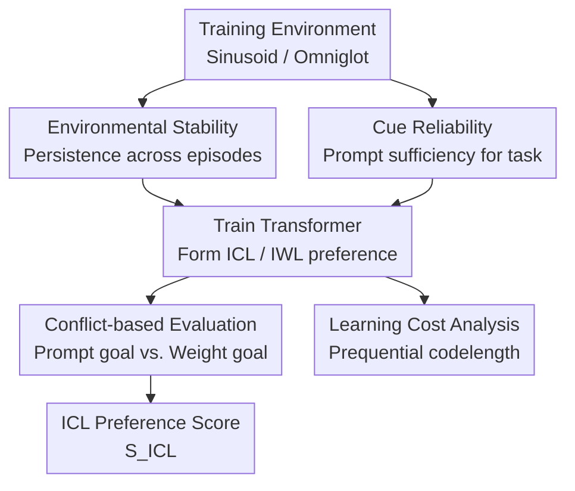

# An evolutionary perspective on modes of learning in Transformers

**Conference**: ICLR 2026  
**OpenReview**: [https://openreview.net/forum?id=5ubZyHPhnK](https://openreview.net/forum?id=5ubZyHPhnK)  
**Code**: To be released  
**Area**: Learning Theory / Transformer Learning Dynamics  
**Keywords**: In-Context Learning (ICL), In-Weight Learning (IWL), Environmental Stability, Cue Reliability, Learning Cost

## TL;DR
Borrowing the perspective of "phenotypic plasticity vs. genetic assimilation" from evolutionary biology, this paper explains the Transformer's selection between In-Context Learning (ICL) and In-Weight Learning (IWL) as a manifestation of learning dynamics determined by environmental stability, cue reliability, and the inherent learning costs of different strategies.

## Background & Motivation
**Background**: A core capability of Transformers is in-context learning (ICL), where the model adjusts inferences on current inputs using a few examples in the prompt without updating parameters. In contrast, in-weight learning (IWL) involves gradually encoding patterns into parameters during training. Existing research has explained the emergence of ICL through induction heads, implicit gradient descent, Bayesian inference, and training data distributions, focusing mostly on what the final strategy should be.

**Limitations of Prior Work**: In real training, ICL and IWL are not static binary choices. In some experiments, ICL appears first and is later replaced by IWL; in others, the model initially fits patterns via weights and only later learns to use context. Explanations based solely on the "final optimal strategy" cannot account for these mid-course shifts, as they do not address why one strategy is learned first or why another takes over later.

**Key Challenge**: The paper attributes the conflict to predictability across two time scales. If the task environment remains stable over the long term, information across training steps is reliable, making it more efficient to solidify patterns into weights. If the environment changes frequently but the cues within a single prompt are reliable, it is more rational to adjust outputs based on context. Crucially, models do not jump directly to long-term optimal strategies but adopt low-cost strategies more easily learned by the current architecture and task structure.

**Goal**: The authors aim to systematically manipulate the variables of "environmental stability" and "cue reliability" to observe how Transformer preferences for ICL/IWL change. Furthermore, they aim to explain the direction of strategic transitions from early to late training—specifically, why some tasks exhibit ICL → IWL while others show IWL → ICL.

**Key Insight**: The paper draws from two adaptation mechanisms in evolutionary biology. Phenotypic plasticity corresponds to ICL: the same genotype produces different phenotypes under different environmental cues. Genetic evolution corresponds to IWL: stable selective pressure accumulates over generations and is written into the genome. Genetic assimilation corresponds to "ICL being replaced by IWL": a response originally requiring an environmental cue becomes fixed under stable conditions, no longer depending on the cue.

**Core Idea**: The explanatory framework for Transformer learning dynamics is rewritten using "environmental fluctuation, cue reliability, and plasticity costs" from evolutionary theory: the environment determines the long-term preference for ICL vs. IWL, while learning costs determine which strategy emerges first during training.

## Method
### Overall Architecture
Rather than proposing a new training algorithm, the paper constructs two controllable learning environments to decouple the competition between ICL and IWL. The process involves decomposing environmental predictability into stability and cue reliability, parameterizing these variables in Sinusoid Regression and Omniglot binary classification, and measuring model preference using conflict-based evaluation prompts.

The experimental logic follows three steps. First, generating a series of training episodes, each containing prompt examples and a query. Second, controlling task similarity across episodes and the reliability of prompt labels via parameters. Third, conducting evaluation by intentionally causing a conflict between the prompt's implied task and the current training task to calculate an ICL preference score.

### Key Designs
**1. Dual-Timescale Predictability: Translating Evolutionary Intution into Variables**

The most critical modeling choice is splitting "environmental predictability" into two non-equivalent dimensions. Environmental stability describes whether the target task remains consistent across training steps, corresponding to trans-generational selective pressure. Cue reliability describes whether prompt examples accurately indicate the current task, corresponding to an organism's ability to adjust via environmental cues. This split is vital because both support predictability but encourage different strategies: the former favors IWL, the latter ICL.

In Sinusoid Regression, each task is $f_t(x)=A_t\sin(x+\phi_t)$. Task parameters $\theta_t=[A_t,\phi_t]^\top$ evolve via an AR(1) process: $\theta_t=\alpha\theta_{t-1}+(1-\alpha)\tilde{\theta}_t$. As $\alpha \to 1$, the environment becomes more stable. Cue reliability is controlled by Gaussian noise variance $\sigma^2$ on prompt labels. In Omniglot, stability is controlled by the persistence probability of the global mapping $M_t$, and cue reliability by the probability $\rho$ that prompt labels are correct.

**2. Conflict-based Evaluation: Simultaneously Testing ICL and IWL**

Standard test error cannot distinguish if a model solves a task via prompt cues or weight-encoded patterns. The authors construct a "conflict" protocol: an evaluation task $f_e$ is sampled from the prior, unrelated to the training task, to generate a prompt; however, the query also has a ground-truth target $f_t$ corresponding to the training environment. Thus, a single query yields two mutually exclusive answers: $y_{ICL}=f_e(x_q)$ and $y_{IWL}=f_t(x_q)$.

The authors compute errors $E_{ICL}$ and $E_{IWL}$ relative to both targets and define $S_{ICL}=E_{IWL}/(E_{ICL}+E_{IWL})$. A score near 1 indicates a preference for ICL, while a score near 0 indicates a preference for IWL. This metric transforms "learning modes" into a continuous value observable across different conditions and training steps.

**3. Dual Task Domains: Creating Opposing Learning Costs**

Sinusoid Regression and Omniglot were selected because they assign different difficulty levels to ICL and IWL. In Sinusoid tasks, IWL can easily learn a global approximation of the sine function early on, even if it doesn't fit every episode perfectly. However, ICL requires performing regression-like inference across 10 examples in a forward pass, a more complex algorithm. Thus, IWL is the "cheaper" initial strategy here, and ICL typically appears later.

Omniglot is the opposite. Each query class appears in the prompt as a matching example; ICL only needs to perform local matching and label copying via attention. Conversely, IWL must memorize the global mapping of 1,623 character classes to binary labels, which may also change over time. This makes ICL the "cheaper" strategy with lower sample complexity. These tasks allow for testing the theory that early strategies are determined by learning costs rather than long-term optimality.

**4. Learning Cost Metric: Explaining Strategy Order via Prequential Codelength**

To move beyond qualitative descriptions of "difficulty," the paper introduces prequential codelength from the Minimum Description Length (MDL) perspective. Intuitively, a strategy that aligns better with the model's inductive biases will reduce negative log-likelihood (NLL) faster in early training, resulting in a shorter cumulative code length. Formally, prequential codelength is the sequential accumulation of $-\log P(y_t|x_t;\theta_{t-1})$.

Calculation of cumulative loss for different strategies confirms the theory: In Omniglot, the cumulative BCE for ICL is far lower than for IWL; in Sinusoid tasks, the cumulative MSE for IWL is lower than for ICL. Furthermore, by reducing the Omniglot character set size to lower IWL's memory cost, the authors observed the learning trajectory flip from ICL-first to IWL-first, providing causal evidence for the role of learning costs.

### Loss & Training
The model is a 4-layer decoder-only Transformer with 4 heads per layer, an embedding dimension of 128, and learnable positional encodings. In Sinusoid Regression, scalar inputs and outputs are projected via linear layers. In Omniglot, images pass through a shallow ResNet before the Transformer, trained end-to-end.

Training objectives: MSE for Sinusoid queries and BCE for Omniglot query labels. The optimizer is AdamW ($lr=1\times 10^{-4}$) with a 1000-step warmup and cosine decay. Models are trained for 50,000 steps with a batch size of 128. Results are reported as the mean and standard error across 3 random seeds.

## Key Experimental Results

### Main Results
| Task | Manipulated Variable | Observed ICL Preference | Conclusion |
|------|----------------------|-------------------------|------------|
| Sinusoid regression | Stability $\alpha$ (low to high), noise $\sigma^2$ (low to high) | $S_{ICL}$ drops sharply as $\alpha \to 1$; highest $S_{ICL}$ at low noise/low stability | Stable environments promote IWL; reliable prompts promote ICL |
| Omniglot classification | Persistence $\alpha$ and label accuracy $\rho$ | In unstable environments, higher $\rho$ yields higher $S_{ICL}$; usually shifts to IWL as $\alpha \to 1$ | Matching tasks follow the same logic: reliable cues support ICL |
| Omniglot, $\rho=1$ | Fully stable environment, fully reliable cue | Maintains strong ICL preference | When both solve the task, preference depends on costs, not just optimality |
| Trajectory comparison | Omniglot (high stability) vs Sinusoid (med stability) | Omniglot: ICL → IWL; Sinusoid: IWL → ICL | Transience direction depends on task structure/learning cost |

### Ablation Study
| Configuration | Key Metric | Description |
|------|---------|------|
| Sinusoid: ICL-favored env | Cumulative MSE: ICL > IWL | Forward-pass regression is harder; ICL has higher learning cost |
| Sinusoid: IWL-favored env | Prequential codelength: IWL is shorter | Explains why IWL-like strategies appear earlier in Sinusoid tasks |
| Omniglot: Full set $|C|=1623$ | Cumulative BCE: ICL < IWL | Local matching is cheaper than memorizing large mappings; ICL appears first |
| Omniglot: Reduced $|C|=100$ | Early $S_{ICL}<0.2$, then shifts to ICL | Reducing IWL memory cost flips the trajectory from ICL-first to IWL-first |
| Omniglot: Increase $|C|$ | Initial ICL preference strengthens as character count increases | Supports "coupon collector" sample complexity effect on IWL costs |

### Key Findings
- **Environmental stability** determines if patterns are worth solidifying into weights: as $\alpha \to 1$, both tasks shift toward IWL.
- **Cue reliability** determines if context is trustworthy: lower $\sigma^2$ or higher $\rho$ increases reliance on prompts.
- ICL is not always a "late-stage capability," nor is IWL always "foundational": the sequence depends on which strategy is easier to learn given the task structure.
- In Omniglot, ICL persists even in stable environments if cues are reliable, suggesting Transformer ICL maintenance costs are low; the key factor is the difficulty of the alternative (IWL).
- Reducing the Omniglot character set size provides causal proof: shifting only the IWL cost successfully reversed the learning trajectory.

## Highlights & Insights
- The debate over ICL/IWL is shifted from "whether models can meta-learn" to "how the training ecology selects learning strategies."
- The evolutionary analogy is functional, not decorative. Plasticity mapping to ICL and genetic assimilation mapping to ICL-to-IWL transitions provides a rigorous framework.
- The conflict-based evaluation is elegant. Making prompt goals and weight goals compete reveals strategy more effectively than simple accuracy.
- Learning costs unify disparate phenomena like ICL transience and delayed ICL: models take the "cheapest" path first, before long-term pressures push them toward optimality.
- This has implications for LLM training: to promote context-dependence, environments must be diverse but provide reliable cues; stable, repetitive tasks naturally push knowledge into weights.

## Limitations & Future Work
- The environments remain simplified (Sinusoid/Omniglot). There is still a gap between these and real LLM pre-training distributions.
- The explanation is primarily at Marr's computational level: it explains "why" a strategy is rational but doesn't detail the internal circuits (e.g., specific weights) implementing the shift.
- ICL and IWL are treated as conflicting goals; in real LLMs, they might be more integrated (e.g., prompts activating existing weight knowledge).
- The "Baldwin effect" is a promising future direction: does early ICL act as a "scaffold" that accelerates subsequent IWL for complex tasks?

## Related Work & Insights
- **vs. Chan et al. 2022**: While Chan emphasized data distribution, this work organizes those properties into evolutionary variables (stability/reliability) and focuses on strategic transitions.
- **vs. Singh et al. 2023 (ICL Transience)**: This work explains ICL transience via genetic assimilation and demonstrates the reverse IWL → ICL path, showing transience isn't a single directional rule.
- **vs. Von Oswald et al. 2023 (Implicit Optimization)**: While Von Oswald focuses on how Transformers implement algorithms, this work focuses on *when* they should learn those algorithms vs. weight-based solutions.

## Rating
- **Novelty**: ⭐⭐⭐⭐⭐ Natural and grounded integration of evolutionary biology with learning dynamics.
- **Experimental Thoroughness**: ⭐⭐⭐⭐☆ Solid across tasks and configurations, though the gap to real LLMs remains.
- **Writing Quality**: ⭐⭐⭐⭐⭐ Clear progression from evolutionary logic to experimental validation.
- **Value**: ⭐⭐⭐⭐⭐ Highly insightful for understanding the emergence/disappearance of ICL and designing training ecologies.

<!-- RELATED:START -->

## Related Papers

- [\[ICLR 2026\] Transformers as Measure-Theoretic Associative Memory: A Statistical Perspective and Minimax Optimality](transformers_as_measure-theoretic_associative_memory_a_statistical_perspective_a.md)
- [\[ICLR 2026\] Two Failure Modes of Deep Transformers and How to Avoid Them: A Unified Theory of Signal Propagation at Initialisation](two_failure_modes_of_deep_transformers_and_how_to_avoid_them_a_unified_theory_of.md)
- [\[ICLR 2026\] Transformers with Endogenous In-Context Learning: Bias Characterization and Mitigation](transformers_with_endogenous_in-context_learning_bias_characterization_and_mitig.md)
- [\[ICLR 2026\] Continuum Transformers Perform In-Context Learning by Operator Gradient Descent](continuum_transformers_perform_in-context_learning_by_operator_gradient_descent.md)
- [\[ICLR 2026\] A Statistical Learning Perspective on Semi-dual Adversarial Neural Optimal Transport Solvers](a_statistical_learning_perspective_on_semi-dual_adversarial_neural_optimal_trans.md)

<!-- RELATED:END -->
