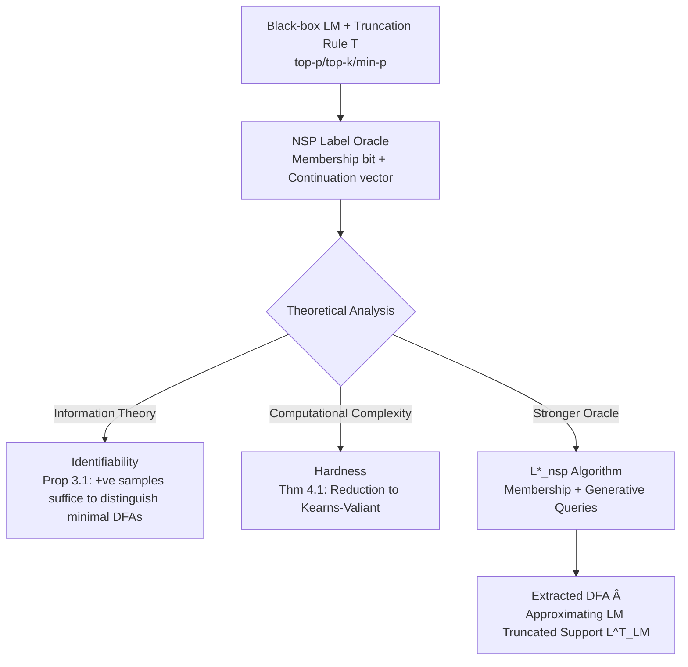

# Automata Learning and Identification of the Support of Language Models

**Conference**: ICLR 2026  
**OpenReview**: [https://openreview.net/forum?id=L8SMNWsxfK](https://openreview.net/forum?id=L8SMNWsxfK)  
**Code**: To be confirmed  
**Area**: Learning Theory / Automata Learning  
**Keywords**: DFA Learning, Next Symbol Prediction, Support Identification, L* Algorithm, PAC Learning, Language Model Interpretability  

## TL;DR
This paper systematically characterizes the learnability of regular languages under "Next Symbol Prediction (NSP)" supervision. It proves that while NSP labels ensure identifiability, they cannot bypass computational hardness. Furthermore, it proposes the L*_nsp algorithm—leveraging a language model as a "teacher" to efficiently extract a DFA that approximately characterizes its generative support set.

## Background & Motivation
- **Background**: Language Models (LMs) are widely deployed, yet their internal computations and the set of strings they generate are difficult to explain. A fundamental question is: Can a compact, interpretable formal object (such as a Deterministic Finite Automaton, DFA) be extracted from a black-box model such that its accepted strings approximate the model's generative support? Classic conclusions in automata learning state that inferring a DFA from labeled samples is NP-hard, and even (improper) PAC learning is infeasible under cryptographic assumptions. However, Angluin's L* algorithm allows polynomial-time learning using membership queries and counterexamples.
- **Limitations of Prior Work**: The Next Symbol Prediction (NSP) setting—where the learner obtains supervision for each prefix regarding "whether the prefix itself is in the language" and "which next symbols lead to an accepted string"—has long been used for the **empirical evaluation** of neural sequence models (e.g., performance of LSTMs or Transformers on formal languages). However, a **learnability theory** for languages under this supervision has never been established, and its relationship with traditional binary classification remains unclear.
- **Key Challenge**: The supervision provided by NSP is "richer" than binary classification (providing a bit vector for each prefix), suggesting it should be easier to learn. However, can this richer supervision truly break the computational barriers of DFA learning? Conversely, negative example distributions are often artificial or undefined in generative model scenarios, making the traditional PAC framework unsuitable.
- **Goal**: Characterize the learnability of the NSP setting (identifiability, computational complexity, and oracle requirements) within a computational learning theory framework, and connect it to the practical problem of "identifying the (truncated) support of an LM."
- **Key Insight**: **(Continuation bits as negative information)** The continuation bits $\varphi(y,\sigma)=0$ prove that any extension of $y\sigma$ is not accepted; this provides information about "strings outside the language," enabling the distinction of different minimal DFAs using only positive examples. **(Generative queries as strong oracles)** Prefix-conditioned generation in LMs naturally serves as a powerful query primitive, bypassing the difficulties of passive learning.

## Method

### Overall Architecture
The paper proceeds through three levels. First (Identifiability), it proves that positive examples + NSP labels are information-theoretically sufficient to uniquely determine a minimal DFA, making the equivalence query oracle well-defined. Second (Hardness), it proves that even with NSP labels, PAC learning a DFA remains cryptographically hard, and membership queries alone cannot achieve polynomial-time exact identification. Third (Learning with an LM Teacher), it addresses hardness by proposing a stronger query model—prefix-conditioned generative queries—and extends Angluin's L* to L*_nsp, providing distribution-specific PAC guarantees relative to the "teacher distribution." NSP learning and "learning the LM support set" are directly linked by setting $f^\star=f^T_{LM}$ and $D=D^T_{LM}$.

### Key Designs

**1. Equivalence between NSP and Truncated Support: Formalizing LM support extraction as a learnability problem.** The paper sets the alphabet as $\Sigma=V\cup\{[\text{EOS}]\}$. A truncation rule $T$ (e.g., top-p/min-p) maps a prefix $y$ to an accepted next-symbol set $C_T(y)$, where $[\text{EOS}]\in C_T(y)$ iff $y$ can terminate. The set of all strings generated by the LM under $T$ forms the truncated support $L^T_{LM}$. The NSP oracle is naturally defined as $L^T_{LM}(y)=\mathbb{I}[[\text{EOS}]\in C_T(y)]$ and $\varphi_T(y,\sigma)=\mathbb{I}[\sigma\in C_T(y)]$. This mapping ensures that any PAC learner capable of learning a low-error $\hat f$ from NSP-labeled positive examples immediately yields a process for learning the LM truncated support when $f^\star=f^T_{LM}$ and $D=D^T_{LM}$.

**2. Identifiability via continuation bits: Proving information-theoretic sufficiency.** Positive examples alone (even with prefix membership bits) are insufficient to identify a language (e.g., $L_A=\Sigma^*$ vs. $L_{A^\star}=1^*$). The breakthrough is that continuation bits carry "out-of-language" information: $\varphi(y,\sigma)=0$ proves all extensions of $y\sigma$ are rejected. Based on this, Proposition 3.1 proves that for any two distinct minimal DFAs $A\neq A^\star$, there must exist some $x\in L_{A^\star}$ such that $f_A(x)\neq f_{A^\star}(x)$. Two corollaries follow: there exists a finite **teaching set** $S\subseteq L_{A^\star}$ that uniquely determines $A^\star$, and the **equivalence query oracle is well-defined** in the NSP setting.

**3. Hardness Reduction: Proving rich supervision cannot break cryptographic barriers.** Although continuation bits are highly informative for certain classes (e.g., Conjunctions, where one positive example can recover the target), the paper proves they do not help for general DFAs. Theorem 4.1 shows: if the class of Boolean acyclic DFAs $\text{ADFA}^N_{p(N)}$ is efficiently PAC-learnable in the NSP setting, it is also efficiently learnable under traditional binary classification—the latter of which is known to be hard under cryptographic assumptions (Kearns & Valiant 1994). The construction shows that for any ADFA, one can construct an ADFA with only $N+1$ states such that **all but one continuation bit become uninformative**, making the prediction of that single bit as hard as learning the ADFA in the traditional setting.

**4. L*_nsp: Modifying counterexample handling with continuation bits.** Facing hardness, the paper turns to a stronger query model: membership queries $MQ(x)$ and generative queries $\text{Gen}_{D_{LM}}(x)$, which generates a valid NSP-labeled string conditioned on $x$. L*_nsp's core modification (Lemma 5.1) **transforms any NSP label mismatch into a standard membership mismatch**. If a mismatch occurs at prefix $x_{:n}$: if it is a membership mismatch, use $x'=x_{:n}$; if it is a continuation mismatch where the target says $\sigma$ never leads to acceptance but the hypothesis says it does, find a suffix $s$ to an accepting state in the hypothesis and let $x'=x_{:n}\cdot s$; if the target says $\sigma$ is feasible but the hypothesis forbids it, use a **generative query** to get a valid extension $y$ and let $x'=x_{:n}\sigma y$. Theorem 5.2 provides a distribution-specific PAC guarantee regarding $D_{LM}$, with running time polynomial in $n, 1/\epsilon, 1/\delta$, and max generation length.

## Key Experimental Results

### Main Results
Evaluated L*_nsp on extracting DFAs from Transformer teachers for 11 regular languages (states 2–86): 6 Tomita grammars, Parity, and 4 bounded Dyck languages. Transformers were 8-layer, width 512, trained with AdamW. Sampling used min-p ($p=0.05$).

| Task Family | Target States | Samples for Conv. | Key Phenomenon |
|-------------|---------------|-------------------|----------------|
| Tomita (well-trained) | 2–5 | 1 +ve sample often suffices | Usually recovers target DFA in <1s |
| Bounded Dyck | 8–86 | ≤100 samples | Converges to target DFA; near-perfect NSP accuracy |
| Parity / Tomita-5 (imperfect) | Large | — | Extracts larger DFAs; state count always $\le$ teacher support |

### Ablation Study
Comparison of NSP labels vs. binary labels (classic L*) on 6 languages, sampling from the model's untruncated distribution and labeling positive/negative based on min-p truncation (≈99.5% negative):

| Setting | Label Type | Performance on Dyck (with dead states) |
|---------|------------|-----------------------------------------|
| Classic L* | Binary only | Slow state growth, high sample complexity |
| L*_nsp | NSP (Cont. bits) | Continuation bits heavily utilized, faster identification |

### Key Findings
- **Continuation bits are heavily used in languages with dead-state transitions (e.g., Bounded Dyck)**, leading to improved sample complexity over binary labels.
- **The number of extracted states is always $\le$ the target states of the teacher's support.**
- By constructing product DFAs $B$ for the symmetric difference $L(\hat A)\triangle L(A^\star)$ and using BFS, the authors found **systematic error samples** in LMs (e.g., in Parity and Dyck), which could be mitigated with longer training.

## Highlights & Insights
- **Translates "Interpretability Extraction" into a clean learnability problem**: The NSP $\leftrightarrow$ truncated support correspondence allows for a PAC framework for DFA extraction from LMs using black-box simulations.
- **Comprehensive treatment of positive and negative results**: The paper provides insight by showing that continuation bits provide information-theoretic identifiability (positive) yet do not overcome computational hardness (negative).
- **Distribution-specific guarantees suit generative models**: Traditional L* requires artificial negative distributions; this approach targets the LM's induced distribution, which is most relevant for predicting generative errors.
- **Utility in error mining**: Converting extracted DFAs into bug-finding tools via symmetric difference and BFS provides practical value beyond theory.

## Limitations & Future Work
- **Restricted to regular languages/DFAs**: The assumption that LM support is a regular language is a limitation for real-world context-sensitive distributions like natural language.
- **Reliance on small-scale synthetic languages**: Experiments use synthetic grammars with 2–86 states; the scalability of generative queries and extraction size for large models with vocabularies in the tens of thousands is unverified.
- **Strong coupling with truncation rules**: The support definition depends on specific $T$ (e.g., min-p thresholds), and results change with sampling settings.
- **Persistent Hardness**: Theoretically, general DFAs remain cryptographically hard under NSP; L*_nsp's efficiency relies on the generative query assumption, which requires further characterization for real LMs.

## Related Work & Insights
- **Classic DFA Learnability**: Follows Gold 1978, Angluin 1987, and Kearns & Valiant 1994, characterizing learnability in the "LM support identification" setting.
- **Automata Extraction from Neural Models**: Connects to early work (Giles 1992) and recent L*-based white-box/black-box extraction (Weiss 2018/2019, Zhang 2024), while focusing specifically on **support identification**.
- **Insight**: The idea of continuation bits as "negative information" is transferable to other learning scenarios with only positive examples and structural constraints.

## Rating
- **Novelty**: ⭐⭐⭐⭐⭐ — First to establish learnability theory for regular languages in the NSP setting and connect it to LM support identification.
- **Experimental Thoroughness**: ⭐⭐⭐⭐ — 11 languages with ablation studies and error mining; however, restricted to synthetic small-scale cases.
- **Writing Quality**: ⭐⭐⭐⭐⭐ — Clear definitions, distinct layers of results, and smooth transition from motivation to theorems.
- **Value**: ⭐⭐⭐⭐ — Provides a provable formal tool for LM interpretability with clear practical applications in extraction and debugging.

<!-- RELATED:START -->

## Related Papers

- [\[ICLR 2026\] Language Identification in the Limit with Computational Trace](language_identification_in_the_limit_with_computational_trace.md)
- [\[ICLR 2026\] Unveiling the Basin-like Loss Landscape in Large Language Models](unveiling_the_basin-like_loss_landscape_in_large_language_models.md)
- [\[ICLR 2026\] FlowNIB: An Information Bottleneck Analysis of Bidirectional vs. Unidirectional Language Models](flownib_an_information_bottleneck_analysis_of_bidirectional_vs_unidirectional_la.md)
- [\[ICLR 2026\] Diffusion Language Models are Provably Optimal Parallel Samplers](diffusion_language_models_are_provably_optimal_parallel_samplers.md)
- [\[ICLR 2026\] Learning Correlated Reward Models: Statistical Barriers and Opportunities](learning_correlated_reward_models_statistical_barriers_and_opportunities.md)

<!-- RELATED:END -->
