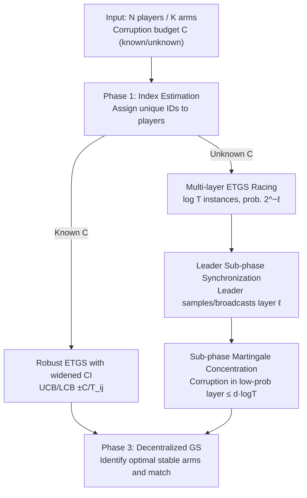

# Bandit Learning in Matching Markets Robust to Adversarial Corruptions

**Conference**: ICLR2026  
**OpenReview**: [https://openreview.net/forum?id=CoWJc5ofDO](https://openreview.net/forum?id=CoWJc5ofDO)  
**Code**: To be confirmed  
**Area**: Learning Theory / Online Learning / Multi-armed Bandits  
**Keywords**: Matching Markets, Multi-armed Bandits, Adversarial Corruptions, Robust Online Learning, Regret Bounds

## TL;DR
This paper investigates the decentralized bilateral matching market bandit learning problem under feedback corrupted by an adversary for the first time. It provides robust algorithms for cases where the total corruption $C$ is known and unknown: for known $C$, the confidence intervals of the classic ETGS are widened; for unknown $C$, a "multi-layer ETGS racing + sub-phase level synchronization" approach is used to adaptively resist arbitrary corruption. The paper proves player-optimal stable regret upper bounds and a matching lower bound.

## Background & Motivation
**Background**: The core goal in bilateral matching markets (e.g., employer-worker, rider-driver, crowdsourcing platforms) is to find a **stable matching**—a state where no player-arm pair prefers each other over their current partners. In reality, players (one side of the market) do not know their true preferences beforehand and must learn them by repeatedly matching and observing stochastic rewards. This is modeled as Multi-Armed Bandits (MAB): players act as bandit learners, and the reward distributions represent unknown preferences. A representative algorithm is Kong & Li's (2023) Explore-Then-Gale-Shapley (ETGS), which uses Round-Robin exploration to estimate preferences followed by offline Gale-Shapley to find the optimal stable matching.

**Limitations of Prior Work**: Almost all existing matching market bandit algorithms assume that feedback accurately follows a stochastic preference model (rewards from fixed distributions). However, real-world feedback can be sabotaged by external noise or **deliberate manipulation**: nodes in server resource allocation might overperform during testing to secure more resources, or competitors in advertising might use click farms to inflate fake CTRs. These corrupted signals severely distort the estimation of true preferences, and existing algorithms **lack defense mechanisms**—once feedback is corrupted, they fail to converge to the true stable matching.

**Key Challenge**: The authors prove that ETGS is **extremely fragile** under adversarial corruption. Since the arm-pulling sequence in ETGS is a deterministic Round-Robin, an adaptive adversary observing past matches and rewards can systematically corrupt only the optimal arm for player $p_i$, forcing them to match with sub-optimal arms. This manipulation succeeds in only $O(\log T/\Delta^2)$ rounds, resulting in linear $O(T)$ regret. A natural remedy is randomization (a classic technique against corruption), but if players randomize independently in a decentralized market, **frequent matching conflicts** occur, causing exploration efficiency to collapse. This creates a dilemma: "Determinism → Targeted manipulation vs. Randomization → Matching conflicts."

**Goal**: Design matching market bandit algorithms that are robust to **arbitrary levels** of adversarial corruption and exhibit **graceful performance degradation** as corruption increases. The algorithms should be decentralized, require minimal player communication, cover both known and unknown total corruption $C$, and provide provable regret bounds.

**Key Insight**: Model matching market feedback corruption as "Stochastic MAB with adversarial corruptions" (following Lykouris et al. 2018). The core idea is to transplant the anti-corruption philosophy of single-player randomized MAB (multiple instances + varying sampling probabilities) into ETGS while resolving decentralized randomization conflicts through a **leader synchronization mechanism**.

**Core Idea**: Maintain $\log T$ instances of ETGS "racing" against each other with different learning rates. Instances with lower sampling probabilities experience less corruption statistically and are more accurate. An elected leader samples and broadcasts an instance layer index at the end of each sub-phase, forcing all players to synchronize on the same instance, thereby tolerating corruption without causing matching conflicts.

## Method

### Overall Architecture
The algorithm follows the three-phase structure of ETGS: **Phase 1 Index Estimation** ($N$ iterations to assign unique IDs to each player based on acceptance by a single preference arm $a_1$, ensuring conflict-free Round-Robin) → **Phase 2 Preference Learning** (the core innovation, estimating the preference ranking for the top $N$ arms) → **Phase 3 Stable Matching Identification** (using decentralized offline Gale-Shapley to match based on estimated rankings for the remaining rounds). Phases 1 and 3 remain largely identical to the original ETGS; all modifications are concentrated in **Phase 2**.

Depending on whether $C$ is known, Phase 2 has two designs: a "Robust ETGS with widened confidence intervals" (Algorithm 1) for known $C$, and the primary "Multi-layer ETGS Racing" (Algorithm 2) for unknown $C$. The latter is composed of four components: multi-instance anti-corruption, leader sub-phase synchronization, optimal sub-phase length based on a communication/learning tradeoff, and sub-phase level martingale concentration.

### Key Designs

**1. Vulnerability Diagnosis of ETGS under Deterministic Round-Robin**

The departure point is a negative result: because ETGS arm-pulling is deterministic, an adaptive adversary can precisely target the optimal arm. By concentrating corruption on player $p_i$'s optimal arm to create a "fake preference reversal," the adversary can force sub-optimal matching for $O(T)$ rounds. Since ETGS exploration "crystallizes" after $O(\log T/\Delta^2)$ rounds, the same amount of corruption suffices to cause linear regret.

**2. Robust ETGS with Widened Confidence Intervals: Scaling by worst-case corruption when $C$ is known**

When $C$ is known, the corrupted reward is viewed as the true reward plus a corruption term: $r_{i,j}(t)=r^S_{i,j}(t)+c_{i,j}(t)$. Since $\sum_t \max_j |c_{i,j}(t)|\le C$, the total corruption on arm $a_j$ offsets the mean estimate by at most $C/T_{i,j}$. The algorithm widens the confidence interval by $C/T_{i,j}$ beyond the standard $\sqrt{6\log T/T_{i,j}}$:

$$\mathrm{UCB}_{i,j}=\hat\mu_{i,j}+\sqrt{\frac{6\log T}{T_{i,j}}}+\frac{C}{T_{i,j}},\qquad \mathrm{LCB}_{i,j}=\hat\mu_{i,j}-\sqrt{\frac{6\log T}{T_{i,j}}}-\frac{C}{T_{i,j}}.$$

Standard preference identification occurs when intervals do not overlap. This ensures no misidentification even if the adversary exhausts the budget on one arm, at the cost of an **additive term** $KC/\Delta$ in regret. The player-optimal stable regret is:

$$\mathrm{Reg}_i(T)=O\!\Big(\frac{K\log T}{\Delta^2}+\frac{KC}{\Delta}\Big).$$

**3. Multi-layer ETGS Racing + Leader Sub-phase Synchronization: Handling unknown $C$ without conflicts**

When $C$ is unknown, $\log T$ instances (layers) are used. Layer $\ell$ has a sampling probability proportional to $2^{-\ell}$. Each sub-phase activates only one sampled layer to update its specific statistics $\hat\mu^\ell_{i,j}, T^\ell_{i,j}$. Layers with lower probabilities are less frequently hit by the adversary and are thus more robust. If a slower, more accurate layer $\ell$ fixes a stable matching $\sigma^\ell$, it overwrites all faster layers $\ell' \le \ell$.

To prevent conflicts in decentralized settings, a **sub-phase synchronization mechanism** is introduced. Player 1 (the leader) samples the layer index $\ell$ at the end of each sub-phase and broadcasts it by "pulling a specific arm for $\lfloor\ell\rfloor$ rounds" in a predefined future window. This ensures all players use the same instance, satisfying both "anti-corruption through randomization" and "conflict avoidance via synchronization."

**4. Sub-phase Martingale Concentration + Communication/Efficiency Tradeoff**

Traditional martingale inequalities for round-by-round sampling (Lykouris et al. 2018) fail here because sampling happens once per sub-phase. The authors derive a new **sub-phase level martingale inequality** (Lemma 3.3). For a layer with sampling probability $< 1/C$, the cumulative corruption is bounded by $d\log T + 2$ with high probability, where $d$ is the sub-phase length. The confidence radius is set as:

$$\mathrm{UCB}^\ell_{i,j}=\hat\mu^\ell_{i,j}+\sqrt{\frac{6\log T}{T^\ell_{i,j}}}+\frac{2d\log T}{T^\ell_{i,j}},\qquad \mathrm{LCB}^\ell_{i,j}=\hat\mu^\ell_{i,j}-\sqrt{\frac{6\log T}{T^\ell_{i,j}}}-\frac{2d\log T}{T^\ell_{i,j}}.$$

There is a fundamental tradeoff: $d=1$ requires frequent communication (high overhead), while large $d$ amplifies the corruption experienced within a sampled layer. Minimizing the regret bound with respect to $d$ yields an optimal length of $d=O(\sqrt{\log T})$.

### Loss & Training
The core of this theoretical work is regret analysis. The player-optimal stable regret for Multi-layer ETGS Racing (Theorem 3.4) is:

$$\mathrm{Reg}_i(T)\le O\!\Big(\frac{Kd\log T(\log T+C)}{\Delta}+\frac{K\log^2 T(\log T+C)}{d\Delta^2}+\frac{K\log^2 T(\log T+C)}{\Delta}\Big).$$

With optimal $d=O(\sqrt{\log T})$, this simplifies to $O\!\big(K\log^{1.5}T(\log T+C)/\Delta^2+K\log^2 T(\log T+C)/\Delta\big)$. The proof focuses on a critical layer $\ell^*=\arg\min_\ell[2^\ell>C]$ which acts as "corruption-free." Faster layers are corrected by $\ell^*$ and contribute regret at most proportional to $C$.

## Key Experimental Results

### Main Results
Simulation setup: $N=K=5$, fixed preference gap $\Delta=0.2$, Gaussian rewards. Corruptions follow the strategy from Wang et al. (2024). Results track the **maximum cumulative player-optimal stable regret** across 10 runs.

| Setting | Baseline | Ours (Both Alg.) |
|------|----------|------------------|
| $C=4000,\ T=5\times10^5$ | Vanilla ETGS / Phased ETC / AETGS-E | Ours achieve the **lowest** cumulative regret (Fig. 1(a)) |

Performance comparison (Table 1):

| Setting | Regret Bound | Communication Cost |
|------|--------|----------|
| Known $C$ | $O(K\log T/\Delta^2+KC/\Delta)$ | $O(\log(K\log T/\Delta^2+KC/\Delta))$ |
| Unknown $C$ | $O\!\big(K(\log T+C)\log^{1.5}T(1/\Delta^2+\sqrt{\log T}/\Delta)\big)$ | Sub-phase length dependent |

### Ablation Study

| Configuration | Key Observation | Description |
|------|---------|------|
| $C\in\{1000,2000,4000\}$ | Regret increases with $C$ | Validates that corruption enters regret additively; known $C$ outperforms unknown $C$. |
| $d\in\{1,10,50\}$ at $C=1000$ | $d=10,50$ perform significantly worse | Confirms tradeoff: excessive $d$ amplifies corruption per sub-phase. |
| $d\in\{1,2,4,6,8\}$ | $d=4$ is optimal | Precision match with theoretical $d=O(\sqrt{\log T})\approx4.3$. |

### Key Findings
- Both proposed algorithms suppress targeted adversarial attacks, outperforming all baselines under strong corruption ($C=4000$).
- The empirical optimal sub-phase length ($d=4$) aligns remarkably with the theoretical prediction ($d \approx 4.3$).
- Knowing $C$ a priori yields better performance, as the unknown case pays a multiplicative $\log^2 T$ factor to estimate the effective corruption level.

## Highlights & Insights
- **Leader Sub-phase Synchronization** is the key bridge: it allows randomization (anti-corruption) in a decentralized market without the "inevitable collision" problem of independent randomization.
- **Sub-phase Level Martingale Inequality** was derived specifically because synchronization changes the sampling granularity, rendering standard round-by-round inequalities inapplicable.
- **Communication vs. Learning Tradeoff**: The derivation of the analytical optimal $d=O(\sqrt{\log T})$ and its empirical verification is a strong point of the paper.
- The vulnerability diagnosis provides a clear mathematical reason why deterministic Round-Robin is a bottleneck in robust matching.

## Limitations & Future Work
- The unknown $C$ algorithm regret is higher than the lower bound by a **multiplicative $\log^2 T$ factor** due to multi-layer overhead and synchronization.
- There is a mismatch between the preference gap definitions $\Delta$ and $\tilde\Delta$ in the bounds—a fundamental open problem in matching markets regarding decentralized coordination costs.
- Simulations are small-scale ($N=K=5$) and use a specific corruption strategy; robustness against more diverse adversaries or larger scales remains to be tested.
- The mechanism relies on a reliable leader and error-free broadcast; robustness against a compromised leader or "noisy" synchronization signals was not discussed.

## Related Work & Insights
- **vs. Vanilla ETGS (Kong & Li, 2023)**: ETGS is efficient but fragile; this work adds robustness via widened CIs or multi-layer racing.
- **vs. Single-player Robust Bandits (Lykouris et al., 2018)**: This paper extends the multi-layer probability idea to decentralized players, resolving conflict issues with synchronization and new concentration bounds.
- **vs. Lower Bounds (Sankararaman et al., 2021)**: This work combines OSB constructions with corruption lower-bound techniques to show that the known $C$ algorithm is nearly optimal.

## Rating
- Novelty: ⭐⭐⭐⭐⭐ First introduction of adversarial corruption to matching markets with novel sync/concentration tools.
- Experimental Thoroughness: ⭐⭐⭐ Clear theoretical verification, though small-scale.
- Writing Quality: ⭐⭐⭐⭐ Logical progression from vulnerability diagnosis to solutions.
- Value: ⭐⭐⭐⭐ Provides the first provable robust framework for safety-critical matching markets.

## Related Papers

- [\[ICLR 2026\] Online Conformal Prediction with Adversarial Semi-bandit Feedback via Regret Minimization](online_conformal_prediction_with_adversarial_semi-bandit_feedback_via_regret_min.md)
- [\[ICLR 2026\] Laplacian Kernelized Bandit](laplacian_kernelized_bandit.md)
- [\[ICML 2026\] Bandit Social Learning with Exploration Episodes](../../ICML2026/learning_theory/bandit_social_learning_with_exploration_episodes.md)
- [\[ICLR 2026\] Noise Tolerance of Distributionally Robust Learning](noise_tolerance_of_distributionally_robust_learning.md)
- [\[ICLR 2026\] A Faster Parameter-Free Regret Matching Algorithm](a_faster_parameter-free_regret_matching_algorithm.md)

<!-- RELATED:END -->

<!-- RELATED:START -->

## Related Papers

- [\[ICLR 2026\] Noise Tolerance of Distributionally Robust Learning](noise_tolerance_of_distributionally_robust_learning.md)
- [\[ICLR 2026\] A Statistical Learning Perspective on Semi-dual Adversarial Neural Optimal Transport Solvers](a_statistical_learning_perspective_on_semi-dual_adversarial_neural_optimal_trans.md)
- [\[ICLR 2026\] Feature Compression is the Root Cause of Adversarial Fragility in Neural Networks](feature_compression_is_the_root_cause_of_adversarial_fragility_in_neural_network.md)
- [\[ICLR 2026\] InfoBridge: Mutual Information Estimation via Bridge Matching](infobridge_mutual_information_estimation_via_bridge_matching.md)
- [\[ICLR 2026\] A Faster Parameter-Free Regret Matching Algorithm](a_faster_parameter-free_regret_matching_algorithm.md)

<!-- RELATED:END -->
