# Bandits with Single-Peaked Preferences and Limited Resources

**Conference**: ICLR 2026  
**OpenReview**: [https://openreview.net/forum?id=0SNfofDIRF](https://openreview.net/forum?id=0SNfofDIRF)  
**Code**: [https://github.com/GurKeinan/code-for-Bandits-with-Single-Peaked-Preferences-and-Limited-Resources-paper](https://github.com/GurKeinan/code-for-Bandits-with-Single-Peaked-Preferences-and-Limited-Resources-paper)  
**Area**: Combinatorial Multi-Armed Bandits / Online Learning Theory  
**Keywords**: Single-peaked preferences, Budget-constrained matching, Combinatorial bandit, PQ tree, Regret bounds, NP-hard  

## TL;DR
The paper introduces the "single-peaked preference" structure from social choice theory into online matching bandits with budget constraints. By bypassing the NP-hardness of the general case, it provides polynomial-time efficient algorithms with regrets of $\tilde{O}(UK T^{2/3})$ (unknown structure) or $\tilde{O}(U\sqrt{TK})$ (known structure).

## Background & Motivation
**Background**: Modern recommendation systems must trade off between "learning each user's preference" and "satisfying global resource constraints"—for instance, a content platform needs to select a set of creators (each with different costs) within a daily budget and match users to the content of these creators. This naturally falls within the combinatorial multi-armed bandit (combinatorial MAB) framework: a decision-maker selects a structured set of actions (assigning an arm to each user) to maximize cumulative satisfaction.

**Limitations of Prior Work**: In general cases, even the offline version—finding the optimal feasible matching given an expected reward matrix $\Theta$—is NP-hard (Theorem 1 proves that approximation within any factor better than $1-1/e$ is NP-hard). This implies that no efficient online algorithm can achieve sublinear standard regret. Consequently, traditional approaches settle for **$\alpha$-regret**, which compares performance against the "optimal efficiently computable approximate solution" rather than the true optimum. This is a significantly weaker guarantee and is unsatisfactory in high-stakes or highly structured scenarios.

**Key Challenge**: One must either insist on standard regret but be blocked by NP-hardness, or use efficient algorithms but only achieve weakened $\alpha$-regret. The goal is to find a natural structural assumption that breaks the computational barrier, allowing for both.

**Goal**: The paper introduces the single-peaked (SP) structure onto the preference matrix $\Theta$—there exists a total order of arms such that each user's utility is "unimodal" (increasing then decreasing) along this order. SP has been extensively studied in social choice theory since Black (1948) (e.g., voters along an ideological spectrum, consumers along a single attribute, users along content type similarity). Historically, it has turned many NP-hard voting problems into polynomial-time solvable ones. This paper demonstrates that in cardinality matching models with budget constraints, SP similarly makes computational challenges efficient without sacrificing the regret rate.

**Core Idea (Computationally Tractable but Statistically Hard)**: A counter-intuitive key insight of this paper is that **the SP structure only simplifies "computation" but not "statistics"**. Even if the SP order and user peak positions are known, the worst-case regret remains $\Omega(U\sqrt{TK})$, identical to the lower bound for general preferences. Therefore, the value of being single-peaked lies purely in "making NP-hard problems polynomial," while the intrinsic difficulty of exploration-exploitation remains unchanged.

## Method

### Overall Architecture
The paper focuses on the Constrained Bandit Recommendation (CBR) problem: $U$ users, $K$ arms, each arm $k$ has a cost $c_k$, and the total cost of arms selected in each round cannot exceed budget $B$. Each user is then matched to one selected arm to maximize the cumulative satisfaction over $T$ rounds. The technical stack progresses through three layers: first solving the **offline** optimal matching (SP-MATCHING via dynamic programming), then handling the online case with **known structure** (MVM via optimistic UCB), and finally addressing the online case with **unknown structure** (EMC via explore-then-commit + PQ tree order recovery).

```mermaid
flowchart TD
    A[CBR Problem: U Users / K Arms / Budget B] --> B{Single-Peaked SP Structure?}
    B -->|No, NP-hard| Z[Limited to α-regret]
    B -->|Yes| C[SP-MATCHING<br/>Offline DP Optimal Matching<br/>O&#40;K²U+K²B&#41;]
    C --> D{Is SP Order & Peak Known?}
    D -->|Known| E[MVM: Optimistic UCB + Maximal Matrix<br/>Regret Õ&#40;U√TK&#41;]
    D -->|Unknown| F[EMC: Explore-then-commit]
    F --> G[EXTRACT-ORDER<br/>PQ Tree Restores Approx. SP Order]
    G --> H[Project to Nearest SP Matrix<br/>Then Call SP-MATCHING]
    H --> I[Regret Õ&#40;UK T^2/3&#41;]
```

### Key Designs

**1. SP-MATCHING: Reducing NP-hard matching to DP using "Nearest Peak".** The breakthrough for offline optimal matching is Lemma 4—given a subset of selected arms $S$, the optimal matching assigns each user to the arm in $S$ **closest to their peak position** (if the peak falls between two selected arms $k_j, k_{j+1}$, one of the two is chosen). This unimodal property provides the problem with optimal substructure, allowing for dynamic programming. A table $F(k,b)$ is maintained to represent the maximum reward when "arm $k$ is the rightmost selected arm, budget does not exceed $b$, and only users with peaks $\le k$ are considered":

$$F(k,b)=\max_{\substack{i:0\le i<k,\ b\ge c_i+c_k}}\Big[F(i,b-c_k)+\sum_{u:\,i<p(u)\le k}\max\{P_{u,i},P_{u,k}\}\Big].$$.

The intuition is: when $k$ is the highest selected arm and $i$ is the second highest, users with peaks before $i$ are unaffected, and users with peaks between $i$ and $k$ are assigned to whichever is better. Summation terms for all $(i,k)$ pairs are precomputed in $O(K^2U)$ time, and the table is filled in $O(K^2B)$, yielding the **exact optimum** in $O(K^2(U+B))$ total complexity (Theorem 5).

**2. Maximal Matrix: Collapsing optimistic UCB optimization into a single call.** Online UCB requires solving $\pi^t\in\arg\max_{\pi}\max_{P\in\mathcal{C}_t}V(\pi;P)$ each round—optimizing the matching and the matrix simultaneously over the confidence set $\mathcal{C}_t$ (all matrices consistent with the SP order/peaks and within each $(u,k)$ interval). Lemma 6 proves that when the order $\prec$ and peaks $p(\cdot)$ are known, there exists a **unique entry-wise maximal matrix** $P^t$ in $\mathcal{C}_t$, where entries are the minimum of UCB values taken from that position towards the peak:

$$P^t_{u,k}=\begin{cases}\min_{i:\,k\preceq i\preceq p(u)}\mathrm{UCB}_{u,i}(t), & k\preceq p(u)\\[2pt]\min_{i:\,p(u)\preceq i\preceq k}\mathrm{UCB}_{u,i}(t), & p(u)\preceq k\end{cases}$$

This matrix entry-wise dominates all matrices in the confidence set, so running SP-MATCHING once on it is equivalent to solving the entire optimistic optimization. The MVM (Match-via-Maximal) algorithm constructs $P^t$, calls SP-MATCHING, and updates history, achieving $O(U\sqrt{TK\ln T})$ regret using standard UCB arguments (Hoeffding + union bound) with per-round cost $O(K^2(U+B))$ (Theorem 7). It also generalizes to cases where the order and peak belong to a polynomial-sized candidate set $S$.

**3. EXTRACT-ORDER: Approximating the SP order from noisy estimates using PQ trees.** The unknown structure case is the most difficult—noisy estimates $\bar\Theta$ are generally not SP, and the true SP order cannot be read directly. The paper relaxes the definition: $P$ is $\delta$-ASP (Approximately Single-Peaked) if for any $i\prec j\prec l$, $P_{u,j}\ge\min\{P_{u,i},P_{u,l}\}-\delta$. It proves that a $\delta$-noise perturbation of an SP matrix is $2\delta$-ASP, and conversely, any $\delta$-ASP matrix can be projected to an exact SP matrix with entry-wise difference $\le \delta$ (Lemma 9). Order recovery uses "consecutive constraints": if a user prefers a subset of arms $A_1$ over $A_2$ (with a gap $>2\varepsilon$ to resist noise), any SP order must arrange $A_1$ as a contiguous block. EXTRACT-ORDER sorts arms by preference for each user and, when the preference difference exceeds $2\varepsilon$, adds a constraint to a **PQ tree** (Booth & Lueker 1976). It outputs an order satisfying all constraints in $O(UK^2)$ time. Lemma 10 guarantees the returned order makes $\bar\Theta$ $(2K\varepsilon)$-ASP.

**4. EMC: Linking tools into a sublinear algorithm via explore-then-commit.** The EMC (Explore-then-Match-and-Commit) algorithm follows five steps: ① Explore each arm for $N$ rounds to collect empirical means $\bar\Theta$; ② Extract order $\prec$ using EXTRACT-ORDER (setting $\varepsilon_N=\sqrt{2\ln T/N}$ so $\|\Theta-\bar\Theta\|_\infty\le\varepsilon$ holds with high probability); ③ Project $\bar\Theta$ to an SP matrix $\tilde\Theta$ via Lemma 9; ④ Run SP-MATCHING on $\tilde\Theta$ to get matching $\tilde\pi$; ⑤ Commit to $\tilde\pi$ for the remaining $T-NK$ rounds. The regret depends on the approximation quality of $\tilde\Theta$ to $\Theta$. Balancing exploration cost and approximation error with $N=\Theta(T^{2/3}(\ln T)^{1/3})$ yields $\tilde{O}(UK T^{2/3})$ regret (Theorem 11) in polynomial time. Theorem 12 provides evidence for why $\sqrt{T}$ might be impossible under an unknown order: even the subproblem of "finding the optimal SP matrix in a confidence set given a fixed matching" (MAX-SP-WCS) is NP-hard to approximate within a factor of $3/4+\delta$.

## Key Experimental Results
Experiments were conducted on synthetic data (standard Python + NumPy/Pandas + SageMath for PQ trees) to verify if the asymptotic regret slopes match the theory. Setting: $U=100$ users, $K=20$ arms, 10 random SP instances × 10 independent runs.

### Main Results (log-log Regret Slope)

| Algorithm | Setting | Theoretical Regret | Theoretical Slope | Observed Slope |
|-----------|---------|---------------------|-------------------|----------------|
| EMC (Unknown Structure) | $T=10^5\sim10^6$, random permutation to simulate unknown order | $\tilde{O}(UK T^{2/3})$ | $2/3\approx0.667$ | $\approx0.694$ |
| MVM (Known Structure) | Run up to $T=10^5$, provided with true SP structure | $\tilde{O}(U\sqrt{TK})$ | $0.5$ | $0.388\sim0.434$ |

### Key Findings
- **EMC slope is 0.694**, slightly higher than the theoretical $2/3$, but the paper notes that the empirical slope approaches $2/3$ as the time horizon increases, validating the asymptotic prediction. The overhead is due to finite-horizon effects.
- **MVM slope is 0.388–0.434**, strictly lower than the theoretical upper bound of $0.5$, indicating the analysis is conservative for typical instances. The slope varies with the difficulty of the preference structure.
- **The "Cost of Unknown Order" is highlighted**: 0.69 for EMC vs. 0.39–0.43 for MVM—knowing the single-peaked structure brings significantly better asymptotic performance, empirically reflecting the gap between $T^{2/3}$ and $\sqrt{T}$ regret.

## Highlights & Insights
- **The "Computational Solvability $\neq$ Statistical Simplicity" separation is elegant**: The paper explicitly limits the benefits of single-peakedness to the computational dimension and uses the $\Omega(U\sqrt{TK})$ lower bound of the general case to prove statistical difficulty remains unchanged.
- **Interdisciplinary Marriage**: Introducing single-peaked preferences + PQ trees from social choice theory and graph theory into bandits provides a new path for bypassing NP-hardness in combinatorial bandits, distinct from $\alpha$-regret.
- **The Elegance of the Maximal Matrix**: Using a single entry-wise dominating matrix to collapse the simultaneous optimization of a matrix and a matching over a convex set into a single offline call is a clean application of the optimism principle.
- **Comprehensive Lower Bounds**: In addition to upper bound algorithms, it provides structural evidence using the NP-hardness of MAX-SP-WCS approximation to suggest that $T^{2/3}$ may be the limit for efficient algorithms under unknown orders.

## Limitations & Future Work
- **Gap between Upper and Lower Bounds**: Under unknown structure, EMC is $T^{2/3}$ while the statistical lower bound is $\sqrt{T}$ (only reachable by inefficient algorithms); whether efficient algorithms can reach $\sqrt{T}$ is open. For known structures, MVM also has an extra factor of $\sqrt{\ln T}\cdot\max\{\sqrt{K},U\}$.
- **Strong Structural Assumptions**: MVM requires both the SP order and user peaks to be known; in reality, peaks must often be estimated. Pure single-peakedness is an idealization compared to multi-peaked or "noisy" real-world preferences.
- **Experimental Scope**: Experiments are limited to synthetic data without comparison to real recommendation scenarios or external baselines, primarily serving to verify slopes.
- **Future Work**: Extending single-peaked logic to more complex preference structures (e.g., multi-dimensional or single-crossing structures) or using SP to simplify other NP-hard problems in online learning.

## Related Work & Insights
- **Combinatorial Bandits & $\alpha$-regret**: The CUCB and $\alpha$-regret framework of Chen et al. (2013) is a direct comparison—this paper trades structural assumptions for standard regret.
- **Budget/Knapsack Constraints**: Follows Nie et al. (2022, 2023) regarding cardinality/knapsack constraints.
- **Matching Bandits & Recommendation**: Related to Liu et al. (2020) and Kong et al. (2022, 2024); while Ben-Porat & Torkan (2023) use exponential time in $K$, this work remains polynomial.
- **Bipartite Matching Variant (Appendix I)**: The paper discusses a one-to-one version where each arm serves at most one user. In this case, the offline problem is solvable via the Hungarian algorithm or min-cost flow without SP structure, achieving $\tilde{O}(\sqrt{UKBT})$ regret. This highlights that the "one arm serving multiple users" aspect of the main model is the source of NP-hardness requiring SP structure.

## Rating
- **Novelty**: ⭐⭐⭐⭐⭐ Integrating SP preferences + PQ trees into budget-constrained matching bandits while separating computational vs. statistical difficulty is a novel and self-consistent approach.
- **Experimental Thoroughness**: ⭐⭐⭐ Synthetic verification of slopes only; however, this is appropriate for a theory-heavy paper.
- **Writing Quality**: ⭐⭐⭐⭐⭐ The progression through the three algorithm tiers is logical, with complete lemma-theorem chains and matching hardness results.
- **Value**: ⭐⭐⭐⭐ Provides a robust new route for bypassing NP-hardness in many-to-one matching bandits, though applicability is limited by the strong structural assumption.

<!-- RELATED:START -->

## Related Papers

- [\[ICLR 2026\] Convergence Dynamics of Over-Parameterized Score Matching for a Single Gaussian](convergence_dynamics_of_over-parameterized_score_matching_for_a_single_gaussian.md)
- [\[ICLR 2026\] Combinatorial Rising Bandits](combinatorial_rising_bandits.md)
- [\[ICLR 2026\] Interactive Learning of Single-Index Models via Stochastic Gradient Descent](interactive_learning_of_single-index_models_via_stochastic_gradient_descent.md)
- [\[ICLR 2026\] High-Dimensional Analysis of Single-Layer Attention for Sparse-Token Classification](high-dimensional_analysis_of_single-layer_attention_for_sparse-token_classificat.md)
- [\[ICLR 2026\] Lipschitz Bandits with Stochastic Delayed Feedback](lipschitz_bandits_with_stochastic_delayed_feedback.md)

<!-- RELATED:END -->
