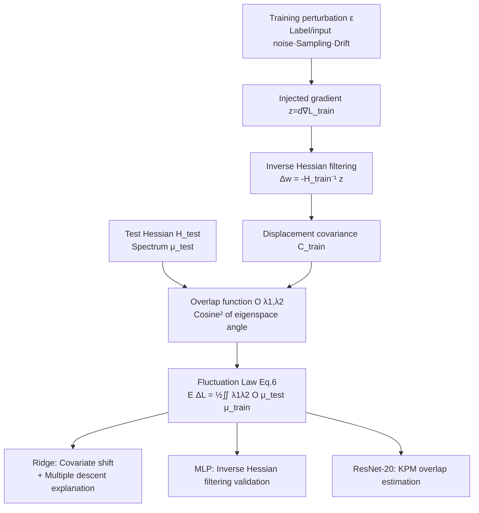

# Beyond Spectra: Eigenvector Overlaps in Loss Geometry

**Conference**: ICLR 2026  
**OpenReview**: [https://openreview.net/forum?id=ditBKIciC3](https://openreview.net/forum?id=ditBKIciC3)  
**Code**: To be confirmed  
**Area**: learning theory / loss geometry / random matrix theory  
**Keywords**: eigenvector overlap, dual loss geometry, Hessian, generalization, covariate shift, multiple descent, random matrix  

## TL;DR
The local loss geometry of machine learning is essentially a "two-operator" problem: the training loss and the test loss each have a Hessian. Analyzing their respective spectra (eigenvalues) alone is insufficient; what truly determines generalization is the **alignment (eigenvector overlap)** between the two Hessian eigenspaces. This paper establishes a universal fluctuation law, a noise propagation law, and provides a scalable overlap estimation algorithm for ResNet.

## Background & Motivation
**Background**: A vast amount of research equates "loss geometry" with the "Hessian spectrum"—measuring eigenvalue distributions, studying sharp/flat minima, explaining generalization via sharpness (maximum eigenvalue), and developing curvature regularization methods like SAM based on single-loss spectra. Random matrix theory has long established that "spectra alone are not enough": in spiked models, risk depends on the alignment of sample eigenvectors with population directions rather than the eigenvalues themselves.

**Limitations of Prior Work**: Actual learning involves at least **two losses**—the training loss and the test loss. Their joint geometry cannot be characterized solely by their individual spectra, as spectra only describe "how much curvature" exists while completely losing the critical directional information of whether the principal directions of the two losses point toward the same location. Directional information becomes indispensable when comparing two operators.

**Key Challenge**: Generalization error = where training perturbations push parameters $\times$ how sensitive the test loss is in that direction. The former is determined by the low-curvature directions of the training Hessian, while the latter is determined by the high-curvature directions of the test Hessian. Whether **the two overlap** is the true switch for the error magnitude, yet pure spectral analysis is blind to this. The paper highlights a counterexample: in anisotropic ridge regression, when the minimum training eigenvalue decreases monotonically (where spectral analysis would predict an error increase), the test error may actually decrease because the low training eigenspace happens to align with low test sensitivity directions.

**Goal**: Establish a local dual-loss geometry framework that **explicitly incorporates both spectra and overlaps**, providing both a theoretical foundation (fluctuation law + propagation law) and practical estimation tools applicable to networks with millions of parameters.

**Key Insight**: **[Two-operator perspective]** Redefines local loss geometry as a union of two quadratic approximations, introducing the "overlap function $O(\lambda_1, \lambda_2)$" as the missing fundamental quantity; **[Overlap routing]** Spectra set the curvature scale, while overlap determines how training fluctuations are "routed" into test error.

## Method

### Overall Architecture
The training and test losses of a model near a given point are expanded to the second order, resulting in two quadratic approximations (two Hessians $H_{\text{train}}, H_{\text{test}}$). Training perturbations (label noise, sampling, distribution shift, etc.) inject a gradient $z$ at the optimal point $w_0$, which is filtered by the inverse Hessian into a displacement $\Delta w = -H_{\text{train}}^{-1}z$; this displacement is substituted into the test loss to obtain the test error increment $\Delta L$. The theory revolves around how the expectation of $\Delta L$ is determined by the spectra and overlap of the two Hessians, implemented progressively across ridge regression (theoretically exact), MLP (non-convex validation), and ResNet-20 (large-scale algorithm).

### Key Designs

**1. Overlapping Local Fluctuation Law: Decomposing generalization into a double integral of spectra $\times$ alignment.** This is the theoretical core. The expectation of the second-order term of the test error increment can be written as a trace $\frac{1}{2d}\mathrm{tr}[H_{\text{test}}C_{\text{train}}]$, where $C_{\text{train}}=\mathbb{E}[\Delta w\,\Delta w^\top]$ is the displacement covariance. By expanding this trace according to the eigendecompositions of the two operators and defining the overlap kernel $\frac{1}{d}O(\lambda_1,\lambda_2)$ as the mean squared cosine of the angle between eigenvectors of $H_{\text{test}}$ and $C_{\text{train}}$ at eigenvalues $\lambda_1,\lambda_2$, Theorem 1 is derived:
$$\mathbb{E}[\Delta L]=\frac{1}{2}\iint \lambda_1\,\lambda_2\,O(\lambda_1,\lambda_2)\,\mu_{\text{test}}(d\lambda_1)\,\mu_{\text{train}}(d\lambda_2).$$
The insight is that neither training nor test spectra alone can predict generalization; what is decisive is how much the "high-variance displacement directions (large $\lambda_2$, i.e., low-curvature training directions)" **overlap** with "highly sensitive test directions (large $\lambda_1$)". Error is maximized when these two are strongly overlapped.

**2. Free Probability Propagation Law: Splitting complex model overlaps into products of simple model components.** In practice, it is often necessary to calculate the overlap between "operator $A$ and a noisy transformation of operator $B$ ($\hat B$)" (e.g., population test covariance vs. sample training covariance). Theorem 2 states: If $\hat B=F(B,X)$ is a rational expression and $X$ is **free** from $A, B$ (an independence concept in large random matrices), then:
$$O_{A,\hat B}(a,\hat b)=\int O_{A,B}(a,b)\,O_{B,\hat B}(b,\hat b)\,\mu_B(db).$$
This provides an "overlap calculus" where overlap functions of complex matrix models can be obtained by multiplying and integrating simpler components.

**3. Application in Ridge Regression: Unifying covariate shift and multiple descent as overlap phenomena.** This theory holds exactly in ridge regression. Label noise acts as the perturbation, yielding displacement covariance $C_{\text{train}}=\sigma^2\alpha^{-1}\hat\Sigma_{\text{train}}(\hat\Sigma_{\text{train}}+\lambda I)^{-2}$ (where $\alpha=m/d$ is the sampling ratio). Substituting this into the fluctuation formula gives:
$$\mathbb{E}[\Delta L]=\frac{\sigma^2}{2\alpha}\iint \frac{\lambda_1\lambda_2}{(\lambda_2+\lambda)^2}\,O_{\Sigma_{\text{test}},\hat\Sigma_{\text{train}}}(\lambda_1,\lambda_2)\,\mu_{\Sigma_{\text{test}}}\,\mu_{\hat\Sigma_{\text{train}}}.$$
(i) **Covariate Shift**: Under constant training/test spectra, varying only the overlap by rotating the eigenspace causes test risk to fluctuate, identifying overlap $O_{\Sigma_{\text{test}},\Sigma_{\text{train}}}$ as a natural measure of "shift itself". (ii) **Multiple Descent**: In dual-scale covariance settings, test error peaks at $\alpha=1/2, 1$. The overlap map shows peaks occur when near-zero training directions overlap with sharp test subspaces.

**4. Large-scale Overlap Estimation: Subspace iteration + Kernel Polynomial Method (KPM) using only matrix-vector products.** Eigendecomposition is infeasible for modern networks. The authors use: **Outlier spaces** are extracted directly via subspace iteration; **Bulk spaces** use the Kernel Polynomial Method to estimate overlap density. Given a smoothing kernel $G(x;\sigma)$, the smoothed total overlap is expressed as $\mathbb{E}_v\|G_{B,\lambda_2}^{1/2}G_{A,\lambda_1}^{1/2}v\|^2$ via Hutchinson's trace estimator + Gaussian kernel + Chebyshev truncated series. This only requires matrix-vector products, making it linear in model and sample size.

## Key Experimental Results

### Main Results

| Setting | Content | Key Findings |
|------|------|----------|
| Ridge Regression | Dual-scale covariance $s_1^2,s_2^2$, isospectral rotation $\theta$ | $\theta=0$ (aligned) yields low error; $\theta=\pi/2$ (misaligned) yields high error with identical displacement; theory matches simulation. |
| Multiple Descent | 2/3/4-scale data, $d=5000$ | Peaks at $\alpha=1/2,1$ precisely match theoretical curves; overlap functions align with experimental results. |
| MLP Validation | Teacher-student, width (5,5,5,1), tanh, MSE | Predicted $\Delta L/L_0$ aligns with measurements across input/label noise magnitudes. |
| ResNet-20 / CIFAR-10 | Pre-trained checkpoint, top-1 92.6% | $H_{\text{train}}, H_{\text{test}}$ are strongly aligned diagonally in balanced sets; alignment significantly vanishes in class-imbalanced sets. |

### Ablation Study

| Phenomenon | Observation |
|------|------|
| Inverse Hessian Filtering | MLP learning amplifies/compresses variance along $H_{\text{train}}$ directions; good train/test alignment prevents large displacements from becoming large test errors. |
| Multiple Descent Mechanism | At $\alpha=1/2$, the training spectrum splits; at $\alpha=1$, near-zero components appear. Between lines 3→4, risk drops while the minimum training eigenvalue also drops—unexplainable by pure spectral analysis. |
| Class Imbalance as Alignment Gap | Class imbalance disrupts the training-test alignment, scattering outlier energy into the bulk of the other operator. |

## Highlights & Insights
- **Conceptual Correction**: Highlights that the mainstream "loss geometry = Hessian spectrum" view is an oversimplification that omits directional information (overlap).
- **Theoretical Unity**: The fluctuation and propagation laws unify covariate shift, multiple descent, and class imbalance into a single phenomenon of "train-test eigenspace misalignment."
- **Closing the Gap**: Moves beyond ridge regression to provide a scalable KPM + Hutchinson + Chebyshev estimator that works on ResNet-20, bridging random matrix theory and deep learning practice.
- **Counter-intuitive Insight**: Demonstrating that test error can fall while the training spectrum becomes more ill-conditioned proves that pure spectral analysis can lead to incorrect conclusions.

## Limitations & Future Work
- **Local Quadratic Boundary**: The theory relies on local second-order expansions; its accuracy under large perturbations or strong non-convexity requires further exploration.
- **Scalability Limits**: ResNet-20 is a strong proof of concept, but validation on billion-parameter models is missing.
- **Static Analysis**: The current work provides snapshots at optima; tracking Hessian overlap dynamically over training time is a suggested future direction.
- **Diagnostics vs. Intervention**: Currently a diagnostic tool for understanding why domain shifts are harmful; "alignment-aware optimization" remains to be implemented.

## Related Work & Insights
- **Comparison with Hessian Spectral Analysis**: Unlike works focusing only on eigenvalue distributions and sharpness (e.g., Sagun, Papyan), this work adds the directional dimension.
- **Comparison with Random Matrix Spiked Models**: Adapts the idea that "risk depends on eigenvector alignment" to training-test learning theory.
- **Comparison with Multiple Descent Literature**: Corrects the interpretation that peaks originate purely from spectral ill-conditioning, providing a complete resolution via overlap.

## Rating
- **Novelty**: ⭐⭐⭐⭐⭐
- **Experimental Thoroughness**: ⭐⭐⭐⭐
- **Writing Quality**: ⭐⭐⭐⭐
- **Value**: ⭐⭐⭐⭐

<!-- RELATED:START -->

## Related Papers

- [\[ICLR 2026\] Characterizing the Discrete Geometry of ReLU Networks](characterizing_the_discrete_geometry_of_relu_networks.md)
- [\[ICLR 2026\] Scaling Laws and Spectra of Shallow Neural Networks in the Feature Learning Regime](scaling_laws_and_spectra_of_shallow_neural_networks_in_the_feature_learning_regi.md)
- [\[ICLR 2026\] PAC-Bayes Bounds for Cumulative Loss in Continual Learning](pac-bayes_bounds_for_cumulative_loss_in_continual_learning.md)
- [\[ICLR 2026\] On Powerful Ways to Generate: Autoregression, Diffusion, and Beyond](on_powerful_ways_to_generate_autoregression_diffusion_and_beyond.md)
- [\[ICLR 2026\] TESSAR: Geometry-Aware Active Regression via Dynamic Voronoi Tessellation](tessar_geometry-aware_active_regression_via_dynamic_voronoi_tessellation.md)

<!-- RELATED:END -->
