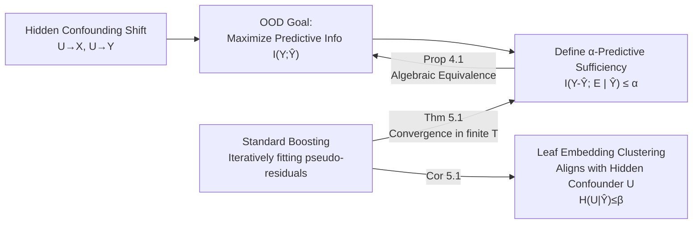

# Boosting for Predictive Sufficiency

**Conference**: ICLR 2026  
**OpenReview**: [https://openreview.net/forum?id=1mQT8PXIy8](https://openreview.net/forum?id=1mQT8PXIy8)  
**Code**: [https://github.com/gautam0707/Boosting_for_predictive_sufficiency](https://github.com/gautam0707/Boosting_for_predictive_sufficiency)  
**Area**: learning theory / OOD generalization  
**Keywords**: Out-of-Distribution Generalization, Hidden Confounding Shift, Information Theory, Gradient Boosting, Predictive Sufficiency, Reference Classes  

## TL;DR
This paper introduces the information-theoretic concept of **$\alpha$-predictive sufficiency**. It theoretically demonstrates that boosting outperforms specialized methods in tabular OOD tasks under hidden confounding shifts because it **implicitly partitions data into "reference classes/environments" aligned with hidden confounders**, maximizing predictive information within each environment.

## Background & Motivation

**Background**: Out-of-distribution (OOD) generalization is central to trustworthy machine learning. Many methods based on "invariance" assumptions (e.g., IRM, REx, GroupDRO, multi-calibration) have been proposed. These typically assume shifts arise from label or covariate shifts and rely on pre-specified environmental partitions (e.g., zip codes for housing prices, hospital IDs for medical diagnosis).

**Limitations of Prior Work**: On real-world tabular data, a recurring empirical phenomenon is that these sophisticated OOD methods often **fail to beat** "traditional" models like boosting, MoE, or MLPs (observed in benchmarks by Gulrajani & Lopez-Paz 2021, Nastl & Hardt 2024, etc.). Furthermore, real-world shifts often stem from **hidden confounding shifts**: a latent variable $U$ causally influences both covariates $X$ and labels $Y$ (i.e., $U\to X,\ U\to Y$), which is neither pure label shift nor pure covariate shift, causing standard invariance assumptions to fail.

**Key Challenge**: Why does boosting win? Previous explanations attribute this to variance reduction, feature selection, handling missing covariates, or links to multi-calibration—yet these do not address the actual mechanism of boosting in the challenging scenario of **hidden confounding**. OOD generalization is essentially a "reference class problem": to assign a probability to an individual, which group should they be assigned to? Incorrect partitioning (e.g., grouping by hospital ID instead of disease mechanism) leads to incorrect predictions.

**Goal**: To provide a **theoretically grounded mechanistic explanation** for why "boosting is good at OOD" and formalize it into a measurable information-theoretic objective.

**Core Idea**: **Boosting implicitly partitions data into reference classes aligned with hidden confounding shifts.** Specifically, the clustering of leaf embeddings in boosted trees aligns with the values of the hidden confounder $U$, thereby maximizing the mutual information between $Y$ and the prediction $\hat Y$ within each environment. The authors characterize this using **$\alpha$-predictive sufficiency** and prove that standard boosting always returns an $\alpha$-predictive sufficient predictor within finite rounds.

## Method

### Overall Architecture
The paper builds a theoretical chain: "Define Objective → Establish equivalence between Objective and OOD Generalization → Prove Boosting achieves Objective." It sets the OOD performance metric as predictive information $I(Y;\hat Y)$, defines $\alpha$-predictive sufficiency, proves its algebraic equivalence to predictive information (Prop 4.1), and finally proves that standard boosting algorithms return an $\alpha$-predictive sufficient predictor in finite rounds $T$ (Thm 5.1), which resolves uncertainty about the hidden confounder $U$ (Cor 5.1).

### Key Designs

**1. $\alpha$-Predictive Sufficiency: Characterizing OOD transferability via "conditional independence of residuals and environments."** The conceptual foundation is Definition 4.3: for $\alpha\ge 0$, a prediction $\hat Y$ is called **$\alpha$-predictive sufficient** across environments $E$ if and only if $I(Y-\hat Y;\ E\mid \hat Y)\le \alpha$. Intuitively, when $\alpha=0$, the prediction error $Y-\hat Y$ is independent of the environment $E$ given the prediction $\hat Y$—meaning the model fails in the same way regardless of the environment. Since $E$ encodes information about the hidden confounder $U$ (a direct parent of $Y$), achieving predictive sufficiency means the predictor has **implicitly absorbed the influence of $U$ through $X$ and training**, which is the condition for cross-environment transfer. In regression, "error" is $Y-\hat Y$; in classification, $\hat Y$ is treated as a predicted probability using probability residuals—a choice that matches the pseudo-residuals fitted in each round of gradient boosting.

**2. Translating $\alpha$-sufficiency into predictive information decomposition for OOD goals.** To prove "small $\alpha$ ⟺ good OOD performance," the authors use the information-theoretic decomposition from Reddy et al. (2026). Under hidden confounding shifts, $I(Y;\hat Y)=I(Y;\phi(X)\mid E)-I(Y;\phi(X)\mid \hat Y)$. Proposition 4.1 expands $\alpha$-sufficiency as:
$$I(Y-\hat Y;\ E\mid \hat Y)=-I(Y;\phi(X)\mid E,\hat Y)+I(Y;\phi(X)\mid \hat Y)+I(Y;E\mid \phi(X)).$$
The first term on the right is the negative lower bound of conditional informativeness (to be maximized), the second is the residual (to be minimized), and the third $I(Y;E\mid\phi(X))$ is the **concept drift/invariance measure** (to be zero). Thus, "minimizing $\alpha$" is algebraically equivalent to "maximizing within-environment predictive information + achieving invariance."

**3. Characterizing weak learners with information theory to prove finite-round $\alpha$-sufficiency.** This is the main result. The authors define an information-theoretic weak learner (Def 5.1): compared to a constant baseline, a weak learner $h$ contributes at least a margin $\gamma$ to predictive information each round, i.e., $I(Y;h(X))\ge \gamma$. Combined with a conditional weak learning assumption $I(Y;h_t\mid h_0,\dots,h_{t-1})\ge \gamma$ and existence of reweighted distributions, Theorem 5.1 states there exists a finite 
$$T=\frac{H(Y)-H(Y\mid X,E)-\alpha-I(Y;\hat Y_0)}{p\cdot\gamma},$$
such that after $t\ge T$ rounds, the boosting predictor $\hat Y_t$ is $\alpha$-predictive sufficient. Intuitively, each round injects at least $p\cdot\gamma$ information, gradually filling the gap between $\hat Y$ and $Y$ until the residual information (i.e., $\alpha$) drops below the threshold.

**4. Leaf embedding alignment with hidden confounders: from "sufficiency" to "identifying environments."** Corollary 5.1 proves that under structural assumption 5.4 (the representation $\phi(X)$ retains and uses signals carrying $U$, $I(U;\hat Y_t)\ge c\cdot I(Y;\hat Y_t)$), there exists finite $T=\frac{H(U)-\beta-c\,I(Y;\hat Y_0)}{c\cdot p\cdot\gamma}$ such that $H(U\mid\hat Y_t)\le\beta$ for $t\ge T$. This means the uncertainty of the hidden confounder $U$ is minimized given the boosting prediction. This provides the theoretical basis for the phenomenon where "leaf embedding clusters of boosting align with $U$ values." Boosting requires no environment labels $E$ and trains on pooled data, yet implicitly partitions data into reference classes aligned with hidden confounders.

## Key Experimental Results

Experiments aim to **verify the theory**: whether boosting representations cluster by hidden confounders and whether high predictive information/low predictive sufficiency correlate with better performance. CatBoost and XGBoost were used, with leaf embeddings visualized via t-SNE/PCA and mutual information estimated using the KSG estimator.

### Main Results

XGBoost vs. CatBoost on real data (Lower MSE is better, higher Pred. Info is better, lower Pred. Suffi is better):

| Method | California Housing MSE↓ | Pred. Info.↑ | Pred. Suffi.↓ | 20 Newsgroups Acc↑ | Pred. Info.↑ | Pred. Suffi.↓ |
|------|------|------|------|------|------|------|
| XGBoost | 0.31±0.00 | 0.47±0.03 | 0.00±0.00 | 62.35±0.40 | 0.27±0.10 | 0.03±0.00 |
| CatBoost | **0.29±0.00** | **0.56±0.10** | 0.00±0.00 | **62.61±0.00** | **0.68±0.08** | **0.00±0.00** |

Conclusion: **Higher predictive information → better performance; lower predictive sufficiency → better performance**, consistent with the theory.

### Ablation Study

| Experiment | Setting | Key Findings |
|------|------|------|
| Synthetic 1 | Linear SCM, 10 environments, $U\sim\mathcal N(\mu_e,\sigma_e)$, CatBoost | Models with lower MSE have leaf embeddings that **align with hidden confounder values**; CatBoost reached ARI(U)=0.730, NMI(U)=0.842. |
| Synthetic 2 | Added extra confounder $U_2\to S,\ U_2\to Y$ ($S$ has no causal effect on $Y$) | Training with $X$ only yielded low ARI/high MSE; training with both $X,S$ yielded high ARI/low MSE—**any covariate acting as a proxy for unobserved confounders improves generalization.** |
| California Housing | Induced confounding shift via income/age/price | XGBoost leaf embedding PCA representations clustered clearly by hidden confounder values in both training and test sets. |
| 20 Newsgroups | TF-IDF + SVD, shift induced by doc length/keywords | Leaf embedding clusters matched the hidden confounder groups. |

### Key Findings
- Boosting models **trained only on pooled data without environment labels** automatically cluster leaf embeddings to align with the hidden confounder $U$, confirming Cor 5.1.
- Performance, predictive information, and predictive sufficiency are highly consistent, linking abstract information-theoretic goals to observable MSE/Accuracy.
- The empirical trick that "adding a covariate as a proxy for unobserved confounders improves OOD" receives a mechanistic explanation.

## Highlights & Insights
- **Elevating "why boosting is strong" from empirical observation to provable mechanism**: $\alpha$-predictive sufficiency is a clean, measurable target, not just another vague "inductive bias" narrative.
- **Unifying multiple lines of inquiry**: Connects multi-calibration, the reference class problem, predictive information decomposition, and hidden confounding shifts through the single concept of sufficiency.
- **Superior explanatory power**: While variance reduction/feature selection are factors, this paper identifies "implicit environment identification" as the key in hidden confounding scenarios, explaining phenomena like the utility of proxy covariates.

## Limitations & Future Work
- **Common Confounding Support (Assumption 3.1)** is strong: confounder values in the test set must have appeared during training, otherwise generalization has a fundamental upper bound.
- **Structural Assumption 5.4** (representation retains $U$ signals) is difficult to verify directly and serves as a sufficient condition rather than a testable premise.
- Experiments are limited to **tabular data** and induced shifts, not yet extended to high-dimensional native data like images or raw text.
- Future work: design new OOD algorithms that estimate/regularize $\alpha$, relax common support assumptions, and extend sufficiency guarantees beyond tabular data.

## Related Work & Insights
- **OOD Generalization under Hidden Confounding**: Alabdulmohsin et al. 2023, Tsai et al. 2024, Prashant et al. 2025 (proxy variable inference), Reddy et al. 2026 (region-specific predictors)—this work provides the theoretical complement.
- **Boosting and Multi-calibration**: Globus-Harris et al. 2023, Wu et al. 2024a (level-set boosting via multi-calibration); this paper differs by revealing the link to "maximizing conditional information" and explicitly handling $P(X\mid Y)$ shifts.
- **MoE and Architecture-Data Alignment**: Li et al. 2023, Wu et al. 2024b—both boosting and MoE can model "per-region invariant prediction + routing" structures; this paper provides an information-theoretic explanation for such inductive biases.
- **Insight**: $\alpha$-predictive sufficiency can serve as a general OOD regularizer/diagnostic—any model can calculate $I(Y-\hat Y;E\mid\hat Y)$ to determine if it "groups by environment," not just boosting.

## Rating
- **Novelty**: ⭐⭐⭐⭐ Proposes $\alpha$-predictive sufficiency and provides the first mechanistic proof for boosting under hidden confounding.
- **Experimental Thoroughness**: ⭐⭐⭐ Validates every part of the theory with synthetic and real datasets, though limited to tabular data and lacking direct benchmarks against specialized OOD methods.
- **Writing Quality**: ⭐⭐⭐⭐ Clear progression through "Objective → Equivalence → Achievement."
- **Value**: ⭐⭐⭐⭐ Provides a theoretically grounded answer to why traditional models beat specialized OOD methods, offering guidance for future trusted ML design.

<!-- RELATED:START -->

## Related Papers

- [\[NeurIPS 2025\] Revisiting Agnostic Boosting](../../NeurIPS2025/learning_theory/revisiting_agnostic_boosting.md)
- [\[ICLR 2026\] High-Dimensional Analysis of Single-Layer Attention for Sparse-Token Classification](high-dimensional_analysis_of_single-layer_attention_for_sparse-token_classificat.md)
- [\[ICLR 2026\] Escaping Model Collapse via Synthetic Data Verification: Near-term Improvements and Long-term Convergence](escaping_model_collapse_via_synthetic_data_verification_near-term_improvements_a.md)
- [\[ICLR 2026\] Minimax Sample Complexity of Graph Neural Networks: Lower Bounds and Structural Effects](minimax_sample_complexity_of_graph_neural_networks_lower_bounds_and_structural_e.md)
- [\[ICLR 2026\] Learning Shrinks the Hard Tail: Training-Dependent Inference Scaling in a Solvable Linear Model](learning_shrinks_the_hard_tail_trainingdependent_inference_scaling_in_a_solvable.md)

<!-- RELATED:END -->
