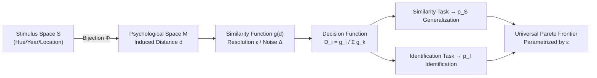

# Bound by Semanticity: Universal Laws Governing the Generalization-Identification Tradeoff

**Conference**: ICLR 2026  
**OpenReview**: [https://openreview.net/forum?id=ZF0xRAdsuY](https://openreview.net/forum?id=ZF0xRAdsuY)  
**Code**: [https://github.com/nplresearch/generalization](https://github.com/nplresearch/generalization)  
**Area**: Learning Theory / Representation Geometry / Cognitive Science  
**Keywords**: Generalization-Identification Tradeoff, Semantic Resolution, Pareto Frontier, Representation Capacity, Binding Problem, Multi-object Processing  

## TL;DR
This paper demonstrates a fundamental contradiction between "broad generalization" and "precise identification": any system with **finite semantic resolution** $\varepsilon$ in its similarity computation (ranging from small ReLU networks to VLMs to the human brain) must reside on a **universal Pareto frontier** and exhibits a $1/n$ collapse in identification capacity as the number of co-occurring objects $n$ increases.

## Background & Motivation
- **Background**: Neural networks utilize distributed representations to achieve generalization (relying on compositionality and similarity structures). Shepard's Universal Law of Generalization in cognitive science also posits that representations should be organized in a "psychological space" according to their latent structures. Interpretability work further shows that feature vectors in the latent spaces of Large Language Models (LLMs) often organize into rich geometric structures.
- **Limitations of Prior Work**: Simultaneously, both human working memory and large-scale networks exhibit striking capacity bottlenecks when **processing multiple objects**—notably the "binding problem," where systems fail to maintain correct associations between features during parallel input. Campbell et al. observed that even SOTA VLMs struggle with multi-target reasoning.
- **Key Challenge**: Frankland et al. (2021) proposed that generalization and identification capacities are inherently in tension, termed "Miller's Law". However, this has remained at the level of empirical observation and qualitative assertion, lacking a **provable closed-form characterization** or clarity on whether it is a model defect or a universal law.
- **Goal**: To elevate this tradeoff from an empirical phenomenon to an **information-theoretic universal law**, providing precise closed-form relationships between $p_S$ (generalization success rate) and $p_I$ (identification success rate), and validating it across scales from toy networks to VLMs.
- **Core Idea**: **[Resolution is Everything]** The precision of model similarity computation is abstracted into a resolution parameter $\varepsilon$—similarity beyond distance $\varepsilon$ degrades into noise $\Delta$. Since $\varepsilon$ determines both generalization and identification, both are locked onto a "universal curve" parameterized only by $\varepsilon$, independent of the specific space or distribution.

## Method

### Overall Architecture
This work is purely theory-driven with multi-scale empirical validation. It formalizes the processing chain as "Stimulus Space $S \to$ Psychological Space $M \to$ Similarity Function $g$". A simplified "constant similarity function" is used to derive closed-form expressions for $p_S, p_I$, revealing a Pareto frontier with three regimes. It then extends to cases with noise and multiple inputs $n$ to derive the $1/n$ collapse law, finally validating these across ReLU toy networks, CNNs, LLMs, and VLMs.

### Key Designs

**1. Constant Similarity Model with Finite Resolution: Collapsing precision loss into a single knob.** After the model maps stimuli into the psychological space $M$, it compares representations using a distance-dependent similarity $g(x,y)=g(d(x,y))$, with decisions following the Luce choice rule $D_i = g(x_i,p)/\sum_k g(x_k,p)$. The core abstraction in this paper characterizes any precision loss (computational noise, finite precision, ReLU truncation of negative correlations, or inaccurate long-range encoding) as a resolution $\varepsilon$: defining a constant similarity function $g_{\varepsilon;\Delta}(x,y)=\mathbb{1}_{B_\varepsilon(x)}(y)+\Delta\,\mathbb{1}_{M\setminus B_\varepsilon(x)}(y)$. This means inputs within radius $\varepsilon$ are "similar=1," while those outside collapse to noise $\Delta$. Here $\varepsilon$ acts like bandwidth in kernel methods or temperature in softmax—smaller $\varepsilon$ creates sharper boundaries (like a Dirac delta), while larger $\varepsilon$ is "diffuse," reflecting long-range structure but introducing interference.

**2. Closed-form Pareto Frontier for Two Tests: Generalization and identification are locked by the same quantity.** Let $b_p(\varepsilon)=\nu(B_\varepsilon(p))$ be the probability measure of a ball with radius $\varepsilon$ centered at $p$, and $\langle b(\varepsilon)\rangle$ its spatial average. Theorem 1 provides the closed-form solution for the noiseless case:

$$p_S(\varepsilon)=\tfrac{1}{2}+\langle b(\varepsilon)\rangle-\langle b(\varepsilon)\rangle^2-\mathrm{Var}(b(\varepsilon)),\qquad p_I(\varepsilon)=1-\tfrac{1}{2}\langle b(\varepsilon)\rangle.$$

Two key insights emerge: First, the variance term $\mathrm{Var}(b(\varepsilon))$ independently reduces $p_S$, measuring the **heterogeneity** of the stimulus space (differences in "crowdedness" across regions). Thus, models perform similarity judgments better on uniform manifolds (e.g., rotation) than on non-uniform ones (e.g., natural images). Second, when $\mathrm{Var}=0$, both $p_S$ and $p_I$ are parameterized solely by $\langle b(\varepsilon)\rangle$, leading to a **universal Pareto curve in the $(p_S,p_I)$ plane independent of $M$ and $\nu$**. This curve shows three regions: at low $\varepsilon$, identification is perfect ($p_I\approx1$) but generalization is at chance ($p_S\approx0.5$); at moderate $\varepsilon$, the tradeoff appears, with $p_S$ peaking at $\langle b(\varepsilon)\rangle=1/2$; at high $\varepsilon$, interference dominates and both drop. Theorem 2 incorporates noise $\Delta$, showing it causes a monotonic synchronous decline in both.

**3. $1/n$ Collapse Law for Multiple Inputs: Why LLMs fail to count multiple objects.** Theorem 3 generalizes the analysis to $n$-item tests. Under the homogeneity assumption $b_p(\varepsilon)=b(\varepsilon)$, it provides a polynomial closed-form solution:

$$p_I^n(\varepsilon)=\mathbb{E}_{p\sim\nu}\!\left[\frac{1-(1-b_p(\varepsilon))^n}{n\,b_p(\varepsilon)}\right].$$

For large $n$, $p_I^n(\varepsilon)\approx (b(\varepsilon)\,n)^{-1}$—**identification success rate decays as $1/n$ with the number of objects $n$**, at a rate determined by $b(\varepsilon)$. This implies that a model optimized for generalization ($b(\varepsilon)\approx1/2$) will be severely limited in its ability to process multiple representations accurately, explaining the common origin of human working memory limits and LLM multi-target reasoning failures. An interesting byproduct: when $b(\varepsilon)$ is small, $p_S$ is non-monotonic with respect to $n$—for many objects, a model should actually opt for lower resolution at the cost of higher error for few objects.

**4. ReLU Toy Networks: Resolution boundaries are learned, not hand-set.** Using the architecture $f(x)=\sigma(W^\top W x)$ from Elhage et al. (2022) with one-hot encoded stimuli, $f(x_i)_j=\sigma(w_j^\top w_i)$ represents the learned similarity $g(x_i,x_j)$. Training with pure reconstruction loss triggers superposition—features become orthogonal to minimize interference, pursuing high identification. Conversely, training on similarity tasks (e.g., on a circle/line) causes $(p_S,p_I)$ trajectories to **spontaneously climb from the bottom-left toward the Pareto boundary before falling back**. The learned $g(x,\cdot)$ narrows during training (ReLU clips negative dot products, generating finite resolution). Since learned similarities are linear-decay rather than constant, Proposition 1 derives closed-form expressions for $p_S, p_I$ for $g(x,y)=\max(0,1-d/\varepsilon)$ on a circle, which highly match empirical trajectories.

## Key Experimental Results

### Main Results

| System | Task | Key Phenomenon |
|------|------|----------|
| ReLU Toy Net (l=50, m=10) | 3-item similarity on Circle/Line | Trajectories evolve along the Pareto boundary; resolution emerges spontaneously; lines have lower $p_S$ due to endpoint heterogeneity. |
| ResNet-50 (Fine-tuned) | Phylogeny vs. Species ID | Weighted loss $L=(1-\alpha)L_{id}+\alpha L_{sim}$; increasing $\alpha$ improves generalization but drops identification, following the theoretical curve. |
| LLM (Gemma-2B / Llama-3.2-3B / Qwen2.5-7B) | "Closest birth year to $p$" | Performance drops as probe year moves away, showing emergent finite resolution (~**70–80 years**), matching noisy exponential decay. |
| VLM (Gemma-3-12B / Qwen2.5-VL-7B) | "Which shape is closest to the red X" | Accuracy drops beyond model-specific resolution scales, isomorphic to the year task. |

### Key Findings
- **Universality**: Systems ranging from 10D hidden layer networks to 12B parameter VLMs fall on the same family of Pareto frontiers, proving finite semantic resolution is an **information-theoretic constraint rather than an implementation artifact**.
- **Optimal Resolution**: The peak for generalization occurs when the similarity function covers approximately half of the representation space ($\langle b(\varepsilon)\rangle=1/2$), echoing findings by Sorscher et al.
- **Heterogeneity Cost**: The more non-uniform the stimulus space (larger $\mathrm{Var}(b(\varepsilon))$), the further empirical points lie from the Pareto frontier, quantifying "data manifold geometry" into generalization difficulty.

## Highlights & Insights
- **Elevating Empirical Assertions to Provable Laws**: Frankland’s "Miller's Law" was a qualitative observation; this paper provides closed-form Pareto frontiers and the $1/n$ collapse law independent of specific spaces or distributions.
- **Unifying Cognitive Science and Deep Learning**: Shepard’s law, working memory capacity, the binding problem, superposition, and "neural lexicon" structures in population coding are linked under a single resolution framework. This explains why both brains and LLMs fail similarly in multi-target processing.
- **Resolution as a Continuous Knob**: Tuning generalization-identification balance via loss weights $\alpha$ or thresholds $\varepsilon$ allows for an actionable diagnostic dimension for task-specific demands.

## Limitations & Future Work
- **Limited to Non-compositional Representations**: The current model does not cover hierarchical syntax, analogical reasoning, or arithmetic where simple components are systemically combined; tradeoffs under compositional schemes require extension.
- **Indirect Evidence on Large Models**: While tradeoffs are directly shown in toy nets and CNNs, for LLMs/VLMs, the paper currently verifies the "existence of finite resolution" without directly mapping the full $p_S$-$p_I$ tradeoff curve.
- **Future Directions**: Using synergy-redundancy decomposition for multi-stimulus joint encoding; distilling similarity functions directly from internal representations using mechanistic interpretability; and testing if neural manifolds obey these resolution bounds via fMRI/electrophysiology.

## Related Work & Insights
- **Cognitive Science Foundations**: Shepard’s Law, Luce Choice Rule, and Miller’s capacity limits are direct sources for this formalization. The Frankland et al. (2021) framework is rendered rigorous.
- **Interpretability / Representation Geometry**: Elhage et al.’s superposition toy model is repurposed as a verification platform; geometric discoveries in latent spaces (Engels, Modell et al.) provide collateral evidence for universal finite resolution.
- **Insight**: This framework suggests that improving LLM multi-target reasoning might not be achieved by scaling parameters alone—if identification naturally decays at $1/n$, explicit compositional/binding mechanisms (e.g., external slots, object-centric representations) may be needed to break the resolution ceiling of a single similarity space.

## Rating
- **Novelty**: ⭐⭐⭐⭐⭐ High theoretical originality in transforming empirical tradeoffs into provable laws with closed-form frontiers.
- **Experimental Thoroughness**: ⭐⭐⭐⭐ Solid cross-scale validation from toy nets to VLMs, though the full tradeoff curve for LLMs is not yet directly plotted.
- **Writing Quality**: ⭐⭐⭐⭐ Clear theoretical derivation and elegant narrative connecting to CogSci, though the density of theorems may be high for non-theoretical readers.
- **Value**: ⭐⭐⭐⭐⭐ Fundamental contribution explaining capacity bottlenecks in both brains and AI, providing an actionable resolution dimension for architectural design and representation diagnostics.

<!-- RELATED:START -->

## Related Papers

- [\[ICLR 2026\] Memory-Statistics Tradeoff in Continual Learning with Structural Regularization](memory-statistics_tradeoff_in_continual_learning_with_structural_regularization.md)
- [\[ICLR 2026\] Language Identification in the Limit with Computational Trace](language_identification_in_the_limit_with_computational_trace.md)
- [\[ICLR 2026\] Automata Learning and Identification of the Support of Language Models](automata_learning_and_identification_of_the_support_of_language_models.md)
- [\[ICLR 2026\] Scaling Laws and Spectra of Shallow Neural Networks in the Feature Learning Regime](scaling_laws_and_spectra_of_shallow_neural_networks_in_the_feature_learning_regi.md)
- [\[ICLR 2026\] Theory of Scaling Laws for In-Context Regression: Depth, Width, Context and Time](theory_of_scaling_laws_for_in-context_regression_depth_width_context_and_time.md)

<!-- RELATED:END -->
