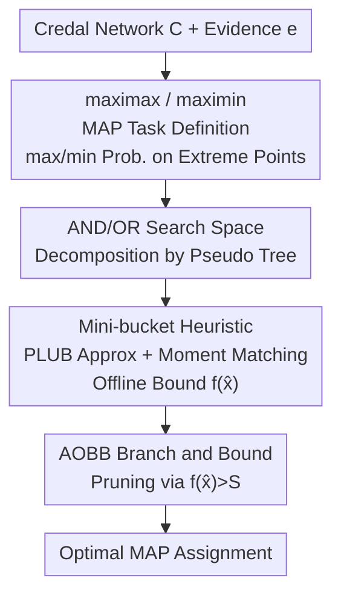

# Branch and Bound Search for Exact MAP Inference in Credal Networks

**Conference**: ICLR2026  
**OpenReview**: [https://openreview.net/forum?id=DTqbEtXXP3](https://openreview.net/forum?id=DTqbEtXXP3)  
**Code**: To be confirmed (attached in the paper appendix)  
**Area**: Probabilistic Graphical Models / Exact Inference / Heuristic Search  
**Keywords**: Credal networks, MAP inference, Branch and Bound, AND/OR search, mini-bucket heuristic

## TL;DR
This paper designs the first depth-first branch-and-bound algorithm for exact MAP inference in credal networks. By formalizing the problem into maximax and maximin MAP tasks, it utilizes problem decomposition within an AND/OR search space and employs a mini-bucket heuristic with cost-shifting for pruning. The approach solves large-scale instances with over 3,000 variables while guaranteeing optimality, outperforming OR search and local search by several orders of magnitude.

## Background & Motivation
**Background**: Bayesian networks (BNs) characterize dependencies between variables using precise conditional probability tables (CPTs). MAP inference (finding the assignment with the highest posterior probability given evidence) has been studied for decades with mature exact algorithms (variable elimination, AND/OR branch and bound, etc.). Credal networks (CNs) are generalizations of BNs: they relax the local model of each variable (given a parent configuration) from a "single distribution" to a "convex set of distributions" (credal set). This allows for the expression of severe uncertainty, unreliable data, or conflicting information, and naturally occurs in partially identifiable causal models with latent variables.

**Limitations of Prior Work**: Past research on credal networks has focused almost exclusively on **marginal inference** (calculating upper and lower probability bounds for a query variable). **MAP inference**—finding the single most probable overall assignment—has been largely neglected. A few existing works (e.g., the Marginal MAP algorithm by Marinescu et al. 2023) can be minimally adapted for credal MAP, but they either handle only very small models or provide no guarantees on solution quality (local search lacks optimality proof).

**Key Challenge**: While both credal MAP and BN MAP are NP-hard, credal MAP introduces additional complexity—the probability of an assignment is no longer a unique value. Instead, it requires a **second-layer max/min optimization over the extreme points** of the joint credal set. This nested optimization prevents existing BN inference frameworks from being directly reused, resulting in a lack of mature exact algorithms for credal MAP.

**Goal**: To scale exact credal MAP while providing optimality guarantees. This is achieved by defining clear optimization targets (upper or lower probabilities) and designing a search framework capable of exploiting graph structures with strong pruning.

**Key Insight**: The most effective exact method for BN MAP is **AND/OR branch and bound**, which decomposes problems into independent subproblems along a pseudo tree. The scale of the search tree is determined by the **depth** of the pseudo tree rather than the number of variables. This structural tool has never been applied to credal networks. The authors migrate and adapt it to be compatible with max/min calculations over credal sets.

**Core Idea**: Formalize credal MAP as **maximax** and **maximin** tasks, perform depth-first branch and bound in an **AND/OR search space**, and provide tight upper bounds for pruning using a new **partition-based (mini-bucket) + cost-shifting** heuristic.

## Method

### Overall Architecture
The method addresses finding an assignment for the remaining variables $Y=X\setminus E$ that maximizes the **upper probability** (maximax) or **lower probability** (maximin) given evidence $e$. The process follows three steps: first, organize the search space into an AND/OR tree (OR nodes select variables, AND nodes select values, edges receive weights based on credal set extreme points); then, use AND/OR Branch and Bound (AOBB) to search the tree, pruning sub-par branches using a heuristic upper bound $f(\hat{x})$; the heuristic itself is compiled offline via an improved mini-bucket method (with PLUB approximation and moment-matching cost-shifting).

The upper probability of an assignment $x=(x_1,\dots,x_n)$ is defined as the product of the maximum values across local credal set extreme points, and the lower probability as the product of the minimum values:

$$\overline{P}(x)=\prod_{i=1}^{n}\max\,\text{ext}\big(K(x_i\mid\pi_i)\big),\qquad \underline{P}(x)=\prod_{i=1}^{n}\min\,\text{ext}\big(K(x_i\mid\pi_i)\big)$$

### Key Designs

**1. maximax / maximin MAP: Converting "Set Probabilities" into Definite Optimization Targets**

In credal networks, an assignment corresponds to a probability interval rather than a single value, making the "most probable assignment" ambiguous. The authors divide this into two tasks with clear semantics. **maximax MAP** seeks the assignment with the highest upper probability, representing the "most optimistic" interpretation:

$$y^*=\arg\max_{y\in\Omega(Y)}\ \max_{P(Y,e)\in K(X)}\ \prod_{i=1}^{n}P(X_i\mid\Pi_i)$$

**maximin MAP** replaces the inner operator with $\min$, seeking the assignment with the highest lower probability, representing the "most robust" interpretation. Both rely on the extreme point product formula: since the strong extension of a joint credal set is formed by the extreme points of local credal sets, the upper/lower probability can be calculated by taking the max/min of extreme points variable-by-variable, avoiding high-dimensional joint optimization.

**2. AND/OR Search Space: Decomposing Global Search via Pseudo Trees**

A naive OR search tree enumerates all assignments, with a size that explodes exponentially with the number of variables. The authors adapt BN AND/OR searching to CNs: first, compute a **pseudo tree** $T$ of graph $G$ (a spanning tree where all non-tree edges are back-edges to ancestors), capturing conditional independence. The search tree branches on variables at OR levels and values at AND levels; crucially, AND nodes decompose the current problem into **independent subproblems**—different child branches of the same pseudo tree node can be solved separately and then merged. Each OR→AND edge weight $w(X_i,x_i)$ is derived from the product of local credal set extreme points. The size of the search tree depends on the **depth $h$** of the pseudo tree, enabling scalability to thousands of variables.

**3. AOBB Branch and Bound + Heuristic Pruning: Pruning Non-Promising Branches**

Within the AND/OR space, the authors apply the AOBB (AND/OR Branch-and-Bound) algorithm. It selects variables statically along the pseudo tree, traversing values to accumulate OR node values. The core is the heuristic evaluation function $f(\hat{x})$ which calculates an **upper bound** for the best maximax extension. If $f(\hat{x})\le S$ (where $S$ is the current best solution), the branch is pruned. For maximin, only the edge weights and heuristic calculations are swapped for their lower-probability versions. The space complexity is $O(n)$, a linear advantage over full compilation methods.

**4. Mini-bucket Heuristic + PLUB + Moment-Matching Cost-Shifting: Efficient and Tight Upper Bounds**

Pruning efficiency depends on the tightness of $f(\hat{x})$. The authors adapt mini-buckets to the credal setting. The challenge is that credal variable elimination operates on **potentials** (sets of non-negative functions), where size explodes during multiplication. Two mechanisms are introduced. First, **Pareto Least Upper Bound (PLUB)**: vectors in a potential $\phi(Y)$ are clustered (up to $M$ clusters), and each cluster is replaced by its component-wise maximum, capping cardinality at $M$ while maintaining an upper bound. Second, **Moment-Matching Cost-Shifting**: partitioning buckets can loosen the bound; auxiliary functions $\lambda_r(A)$ ($\prod_r\lambda_r=1$) are used to redistribute "costs" between mini-buckets. $M=1$ combined with a large $i$-bound is found to be most effective.

*Caveat*: For the **maximin** task, $\max$ and $\min$ operators do not commute. Consequently, variable elimination with min-pruning is no longer exact, and mini-buckets (even with cost-shifting) provide a **much looser** upper bound, making maximin mapping significantly harder.

## Key Experimental Results

Experiments used random/grid credal networks ($n \in \{100, 150, 200\}$ for random; $m \times m$ for grid) and 15 real-world BNs converted to interval probabilities (width $\le 0.3$). Implementation was in C++ with a 1-hour time limit.

### Main Results
AND/OR search (AOBB+MBMM(i, M=1)) shows orders-of-magnitude superiority over OR search (BB) and naive DFS.

| Setting | Best Algorithm | Control | Result |
|---------|----------------|---------|--------|
| Random 100 vars (Table 2) | AOBB+MBMM(i,1): $i{=}8$ in 0.15s / 3544 nodes | BB+MB(i): $i{=}2$ in 3525s / 40M nodes | ~4-5 orders of magnitude faster |
| Grid 10×10 (Table 2) | AOBB+MBMM at $i{=}4$ in 0.30s | BB mostly timed out ("-") | ~5 orders of magnitude improvement |
| Real mastermind3 (3692 vars, Table 3) | AOBB+MBMM(i,1) only one to solve | All others timed out/OOM | Only method scaling to 3000+ vars with proof |

### Ablation Study
Table 1 compares heuristics on random 100-variable networks.

| Configuration | Key Observation | Explanation |
|---------------|-----------------|-------------|
| AOBB+MB(i) | Competitive only at small $i$; times out at $i{\ge}8$ | No approx; potential size explodes at large $i$ |
| AOBB+MB(i,M) | Overhead increases with $M$ ($M{=}50, i{=}10$ takes 3284s) | PLUB approximation alone |
| AOBB+MBMM(i,1) | $i{=}8$ in 0.15s / 3544 nodes; best overall | Approx + Cost-shifting; $M{=}1$ is most efficient |

### Key Findings
- **$M=1$ is optimal**: Larger $M$ increases compilation overhead; $M=1$ with a larger $i$-bound provides tight enough, computationally feasible bounds.
- **Structure is Essential**: Structure-aware AOBB is orders of magnitude faster than OR-based BB, validating the value of the AND/OR space.
- **Exact vs. Local Search (Table 5)**: On 100-variable networks, exact AOBB+MBMM(i,1) took 0.10s, while local searches (SLS/TS/SA/GLS) took 189s–372s without proving optimality.
- **maximin is notably harder**: Non-commutativity of max/min makes heuristics looser, leading to larger search spaces and decreased performance.

## Highlights & Insights
- **Migration of Dual BN Strengths**: Successfully brought AND/OR search (decomposition) and mini-buckets (tight heuristics) to credal networks, solving the cardinality explosion of potential sets via PLUB.
- **Clean Formalization**: Defining "MAP over intervals" as two distinct tasks (maximax/maximin) allows for variable-wise extreme point optimization, avoiding the joint credal set.
- **Honest Limitations**: The authors clearly identify the maximin heuristic weakness, providing a credible analysis of when the algorithm struggles.
- **Generalizable Cost-Shifting**: The use of geometry-mean-based cost-shifting to tighten mini-bucket bounds is a technique applicable to various graphical model inference tasks.

## Limitations & Future Work
- **Maximin Heuristic Looseness**: The non-commutativity of operators leads to loose bounds; designing tighter maximin approximations is the primary future direction.
- **Lack of Anytime Support**: The current focus is on proving optimality. Expanding to an anytime algorithm (per Otten & Dechter 2011) is suggested but not yet implemented.
- **Domain Size Constraints**: Experiments strictly used binary variables ($d=2$). Scalability to multi-valued variables with larger $d^h$ or $d^i$ factors remains untested.
- **Absence of Neural Solver Comparisons**: While neural MPE solvers exist, they provide no guarantees. Positive comparison against "accuracy for speed" trade-offs is missing.

## Related Work & Insights
- **vs. Bayesian MAP AOBB (Marinescu & Dechter 2009)**: This work extends the AOBB framework but replaces single-distribution CPTs with extreme-point optimization and adapts potential approximations.
- **vs. Credal Marginal MAP (Marinescu et al. 2023)**: Prior local search or variable elimination methods were either limited in scale or lacked quality guarantees; this work provides the first exact, large-scale solution.
- **vs. Local Search (SLS/TS/SA/GLS)**: Exact methods outperformed local search in both speed and reliability on the tested instances.

## Rating
- Novelty: ⭐⭐⭐⭐ First AND/OR branch-and-bound framework for exact credal MAP with effective adaptation.
- Experimental Thoroughness: ⭐⭐⭐⭐ Broad coverage of random, grid, and 15 real-world networks across multiple metrics.
- Writing Quality: ⭐⭐⭐⭐ Clear chain from definitions to complexity and results; transparent about maximin shortcomings.
- Value: ⭐⭐⭐⭐ Fills a gap in exact credal MAP algorithms with practical significance for uncertain inference and causal modeling.

<!-- RELATED:START -->

## Related Papers

- [\[ICLR 2026\] Efficient Credal Prediction through Decalibration](efficient_credal_prediction_through_decalibration.md)
- [\[ICLR 2026\] Achieving Approximate Symmetry Is Exponentially Easier than Exact Symmetry](achieving_approximate_symmetry_is_exponentially_easier_than_exact_symmetry.md)
- [\[ICLR 2026\] Bound by Semanticity: Universal Laws Governing the Generalization-Identification Tradeoff](bound_by_semanticity_universal_laws_governing_the_generalization-identification_.md)
- [\[ICLR 2026\] Variational Inference for Cyclic Learning](variational_inference_for_cyclic_learning.md)
- [\[ICLR 2026\] Multiple-Prediction-Powered Inference](multiple-prediction-powered_inference.md)

<!-- RELATED:END -->
## Related Papers

- [\[ICLR 2026\] Efficient Credal Prediction through Decalibration](efficient_credal_prediction_through_decalibration.md)
- [\[ICLR 2026\] Achieving Approximate Symmetry Is Exponentially Easier than Exact Symmetry](achieving_approximate_symmetry_is_exponentially_easier_than_exact_symmetry.md)
- [\[ICLR 2026\] Bound by Semanticity: Universal Laws Governing the Generalization-Identification Tradeoff](bound_by_semanticity_universal_laws_governing_the_generalization-identification_.md)
- [\[ICLR 2026\] Variational Inference for Cyclic Learning](variational_inference_for_cyclic_learning.md)
- [\[ICLR 2026\] Multiple-Prediction-Powered Inference](multiple-prediction-powered_inference.md)

<!-- RELATED:END -->
