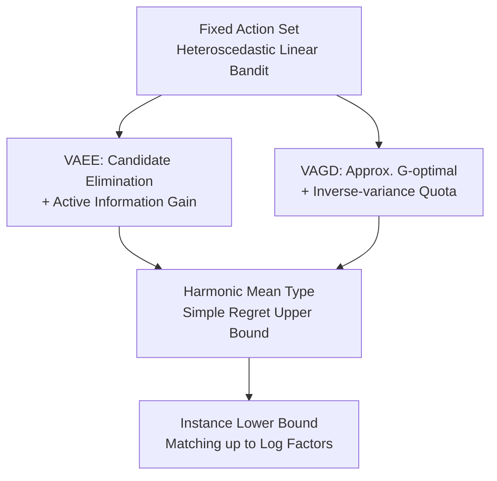

# Breaking the Total Variance Barrier: Sharp Sample Complexity for Linear Heteroscedastic Bandits with Fixed Action Set

**Conference**: ICLR2026  
**OpenReview**: [https://openreview.net/forum?id=IkPJocP3ju](https://openreview.net/forum?id=IkPJocP3ju)  
**Code**: None  
**Area**: Learning Theory / Bandit Theory  
**Keywords**: Heteroscedastic linear bandits, fixed action set, simple regret, harmonic mean variance, G-optimal design  

## TL;DR
This paper investigates heteroscedastic stochastic linear bandits with a fixed action set, demonstrating that the traditional total variance $\Lambda=\sum_{t=1}^T \sigma_t^2$ fails to characterize information gain from low-noise rounds. It introduces two variance-adaptive exploration algorithms, VAEE and VAGD, providing sharp simple regret upper and lower bounds that depend on the harmonic mean variance.

## Background & Motivation
**Background**: Stochastic multi-armed bandits and linear bandits typically measure exploration efficiency through regret or best-arm identification. In linear bandits, each action $a\in\mathcal A$ is associated with a feature vector, and rewards follow $r_t=\langle \theta^*,a_t\rangle+\eta_t$. The algorithm aims to recommend a near-optimal action after a finite number of exploration rounds. Existing methods like OFUL and Weighted OFUL maintain confidence ellipsoids and choose exploration directions based on action uncertainty.

**Limitations of Prior Work**: In heteroscedastic noise settings, the noise variance $\sigma_t^2$ can vary significantly across rounds. Many previous variance-aware linear bandit results describe statistical difficulty using total variance $\Lambda=\sum_t \sigma_t^2$, leading to bounds like $\widetilde O(d\sqrt{\Lambda}/T)$ or equivalent simple regret forms. This metric has a significant blind spot: if early rounds have extremely low noise, the algorithm can recover certain parameter directions almost exactly; however, the total variance remains high due to subsequent high-noise rounds, failing to reflect the value of these "high-quality samples."

**Key Challenge**: The complexity of fixed action sets differs from time-varying action sets. If the action set is changed by an adversary each round, low-noise rounds might not align with useful directions, making total variance an unavoidable complexity. However, with a fixed action set, the algorithm can actively select the most informative actions during low-noise windows to translate small variances into parameter estimation precision. The critical factor is not the sum of variances, but whether the inverse-variance weighted information covers all $d$ parameter directions.

**Goal**: The paper focuses on heteroscedastic stochastic linear bandits with a fixed action set, using simple regret as the primary metric: $\mathbb E[\max_{a\in\mathcal A}\langle \theta^*,a\rangle-\langle \theta^*, \widehat a_T\rangle]$ after $T$ exploration rounds. The authors aim to determine if large or infinite action sets can break the total variance barrier, if finite sets can further utilize discrete structures to reduce dimension factors, and if this harmonic mean dependence is information-theoretically unavoidable.

**Key Insight**: Starting from the reusability of fixed action sets, the authors treat the variance $\sigma_t^2$ of each observation as an information weight. Low-variance observations correspond to larger inverse-variance weights $1/\sigma_t^2$ and should be prioritized to fill the weakest directions in the current confidence ellipsoid. High-variance observations, even if numerous, should not dominate the complexity as they do in total variance bounds.

**Core Idea**: Use "cumulative inverse-variance information" instead of "total variance budget" to characterize the simple regret of fixed-action heteroscedastic linear bandits, and design exploration strategies that actively maximize information gain within non-eliminated candidate actions.

## Method

### Overall Architecture
The paper establishes a set of algorithms and bounds for fixed-action heteroscedastic linear bandits. It first formalizes fixed-action best-arm identification and introduces VAEE for large action sets. For finite action sets, it utilizes VAGD based on approximate G-optimal design. Finally, it constructs instance-dependent lower bounds to show that harmonic mean variance dependence is a fundamental statistical difficulty rather than an analytical artifact.

For large action sets, VAEE maintains a weighted least squares estimate $\widehat\theta_t$, an inverse-variance weighted covariance matrix $V_t$, and a candidate set $\mathcal A_t$. Instead of selecting actions based on reward optimism, it chooses the action with the largest ellipsoidal norm among non-eliminated candidates. After observing rewards and variances, it updates $V_t$ and the estimator using $\sigma_t^{-2}$, then removes actions that cannot be optimal based on the confidence set. For finite sets, VAGD identifies an approximate G-optimal design with small support and adaptively allocates pulls based on the inverse-variance information already obtained for each core action.

### Key Designs
**1. Rewriting the Total Variance Barrier: Shifting from $\sum_t\sigma_t^2$ to $\sum_t 1/\sigma_t^2$**

Traditional analysis places the cumulative variance of heteroscedastic noise $\Lambda=\sum_{t=1}^T\sigma_t^2$ into the regret bound. This paper points out that this treats low-noise rounds merely as samples that "contribute less noise," failing to recognize the massive information gain they provide for parameter estimation. In linear regression, if the noise variance is $\sigma_t^2$, the natural weight is $1/\sigma_t^2$. Low-noise samples should significantly shrink the confidence ellipsoid, while high-noise samples should be downweighted.

The core complexity thus becomes:

$$
\left(\sum_{t=1}^T \frac{1}{\sigma_t^2}-\sum_{i=1}^{\widetilde O(d)}\frac{1}{\sigma_{(i)}^2}\right)^{-1/2},
$$

where $\sigma_{(i)}^2$ represents variances sorted in ascending order. Intuitively, $\sum_t 1/\sigma_t^2$ is the effective sample size in terms of total Fisher information. Subtracting the first $\widetilde O(d)$ smallest variance terms reflects the necessity of using several high-quality observations to cover the $d$-dimensional space, preventing the erroneous conclusion that a single zero-noise round could reduce simple regret to zero.

**2. VAEE: Pulling Actions for Maximum Information Gain in Candidate Sets**

VAEE targets large or infinite action sets. It maintains candidates $\mathcal A_t$, weighted covariance $V_t=\lambda I+\sum_{s\le t}\sigma_s^{-2}a_sa_s^\top$, and the estimate $\widehat\theta_t=V_t^{-1}\sum_{s\le t}\sigma_s^{-2}a_sr_s$. In each round, it selects the action $a \in \mathcal A_t$ that maximizes $\|a\|_{V_{t-1}^{-1}}$. This criterion aims to collect information along the widest direction of the confidence ellipsoid.

This approach explains why Weighted OFUL might fail in certain low-noise windows. Weighted OFUL favors actions with high UCB, potentially oversampling an action that seems rewarding but contributes little to weak parameter coordinates. VAEE identifies which parameter direction restricts the best-arm judgment and allocates samples to that direction during low-noise periods. The elimination step ensures it doesn't explore suboptimal actions indefinitely.

**3. VAGD: Core Sets for Variance-Adaptive Exploration in Finite Action Sets**

When $\mathcal A$ is finite, instead of searching the whole space every round, VAGD finds an approximate G-optimal design. For a distribution $\pi$, let $V(\pi)=\sum_{a\in\mathcal A}\pi(a)aa^\top$ and $g(\pi)=\max_a\|a\|_{V(\pi)^{-1}}^2$. G-optimal design minimizes the uncertainty in the worst direction. VAGD uses a design with a core set of size $O(d \log \log d)$.

Crucially, VAGD does not just sample according to $\pi$. It monitors the accumulated inverse-variance information $\sum_{s\in T(a)}1/\sigma_s^2$ for each core action. If an action has received enough information due to low-noise rounds, the algorithm will not oversample it. This balances exploration based on effective information rather than just the number of pulls.

**4. Matching Lower Bound: Harmonic Mean Dependence is Fundamental**

The paper provides an instance-dependent lower bound: for any algorithm, there exists a $d$-dimensional linear bandit instance with Gaussian noise such that simple regret is at least:

$$
\Omega\left(d\left(\sum_{t=1}^T\frac{1}{\sigma_t^2}\right)^{-1/2}\right).
$$

This suggests that the difficulty is directly linked to the total inverse-variance information of the given variance sequence. The proof reduces best-arm identification to multi-dimensional sign detection or Hamming-risk problems. If the total inverse-variance information is insufficient, no algorithm can reliably distinguish between neighboring instances.

### Loss & Training
The estimation uses inverse-variance weighted least squares:

$$
V_t=\lambda I+\sum_{s=1}^t\sigma_s^{-2}a_sa_s^\top,
\qquad
\widehat\theta_t=V_t^{-1}\sum_{s=1}^t\sigma_s^{-2}a_sr_s.
$$

VAEE's confidence set is $\mathcal C_t=\{\theta:\|\theta-\widehat\theta_t\|_{V_t}\le \beta_t\}$. For heavy-tailed noise, the framework can be extended by replacing standard least squares with robust estimators to maintain concentration inequalities.

## Key Experimental Results

### Main Results
The primary results are theoretical complexity Comparisons.

| Setting | Algorithm / Result | Simple Regret Upper Bound | Action Set | Key Insight |
|------|-------------|-------------------|--------|----------|
| Existing Variance-aware OFUL | Weighted OFUL / VOFUL | Depends on total variance $\Lambda = \sum \sigma_t^2$; $\widetilde O(d\sqrt{\Lambda}/T)$ | Often time-varying | Complexity dominated by high-noise rounds |
| Large/Infinite Fixed Set | VAEE | $\widetilde O\left(d\left[\sum_t1/\sigma_t^2-\sum_{i=1}^{\widetilde O(d)}1/\sigma_{(i)}^2\right]^{-1/2}\right)$ | Fixed / Infinite | Breaks total variance barrier via active info gain |
| Finite Fixed Set | VAGD | $\widetilde O\left(\sqrt{d\log|\mathcal A|}\left[\sum_t 1/\sigma_t^2- \dots \right]^{-1/2}\right)$ | Fixed / Finite | Optimal design reduces dimension/action dependence |
| Information Lower Bound | Theorem 6.1 | $\Omega\left(d(\sum_t1/\sigma_t^2)^{-1/2}\right)$ | Fixed Action Set | Matches VAEE variance dependence up to log factors |

### Ablation Study
The paper analyzes performance across different noise sequences.

| Noise Sequence | VAEE Simple Regret | Weighted OFUL Regret | Description |
|----------------|-------------------|----------------------|-------------|
| Fast-decaying noise, $\sigma_t^2=1/t^2$ | $\widetilde O(d/T^{3/2})$ | $\widetilde O(d/T)$ | Late low-noise provides high info; VAEE continues to improve |
| Flat noise, $\sigma_t^2\equiv 1/d$ | $\widetilde O(\sqrt{d/T})$ | $\widetilde O(\sqrt{d/T})$ | Degenerates to classic case; no performance penalty |
| Many moderate spikes | $\widetilde O(d/T^{2/3})$ | $\widetilde O(d/\sqrt T)$ | Inverse-variance clearly outperforms total variance metrics |
| Front-loaded super-precision | $\widetilde O(d/T^{6/5})$ | $\widetilde O(d/\sqrt T)$ | Early precision quickly identifies directions; total variance masks this |

### Key Findings
- VAEE's improvement stems from its action selection mechanism: it actively allocates low-noise rounds to the widest direction of the confidence ellipsoid.
- When all variances are similar, the harmonic mean dependence offers no advantage but matches existing bounds.
- In fixed action sets, low-noise windows can be reused, marking a critical boundary from adversarial time-varying action sets.
- VAGD demonstrates that the discrete structure of finite action sets is worth exploiting to improve the dimension factor.

## Highlights & Insights
- The main highlight is shifting the complexity of heteroscedastic bandits from total variance to inverse-variance information. This perspective is natural but only holds strictly under fixed action sets.
- VAEE's design is elegant: candidate elimination ensures safety, ellipsoidal norm selection handles weak directions, and weighted estimation amplifies the value of low-noise samples.
- VAGD integrates classical optimal experimental design into heteroscedastic bandits, considering not just "which actions cover the space" but "how much effective inverse-variance information each action has obtained."
- The lower bound confirms that the harmonic mean dependence is a sharp characterization of sample complexity, not a heuristic.

## Limitations & Future Work
- The assumption of a fixed action set is core; if the action set is chosen by an adversary, total variance dependence may be unavoidable.
- Algorithms assume that $\sigma_t$ is observable and bounded by $[\sigma_{\min}, \sigma_{\max}]$. Real-world systems often require variance estimation, which may introduce coupling errors.
- VAGD relies on solving for an approximate G-optimal design; for massive or complex action spaces, this may become a computational bottleneck.
- The results focus on simple regret. While Table 2 compares metrics, improvements in simple regret do not automatically translate to cumulative regret.
- Extending sharp inverse-variance characterizations to generalized linear bandits, kernel bandits, or MDPs with function approximation remains an open challenge.

## Related Work & Insights
- **vs. Weighted OFUL/VOFUL**: While these use variance-weighted estimators, their complexity is expressed via total variance. Ours shows that for fixed sets, total variance is not a sharp metric.
- **vs. He & Gu 2025 / Jia et al. 2024 Lower Bounds**: Previous work proved total variance dependence was unavoidable for time-varying sets. Ours emphasizes that fixed sets allow re-using low-noise rounds, leading to finer-grained bounds.
- **vs. Classical G-optimal Design**: While classic design tells you where to sample to cover space, VAGD incorporates noise quality into the quota, essentially asking how much and at what quality one must sample each core action.

## Rating
- Novelty: ⭐⭐⭐⭐⭐ Clear re-characterization using inverse-variance information for fixed-action settings.
- Experimental Thoroughness: ⭐⭐⭐⭐ Complete chain of evidence via bounds, case studies, and noise sequence comparisons.
- Writing Quality: ⭐⭐⭐⭐ Well-structured with a clear logical progression from large sets to finite sets and lower bounds.
- Value: ⭐⭐⭐⭐⭐ Provides a sharp answer to sample complexity in heteroscedastic bandits and offers a transferable perspective for variance-aware RL.

<!-- RELATED:START -->

<!-- RELATED:END -->

## Related Papers

- [\[ICLR 2026\] Variance-Dependent Regret Lower Bounds for Contextual Bandits](variance-dependent_regret_lower_bounds_for_contextual_bandits.md)
- [\[ICLR 2026\] Towards a Sharp Analysis of Offline Policy Learning for f-Divergence-Regularized Contextual Bandits](towards_a_sharp_analysis_of_offline_policy_learning_for_f-divergence-regularized.md)
- [\[ICLR 2026\] Sample Complexity and Representation Ability of Test-time Scaling Paradigms](sample_complexity_and_representation_ability_of_test-time_scaling_paradigms.md)
- [\[ICLR 2026\] How hard is learning to cut? Trade-offs and sample complexity](how_hard_is_learning_to_cut_trade-offs_and_sample_complexity.md)
- [\[ICLR 2026\] Mitigating the Curse of Detail: Scaling Arguments for Feature Learning and Sample Complexity](mitigating_the_curse_of_detail_scaling_arguments_for_feature_learning_and_sample.md)

<!-- RELATED:END -->
