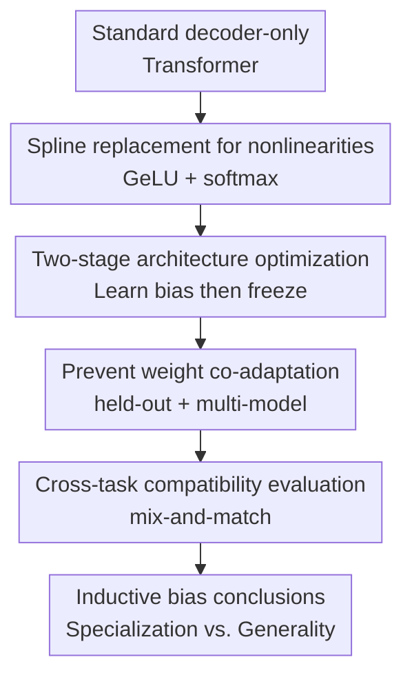

# Can Transformers Really Do It All? On the Compatibility of Inductive Biases Across Tasks

**Conference**: ICLR 2026  
**OpenReview**: [https://openreview.net/forum?id=B08MW8oDqN](https://openreview.net/forum?id=B08MW8oDqN)  
**Code**: https://github.com/idiap/lm-afs  
**Area**: Learning Theory / Transformer Inductive Bias  
**Keywords**: Transformer Inductive Bias, Architecture Search, Learnable Activation Functions, Algorithmic Reasoning, Cross-task Transfer

## TL;DR

This paper replaces the most critical nonlinear modules in Transformers with learnable spline functions and uses a two-stage training process to find suitable architectural biases for specific datasets. The authors discover that algorithmic tasks require highly specialized biases, whereas the bias compatibility between language and code modeling is significantly higher.

## Background & Motivation

**Background**: Over the past few years, the Transformer has become the unified backbone for multimodal, language, code, vision, and speech modeling. Differences between systems mainly manifest in scale, data, tokenizers, or minor engineering details, while the core architecture remains a combination of Attention, MLP, GeLU, and softmax. This convergence suggests an intuition that Transformers possess a sufficiently general inductive bias to cover a wide range of real-world tasks.

**Limitations of Prior Work**: This intuition fails to explain why Transformers perform poorly on basic algorithmic tasks. Tasks like decimal addition, copying, parentheses matching, and needle-in-a-haystack recall are simple for humans, but standard Transformers often exhibit slow learning, high seed variance, and poor length extrapolation. Conversely, new positional encodings or attention mechanisms designed for these toy tasks are rarely transferred to real language models, suggesting a compatibility gap between "effective for a specific task" and "serving as a general architectural component."

**Key Challenge**: The paper investigates not whether Transformers can gain these capabilities through scaling, but a more fundamental question: Is the architectural bias of a standard Transformer close to the local optimum for a given task? If a task exists where slight modifications significantly improve performance, the standard Transformer is not the most suitable; if such modifications do not transfer to other tasks, the required biases are incompatible.

**Goal**: The authors decompose the problem into two experimental questions. First, given a dataset, can a local architectural variant be found that fits it better than a standard Transformer? Second, if an architecture found for task $D$ is fixed and used to train task $D'$, can the performance change measure the compatibility of the required inductive biases?

**Key Insight**: Instead of discrete neural architecture search or replacing the entire Transformer, this work focuses on the nonlinearities that determine the shape of the function family: GeLU in the MLP and the softmax kernel in attention. Significant differences brought by replacing only these nonlinearities would suggest standard architectural biases are neither unique nor optimal.

**Core Idea**: Use learnable 1D linear splines to replace GeLU and the softmax kernel. Optimize these nonlinearities as "architectural hyperparameters" on held-out data, then freeze them and retrain new models from scratch to measure bias compatibility via cross-task retraining.

## Method

### Overall Architecture

The method acts as an experimental framework using learnable nonlinearities to probe architectural bias. In Stage I, nonlinear functions within the Transformer are optimized for a source dataset $D$. In Stage II, these functions are frozen as fixed architectural hyperparameters, and model weights are retrained from scratch to evaluate learning speed, generalization, and stability on the same or a different task $D'$.

### Key Designs

**1. Spline Replacement: Compressing Architectural Bias into Optimized Functions**

The key difference between standard Transformers and linear models lies in nonlinear operations: MLPs use GeLU for element-wise activation, and attention uses softmax to transform $QK^\top$ into normalized weights. The roles of GeLU and the softmax kernel are rewritten as learnable 1D functions. MLP layers, originally $x \leftarrow W'\phi(Wx+b)+b'$ where $\phi$ is GeLU, are replaced with linear splines $\phi_{\theta_{MLP}}$. These splines are parameterized by function values at keypoints, allowing them to represent identity, step, periodic, or sharp functions.

The attention mechanism is handled more precisely. Standard softmax attention is a special case of kernel attention:

$$
x_i \leftarrow \frac{\sum_j K(Q_i,K_j)V_j}{\sum_j K(Q_i,K_j)}, \quad K_{smax}(Q,K)=\exp(Q^\top K/\sqrt{d}).
$$

A learnable mapping $\phi'_{\theta_A}:\mathbb{R}\rightarrow\mathbb{R}$ is introduced to define the kernel as $K(Q,K)=\phi'_{\theta_A}(Q)^\top\phi'_{\theta_A}(K)$. This allows changing the inductive bias of attention similarity without rewriting the entire Transformer.

**2. Two-Stage Optimization: Learning Task Bias and Testing Reusability**

To ensure learned nonlinearities represent reusable architectural biases rather than co-adaptation with specific weights, a two-stage process is used. Stage I involves joint training of model weights and spline parameters $(\theta_A, \theta_{MLP})$ on source dataset $D$. Stage II freezes these splines and retrains the model weights from a random initialization. If Stage II models still outperform the baseline, it confirms the learned parameters represent architectural inductive biases.

**3. Preventing Co-adaptation: Held-out Loss and Multi-model Sharing**

To reduce the risk of splines adapting to specific seeds, data is split into $D_{wts}$ and $D_{arch}$. Model weights are updated via $D_{wts}$, while spline parameters are optimized using only the held-out $D_{arch}$. Additionally, $M$ models with different random seeds are trained simultaneously in Stage I, sharing a single set of nonlinearity parameters. This forces the splines to adapt to multiple weight sets simultaneously.

**4. Cross-task Compatibility: Distinguishing Strong Bias from General Bias**

The learned architectures are swapped across tasks. For each task $D$, nonlinearities are optimized. Then, for every target task $D'$, a model is trained from scratch using the architecture optimized for $D$. This generates a task-to-task matrix where rows represent the architecture source and columns represent the target task.

### Loss & Training

Stage I uses a dual-loss optimization. For each step, minibatches are sampled from $D_{wts}$ to update weights $\theta_m$ for $M$ parallel models via $L^m_{wts}$. A shared minibatch from $D_{arch}$ is used to calculate the sum of architecture losses $L_{arch}$ to update spline parameters $(\theta_A, \theta_{MLP})$. Algorithmic tasks typically use $M=8$. Stage II follows standard training procedures with frozen $\theta_A^\star, \theta_{MLP}^\star$ and randomized initial weights.

## Key Experimental Results

### Main Results

Architetural optimization yields significant gains in algorithmic tasks, particularly in convergence speed and stability. Gains in language and code modeling are more modest, suggesting standard Transformers are closer to the local optimum for these domains.

| Task / Dataset | Metric | Ours | Standard Transformer | Gain |
|---|---|---|---|---|
| ADD / MANO Algorithmic | Test accuracy vs steps | $2$ to $3\times$ faster convergence | Slow convergence, high variance | Significant speed and stability |
| COPY Length Extrapolation | Sequence-wise accuracy for length $>10$ | Alibi + Ours > Alibi | Fails on unseen lengths | Nonlinearities affect extrapolation |
| TINYSTORIES | Token accuracy | $64.4\%$ (2-layer) | $63.7\%$ (GeLU baseline) | Small but stable gain |
| FINEWEB Large | Validation loss | $3.68$ (12-layer) | $3.72$ (GeLU / ReLU) | Consistent small gain |

### Ablation Study

| Configuration | Metric | Description |
|---|---|---|
| Softmax + GeLU | TINYSTORIES Acc $63.7\%$ | Standard baseline |
| Softmax + Spline MLP | TINYSTORIES Acc $64.4\%$ | Most gains from MLP nonlinearities |
| Spline Attention + GeLU | Stable or worse | Softmax is difficult to outperform for language |
| Multi-model $M=1$ vs $M=6$ | Acc $63.8\%$ vs $64.3\%$ | Shared splines improve bias stability |
| Spline vs Polynomial | Val Loss $3.68$ vs $3.69$ | Polynomials approximate splines efficiently |

### Key Findings

- Algorithmic tasks show the largest gains, where standard Transformers have poorly suited biases.
- Algorithmic tasks exhibit a strong diagonal pattern in compatibility matrices, meaning biases are highly specialized.
- Natural language and code modeling biases are more compatible; standard Transformers are better suited for these domains.
- Enhancements in code modeling exceed those in natural language, likely due to the structural/compositional nature of code.
- Most language task gains come from MLP nonlinearities; softmax attention is hard to replace locally.

## Highlights & Insights

- The compatibility of inductive biases is converted into an experimental matrix, moving beyond philosophical discussion.
- The use of localized nonlinearity replacement serves as a precise probe for architectural bias without the overhead of full NAS.
- The two-loss, shared-parameter optimization method effectively extracts reusable architectural hyperparameters from weights.
- The paper clarifies that "universal" Transformers may fit language data well but might not possess the optimal biases for algorithmic reasoning or length generalization.

## Limitations & Future Work

- The search space is restricted to 1D nonlinearities, excluding complex structures like routing mechanisms or layer-to-layer interactions.
- Experiments are conducted at scales smaller than state-of-the-art LLMs; persistence of architectural gains at extreme scale remains to be verified.
- Learnable splines increase implementation complexity; while polynomial approximations help, sharp splines in algorithmic tasks may lack efficient universal implementations.
- Future work could pursue multi-task architecture optimization to find nonlinearities that support language, code, and algorithmic reasoning simultaneously.

## Related Work & Insights

- **Vs. Trainable Activations**: Unlike traditional methods that update activations during training for fitting, this work emphasizes frozen re-use to study architectural bias.
- **Vs. Neural Architecture Search (NAS)**: While NAS searches for discrete modules, this work uses gradient-based optimization in a continuous 1D function space.
- **Vs. Length Extrapolation**: While many works focus on positional encoding, this study shows that MLP/attention nonlinearities also fundamentally limit extrapolation.

## Rating

- Novelty: ⭐⭐⭐⭐☆ Experimental perspective on cross-task bias compatibility is highly innovative.
- Experimental Thoroughness: ⭐⭐⭐⭐☆ Covers algorithmic, language, and code tasks, though scale is smaller than production LLMs.
- Writing Quality: ⭐⭐⭐⭐☆ Clear motivation and high info-density in charts.
- Value: ⭐⭐⭐⭐⭐ Provides an operational framework for diagnosing architectural suitability across diverse tasks.

<!-- RELATED:START -->

## Related Papers

- [\[ICLR 2026\] Transformers Trained via Gradient Descent Can Provably Learn a Class of Teacher Models](transformers_trained_via_gradient_descent_can_provably_learn_a_class_of_teacher_.md)
- [\[ICLR 2026\] Transformers Are Inherently Succinct](transformers_are_inherently_succinct.md)
- [\[ICLR 2026\] Quantitative Bounds for Length Generalization in Transformers](quantitative_bounds_for_length_generalization_in_transformers.md)
- [\[ICLR 2026\] Probability Distributions Computed by Autoregressive Transformers](probability_distributions_computed_by_autoregressive_transformers.md)
- [\[ICLR 2026\] Efficient Turing Machine Simulation with Transformers](efficient_turing_machine_simulation_with_transformers.md)

<!-- RELATED:END -->
