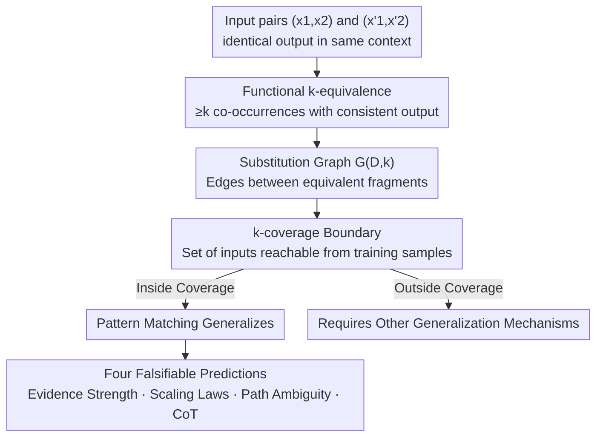

# Characterizing Pattern Matching and Its Limits on Compositional Task Structures

**Conference**: ICLR 2026  
**OpenReview**: [https://openreview.net/forum?id=VCjlm003WL](https://openreview.net/forum?id=VCjlm003WL)  
**Code**: https://github.com/kaistAI/coverage-principle  
**Area**: Learning Theory / Compositional Generalization  
**Keywords**: Pattern Matching, Functional Equivalence, Coverage Boundary, Sample Complexity, Path Ambiguity

## TL;DR
This paper strictly formalizes "pattern matching" in LLMs as **functional equivalence**—where a model safely substitutes between two input fragments only if they are repeatedly observed to produce identical outputs in the same context. Based on this, it defines a decidable and falsifiable **coverage boundary**. It proves data scaling laws for compositional tasks and reveals a structural failure mode called "path ambiguity," drawing a precise line between what pattern matching can and cannot achieve.

## Background & Motivation
**Background**: Numerous studies on compositional generalization indicate that LLMs frequently fail on tasks requiring "composition," such as multi-hop reasoning, mathematical logic, and semantic parsing. The mainstream explanation is that they rely on "pattern matching" (learning local statistical regularities between input fragments and outputs) rather than true systematic generalization.

**Limitations of Prior Work**: The term "pattern matching" has remained largely intuitive. Existing behavioral studies often use task settings where multiple sources of generalization (e.g., algebraic invariance and structural repetition) are mixed. These studies lack a precise definition of "pattern matching" and can only diagnose failures post-hoc, failing to **predict in advance** which inputs can be solved by pattern matching and which cannot.

**Key Challenge**: The fundamental issue is the lack of a **data-centric and model-agnostic** definition. If "pattern matching" cannot be formalized as a property of the dataset itself, it cannot be cleanly isolated from other generalization mechanisms, making it impossible to characterize its boundaries.

**Goal**: (1) Provide a computationally decidable and falsifiable definition of "pattern matching"; (2) Quantitatively characterize the success conditions and limits of pattern matching on controlled tasks where other generalization sources are intentionally removed.

**Key Insight**: The authors’ core intuition is that a learner is only "authorized" to exploit the equivalence between two input fragments for substitution-based generalization when those fragments are observed to behave identically. By treating the frequency of "observed consistency" as evidence strength, the capability of pattern matching can be quantified.

**Core Idea**: Define pattern matching as "performing safe substitutions within the coverage supported by functional equivalence." Generalization beyond this coverage necessarily requires other mechanisms—resulting in a pre-computable boundary $\mathrm{Cover}_k(D)$.

## Method

### Overall Architecture
This paper does not propose a new model but rather a **diagnostic framework + controlled experiments**. The logical chain is: formalize "pattern matching" as functional equivalence $\to$ construct a substitution graph based on functional equivalence $\to$ use the connected components of the substitution graph to define the coverage boundary $\to$ train GPT-2 and Mamba on four synthetic compositional tasks (2-HOP, PARALLEL 2-HOP, 3-HOP, NON-TREE) to **predict** generalization success/failure using the coverage boundary and verify theoretical scaling laws. Tasks are constructed using randomly generated mappings to remove "non-compositional" generalization sources like commutativity, making functional equivalence the only available mechanism.

### Key Designs

**1. Functional Equivalence and Coverage Boundary: Decidable Dataset Properties**

To address the inability to predict pattern matching success, the authors provide two core definitions. Let the ground-truth mapping be $f: X^\ell \to X$, and fix a non-empty proper subset index $I \subset [\ell]$. Two subsequences $a, a'$ are termed **functional $k$-equivalent** in dataset $D$ (denoted $a \equiv^{(D,k)}_I a'$) if and only if: (1) **Sufficient Co-occurrence**—there exist at least $k$ pairs of inputs $\{x, x'\}$ that differ only at index $I$ (i.e., $x_I=a, x'_I=a', x_{[\ell]\setminus I}=x'_{[\ell]\setminus I}$); and (2) **Consistency**—every such pair satisfies $f(x)=f(x')$. Intuitively, "these two fragments have been seen behaving identically in the same contexts at least $k$ times." The hyperparameter $k$ represents the **evidence strength**: $k=1$ is the weakest evidence, while larger $k$ indicates stricter requirements.

Using this equivalence, a **substitution graph** $G(D,k)=(V,E)$ is constructed where vertices are all possible inputs $X^\ell$, and an edge exists between two points if they differ only by a functionally $k$-equivalent fragment. The **$k$-coverage** $\mathrm{Cover}_k(D)$ is defined as all inputs reachable from any observed input $x \in D$ in the substitution graph. **Pattern matching is formally defined as "generalization achieved via substitution of functionally equivalent fragments within the $k$-coverage."** This allows coverage to be a **purely data-driven property**, independent of model architecture or learning algorithms, and precisely computable for any fixed-length discrete sequence task (Alg. 1). It is stricter than standard "in-domain (ID)" definitions—a sample may be ID but fall outside the coverage, explaining exactly why it fails to generalize.

**2. Evidence Strength (k-cutoff) Predicting Instance Success and Representation Clustering**

The authors define a **$k$-cutoff** for each test input: the minimum $k$ for which it falls into the $k$-coverage (set to 0 if outside). Experiments show that $k$-cutoff is **strongly positively correlated** with instance-level accuracy: samples with high $k$-cutoffs are learned quickly, while those with low $k$-cutoffs lag even after 50k epochs. Samples outside the coverage ($k=0$) remain at chance accuracy ($\approx 1/50$). This explains why models struggle with long-tail distributions—rare combinations may be ID but have weak functional equivalence evidence (low $k$), pushing them outside the effective coverage.

Mechanistically, an **IICG (Intra–Inter Cosine Gap)** metric is used to map this to representation space: $\mathrm{IICG} = \cos_{\text{intra}} - \cos_{\text{inter}}$, representing the mean cosine similarity of hidden vectors sharing the same intermediate state $b=f_1(x_1,x_2)$ minus the mean of those that do not. Results show that higher $k$-cutoffs lead to higher IICG (at specific layers/positions), meaning **stronger functional evidence $\to$ more consistent internal representations**. Samples outside coverage show no clustering. Causal tracing confirms these clusters are causative for predictions. Notably, these clusters **do not necessarily align with vocabulary embeddings**, suggesting standard interpretability tools like logit lens might not "see" them.

**3. Scaling Law: Polynomial Sample Complexity for Coverage**

The authors prove a **tight sample complexity bound** for 2-HOP tasks (Theorem 6.1): for a vocabulary size $n$ and a uniformly sampled training set $D$, a learner generalizing within $k$-coverage achieves perfect ID generalization with high probability if $N \gtrsim n^c$ (where $c = 2.5 - \tfrac{0.5}{k}$). Conversely, if $k \ge 2$ and $n^2 \lesssim N \lesssim n^c$, perfect generalization is impossible for certain 2-HOP tasks. Thus, the exponent $c \in [2, 2.5)$, and data requirements grow polynomially with $n$.

Empirical results match perfectly: the measured exponent for 2-HOP is $c=2.26$, and deeper structures yield larger exponents (PARALLEL-2-HOP $c=2.43$, 3-HOP $c=2.58$)—each added computational step introduces a new dimension of relational requirements, increasing the scaling steepness. Crucially, this exponent remains constant even when GPT-2 parameters vary **20x (68M $\to$ 1.5B)** and holds for Mamba, indicating the scaling law is determined by **data properties** rather than model capacity. A sharp phase transition from "complete failure" to "complete success" is also observed near $N=20\text{k}$.

**4. Path Ambiguity: A Structural Failure Mode of Pattern Matching**

The framework predicts a previously uncharacterized failure mode: **path ambiguity**. In NON-TREE tasks, $x_2$ influences the output through two paths (entering $f_1$ and also entering $f_2$ directly). Even if $(x_1, x_2)$ and $(x'_1, x'_2)$ produce the same intermediate state $b$, **functional equivalence cannot be established** if $x_2 \neq x'_2$ (they are not guaranteed to behave identically under different $x_3$). Consequently, the model fails to form a unified intermediate representation and instead develops **context-dependent representations conditioned on $x_2$**: IICG is near zero when grouped by $b$, but high when grouped by $(b, x_2)$. This harms both generalization (failure persists even with exhaustive ID combinations and 1.5B parameters) and interpretability (linear probes like logit lens cannot reliably read intermediate states).

Chain-of-Thought (CoT) mitigates this but does not solve the root cause: by outputting the intermediate state before the final answer, CoT "flattens" multi-hop into single-hop sequences, reducing data requirements (3-HOP exponent drops from 2.58 to 1.76). However, path ambiguity remains—the NON-TREE task with CoT still fails under conditions where 2-HOP perfectly generalizes, and representations remain context-dependent. This finding echoes the difficulty LLMs face in complex planning even with CoT and massive data.

### Loss & Training
All models are trained from scratch using standard next-token prediction (GPT-2 base with 8 layers, 12 heads, 768 dims; also tested 68M–1.5B and Mamba). The CoT version modifies the task into multi-token prediction: e.g., 2-HOP becomes $(x_1, x_2, x_3) \mapsto (b, t)$, generating the intermediate state $b$ before the final output $t$. Data is sampled such that each primitive function has a seen domain ratio $p_{\text{seen}}=0.7$, and $N$ samples are drawn uniformly. Evaluation includes ID (combinations unseen, but primitives seen) and OOD (at least one primitive unseen), with 2000 instances each.

## Key Experimental Results

### Main Results (Data Scaling Exponents)

| Task Structure | Measured Exponent $c$ | Description |
| :--- | :--- | :--- |
| 2-HOP | 2.26 | Consistent with theoretical bound $c=2.5-0.5/k$ ($c \in [2, 2.5)$) |
| PARALLEL 2-HOP | 2.43 | Parallel hops, extra dimension of relation → higher exponent |
| 3-HOP | 2.58 | Deeper structures lead to steeper growth in data requirements |
| 2-HOP (68M→1.5B GPT-2) | 2.13 / 2.26 / 2.28 | Exponent remains nearly constant across 20x parameter scale |
| Mamba (4 layers, 256 dim) | 2.00 | Falls within the theoretical range; scaling is architecture-independent |
| 2-HOP-CoT / 3-HOP-CoT / 5-HOP-CoT | 2.09 / 1.76 / 1.80 | CoT "flattens" hops, significantly lowering and unifying exponents |

(All linear fits $R^2 > 0.98$.)

### Path Ambiguity Diagnosis (IICG Analysis)

| Task / Grouping Method | IICG | Implication |
| :--- | :--- | :--- |
| 2-HOP, grouped by $b$ | High | Unified intermediate representation formed; successful generalization |
| NON-TREE, grouped by $b$ | Near Zero | No unified intermediate representation formed |
| NON-TREE, grouped by $(b, x_2)$ | High | Regression to context-dependent representation → root cause of failure |
| Outside Coverage ($k=0$) | $\approx 0$ | No functional equivalence evidence; no clustering |

### Key Findings
- **Evidence strength $k$-cutoff strongly predicts instance-level success**: High $k$-cutoff samples generalize quickly; low ones lag; $k=0$ stays at chance level ($\approx 1/50$).
- **Scaling laws are data-driven, not model-driven**: Exponents are stable across a 20x parameter range and across architectures (Transformer/Mamba), echoing the reality that scaling parameters does not easily fix multi-hop reasoning.
- **Path ambiguity is a hard barrier**: Even with 1.5B parameters and nearly exhaustive ID data ($N=50\text{k} \approx 0.7^2 \times 50^3 \approx 61\text{k}$), models fail to form unified representations—high accuracy may occur but the mechanism remains flawed.
- **CoT improves efficiency but not the root mechanism**: It reduces data requirements and flattens multiple hops, but path ambiguity in NON-TREE structures persists.

## Highlights & Insights
- **Formalizes "pattern matching" as a decidable dataset property**: Functional equivalence and coverage boundaries allow researchers to determine which inputs can be solved **before** testing, a major leap from post-hoc attribution.
- **Coverage is stricter than standard ID**: Explains why samples that are technically in-domain can fail to generalize due to lack of functional evidence, unifying phenomena like the long-tail failure, reversal curse, and logical negation difficulties.
- **Precise alignment between theory and empirical results**: The theoretical sample complexity bound $c=2.5-0.5/k$ is validated across multiple architectures and massive parameter scales, a rarity in empirical-heavy LLM analysis.
- **Transferable diagnostic tools**: The IICG metric and coverage algorithm are task-agnostic and can be applied to other synthetic tasks. The goal of "maximizing $k$-coverage" provides a quantitative target for data augmentation.

## Limitations & Future Work
- **Highly synthetic tasks**: By using random mappings, the study excludes algebraic invariants (e.g., commutativity) present in natural language. Whether findings translate to real-world LLMs remains to be verified.
- **Theoretical bounds limited to 2-HOP**: Exponents for PARALLEL-2-HOP and 3-HOP are empirical; tight bounds for deeper structures remain an open question.
- **Isolated mechanism**: The authors note other generalization mechanisms (property-based or shared-operator); this paper does not model how these interact with pattern matching.
- **Future Directions**: Combining the coverage framework with property-based mechanisms or designing data augmentation based on "maximizing $k$-coverage" to reduce data needs for multi-hop planning.

## Related Work & Insights
- **vs. Behavioral Compositional Studies (e.g., Mirzadeh, Dziri, Wang et al.)**: Prior works observed failures and attributed them to "pattern matching" post-hoc. This work provides a formal definition and controlled isolation, moving from descriptive to predictive analysis.
- **vs. Mechanistic Interpretability (e.g., Wang et al. 2024a)**: While others found that Transformers form intermediate representations, this paper shows these are driven by **functional equivalence evidence** in the data and explains why tools like logit lens fail in path-ambiguous tasks.
- **vs. CoT Sample Efficiency**: This work explains *why* CoT reduces data requirements—by "flattening" hops—while identifying that CoT inherits structural limitations like path ambiguity, providing a mechanistic explanation for why CoT fails in complex planning.

## Rating
- Novelty: ⭐⭐⭐⭐⭐ First to formalize pattern matching as a decidable coverage boundary and prove complexity bounds.
- Experimental Thoroughness: ⭐⭐⭐⭐⭐ Four tasks, 20x parameter scaling, cross-architecture, CoT controls, and causal tracing.
- Writing Quality: ⭐⭐⭐⭐ Rigorous formalization and informative charts, though dense definitions may have a high entry barrier.
- Value: ⭐⭐⭐⭐⭐ Provides a falsifiable diagnostic framework for compositional generalization with direct implications for data augmentation.

<!-- RELATED:START -->

## Related Papers

- [\[ICLR 2026\] Characterizing the Discrete Geometry of ReLU Networks](characterizing_the_discrete_geometry_of_relu_networks.md)
- [\[ICLR 2026\] On the Computational Limits of AI4S-RL：A Unified $\varepsilon$-$N$ Analysis](on_the_computational_limits_of_ai4s-rl_a_unified_varepsilon-n_analysis.md)
- [\[ICLR 2026\] The Expressive Limits of Diagonal SSMs for State-Tracking](the_expressive_limits_of_diagonal_ssms_for_state-tracking.md)
- [\[ICLR 2026\] Sharp Asymptotic Theory for Q-Learning with LD2Z Learning Rate and Its Generalization](sharp_asymptotic_theory_for_q-learning_with_textttld2z_learning_rate_and_its_gen.md)
- [\[ICLR 2026\] Neural Collapse in Multi-Task Learning](neural_collapse_in_multi-task_learning.md)

<!-- RELATED:END -->
