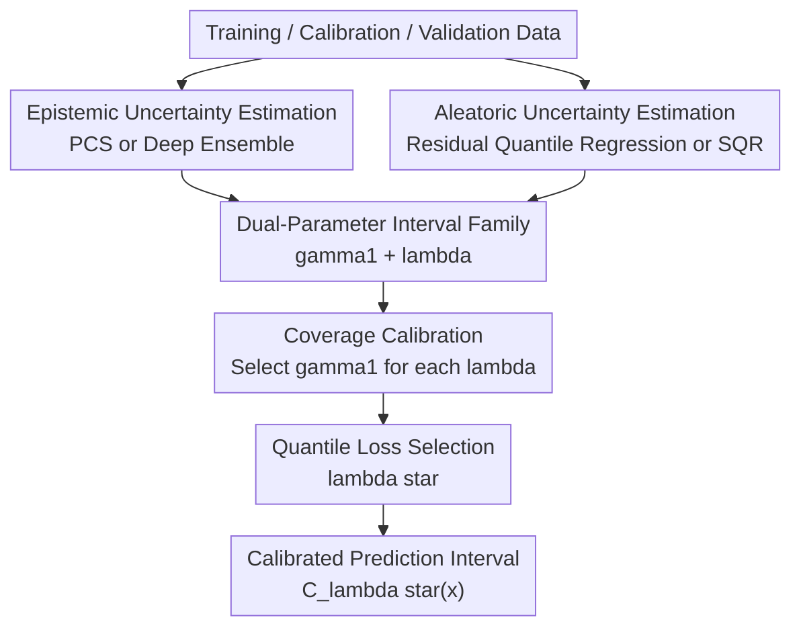

# CLEAR: Calibrated Learning for Epistemic and Aleatoric Risk

**Conference**: ICLR2026  
**OpenReview**: [https://openreview.net/forum?id=RY4IHaDLik](https://openreview.net/forum?id=RY4IHaDLik)  
**Code**: https://github.com/Unco3892/clear  
**Area**: Learning Theory / Uncertainty Calibration  
**Keywords**: [Calibrated Learning, Prediction Intervals, Epistemic Uncertainty, Aleatoric Uncertainty, Conditional Coverage]

## TL;DR
CLEAR proposes a dual-parameter calibration framework that combines aleatoric and epistemic uncertainty in regression prediction intervals according to data-adaptive proportions. This approach significantly narrows intervals and improves conditional coverage while maintaining nominal coverage levels.

## Background & Motivation
**Background**: In reliable machine learning, uncertainty quantification typically aims to output a prediction interval $C(x)$ for each input $x$ such that the true label falls within the interval with a probability of at least $1-\alpha$. Conformal prediction and calibration methods have already provided marginal coverage guarantees, meaning they cover enough test samples in an average sense. Quantile regression, CQR, Deep Ensembles, and Bayesian methods also provide various forms of uncertainty estimation.

**Limitations of Prior Work**: Marginal coverage does not equate to reliability in every local region. A method might produce intervals that are too wide in high-density regions and under-cover in extrapolation regions while still satisfying $95\%$ coverage on average. Particularly in regression tasks, many methods only model aleatoric uncertainty caused by noise itself, ignoring epistemic uncertainty arising from sparse training samples, model selection, and data processing choices. Other methods reflecting epistemic uncertainty may give inappropriate intervals in areas where the data itself is highly noisy.

**Key Challenge**: Aleatoric and epistemic uncertainties are not the same type of risk. The former arises from observational noise, missing covariates, or true randomness, and does not necessarily disappear even with more samples of the same type. The latter arises from limited samples, model specifications, and data processing choices, becoming particularly evident in extrapolation or low-sample regions. Prediction intervals should cover both types of risk, but since their scales depend on the dataset and the estimator, simply adding them or merging them with fixed proportions easily biases toward one side.

**Goal**: The authors aim to construct a regression prediction interval method that can utilize both aleatoric and epistemic uncertainty estimators. It should maintain nominal coverage after calibration while automatically selecting the relative weights of the two types of uncertainty via a validation set. Furthermore, the selected weights should be interpretable, helping to determine which type of risk dominates the current task.

**Key Insight**: The paper observes that the issue with many existing methods is not the total lack of uncertainty estimation, but rather the hardcoded proportions between the two types of estimates. For instance, some methods default to assuming both uncertainties are equally important or only tune a single global scaling coefficient. Conversely, CLEAR decouples "how wide the total interval should be" and "how to distribute the balance between the two uncertainties" into two calibratable parameters, determined jointly on the validation set using coverage constraints and quantile loss.

**Core Idea**: Use two parameters $\gamma_1$ and $\gamma_2$, or equivalently a global calibration scale $\gamma_1$ and a ratio $\lambda=\gamma_2/\gamma_1$, to adaptively merge aleatoric and epistemic uncertainty, thereby learning prediction intervals that are both calibrated and sharper.

## Method

### Overall Architecture
CLEAR is designed for regression prediction intervals: given a point predictor $\hat f(x)$, an aleatoric uncertainty estimator, and an epistemic uncertainty estimator, the method first estimates the interval expansion in both directions separately and then performs a search over a set of candidate $\lambda$ values. For each $\lambda$, CLEAR selects the smallest $\gamma_1$ that allows the calibration set to reach the target coverage, and then selects the optimal $\lambda^\star$ using the quantile loss on the validation set.

The paper emphasizes that CLEAR is not an architecture tied to a specific model but rather a calibration layer. In the main experiments, aleatoric uncertainty comes from residual-based quantile regression, and epistemic uncertainty comes from model perturbation ensembles under the PCS framework. Additional experiments transfer the same calibration philosophy to Deep Ensembles and Simultaneous Quantile Regression, demonstrating its nature as a plug-and-play combination principle.

### Key Designs
**1. Dual-Parameter Interval Family: Decoupling Total Width and Uncertainty Ratio**

The core form of CLEAR constructs an interval around the point prediction $\hat f(x)$. Intuitively, it can be written as $C(x)=[\hat f(x)\pm \gamma_1\cdot \text{aleatoric}(x) \pm \gamma_2\cdot \text{epistemic}(x)]$. The paper further sets $\gamma_2=\lambda\gamma_1$, such that $\gamma_1$ handles global scaling and $\lambda$ handles the relative weight of epistemic uncertainty to aleatoric uncertainty. The benefit is that coverage calibration and risk source interpretation are no longer conflated into a single parameter.

Specifically, if the aleatoric estimator provides upper and lower directional estimates $\hat q^{ale}_{\alpha/2}(x),\hat q^{ale}_{1-\alpha/2}(x)$, and the epistemic estimator provides $\hat q^{epi}_{\alpha/2}(x)$, $\hat q^{epi}_{1-\alpha/2}(x)$, then for each candidate $\lambda$, the interval is written as $[\hat f-\gamma_1\hat q^{ale}_{\alpha/2}-\lambda\gamma_1\hat q^{epi}_{\alpha/2},\hat f+\gamma_1\hat q^{ale}_{1-\alpha/2}+\lambda\gamma_1\hat q^{epi}_{1-\alpha/2}]$. When $\lambda=0$, the interval essentially trusts only aleatoric uncertainty; when $\lambda$ is large and $\gamma_1$ small, the interval is dominated by epistemic uncertainty. This continuous adjustment mechanism is more suitable for scenarios where data distributions change compared to fixing $\lambda=1$ or a single scale parameter.

**2. Residual Quantile Regression: Modeling Aleatoric Uncertainty Around Prediction Errors**

The paper argues that directly modeling the conditional quantiles of $Y$ entangles the mean function with the noise structure. Especially when the point predictor is already strong, the upper and lower bounds of the interval may not stably reflect "irreducible noise." The main experiments of CLEAR utilize ALEATORIC-R: first obtaining a stable point prediction $\hat f$, then training a quantile regression model on residuals $Y_i-\hat f(X_i)$ to estimate conditional residual quantiles.

This modification, while seemingly small, makes aleatoric uncertainty estimation closer to the "local error shape around current predictions." if a location has high label noise, the residual quantiles widen; if the mean function is hard to learn but noise is low, the residual model will not misattribute model ignorance entirely to aleatoric risk. Subsequent responsibilities for describing extrapolation and model selection risks are left to the epistemic branch, clarifying the roles of both.

**3. PCS / Ensemble Epistemic Uncertainty: Explicitly Including Finite Sample and Model Selection Risks**

The epistemic branch of CLEAR can interface with any epistemic estimator. The main experiments use the PCS-UQ approach: obtaining a set of estimators from different models, perturbations, or acceptable data science choices, and using the dispersion of these estimators to construct epistemic uncertainty. The implementation primarily focuses on model perturbations. Variant (a) uses an ensemble of quantile models, variant (b) is restricted to QXGB, and variant (c) uses a standard PCS mean model.

This step addresses the issue where traditional CQR prone to under-coverage in extrapolation regions. In data-sparse areas, residual quantiles might not show danger due to few calibration samples, but predictions from different models will be more dispersed; by adding this as an epistemic term, CLEAR can proactively widen intervals in low-density regions rather than just pursuing average coverage.

**4. Coverage Calibration First, then Quantile Loss to Select $\lambda$: Managing Reliability and Sharpness via Two Criteria**

For each candidate $\lambda\in\Lambda$, CLEAR selects the minimum $\gamma_1$ such that at least $\lceil(1-\alpha)(|D_{cal}|+1)\rceil$ points in the calibration set are covered. This step inherits the philosophy of conformal calibration: first ensuring the interval does not lose marginal coverage in pursuit of being narrow. Subsequently, the method calculates the quantile loss of the interval bounds on the validation set and selects $\lambda^\star=\arg\min_{\lambda\in\Lambda}\text{QuantileLoss}(D_{val},C_\lambda)$.

Quantile loss penalizes both boundary violations from being too narrow and lack of sharpness from being too wide, distinguishing between two methods that both achieve target coverage better than PICP alone. The paper also provides theoretical discussions: under conditions such as a compact $\Lambda$, consistency of base PCS models, and consistency of aleatoric quantile estimates, CLEAR can achieve asymptotic conditional validity. Furthermore, if the calibration set size is infinite, joint calibration is not inferior to single-parameter baselines. In practice, the $\lambda$ grid includes a linear grid from 0 to 0.09 and a log grid from 0.1 to 100, totaling over 4000 candidates, with calibration search costs being negligible compared to base model training.

### A Complete Example
Using Ames Housing as an example, suppose the goal is to provide a $90\%$ interval for house price prediction. Using only 2 features, the information usable by the model is limited, and much uncertainty comes from the house price itself being difficult to explain by existing covariates. CLEAR learns $\lambda=0.64$, $\gamma_1=0.99$, and the calibrated epistemic/aleatoric ratio is only 0.03, indicating the interval is expanded primarily based on aleatoric uncertainty.

When using all features but reducing training samples to $20\%$, the situation is reversed: input information is richer, but insufficient samples lead to higher model selection and extrapolation risk. CLEAR pushes $\lambda$ to 100, $\gamma_1$ to approximately 0.01, and the calibrated epistemic/aleatoric ratio reaches about 250.5. This example demonstrates that $\lambda$ is not just a hyperparameter; it also serves as a diagnostic signal: whether the current prediction risk is "inherently noisy data" or "model ignorance."

### Loss & Training
CLEAR's training and calibration can be divided into three layers. The first layer trains the point predictor, aleatoric uncertainty model, and epistemic uncertainty model on the training set. The second layer finds the minimum $\gamma_1$ for each $\lambda$ on the calibration set to satisfy the coverage requirement. The third layer selects $\lambda^\star$ on the validation set using quantile loss. In the standard setup, $D_{val}$ is often used as $D_{cal}$. A more conservative "conformalized" setup is provided in the appendix, splitting the validation portion into a $10\%$ validation set and $10\%$ calibration set.

The form of the quantile loss is the average of the pinball loss for the upper and lower bounds: if $l(x),u(x)$ are the interval bounds, then $\text{QuantileLoss}(D,C)=\frac{1}{2|D|}\sum_i[QL_{\alpha/2}(Y_i,l(X_i))+QL_{1-\alpha/2}(Y_i,u(X_i))]$, where $QL_\tau(y,q)=(y-q)(\tau-\mathbf{1}_{y\le q})$. Coverage is primarily managed by the calibration step, while interval quality is managed by the quantile loss; this division of labor is key to the stability of CLEAR.

## Key Experimental Results

### Main Results
The paper evaluates CLEAR on synthetic data and 17 real-world regression datasets. Real data comes from a large UQ benchmark, with 10 random train/validation/test splits (60%/20%/20%) for each dataset, targeting 95% nominal coverage. Main metrics include PICP, NIW, NCIW, AISL, and quantile loss. Discussion in the main text focuses on NCIW and quantile loss.

| Setup | Comparison | Metric | CLEAR Relative Results | Note |
|------|----------|------|----------------|------|
| 17 Real Regression Datasets | PCS-UQ | Quantile Loss | Baseline is 15.8% higher than CLEAR | CLEAR intervals are sharper with lower loss |
| 17 Real Regression Datasets | ALEATORIC | Quantile Loss | Baseline is 34.4% higher than CLEAR | Sole aleatoric branch easily misses extrapolation risk |
| 17 Real Regression Datasets | ALEATORIC-R | Quantile Loss | Baseline is 9.4% higher than CLEAR | Residual modeling is strong but lacks epistemic branch |
| 17 Real Regression Datasets | PCS-UQ | NCIW | Baseline is 17.5% higher than CLEAR | Epistemic-only is too wide in some areas |
| 17 Real Regression Datasets | ALEATORIC | NCIW | Baseline is 28.3% higher than CLEAR | Original CQR-type methods have poor interval quality |
| 17 Real Regression Datasets | ALEATORIC-R | NCIW | Baseline is 3.0% higher than CLEAR | CLEAR still gains over a strong baseline |

The core conclusion from synthetic experiments is more intuitive: ALEATORIC-R covers well in high-density regions but under-covers in low-density/extrapolation regions; PCS can widen at extrapolation points but may be too wide or slightly under-cover in some regions; CLEAR utilizes both to expand the interval when $x$ is far from the training distribution center while maintaining relatively narrow width in dense data areas.

### Ablation Study
| Configuration / Scenario | NCIW / Gain | Quantile Loss / Gain | Coverage or Interpretation |
|-------------|-------------|----------------------|--------------|
| CLEAR + DE/SQR vs DE | NCIW Gain 28.57% | Quantile Loss Gain 23.98% | PICP roughly equal; framework transferable to Deep Ensembles |
| CLEAR + DE/SQR vs SQR | NCIW Gain 13.36% | Quantile Loss Gain 13.66% | Adding epistemic branch still yields stable gains over SQR alone |
| CLEAR + conformal DE/SQR vs DE-conformal | NCIW Gain 27.90% | Quantile Loss Gain 24.08% | Dual-parameter combination still narrows intervals even if baseline is calibrated |
| CLEAR + conformal DE/SQR vs SQR-conformal | NCIW Gain 13.23% | Quantile Loss Gain 10.12% | Effective even for aleatoric deep quantile models |
| Ames Housing, 2 features | NCIW 0.171 | Quantile Loss 3,131 | Coverage 0.89, better than NCIW of PCS 0.214 / CQR 0.186 |
| Ames Housing, all features | NCIW 0.103 | Quantile Loss 1,923 | Coverage 0.88, avg width $55,910$, slightly better than PCS/CQR |

### Key Findings
- In the main settings, CLEAR variant (a) often emerges as the best or most stable method across 15 out of 17 datasets compared to PCS, ALEATORIC, and ALEATORIC-R. This indicates the gains are not accidental to a single dataset.
- Comparisons with UACQR show that CLEAR variant (c) is overall superior to both UACQR versions in 14/17 datasets; on datasets like airfoil, energy efficiency, and naval propulsion, NCIW/AISL/Average Width can show 40%-70% advantages while coverage remains above ~94.5%.
- The values of $\lambda$ are data-dependent. In Ames Housing, $\lambda=0.64$ with 2 features, but rises to 100 with all features and fewer samples; this supports the motivation that fixed proportions are not robust.
- Gains persist in "Conformalized" settings, though small calibration sets might increase the risk of parameter overfitting. The paper thus cautions that for calibration samples significantly smaller than those in main experiments, priors on $\lambda$ and $\gamma_1$ or more careful grid selection might be needed.

## Highlights & Insights
- The most clever aspect of CLEAR is decoupling "uncertainty estimation quality" from the "uncertainty combination ratio." Many UQ methods default to assuming the scales of different outputs are comparable, but in reality, the numerical scales of PCS, CQR, SQR, and DE can be entirely different; dual-parameter calibration provides a simple scale alignment layer.
- Residual quantile regression is a practical trick. It doesn't require reinventing CQR but shifts the target of quantile regression from $Y$ to $Y-\hat f(X)$, making the aleatoric branch act more like a local error model, explaining why CLEAR is steadier than direct CQR or ALEATORIC.
- The interpretability of $\lambda$ is noteworthy. Many calibration methods only output an interval without the user knowing where the width comes from; CLEAR's ratio parameter informs practitioners whether the current risk is "inherently noisy data" or "model ignorance," which is valuable for active learning, data collection, and feature engineering.
- The method possesses strong engineering plug-and-play capability. The主线 uses PCS+CQR, but experiments with DE+SQR show that as long as two types of uncertainty estimates are provided, CLEAR can serve as a post-processing/calibration module, making it easier to reuse than methods tied to a specific Bayesian or ensemble architecture.

## Limitations & Future Work
- CLEAR depends on the quality of base uncertainty estimators. If the aleatoric or epistemic branches are severely distorted, dual-parameter calibration can only provide scale compensation and cannot recover the correct local structure out of nowhere.
- When calibration samples are few, tuning $\gamma_1$ and $\lambda$ simultaneously may overfit. Calibration sets in the experiments had at least ~150 samples, but in small-data or high-dimensional sparse tasks, grid search might require regularization, priors, or more conservative data splitting.
- The current form uses additive combinations (linear sum of expansions). While simple and interpretable, this structure might not suit all distribution shapes; future work could explore multiplicative, gated, or input-dependent $\lambda(x)$.
- The paper primarily focuses on regression prediction intervals. Uncertainty combinations in classification tasks, sequence prediction, time series, and multi-output structures are more complex; while CLEAR's philosophy can be transferred, coverage definitions and loss functions would need redesigning.
- PCS-type epistemic uncertainty requires researchers to make judgments about data processing and model perturbations. The main benchmark simplified preprocessing perturbations; in real-world data science workflows, which perturbations should be included in the epistemic set remains the responsibility of the user.

## Related Work & Insights
- **vs CQR**: CQR obtains marginal coverage through quantile regression and conformal calibration but primarily reflects aleatoric structures. CLEAR retains the calibration philosophy while adding an epistemic branch, thus better avoiding conditional under-coverage in extrapolation regions.
- **vs PCS-UQ**: PCS-UQ describes epistemic uncertainty through the stability of model and data science choices but does not explicitly model data noise. CLEAR uses PCS as the epistemic component and uses residual quantile regression to fill in the aleatoric component, resulting in intervals that are generally narrower and more targeted.
- **vs Deep Ensembles / SQR**: Deep Ensembles are often used for epistemic estimation, while SQR is used for aleatoric quantile estimation. CLEAR's DE+SQR experiments prove it is not a PCS-exclusive method but can add a unified calibration layer to different UQ estimators.
- **vs UACQR**: UACQR also focuses on uncertainty-adaptive conformal intervals, but CLEAR more explicitly distinguishes two types of uncertainty and calibrates both through $\lambda$ and $\gamma_1$. CLEAR is more stable across most datasets and metrics, particularly avoiding scenarios where UACQR-P creates infinitely wide intervals.

## Rating
- Novelty: ⭐⭐⭐⭐ Simple dual-parameter calibration form, but combining epistemic/aleatoric ratio learning, coverage constraints, and quantile loss selection is very clear.
- Experimental Thoroughness: ⭐⭐⭐⭐⭐ Covers synthetic experiments, 17 real regression datasets, two sets of estimators (PCS/CQR and DE/SQR), UACQR comparisons, and the Ames case study.
- Writing Quality: ⭐⭐⭐⭐ The logic in the main text is clear and the appendix is comprehensive; however, details on methods and experiments are scattered between the text and appendix, requiring cross-referencing.
- Value: ⭐⭐⭐⭐⭐ Highly practical for regression systems requiring interpretable prediction intervals, especially for tabular data, scientific modeling, and risk assessment scenarios where both extrapolation risk and observational noise coexist.

<!-- RELATED:START -->

## Related Papers

- [\[ICLR 2026\] Epistemic Uncertainty Quantification To Improve Decisions From Black-Box Models](epistemic_uncertainty_quantification_to_improve_decisions_from_black-box_models.md)
- [\[ICLR 2026\] Conformalized Decision Risk Assessment](conformalized_decision_risk_assessment.md)
- [\[ICLR 2026\] Robust Decision Making with Partially Calibrated Forecasts](robust_decision-making_with_partially_calibrated_forecasters.md)
- [\[ICLR 2026\] Trained on Tokens, Calibrated on Concepts: The Emergence of Semantic Calibration in LLMs](trained_on_tokens_calibrated_on_concepts_the_emergence_of_semantic_calibration_i.md)
- [\[ICLR 2026\] Risk Phase Transitions in Spiked Regression: Alignment Driven Benign and Catastrophic Overfitting](risk_phase_transitions_in_spiked_regression_alignment_driven_benign_and_catastro.md)

<!-- RELATED:END -->
