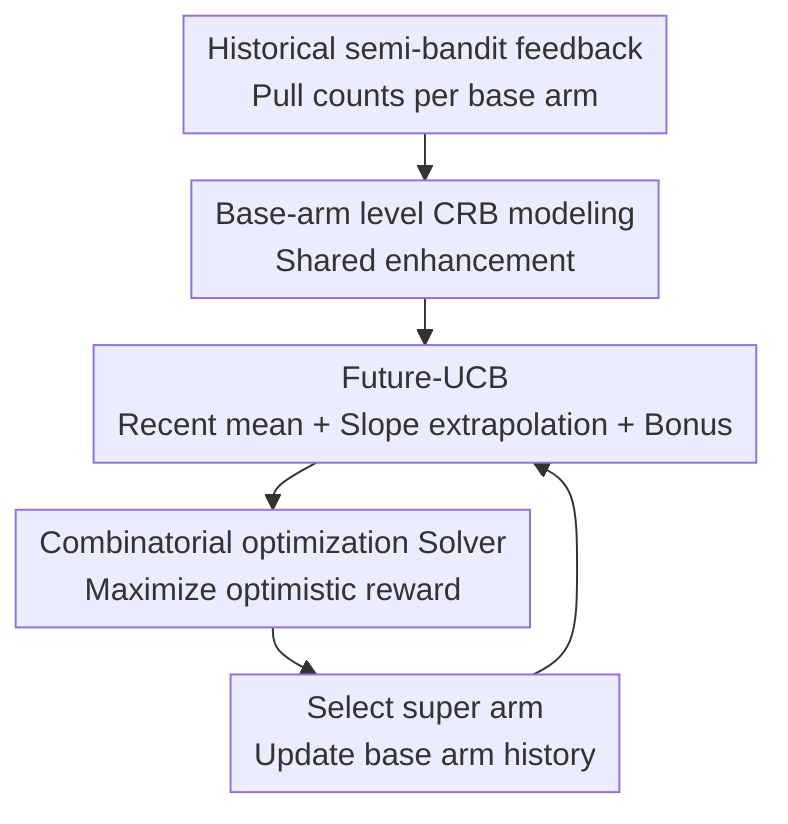

# Combinatorial Rising Bandits

**Conference**: ICLR2026  
**OpenReview**: [https://openreview.net/forum?id=S4dg60APOk](https://openreview.net/forum?id=S4dg60APOk)  
**Code**: https://github.com/ml-postech/Combinatorial-Rising-Bandits  
**Area**: Learning Theory / Bandits / Online Learning  
**Keywords**: Combinatorial bandit, rising bandit, online learning, regret bound, semi-bandit  

## TL;DR
This paper proposes the Combinatorial Rising Bandit framework to characterize online learning problems where combinatorial actions consist of base arms that strengthen with use. It introduces the CRUCB algorithm, which utilizes Future-UCB at the base arm level to estimate long-term potential. Theoretical analysis provides regret guarantees close to the lower bound, and experiments show superior performance over existing bandit methods in synthetic shortest path and AntMaze hierarchical reinforcement learning tasks.

## Background & Motivation
**Background**: Combinatorial online learning typically treats an action as a set of base arms—for instance, a routing path consists of multiple edges, a recommendation package consists of multiple items, and a robotic plan consists of multiple low-level skills. The focus of classic combinatorial bandits is to learn the means at the base arm level using semi-bandit feedback and select the optimal super arm via optimization oracles such as shortest path, matching, or spanning tree.

**Limitations of Prior Work**: Many real-world systems do not yield a "static reward per pull." Robotic skills become more proficient with practice, network links become more reliable with traffic history and estimation updates, and crowdsourcing annotators improve accuracy by performing more tasks of the same type. While rising bandits have studied rewards that increase with usage, existing works mostly treat each action as an independent arm and cannot handle the structure where combinatorial actions share base arms.

**Key Challenge**: When combinatorial and rising structures overlap, the primary difficulty is that the improvement of a single base arm affects all super arms containing it. Treating each path as an independent rising arm leads to redundant exploration of shared edges and misattributes gains to the entire path. Conversely, using standard combinatorial bandits ignores the rising nature, potentially mistaking an "early peaker" with high initial rewards for the long-term optimum, thereby missing a "late bloomer" that matures later but performs better.

**Goal**: The authors aim to formalize a new Combinatorial Rising Bandit (CRB) problem, distinguishing it from both standard combinatorial bandits and non-combinatorial rising bandits. Furthermore, they aim to design an algorithm that utilizes the shared structure of base arms and predicts future rising potential, backed by theoretical regret bounds.

**Key Insight**: Starting from the premise that the expected outcome of a base arm is a monotonic non-decreasing function of its pull count, the reward of a super arm is modeled as a monotonic function of these base arm means. Consequently, the algorithm can utilize optimization oracles from combinatorial bandits while applying the sliding-window extrapolation logic of rising bandits at the base arm level rather than the super arm level.

**Core Idea**: Use Future-UCB at the base arm level to estimate the future potential of each reusable sub-action, and pass these optimistic estimates to a combinatorial optimization oracle to select super arms. This simultaneously addresses "combinatorial sharing" and "rewards rising with practice."

## Method
The contributions of the CRB method are two-fold: problem modeling, which specifies that rewards increase with base arm usage; and the CRUCB algorithm, which estimates the future value of each base arm before invoking an optimization Solver. Theoretical analysis covers the regret upper bound of CRUCB and the lower bound of CRB.

### Overall Architecture
In CRB, there are $K$ base arms, and the set of valid super arms is $\mathcal{S} \subseteq 2^{[K]}$. At each round $t$, the algorithm selects $S_t \in \mathcal{S}$, where each base arm $i \in S_t$ produces an outcome $X_i(t)$. The distribution of this outcome depends on the number of times the arm has been pulled, $N_{i,t-1}$, with the mean denoted as $\mu_i(N_{i,t-1})$. The rising condition requires $\gamma_i(n)=\mu_i(n+1)-\mu_i(n) \ge 0$. The theory further assumes $\mu_i$ is concave, meaning the increment $\gamma_i(n)$ non-increases.

The CRUCB workflow is straightforward: estimate the current level of base arms using a recent window, estimate potential growth using finite differences, and add a conservative exploration bonus to obtain the Future-UCB index $\tilde{\mu}_i(t)$. Then, select the super arm using $\arg\max_{S \in \mathcal{S}} r(S, \tilde{\mu})$. The Solver is a task-dependent oracle, such as Dijkstra for shortest path or a matching solver for maximum matching.

### Key Designs
**1. CRB Modeling: Placing rising rewards on base arms rather than super arms**

Ordinary rising bandits treat each action as an independent arm; thus, the number of times a path is tried determines its mean. This paper posits that in combinatorial tasks, it is the base arms (e.g., edges, skills) that are trained and reused. Therefore, it defines $X_i(t) \sim \mathcal{D}_i(N_{i,t-1})$, allowing each base arm's mean $\mu_i(n)$ to rise with its own pull count $n$, while the super arm reward is aggregated via $r(S, \mu)$.

This captures "partially shared enhancement": exploring one path improves the future performance of shared edges in other paths. It also explains the failure of old algorithms. Non-combinatorial rising algorithms miss statistical efficiency by ignoring sharing, while standard combinatorial bandits assume static means and misinterpret "high current reward" as "long-term optimal."

**2. Future-UCB: Estimating long-term potential with recent mean, slope, and uncertainty**

For each base arm $i$, CRUCB uses a window $h_i=\epsilon N_{i,t-1}$ of recent observations to calculate the recent average outcome and estimates the growth slope via finite differences over interval $h_i$. The potential is then linearly extrapolated over the remaining horizon. The index is:

$$
\tilde{\mu}_i(t)=\underbrace{\text{recent mean}}_{\text{current level}}+\underbrace{\text{slope extrapolation}}_{\text{future potential}}+\underbrace{\beta_i(t)}_{\text{exploration bonus}}.
$$

Under the concavity assumption, this extrapolation remains optimistic: if $\gamma_i(n)$ is non-increasing, using past differences will not underestimate "late bloomers." The exploration bonus is larger than in static bandits to account for extrapolation noise scaled by the prediction distance $(t-N_{i,t-1})$.

**3. Solver Decoupling: Adapting to various online optimization tasks**

Future-UCB provides optimistic values at the base arm level, while action selection is handled by a Solver: $\text{Solver}(\tilde{\mu})=\arg\max_{S \in \mathcal{S}} r(S,\tilde{\mu})$. This allows CRUCB to adapt to shortest path, maximum matching, or spanning tree tasks without redesigning the bandit logic, leveraging existing optimization oracles.

**4. Difficulty-Adaptive Regret Analysis: Using cumulative increments**

The paper introduces the cumulative increment $\Upsilon(M,q)=\sum_{l \in [M-1]} \max_i \{\gamma_i(l)^q\}$ to characterize rising difficulty. If outcomes saturate quickly, the problem resembles a static bandit. If they change slowly over time, sustained exploration is required. The upper bound scales with $K T^q \Upsilon(LT/K,q)$ and $O(KT^{2/3}(\log T)^{1/3})$, which matches lower bounds in specific instance classes.

### Loss & Training
CRUCB does not use a neural loss function but a decision strategy. The primary parameter is the window ratio $\epsilon$, set to $0.125$ in main experiments. Smaller windows are more sensitive to rising changes but have higher variance, while larger windows are more stable but may underestimate the growth of late bloomers.

## Key Experimental Results

### Main Results
| Task | Scale / Setup | Optimal Structure | CRUCB Results | Main Conclusion |
|------|-------------|----------|------------|--------------|
| Toy shortest path | 3 base arms, 2 paths | Late bloomer path is optimal | Regret flattens quickly | SW-CUCB biased to early peaker; R-ed-UCB is inefficient |
| Path-complex | $K=60$, $|\mathcal{S}|=252$, $L=10$ | Late bloomer path in complex graph | Advantage increases | Non-combinatorial methods fail as overlaps increase |
| AntMaze-complex | $K=48$, $|\mathcal{S}|=178$, $L=15$ | Focus on optimal path | Lowest regret | CRUCB avoids impossible edges and inefficient exploration |

### Ablation Study
| Configuration | Key Metrics | Explanation |
|------|---------|------|
| CRUCB | Lowest regret across all tasks | Base-arm level Future-UCB + Solver leverages both rising and sharing |
| R-ed-UCB | Higher regret than CRUCB | Lacks base-arm level learning; cannot handle shared enhancement |
| SW-CUCB | Biased towards early peaker | No rising prediction; exploits short-term rewards too early |
| Window ratio $\epsilon$ | Robust across $\{0.05, 0.4\}$ | Stable performance relative to $\epsilon$ |

### Key Findings
- CRUCB excels when both structures coexist: base arms rise and super arms share base arms.
- Regret analysis shows that CRUCB adapts to the difficulty of the rising process without knowing the exact parameters of the growth function.
- In AntMaze, where the strict concavity assumption is often violated, CRUCB still outperforms baselines, demonstrating the robustness of the mechanism.

## Highlights & Insights
- Modeling the rising effect at the base arm level is the most critical design choice, accurately reflecting scenarios where sub-skills improve through practice.
- Future-UCB explicitly estimates "what happens if I continue to invest," allowing the algorithm to stay optimistic about late bloomers even when their current reward is low.
- The use of cumulative increments $\Upsilon$ for regret analysis provides a more nuanced view of difficulty in non-stationary bandits.

## Limitations & Future Work
- The current theory assumes a fixed set of arms and fixed combinatorial structure. Future work could address dynamic arm sets.
- CRUCB relies on the availability of an optimization Solver; if the constraint set $\mathcal{S}$ is implicitly defined by a complex generator, the oracle might be unavailable.
- For non-concave or catastrophic forgetting scenarios, the current linear extrapolation might require enhancement.

## Related Work & Insights
- **vs Combinatorial Semi-bandit**: Standard methods assume static means or use generic non-stationary windows. CRB explicitly models the "practice makes perfect" effect.
- **vs Non-combinatorial Rising Bandit**: CRUCB uses semi-bandit feedback to avoid the combinatorial explosion that occurs when treating each path as an independent arm.
- **Implications for HRL**: Hierarchical RL systems can be viewed as "high-level combinatorial selection + low-level skill practice," where CRUCB provides a strategy for balanced exploration.

## Rating
- Novelty: ⭐⭐⭐⭐⭐ 
- Experimental Thoroughness: ⭐⭐⭐⭐☆ 
- Writing Quality: ⭐⭐⭐⭐☆ 
- Value: ⭐⭐⭐⭐⭐ 

<!-- RELATED:START -->

## Related Papers

- [\[ICLR 2026\] Efficient Best-of-Both-Worlds Algorithms for Contextual Combinatorial Semi-Bandits](efficient_best-of-both-worlds_algorithms_for_contextual_combinatorial_semi-bandi.md)
- [\[ICLR 2026\] Diversified Multinomial Logit Contextual Bandits](diversified_multinomial_logit_contextual_bandits.md)
- [\[ICLR 2026\] Variance-Dependent Regret Lower Bounds for Contextual Bandits](variance-dependent_regret_lower_bounds_for_contextual_bandits.md)
- [\[ICLR 2026\] Queue Length Regret Bounds for Contextual Queueing Bandits](queue_length_regret_bounds_for_contextual_queueing_bandits.md)
- [\[ICLR 2026\] Contextual Multi-Armed Bandits with Minimum Aggregated Revenue Constraints](contextual_multi-armed_bandits_with_minimum_aggregated_revenue_constraints.md)

<!-- RELATED:END -->
