# Complexity Analysis of Normalizing Constant Estimation: from Jarzynski Equality to Annealed Importance Sampling and Beyond

**Conference**: ICLR 2026  
**OpenReview**: [https://openreview.net/forum?id=96fJALwotm](https://openreview.net/forum?id=96fJALwotm)  
**Code**: [https://github.com/AlexandreGUO2001/NormConstEst](https://github.com/AlexandreGUO2001/NormConstEst)  
**Area**: Learning Theory / Sampling Complexity (probabilistic methods, sampling)  
**Keywords**: Normalizing constant estimation, Jarzynski Equality, Annealed Importance Sampling, non-asymptotic complexity, optimal transport, reverse diffusion sampling

## TL;DR
This paper provides the first **non-asymptotic oracle complexity** bounds for estimating the normalizing constant $Z$ via Jarzynski Equality (JE) and Annealed Importance Sampling (AIS). It replaces isoperimetric inequalities with the "action of the curve" to characterize difficulty, demonstrates that geometric interpolation suffers from exponential action on multimodal distributions, and proposes a new algorithm based on reverse diffusion sampling.

## Background & Motivation
- **Background**: Given an unnormalized density $\pi \propto e^{-V}$, estimating the normalizing constant $Z = \int_{\mathbb{R}^d} e^{-V(x)}\,dx$ (or free energy $F = -\log Z$) is a core problem in Bayesian statistics (marginal likelihood), statistical mechanics (partition functions), and energy-based model training. Direct importance sampling suffers from variance explosion in high dimensions or multimodality, making **annealing methods** like JE, AIS, SMC, and thermodynamic integration the mainstream approach.
- **Limitations of Prior Work**: While annealing methods are empirically successful, **theoretical guarantees are almost non-existent**. Analyses of importance sampling are often limited to asymptotic bias/variance; JE analyses typically assume that the "work" follows simple distributions like Gaussian or Gamma; and existing non-asymptotic complexity bounds **almost exclusively rely on the isoperimetry (log-concavity / Poincaré) of the target distribution**—conditions that difficult multimodal distributions precisely fail to meet.
- **Key Challenge**: Providing rigorous non-asymptotic complexity for $Z$ estimation on **non-log-concave** target distributions requires tools beyond isoperimetric inequalities. Furthermore, whether geometric interpolation—the most widely used method due to its closed-form score—is efficient on multimodal distributions has never been quantitatively characterized.
- **Goal**: To establish the non-asymptotic oracle complexity of JE / AIS under extremely weak assumptions (not requiring log-concavity), diagnose the failure mechanism of geometric interpolation, and provide superior alternative algorithms.
- **Core Idea**: **Using the "action of the curve" as the core dimension of complexity**—specifically, the "Wasserstein-2 velocity squared integral" $A = \int_0^1 |\dot\pi|_\theta^2\,d\theta$ of the probability measure curve $(\pi_\theta)$ connecting the reference and target distributions. Finite action is a significantly weaker condition than isoperimetric inequalities. By combining the Girsanov theorem with optimal transport, the authors bypass the need for isoperimetric assumptions.

## Method

### Overall Architecture
The paper advances through three steps: "Continuous Dynamics → Discrete Algorithms → Diagnosis & Improvement." First, the estimation error of JE is characterized as the "curve action divided by runtime" (Thm. 2) using Annealed Langevin Diffusion (ALD). Second, this continuous analysis is "discretized" into oracle complexity bounds for AIS (Thm. 4). Finally, the paper quantitatively proves that geometric interpolation incurs exponential action on multimodal distributions (Prop. 1) and proposes a new algorithm using reverse diffusion curves based on the OU process, which yields an action of only $O(d\beta+m^2)$ (Prop. 2 + Thm. 5).

```mermaid
flowchart LR
    A["Unnormalized density π ∝ e^-V<br/>Goal: Estimate Z w/ relative error ε"] --> B["JE Continuous Analysis<br/>ALD + Forward/Backward SDE"]
    B -->|"Thm.2: T = 32A/ε²<br/>Error = action/time"| C["AIS Discrete Complexity<br/>Geom. Interp. + ALMC Step"]
    C -->|"Thm.4: Õ(dβ²A²/ε⁴)"| D["Diagnosing Geom. Interp.<br/>Multimodal action is exponential"]
    D -->|"Prop.1: A ≳ m⁴e^{m²/40}"| E["Reverse Diffusion Sampling (RDS)<br/>Using OU process curve"]
    E -->|"Prop.2: action ≤ dβ+m²<br/>Thm.5: Complexity Framework"| F["Exp: RDS accurate on multimodality,<br/>TI/AIS severely biased"]
```

### Key Designs

**1. Characterizing non-asymptotic JE error via action: Translating statistical efficiency into "curve velocity × runtime."** Annealed Langevin Diffusion targets $\tilde\pi_t = \pi_{t/T}$ at time $t$, but a "lag" always exists between the true sample distribution $\mathrm{Law}(X_t)$ and $\tilde\pi_t$. This lag is the source of variance for the estimator $\hat Z = Z_0 e^{-W(X)}$. Rather than assuming isoperimetry, the authors introduce a reference path measure $\mathbb{P}$ with "perfectly compensated drift" (whose marginal is exactly $\tilde\pi_t$). Using the Girsanov theorem, they calculate the KL divergence between the forward/backward path measures and $\mathbb{P}$. By Lemma 4, the optimal compensation field minimizes this KL, which exactly equals the metric derivative $|\dot{\tilde\pi}|_t$. The result is Thm. 2: for a runtime $T = \tfrac{32A}{\varepsilon^2}$, the relative error is controlled within $\varepsilon$ with probability $\geq 3/4$. This bound holds for **any interpolation curve** and aligns with the second law of thermodynamics characterizing dissipated work $W_{\mathrm{diss}} = \overline{W} - \Delta F = \mathrm{KL}(\mathbb{P}^\rightarrow\|\mathbb{P}^\leftarrow)$.

**2. Discretizing continuous analysis into the first oracle complexity bound for AIS.** In practice, neither ALD simulations nor work calculations are exact. Therefore, the authors use "geometric interpolation" $\pi_\theta \propto \exp(-V - \tfrac{\lambda(\theta)}{2}\|\cdot\|^2)$ with an Annealed Langevin Monte Carlo (ALMC, exponential integrator discretization) transition kernel $\hat F_\ell$. The estimation is split into two stages: first, estimating a well-conditioned $Z_0$ via Thermodynamic Integration (costing $\tilde O(d^{4/3}/\varepsilon^2)$), and then estimating $Z/Z_0$ via AIS. The proof strategy (Fig. 1) involves defining a discretization-free reference path $\mathbb{P}$, decomposing $\mathrm{KL}(\mathbb{P}\|\mathbb{P}^\leftarrow)$ and $\mathrm{KL}(\mathbb{P}\|\overline{\mathbb{P}}^\rightarrow)$ into step-wise KL divergences using the chain rule, and controlling each segment via Girsanov. The final complexity in Thm. 4 is:
$$\tilde O\!\left(\frac{d^{4/3}}{\varepsilon^2} \;\vee\; \frac{m\beta A^{1/(2r)}}{\varepsilon^2} \;\vee\; \frac{d\beta^2 A^2}{\varepsilon^4}\right),$$
stemming from "estimating $Z_0$," "controlling continuous dynamics error," and "discretization error." This is the **first complexity bound for a normalizing constant estimation algorithm that does not assume log-concavity**.

**3. Diagnosing geometric interpolation: Quantitatively explaining exponential action caused by "mass teleportation."** Since complexity is dominated by action $A$, the authors analyze the action of geometric interpolation. Prop. 1 proves that for a 1D Gaussian mixture $\pi = \tfrac12\mathcal{N}(0,1) + \tfrac12\mathcal{N}(m,1)$, its geometric interpolation curve action satisfies $A_r \gtrsim m^4 e^{m^2/40}$—**exploding exponentially with the mode separation $m$**. The core technique uses inverse CDFs to write a closed-form 1D $W_2$ distance and lower-bounds the metric derivative near the target distribution. Intuitively, in the final stages of annealing, mass must "teleport" between isolated modes in a very short time, which explains the "torpid mixing" of samplers.

**4. Reverse Diffusion Sampling (RDS): Using OU curves to compress action to polynomial levels.** Since geometric interpolation curves are suboptimal, the authors use an OU process $dY_t = -Y_t dt + \sqrt2\,dB_t$ to evolve the target $\pi$ toward $\mathcal{N}(0,I)$, using the time-reversal $(\pi_{T-t})$ as the AIS interpolation curve. Prop. 2 proves this curve's action $\int_0^\infty |\dot\pi|_t^2\,dt \leq d\beta + m^2$—**scaling only linearly with dimension and smoothness**, far superior to geometric interpolation. The tradeoff is that the OU drift depends on the intermediate score $\nabla\log\pi_t$, which lacks a closed form and must be estimated (via learning-free methods like RDMC/RSDMC/ZODMC/SNDMC). Thm. 5 provides a unified complexity framework for RDS-based estimation: as long as $\mathrm{KL}(Q\|Q^\dagger) \lesssim \varepsilon^2$ and $\mathrm{TV}(\pi,\pi_\delta) \lesssim \varepsilon$, precision is satisfied. This reveals a fundamental tradeoff: **analytical curves (geometric interpolation) have closed-form drifts but poor action, while optimal curves (OU) have good action but require drift estimation.**

## Key Experimental Results

### Main Results Table
Comparison of TI, AIS, and four RDS methods on 2D multimodal targets, reporting $\hat Z/Z$ (closer to 1 is better), MMD, and $W_2$ (smaller is better):

| Target | Metric | TI | AIS | RDMC | RSDMC | ZODMC | SNDMC |
|--------|--------|----|----|------|-------|-------|-------|
| MMB | $\hat Z/Z$ | 0.753±0.009 | 2.974±7.671 | 0.983±0.212 | 1.289±12.78 | 0.988±0.115 | **1.005±0.119** |
| GM | $\hat Z/Z$ | 0.243±0.002 | 0.204±0.001 | **1.000±0.085** | 0.920±1.028 | 0.977±0.284 | 0.997±0.083 |
| GM | MMD↓ | 2.541±0.028 | 2.462±0.027 | 0.358±0.037 | 0.312±0.040 | 0.259±0.038 | **0.158±0.028** |
| GM | $W_2$↓ | 10.56±0.08 | 10.48±0.09 | 7.02±0.91 | 2.60±0.25 | 2.45±0.30 | **1.55±0.68** |

*MMB = Modified Müller-Brown potential, GM = 4-component Gaussian Mixture, both in $\mathbb{R}^2$.*

### Key Findings
- **TI / AIS (based on geometric annealing) are severely biased on multimodal targets**: On GM, $\hat Z/Z$ is only 0.20~0.24 due to incomplete mode coverage (consistent with the exponential action in Prop. 1).
- **All RDS methods provide accurate $Z$ estimates and high-quality samples**, with SNDMC being the most stable ($W_2$ and MMD are the lowest). AIS occasionally exhibits extreme variance (std of 7.67 on MMB), indicating high instability under geometric interpolation.
- **Theory-Experiment Loop**: Large action leads to biased estimation; small action (OU curve) leads to accurate estimation.

## Highlights & Insights
- **Unified difficulty characterization via action**, bypassing isoperimetric inequalities and quantitatively linking the complexity of "sampling" and "normalizing constant estimation" tasks in continuous, non-log-concave settings.
- **First non-log-concave AIS complexity bound**, filling the theoretical gap for a method that was previously "empirically strong but theoretically hollow."
- **Conversion of "mass teleportation" from a qualitative phenomenon to a quantitative lower bound** ($e^{m^2/40}$ in Prop. 1), providing a clean explanation for why geometric interpolation fails on multimodal distributions.
- **Identification of the fundamental tradeoff between "curve analyticity" and "action quality,"** providing a clear design space for future algorithms.

## Limitations & Future Work
- **Tightness of bounds**: It remains unclear if Thm. 2 and Thm. 4 are optimal or if matching lower bounds exist.
- **Action as a signal**: The exponential action lower bound in Prop. 1 does not strictly equate to JE requiring exponential time—large action is a sufficient but not necessarily a required indicator of difficulty.
- **Interpretability**: While action provides a clean statistical characterization, its practical calculability for arbitrary targets remains difficult.
- **Future Generalization**: The authors suggest potential extensions to underdamped/Hamiltonian Langevin, parallel samplers, compactly supported distributions, and discrete distributions.
- **RDS Complexity**: The total complexity still contains exponential terms (hidden in the underlying score estimator), meaning "polynomial-time multimodal estimation" is still a work in progress.

## Related Work & Insights
- **Spectrum of Annealing**: This work unifies path sampling, AIS (Neal 2001), SMC, TI (Kirkwood 1935), and JE under the "curve action" framework.
- **Non-isoperimetric Sampling**: Inspired by work like Guo et al. (2025) which used action to characterize sampling convergence, this paper extends the concept to normalizing constant estimation and adds lower bounds for geometric interpolation.
- **Variance Reduction**: Techniques like escorted simulation and learning optimal control protocols align with this paper's view that path measure discrepancy is the core of complexity.

## Rating
- **Novelty**: ⭐⭐⭐⭐⭐ First non-asymptotic complexity bound for JE/AIS without log-concavity; uses action to explain mass teleportation; original and solid.
- **Experimental Thoroughness**: ⭐⭐⭐ As a theoretical paper, it validates its loop on 2D toy models, but evaluation on high-dimensional or real-world tasks is limited.
- **Writing Quality**: ⭐⭐⭐⭐ The narrative flow (continuous → discrete → diagnosis → improvement) is clear, though the notation density and prerequisite knowledge of OT/Girsanov are high.
- **Value**: ⭐⭐⭐⭐ Lays the non-asymptotic foundation for annealing-based estimation and links sampling complexity with partition function estimation, impacting Bayesian computation and generative modeling.

<!-- RELATED:START -->

## Related Papers

- [\[ICLR 2026\] Sampling Complexity of TD and PPO in RKHS](sampling_complexity_of_td_and_ppo_in_rkhs.md)
- [\[ICLR 2026\] Poisson Midpoint Method for Log-Concave Sampling: Beyond the Strong Error Lower Bounds](poisson_midpoint_method_for_log_concave_sampling_beyond_the_strong_error_lower_b.md)
- [\[ICLR 2026\] Stable Coresets: Unleashing the Power of Uniform Sampling](stable_coresets_unleashing_the_power_of_uniform_sampling.md)
- [\[ICLR 2026\] On Coreset for LASSO Regression Problem with Sensitivity Sampling](on_coreset_for_lasso_regression_problem_with_sensitivity_sampling.md)
- [\[ICLR 2026\] On Powerful Ways to Generate: Autoregression, Diffusion, and Beyond](on_powerful_ways_to_generate_autoregression_diffusion_and_beyond.md)

<!-- RELATED:END -->
