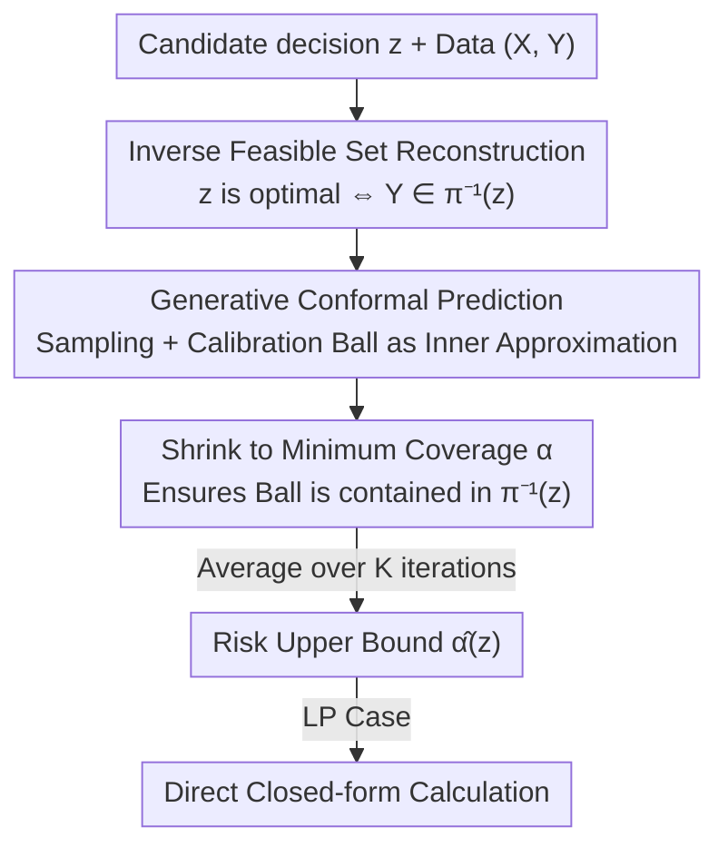

# Conformalized Decision Risk Assessment

**Conference**: ICLR 2026  
**OpenReview**: [https://openreview.net/forum?id=xRjOrcj08o](https://openreview.net/forum?id=xRjOrcj08o)  
**Code**: Anonymous repository in supplementary materials (official repository TBD)  
**Area**: Learning Theory / Conformal Prediction / Uncertainty Quantification / Decision Optimization  
**Keywords**: Conformal Prediction, Inverse Optimization, Decision Risk, Distribution-Free Guarantees, Generative Models

## TL;DR
CREDO transforms the question "how likely is a candidate decision to be sub-optimal" into "the probability that the true outcome falls outside the inverse feasible set of that decision." By using generative conformal prediction to construct an inner approximation set of the inverse feasible set, it provides a **distribution-free, statistically guaranteed** risk upper bound, allowing human experts to perform auditable risk assessments on any decision (whether from algorithms or empirical intuition).

## Background & Motivation

**Background**: The dominant paradigm for handling uncertainty in operations research is predict-then-optimize (PTO)—where machine learning models first estimate unknown parameters (e.g., future demand, patient outcomes), and then an optimization problem is solved to provide a recommended decision. This workflow serves as the foundation for data-driven decision systems in healthcare, energy, and public policy.

**Limitations of Prior Work**: PTO has two major drawbacks in high-stakes scenarios. First, it acts as a black box that directly "prescribes" a solution without revealing how sensitive the decision is to uncertainty or whether alternative decisions might perform similarly or better; thus, decision-makers cannot judge when to trust it or when to override it with experience. Second, PTO fundamentally relies on point predictions and fails to capture distributional complexity—when parameters follow multi-modal distributions, it optimizes for the "expected value," which might fall between peaks where the true parameter almost never occurs, leading to misleading or harmful advice.

**Key Challenge**: Real-world high-stakes decisions are rarely delegated entirely to algorithms. Experienced practitioners often propose alternatives based on domain knowledge outside the data (rare events, operational constraints, risk factors not in historical records). However, existing optimization frameworks lack **principled means to evaluate these human-generated decisions**, creating a gap between algorithmic tools and expert experience.

**Goal**: To complement PTO by proposing the decide-then-assess paradigm. Instead of replacing human judgment with model prescriptions, the goal is to **audit** any candidate decision. Specifically: for a user-specified decision $z$, what is the probability that it remains optimal under the true (unknown) realization of uncertainty $Y$?

**Key Insight**: The authors leverage two key observations: (i) in a broad class of optimization problems, the optimal solution is a deterministic function of target parameters, allowing the mapping to be **inverted** to characterize the set of outcomes where decision $z$ remains optimal (the inverse feasible set); (ii) combining conformal prediction with generative modeling allows for estimating the probability mass of this set, yielding valid, data-driven upper bounds on decision risk.

**Core Idea**: Use "inverse optimization geometry + generative conformal prediction" to provide distribution-free upper bounds on the probability of sub-optimality for any candidate decision—independent of whether the generative model accurately fits the true distribution, while reducing to closed-form solutions under linear programming.

## Method

### Overall Architecture

CREDO aims to solve the following: given covariates $X$, random outcomes $Y$ (uncertain target parameters), and a candidate decision $z$, output a risk measure $\alpha(z)$ such that

$$P\{z \in \pi(Y;\theta)\} \ge 1 - \alpha(z), \quad \forall z \in \mathcal{Z},$$

where $\pi(Y;\theta) = \arg\min_{z\in\mathcal{Z}(\theta)} g(z,Y,\theta)$ is the set of optimal solutions. The method follows a two-step process: first, **problem reformulation**, which equivalently rewrites the "optimality of $z$"—a statement involving a complex $\arg\min$ mapping—as "$Y$ falling within a fixed set"; second, using **generative conformal prediction** to conservatively estimate the probability mass of this set.

### Key Designs

**1. Inverse Feasible Set Reconstruction: Translating "Decision Optimality" to "Outcome Location"**

Directly estimating $P\{z\in\pi(Y;\theta)\}$ is difficult because the randomness is hidden within the $\arg\min$ mapping $\pi$. The authors note that for a specific realization $y$, decision $z$ is optimal **if and only if** its objective value is minimal among all feasible decisions: $g(z,y;\theta)\le g(z',y;\theta),\ \forall z'\in\mathcal{Z}(\theta)$. Thus, the **inverse feasible set** is defined as the set of all outcomes $y$ that make $z$ optimal:

$$\pi^{-1}(z;\theta) := \bigcap_{z'\in\mathcal{Z}(\theta)} \{y\in\mathcal{Y} \mid g(z,y;\theta)\le g(z',y;\theta)\}.$$

Proposition 1 provides the equivalent rewriting $P\{z\in\pi(Y;\theta)\} \equiv P\{Y\in\pi^{-1}(z;\theta)\}$. This **decouples** the random variable $Y$ from the mapping $\pi$: instead of performing probabilistic inference on a complex optimization mapping, the task becomes a standard uncertainty quantification task—estimating the probability that $Y$ falls into a fixed set $\pi^{-1}(z;\theta)$. Under a linear objective $\langle Y,z\rangle$, this set is a cone determined by the vertices of the feasible region, which is geometrically clean.

**2. Generative Conformal Prediction: Inner Approximation for Guaranteed Coverage**

To estimate $P\{Y\in\pi^{-1}(z;\theta)\}$, CREDO does not estimate the probability directly but constructs a set $C(X;\alpha)$ that is **entirely contained** within $\pi^{-1}(z;\theta)$ with a known coverage rate. This allows the target to be bounded:

$$P\{Y\in\pi^{-1}(z;\theta)\} \overset{(a)}{\ge} P\{Y\in C(X;\alpha)\} \overset{(b)}{\ge} 1-\alpha,$$

where (a) follows from set inclusion and (b) from conformal prediction guarantees. Thus, $\alpha$ serves as the risk estimate $\hat\alpha(z)$. Specifically: first, a (conditional) generative model $\hat f:\mathcal{X}\to\mathcal{Y}$ is trained to approximate $Y\mid X$. For a test input $x_{n+1}$, a prediction $\hat y_{n+1}\sim\hat f(x_{n+1})$ is sampled to serve as the center of a conformal ball $C(x_{n+1};\alpha)=\{y:\|y-\hat y_{n+1}\|_2<\hat R(\alpha)\}$. The radius $\hat R(\alpha)$ is calibrated using a calibration set $\{(x_i,y_i)\}_{i=1}^n$ to ensure $(1-\alpha)$ coverage. Finally, a 1D optimization finds the **minimal** $\alpha$ such that the ball is just contained within the inverse feasible set:

$$\hat\alpha(z) = \min_{\alpha\in[1/(n+1),1]}\{\alpha \mid C(x_{n+1};\alpha)\subseteq\pi^{-1}(z;\theta)\}.$$

Why use a generative model instead of a point prediction? A point prediction (conditional mean) might fall near or outside the boundary of the inverse feasible set. If the center is outside, no ball, however small, can be contained within it, forcing the risk to a trivial 1 (overly conservative). Generative modeling allows for multiple samples; as $K$ increases, the chance that at least one sample falls deep within the inverse feasible set increases, providing more informative risk estimates below 1.

**3. K-Sample Averaging + Conformal Weights: Balancing Conservatism and Informativeness**

Single-sample estimates are high-variance. CREDO repeats the process $K$ times to obtain $\{\hat\alpha^{(k)}(z)\}$ and takes the average $\hat\alpha(z)=\frac1K\sum_k\hat\alpha^{(k)}(z)$. Proposition 2 reveals that this average is a **weighted Monte Carlo probability estimate**:

$$\hat\alpha(z) = 1 - \frac1K\sum_{k=1}^K w^{(k)}(z,x_{n+1})\cdot\mathbb{1}\{\hat y^{(k)}_{n+1}\in\pi^{-1}(z;\theta)\},$$

where conformal weights $w^{(k)}\in[0,1]$ are determined by the calibration process. This unified view is critical: a naive Monte Carlo (setting weights to 1, the "NS" variant) is more "accurate" but loses conservatism guarantees. CREDO’s conformal weights **push down** the estimate to satisfy coverage guarantees, which is the essential difference from standard MC and the core of the proof for Theorem 1.

**4. Closed-form Risk Estimation for Linear Programming: Turning Audit into a Scan**

While general CREDO makes no assumptions on the objective or feasible set, for Linear Programming $\pi_{LP}(Y;\theta)=\arg\min_{z\in\mathcal{Z}(\theta)}\langle Y,z\rangle,\ \mathcal{Z}(\theta)=\{z:Az\le b\}$, Corollary 1 provides a closed-form solution. The risk depends only on the distance from the sample to the inverse feasible set boundary $\hat D^{(k)}=\min_{v\in V(\theta)\setminus\{z\}}|\langle\hat y^{(k)}_{n+1},z-v\rangle|/\|z-v\|_2$ and a set of vertex indicator terms. This yields $O(K\cdot n\cdot|V(\theta)|)$ complexity, independent of iteration counts. For practical speedup: if $z$ is not a vertex, the risk is immediately 1, skipping further calculation.

### Loss & Training

CREDO lacks an end-to-end trainable loss—it is an **assessment/audit** framework rather than a predictor. The only "training" involves the base generative model; experiments use a three-component Gaussian Mixture Model (GMM) fitted via EM (100 iterations) for $Y\mid X$, which captures multi-modality without requiring massive data. The training and calibration sets are split following the split conformal framework. Radius $\hat R(\alpha)$ uses standard p-value conformal radii.

### Theoretical Guarantees

- **Conservatism (Theorem 1)**: Under exchangeability (weaker than i.i.d.), $P\{z\in\pi(Y_{n+1};\theta)\}\ge 1-\mathbb{E}[\hat\alpha(z)]$. The estimate is a valid risk upper bound in expectation. Crucially, this **does not require the generative model to be accurate**—providing robustness against model misspecification. The proof relies on post-hoc validity of e-value conformal prediction.
- **Unified Perspective (Proposition 2)**: The estimator is equivalent to a weighted MC probability estimate; setting conformal weights to 1 yields a more aggressive but potentially non-conservative NS variant.
- **Monotonicity of True Positive Rate (Proposition 3)**: TPR is defined as the proportion of truly optimal decisions correctly identified with risk < 1. TPR is proven to increase monotonically with $K$. This implies that more generative sampling prevents feasible decisions from being misclassified as having risk 1, supporting high-quality decision selection.

## Key Experimental Results

Experiments include two synthetic scenarios (Setting I: Triangular feasible set/3-vertex profit maximization; Setting II: Octagonal feasible set/5-vertex complex scenario) and a real-world scenario (2010–2024 solar panel installation records for an Indiana utility company, modeling substation upgrades under budget constraints as knapsack optimization).

### Main Results: Decision Quality (Empirical Confidence Rank, Lower is Better)

| Method | Setting I (σ=1) | Setting II (σ=1) | Real Data |
|------|------|------|------|
| PTO | 2.76 ± 0.59 | 3.36 ± 0.48 | 1.75 ± 1.69 |
| RO | 2.98 ± 0.14 | 6.00 ± 0.00 | 3.00 ± 1.29 |
| SPO+ | 2.68 ± 0.65 | 4.67 ± 1.56 | 2.67 ± 1.43 |
| DFL | 1.83 ± 0.81 | 3.96 ± 2.07 | 1.92 ± 1.04 |
| **CREDO** | **1.61 ± 0.56** | **1.00 ± 0.00** | **1.75 ± 0.92** |

CREDO achieves the lowest rank across most datasets, typically identifying the "most likely optimal" decisions within the top two choices. The exception is Setting I at $\sigma=0.1$ where PTO/RO/SPO+ perform better because low variance centers data near the mean, making point-prediction baselines naturally suitable.

### Ablation Study (CREDO vs Point vs NS)

| Config | Conservatism | TPR vs K | Description |
|------|--------|----------|------|
| CREDO | ~100% | Significant Increase | Conformal weights ensure conservatism; generative sampling improves TPR |
| Point | ~100% | Flat | Point prediction is conservative but identification does not improve with K |
| NS (Weight=1) | ~50% | — | Naive MC loses conservatism; subsequently excluded |

### Key Findings

- **Conformal weights are vital for conservatism**: Removing them (NS variant) drops conservatism from ~100% to ~50%, validating the role of the weighting term in Theorem 1.
- **Generative sampling provides informativeness**: As $K$ increases, CREDO's TPR rises significantly while Point remains flat—at the same conservatism level, CREDO identifies more potentially optimal decisions without false negatives (numerical evidence for Proposition 3).
- **Advantageous in high stochasticity**: As variance $\sigma$ increases, CREDO’s relative accuracy overtakes Point; it leads Setting II throughout, indicating high utility when $Y$ is stochastic and point estimates fail to characterize the distribution.

## Highlights & Insights

- **"Decide-then-assess" is a neglected paradigm**: While most research focuses on "how to provide the optimal decision," CREDO asks "given any decision, what is the probability it is sub-optimal." It is naturally compatible with human expertise, serving as a descriptive (audit) rather than prescriptive tool.
- **Inverse feasible set reconstruction simplifies the problem**: Using the necessary and sufficient conditions for optimality transforms probability inference involving $\arg\min$ into a standard UQ problem of "points falling in a fixed set."
- **Conservatism independent of model fit**: Theorem 1 only requires exchangeability, not generative model accuracy. This is invaluable for safety-critical scenarios—the model may be inaccurate, but the risk upper bound remains valid.

## Limitations & Future Work

- **Selection Bias**: The authors acknowledge that using CREDO’s risk estimates to **select** a decision and then re-evaluating the risk for that specific decision violates exchangeability, invalidating the guarantees. Data splitting is a temporary fix, but principled corrections for data-dependent decision selection are needed.
- **Radius Trade-off**: e-value radii offer strict validity but are conservative; p-value radii are tighter but have weaker validity guarantees.
- **Generative Model Constraints**: Experiments used GMMs (low-dimensional). The impact of generative model quality on TPR/Accuracy in high-dimensional or complex distributions remains to be tested, though it does not affect conservatism.

## Related Work & Insights

- **vs PTO / SPO+ / DFL**: These are prescriptive frameworks aiming to "give the optimal decision." CREDO is descriptive—it audits existing decisions, complementing these methods.
- **vs RO / DRO**: Robust/Distributionally Robust Optimization ensures performance under worst-case scenarios but does not explicitly quantify the risk level of each decision.
- **vs Inversive Conformal Prediction (Gauthier et al. 2025a)**: Both use e-value conformal prediction for coverage error estimation, but CREDO focuses specifically on decision risk within inverse optimization geometry.

## Rating
- Novelty: ⭐⭐⭐⭐⭐ Decoupling decision optimality via inverse feasible sets for risk auditing is a fresh perspective.
- Experimental Thoroughness: ⭐⭐⭐ Theory is strong, but experiments are limited to low-dimensional synthetic cases and a single grid case.
- Writing Quality: ⭐⭐⭐⭐⭐ Clear motivation and logical progression.
- Value: ⭐⭐⭐⭐ Provides an auditable, distribution-free risk certificate for high-stakes decision-making.

<!-- RELATED:START -->

## Related Papers

- [\[ICLR 2026\] Online Decision-Focused Learning](online_decision-focused_learning.md)
- [\[ICLR 2026\] CLEAR: Calibrated Learning for Epistemic and Aleatoric Risk](clear_calibrated_learning_for_epistemic_and_aleatoric_risk.md)
- [\[ICLR 2026\] Robust Decision Making with Partially Calibrated Forecasts](robust_decision-making_with_partially_calibrated_forecasters.md)
- [\[ICLR 2026\] Decision Aggregation under Quantal Response](decision_aggregation_under_quantal_response.md)
- [\[ICLR 2026\] Data-Aware and Scalable Sensitivity Analysis for Decision Tree Ensembles](data-aware_and_scalable_sensitivity_analysis_for_decision_tree_ensembles.md)

<!-- RELATED:END -->
