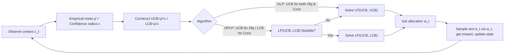

# Contextual Multi-Armed Bandits with Minimum Aggregated Revenue Constraints

**Conference**: ICLR 2026  
**OpenReview**: [https://openreview.net/forum?id=qbhPULMkuQ](https://openreview.net/forum?id=qbhPULMkuQ)  
**Code**: Not released  
**Area**: learning theory  
**Keywords**: multi-armed bandits, contextual bandits, constrained bandits, revenue guarantee, regret bound, linear programming  

## TL;DR
This paper studies a new setting of "Contextual Bandits + Minimum Aggregated Revenue Constraints per arm" (MAB-ARC). It characterizes the optimal allocation using linear programming (LP), proposes two algorithms—Optimistic (OLP) and Optimistic-Pessimistic (OPLP)—and proves via lower bounds that once contexts are introduced, the "free exploration" property relied upon in prior work fails, reactivating the exploration-exploitation tradeoff.

## Background & Motivation
**Background**: Standard multi-armed bandits (MAB) focus only on maximizing cumulative rewards. However, real-world applications often involve various constraints—safety constraints in clinical trials, budget constraints (knapsack bandits), or fairness constraints. An important class of constraints is the "minimum revenue guarantee for every arm," ensuring each content provider on a recommendation platform receives minimum exposure/revenue to maintain their incentive to collaborate.

**Limitations of Prior Work**: Baudry et al. (2024) investigated the **context-free** version of MAB with minimum revenue constraints. In that setting, the optimal policy is to pull each arm linearly according to its revenue guarantee ratio. Since every arm is sampled, the constraints provide **free exploration**, enabling constant regret and $O(\sqrt{T})$ constraint violation. Conversely, Slivkins et al. (2023) and Guo et al. (2024/2025) studied more general **contextual bandits with general stochastic constraints**, but their primal-dual methods only yield $O(\sqrt{T})$ bounds for both regret and violation.

**Key Challenge**: Combining contexts with "aggregated (summed across contexts) minimum revenue constraints" inherently prevents the problem from being decomposed into $|C|$ independent sub-problems. Because constraints are aggregated (providing a single threshold $\lambda_k$ for each arm across all contexts rather than context-specific $\lambda_{k,c}$), the focus shifts from "whether an arm is sub-optimal in a specific context" to a **global planning** problem of "how much more sub-optimal it is compared to others." This causes the closed-form optimal allocation found in standard MAB to vanish.

**Goal**: This paper aims to fill the gap between "context-free minimum revenue constraints" and "general contextual constraints" by providing algorithms and matching lower bounds that exploit the specific structure of the problem without relying on primal-dual methods.

- **Core Idea**: **Characterize the optimal stationary allocation via LP + define a new sub-optimality gap based on the "active constraint set"**. The challenge of directly measuring the sub-optimality of the allocation $w$ relative to $w^\star$ is transformed into a combinatorial problem of "correctly identifying the active constraints $I^\star$," thereby recovering a gap concept analogous to classical MAB.

## Method

### Overall Architecture
The learner observes context $c_t$, selects arm $k_t$, and receives a reward at each step. The goal is to maximize cumulative revenue while ensuring the aggregated revenue across contexts for each arm is $\geq \lambda_k T$. The paper formulates this constrained planning as a **linear program** $\mathrm{LP}(\mu,\mu)$, where the optimal solution $w^\star$ is a stationary allocation (context $\to$ probability distribution over arms). Since $\mu$ is unknown, the algorithm constructs UCB/LCB using empirical means and confidence intervals, solves the LP at each step, and samples accordingly. The OLP and OPLP algorithms apply "optimism/pessimism" to the objective and constraints differently, targeting two distinct points on the performance-violation Pareto front.

### Key Designs

**1. LP-based Stationary Planning: From "No Closed-form" to "Vertex Solutions"** — The original objective is to maximize cumulative revenue over $T$ steps such that the expected aggregated revenue per arm $\geq \lambda_k T$. This work points out that while the optimal solution is generally not unique (as many time-varying policies could satisfy the constraints), one can always construct a **stationary optimal** $w^\star = \frac{1}{T}\mathbb{E}[\sum_t w^\star(t)]$ that satisfies constraints uniformly over time. This $w^\star$ is the solution to $\mathrm{LP}(\mu,\mu):\max_w f(\mu,w)$ s.t. $g_k(\mu,w)\geq\lambda_k,\ w_c\in\Delta_K$, where $f=\sum_c p_c\mu_c^\top w_c$ and $g_k$ is the aggregated revenue for arm $k$. The LP approach maintains computational efficiency but sacrifices the closed-form expressions that Baudry et al. (2024) relied on.

**2. Refined Gap Based on Active Constraint Set $I^\star$** — The LP solution resides on a vertex of the polytope, determined by a set of **binding (active) constraints** denoted by $I^\star$. Specifically, $k\in I^\star\cap\mathcal{K}$ means arm $k$ exactly meets the minimum revenue $g_k(\mu,w^\star)=\lambda_k$, and $(k,c)\in I^\star\cap\mathcal{J}$ means arm $k$ is never selected in context $c$ ($w^\star_{k,c}=0$). Thus, the oracle is equivalent to solving $\mathrm{OPT}(\mu,\mu,I^\star)$ under equality constraints. As measuring allocation sub-optimality is difficult, the paper introduces a metric $\rho(I)=\max(s(I),P(I))$: where the **feasibility gap** $s(I)$ is the minimum relaxation needed to make the constraints in $I$ feasible, and the **performance gap** $P(I)$ measures the revenue loss under that geometry. The worst-case sub-optimality is defined as $\rho^\star=\min_{I\neq I^\star}\rho(I)$, with proofs showing $\rho(I^\star)=0$ and $\rho^\star>0$ (Lemma 3.1). $\rho^\star$ plays the role of the gap in classical MAB, emerging as a new quantity after "combinatorializing" sub-optimality.

**3. OLP (Optimistic) and OPLP (Optimistic-Pessimistic)** — OLP uses **UCB for both** the objective and constraints: $w(t)=\arg\max \mathrm{LP}(\mathrm{UCB}(t),\mathrm{UCB}(t))$. Under feasibility assumptions, the inner problem is always feasible; it **biases towards performance**, achieving polylogarithmic regret but potentially $O(\sqrt{T})$ constraint violation. OPLP employs **asymmetric estimation**: UCB for the objective and LCB for constraints, i.e., solving $\mathrm{LP}(\mathrm{UCB},\mathrm{LCB})$. If infeasible, it falls back to $\mathrm{LP}(\mathrm{UCB},\mathrm{UCB})$. Handling constraints pessimistically adds a safety margin, making OPLP **bias towards constraint satisfaction**, suppressing violations to polylogarithmic levels at the cost of $O(\sqrt{T})$ performance regret. Both are guaranteed by confidence sets $\mathcal{S}_t(\hat\mu,\delta)$ with radius $\epsilon_{k,c}(t)=\sqrt{2\log(2\kappa/\delta)/n_{k,c}(t-1)}$.

**4. Lazy Updates for Computation + Lower Bounds Revealing "Vanishing Free Exploration"** — To reduce the cost of repeatedly solving LPs, **lazy updates** are used: the LP is re-solved only when the pull count for some $(k,c)$ doubles. This ensures only $O(\log T)$ LP calls while maintaining regret bounds. More crucially, the theoretical lower bound (Thm 5.3) shows that in a neighborhood of a nominal instance with $K=3,|C|=3$, any policy satisfies $R+V = \Omega(\sqrt{T})$, and even with $\Omega(\sqrt{T})$ violations, the performance regret remains $\Omega(\log T)$. This proves OLP is near-optimal in $T$ and **refutes the existence of "free exploration" in contextual settings**—Lemma 5.1 further explains that if $K>2$ and $|C|>1$, the optimal allocation must assign zero probability to some $(k,c)$, preventing natural exploration and reactivating the exploration-exploitation tradeoff.

## Key Experimental Results
Being a theoretical work, the experiments are numerical demonstrations on synthetic data (details in Appendix G) to illustrate the $I^\star$ concept and compare against baselines.

### Main Results

| Comparison Target | Source | Relationship |
|:---|:---|:---|
| Optimistic | Guo et al. (2025) | Primal-dual baseline for context + general constraints |
| DOC / SPOC | Baudry et al. (2024) | Algorithm for context-free minimum revenue constraints |
| OLP / OPLP | Ours | LP + Optimistic / Optimistic-Pessimistic |

Experiments also investigate the sensitivity of OPLP to changes in the feasibility margin $\gamma^\star$.

### Theoretical Thoroughness

| Algorithm | Regret $\mathbb{E}[R_T]$ | Violation $\mathbb{E}[V_T]$ | Key Assumptions |
|:---|:---|:---|:---|
| OLP | $O(\log^2 T/\rho^\star)$ | $O(\log^2 T/\rho^\star + \sqrt{\lvert\mathcal{K}\cap I^\star\rvert \log T\, T})$ | Feasible + Non-degenerate (Asm 3) |
| OPLP | $O((\tfrac{1}{\gamma^{\star2}}+\tfrac{1}{\rho^{\star2}})\log^2 T + \sqrt{\lvert\mathcal{K}\cap I^\star\rvert\log T\,T})$ | $O(\tfrac{\lambda}{\gamma^{\star2}}\log^2 T)$ | Strictly Feasible + Non-degenerate (Asm 4) |
| Lower Bound | $\Omega(\log T)$ (Performance) | —— | $R+V=\Omega(\sqrt{T})$ |

### Key Findings
- **OLP adaptive saturation**: When no arm exactly hits the constraint boundary ($\lvert\mathcal{K}\cap I^\star\rvert=0$), both regret and violation degrade to polylogarithmic.
- **Pareto Front ends**: OLP favors performance (polylog regret, $\sqrt T$ violation), while OPLP favors constraints (polylog violation, $\sqrt T$ performance loss).
- **Lower bound conclusion**: In contextual settings, it is impossible to achieve "constant regret + $\sqrt T$ violation" as seen in context-free cases; the free exploration property disappears.

## Highlights & Insights
- **"Combinatorializing" constraint sub-optimality**: Using the active constraint set $I$ and $\rho(I)$ to transform continuous LP sub-optimality into a discrete problem of "guessing the binding set" allows for the recovery of the classical MAB gap framework. This technique is a standalone contribution applicable to any MAB with global linear constraints.
- **Avoiding primal-dual**: The paper points out that primal-dual methods are limited to $O(\sqrt T)$ because they ignore the specific structure; LP + optimism/pessimism directly exploits this structure for polylogarithmic rates.
- **Conceptual insight on "Free Exploration's Boundary"**: It clearly identifies that "constraint-induced exploration" only holds without contexts. Once contexts and sparse optimal allocations appear, constraints no longer force the sampling of all arms, necessitating deliberate exploration design.

## Limitations & Future Work
- **Context distribution known (Asm 2)**: $\{p_c\}$ is assumed known. If relaxed, the estimation target shifts from $\mu_{k,c}$ to $\mu'_{k,c}=p_c\mu_{k,c}$, requiring smoothness assumptions on context distribution.
- **Feasibility assumption**: If $\mathrm{LP}(\mu,\mu)$ is infeasible, the threshold $\lambda_k$ must be heuristically scaled ($\lambda_k\leftarrow\alpha\lambda_k$) to restore feasibility, lacking a unified optimal correction procedure.
- **Finite context/action**: Currently limited to finite $C,K$. Extension to infinite spaces requires linear models $\mu_{k,c}=\langle\theta^\star,\phi(k,c)\rangle$ or RKHS, alongside discretization and approximation error analysis, left for future work.
- **Failure of greedy strategies**: While greedy is effective context-free due to forced exploration, it fails to explore automatically in contextual settings (counter-examples provided in Appendix).
- **Computational overhead**: Solving an LP per round is more expensive than the gradient methods in Guo et al. (2025). This is mitigated by lazy updates, warm-starting, and pre-solving, representing a tradeoff between stronger theoretical guarantees and efficiency.

## Related Work & Insights
- **Context-free minimum revenue**: Baudry et al. (2024) (DOC/SPOC) is a special case and direct baseline. Their "free exploration" is precisely the property this work seeks to transcend.
- **Context + general constraints**: Slivkins et al. (2023), Guo & Liu (2024), and Guo et al. (2025) provide $O(\sqrt T)$ dual bounds via primal-dual. This paper argues that better rates are possible under the specific structure of minimum revenue constraints.
- **Bandits with Knapsacks (BwK)**: e.g., Badanidiyuru et al. (2018), Agrawal et al. (2016). BwK involves hard cumulative budget constraints, whereas this work treats stochastic constraints in expectation, allowing explicit regret-violation tradeoffs.
- **Inspiration**: Treating the identification of the optimal active constraint set as a learning objective is a general approach for LP-type constrained decision-making (monitoring, subset revenue guarantees, etc.), valuable for any sequential decision problem with global linear constraints and contexts.

## Rating
- **Novelty**: ⭐⭐⭐⭐⭐ — Proposes the MAB-ARC setting, bypasses primal-dual using the non-standard gap $\rho(I)$, and theoretically reveals the failure of free exploration under contexts.
- **Experimental Thoroughness**: ⭐⭐⭐ — Purely theoretical work; numerical demonstrations on synthetic data only, reflecting sub-field conventions.
- **Writing Quality**: ⭐⭐⭐⭐ — Motivations, challenges, and contributions are logically progressive. Definitions and theorems are clear, though the high density of gap and sensitivity notations creates a learning curve.
- **Value**: ⭐⭐⭐⭐ — Fills the gap between context-free and general contextual constrained bandits. The gap combinatorialization technique and "free exploration boundary" insights are influential for constrained bandit theory.

<!-- RELATED:START -->

## Related Papers

- [\[ICML 2026\] Online Learning with Recency: Algorithms for Sliding-window Streaming Multi-armed Bandits](../../ICML2026/learning_theory/online_learning_with_recency_algorithms_for_sliding-window_streaming_multi-armed.md)
- [\[ICLR 2026\] Variance-Dependent Regret Lower Bounds for Contextual Bandits](variance-dependent_regret_lower_bounds_for_contextual_bandits.md)
- [\[ICLR 2026\] Towards a Sharp Analysis of Offline Policy Learning for f-Divergence-Regularized Contextual Bandits](towards_a_sharp_analysis_of_offline_policy_learning_for_f-divergence-regularized.md)
- [\[ICLR 2026\] Queue Length Regret Bounds for Contextual Queueing Bandits](queue_length_regret_bounds_for_contextual_queueing_bandits.md)
- [\[ICLR 2026\] Diversified Multinomial Logit Contextual Bandits](diversified_multinomial_logit_contextual_bandits.md)

<!-- RELATED:END -->
