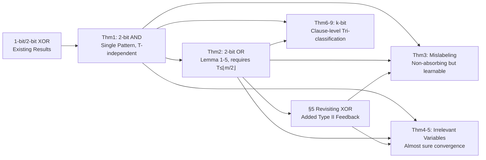

# Convergence Analysis of Tsetlin Machines under Noise-Free and Noisy Training Conditions: From 2 Bits to k Bits

**Conference**: ICLR 2026  
**OpenReview**: [https://openreview.net/forum?id=feOrSQdD9Y](https://openreview.net/forum?id=feOrSQdD9Y)  
**Code**: To be confirmed  
**Area**: Learning Theory / Interpretable Machine Learning / Tsetlin Machine Convergence  
**Keywords**: Tsetlin Machine, Learning Automata, Convergence Proof, Propositional Logic, Label Noise, Absorbing State  

## TL;DR
This paper advances the convergence theory of Tsetlin Machines (TM) from existing 1-bit and 2-bit XOR cases to 2-bit AND/OR, noisy training, and general $k$-bit scenarios. It proves that TM almost surely converges to the correct logical operators under noise-free conditions/irrelevant variables. While it does not converge under mislabeling noise, it remains efficiently learnable. The work also reveals the unique mechanism where the hyperparameter $T$ allows a single clause to jointly represent multiple sub-patterns of the OR operator.

## Background & Motivation

**Background**: The Tsetlin Machine is a classifier based on propositional logic that represents different sub-patterns of a class using a set of "clauses." Each clause is learned by a team of "Tsetlin Automata (TA)," where each TA decides whether to "Include" or "Exclude" a specific literal (feature or its negation). Classification is completed via voting. Due to its purely logical inference, high readability, and hardware-friendly low energy consumption, TM matches or exceeds SOTA performance in tasks like text classification, signal processing, and federated learning.

**Limitations of Prior Work**: Despite strong empirical results, theoretical guarantees for TM have remained fragmented. Previous work only proved convergence for 1-bit Identity/NOT operators (revealing the role of hyperparameter $s$, Zhang et al. 2022) and the 2-bit XOR operator (revealing the role of hyperparameter $T$, Jiao et al. 2023), both restricted to **noise-free** conditions. Fundamental AND and OR operators were not analyzed, noisy training (mislabeling, irrelevant variables) remained unaddressed, and since real applications typically booleanize data into $k$-bit representations, 2-bit conclusions do not cover practical operating ranges.

**Key Challenge**: The 2-bit proof relies heavily on the **exhaustion** of TA states. As the number of bits increases, combinatorial explosion occurs, making direct extrapolation to $k$-bit impossible. Furthermore, sub-patterns of XOR are mutually exclusive (each must be represented by a precise two-literal clause), whereas sub-patterns of OR/AND **share features**. This leads to fundamentally different learning dynamics that cannot simply reuse XOR proof techniques.

**Goal**: To establish a unified convergence theory covering "AND/OR/XOR × Noise-free/Mislabeling/Irrelevant Variables × 2-bit to $k$-bit."

**Core Idea**: **(Contribution 1)** Replace previous stationary distribution analysis with "absorbing state" analysis, combined with a quasi-stationary technique (freezing some TAs while observing transitions of others) to clarify 2-bit AND/OR convergence case-by-case. **(Contribution 2)** To address $k$-bit combinatorial explosion, shift the analysis granularity from "literal-level states" to "clause-level categories"—grouping clauses into "Exact Match," "Partial Match," and "Mismatch"—to analyze transitions between these three categories, bypassing exponential growth.

## Method

### Overall Architecture

This paper is not an algorithm but a **convergence proof system**. It starts with the simplest single-pattern operator (AND) to build foundational tools, addresses the multi-pattern OR with shared features, corrects ignored Type II feedback in XOR, extends noise-free conclusions to two types of noise (mislabeling, irrelevant variables), and finally uses "clause-level clustering" to unlock the $k$-bit domain. The core mechanisms throughout are two hyperparameters: $s$ controls clause granularity, and $T$ regulates feedback resource allocation via Eq.(3)(4), determining if the system can enter an absorbing state.

### Key Designs

**1. Absorbing State Analysis + Quasi-stationary Freezing: Decomposing joint TA dynamics into exhaustible local transitions.** TM convergence is defined as "the states of all TAs no longer change," meaning the system enters a unique absorbing state. For 2-bit AND, there is only one sub-pattern $x_1{=}1, x_2{=}1$ triggering positive output. Using a single clause (4 TAs: $x_1, \neg x_1, x_2, \neg x_2$), the target absorbing state is the TA action $(I, E, I, E)$ corresponding to clause $x_1 \wedge x_2$. The authors **freeze two TAs of the first bit** and track only the second bit's transitions. After analyzing 128 transition instances across various cases, they prove $(I, E, I, E)$ is the unique absorbing state. **Theorem 1**: Under noise-free AND samples where $u_1>0, u_2>0$, any clause almost surely converges to $x_1 \wedge x_2$ over infinite time. A key conclusion is that AND absorbs without requiring $T$.

**2. Joint Representation of OR and $T \le \lfloor m/2 \rfloor$ Condition: Proving multi-pattern absorption requires $T$.** OR has three positive sub-patterns $(0,1), (1,0), (1,1)$ which **share features**. For example, $T$ clauses of form $x_1$ vote for both $(1,0)$ and $(1,1)$. **Theorem 2** relies on Lemma 1–5: Lemma 2 proves that when multiple sub-patterns appear without $T$ (i.e., $u_1>0, u_2>0$), the system is **non-absorbing**, proving $T$ is indispensable. Lemma 4 derives the condition $T \le \lfloor m/2 \rfloor$: while three sub-patterns might seem to require $3T$ clauses, a single clause can jointly represent two patterns, thus $2T$ clauses suffice for three patterns to each receive $T$ votes. $T$ suppresses feedback probability to 0 once a pattern has enough votes, freezing the system into an absorbing state.

**3. Revisiting XOR with Type II Feedback: Explaining why XOR clauses must be exact.** Previous XOR proofs omitted Type II feedback. This paper completes it: since XOR sub-patterns are mutually exclusive, even if $T$ clauses converge to $C=x_1$, Type II feedback from $([1,1], y{=}0)$ will penalize the "Exclude $\neg x_2$" TA with probability 1, forcing it to include $\neg x_2$. This explains why XOR absorbing clauses must take the exact forms $x_1 \wedge \neg x_2$ or $\neg x_1 \wedge x_2$, whereas OR absorbing clauses can be more varied.

**4. The Divide Between Noise Types: Mislabeling disrupts absorption, irrelevant variables do not.** **Mislabeling noise** (producing conflicting labels for the same input) pulls clauses between Type I (learning 1) and Type II (learning 0) feedback. **Theorem 3**: AND/OR/XOR are **non-absorbing** under mislabeling noise. However, Remark 4 notes that TM remains efficient at learning the operator, fitting PAC-learnable or $\epsilon$-optimal concepts. **Irrelevant variables** (bits not involved in classification) do not prevent convergence. **Theorem 4/5**: TM almost surely converges for AND ($T \le m$) and XOR/OR ($T \le \lfloor m/2 \rfloor$) even with $q>0$ irrelevant variables.

**5. Clause-level Tri-classification: Bypassing combinatorial explosion in $k$-bit.** To avoid exponential state growth, the authors categorize clauses into: (1) **Exact Match** (e.g., $x_1 \wedge x_2$ for AND); (2) **Partial Match** (e.g., $x_1$ for AND); (3) **Mismatch** (e.g., $\neg x_1$). By analyzing transitions between these three types, they prove that the system absorbs once it reaches Type (1), while (2) and (3) are non-absorbing. This yields **Theorem 6** (single pattern convergence) and **Theorem 7** (multi-pattern convergence where $T \le \lfloor m/e \rfloor$ for $e$ sub-pattern clusters).

## Key Experimental Results

This is primarily a theoretical work; major theorems are rigorous proofs of almost sure convergence. Empirical data is provided in the appendix as support.

### Theoretical Summary table

| Operator / Setting | Absorbing (Noise-free) | $T$ Condition for Convergence | Key Characteristic |
|---|---|---|---|
| 2-bit AND (Thm 1) | Yes | $T$-independent | Single pattern, unique absorbing state $(I,E,I,E)$ |
| 2-bit OR (Thm 2) | Yes | $T \le \lfloor m/2 \rfloor$ | Single clause can jointly represent two patterns |
| 2-bit XOR (§5) | Yes | $T \le \lfloor m/2 \rfloor$ | Mutually exclusive patterns, exact clauses required |
| $k$-bit Single Pattern (Thm 6) | Yes | $u_1, u_2 > 0$ | Clause-level tri-classification proof |
| $k$-bit Multi-pattern (Thm 7) | Yes | $T \le \lfloor m/e \rfloor$ ($e$=clusters) | Joint representation by pattern clusters |

### Noise Robustness Table

| Noise Type | AND | OR | XOR | Conclusion |
|---|---|---|---|---|
| Mislabeling (Thm 3) | Non-absorbing | Non-absorbing | Non-absorbing | Conflicting labels cause oscillation, but learning remains efficient |
| Irrelevant Variables (Thm 4/5/8/9) | Convergent ($T \le m$) | Convergent ($T \le \lfloor m/2 \rfloor$) | Convergent ($T \le \lfloor m/2 \rfloor$) | Almost sure convergence, holds for $k$-bit |

### Key Findings
- $T$ is the critical parameter for entering absorbing states in multi-pattern and irrelevant variable scenarios.
- The "joint representation" in OR/k-bit allows the lower bound of clauses to be relaxed from $\lfloor m/(\text{patterns})\rfloor$ to $\lfloor m/e\rfloor$, though this may slightly reduce interpretability of individual clauses.
- TM is theoretically robust to irrelevant variables; they are either excluded or neutralized by pairs of clauses.

## Highlights & Insights
- The **shift from literal-level to clause-level analysis** is the most elegant contribution, compressing an exponential state space into three types of transitions to solve the $k$-bit problem.
- The **joint representation mechanism of OR** is rigorously characterized for the first time, explaining why OR has more flexible absorbing clause forms.
- Provides a **practical guide**: if the number of sub-patterns and cluster structure can be estimated, one can select a proper initial $T$ to reduce tuning effort.
- The contrast between mislabeling and irrelevant variables provides a clear theoretical boundary for TM noise robustness.

## Limitations & Future Work
- **Non-absorption under mislabeling**: The paper only proves a lack of absorption; a formal proof for "efficient learning (PAC/$\epsilon$-optimal)" in this state remains an open problem.
- Lack of quantitative guarantees for cases where $T > \lfloor m/e \rfloor$.
- Analysis is restricted to **positive polarity clauses and purely random noise**; complex settings like negative clauses, structured noise, or regression TMs are not yet covered.
- Results focus on asymptotic "almost sure convergence" rather than non-asymptotic bounds for convergence rates or sample complexity.

## Related Work & Insights
- **TM Convergence Genealogy**: 1-bit Identity/NOT (Zhang et al. 2022) $\to$ 2-bit XOR (Jiao et al. 2023) $\to$ This work (AND/OR, noise, $k$-bit). Methodologically shifts from stationary distribution to absorbing state analysis.
- **Concept Learning**: While learning $k$-bit operators is a classic problem (Valiant 1984), TM's specific mechanism of constructing conjunctive expressions from samples requires this dedicated analysis.
- **Practical Implication**: For transparent AI, understanding that resource surplus can lead to the absorption of irrelevant literals helps practitioners balance accuracy and interpretability by limiting clause length or count.

## Rating
- **Novelty**: ⭐⭐⭐⭐ First convergence proofs for 2-bit AND/OR, noise, and $k$-bit. The tri-classification and joint representation concepts are original.
- **Experimental Thoroughness**: ⭐⭐⭐ Comprehensive as a theory paper, but empirical support for efficient learning under mislabeling is missing a formal proof.
- **Writing Quality**: ⭐⭐⭐⭐ Logical progression from AND to $k$-bit. Remarks successfully translate proof insights into practical guidance.
- **Value**: ⭐⭐⭐⭐ Provides foundational theory for the TM community; conclusions on $T$ configuration directly guide real-world deployment.

<!-- RELATED:START -->

## Related Papers

- [\[ICLR 2026\] A Sharp KL Convergence Analysis for Diffusion Models under Minimal Assumptions](a_sharp_kl_convergence_analysis_for_diffusion_models_under_minimal_assumptions.md)
- [\[ICLR 2026\] Training-Free Determination of Network Width via Neural Tangent Kernel](training-free_determination_of_network_width_via_neural_tangent_kernel.md)
- [\[ICLR 2026\] Theoretical Analysis of Contrastive Learning under Imbalanced Data: From Training Dynamics to a Pruning Solution](theoretical_analysis_of_contrastive_learning_under_imbalanced_data_from_training.md)
- [\[ICLR 2026\] On the Convergence of Two-Layer Kolmogorov-Arnold Networks with First-Layer Training](on_the_convergence_of_two-layer_kolmogorov-arnold_networks_with_first-layer_trai.md)
- [\[ICLR 2026\] Finite-Time Convergence Analysis of ODE-based Generative Models for Stochastic Interpolants](finite-time_convergence_analysis_of_ode-based_generative_models_for_stochastic_i.md)

<!-- RELATED:END -->
