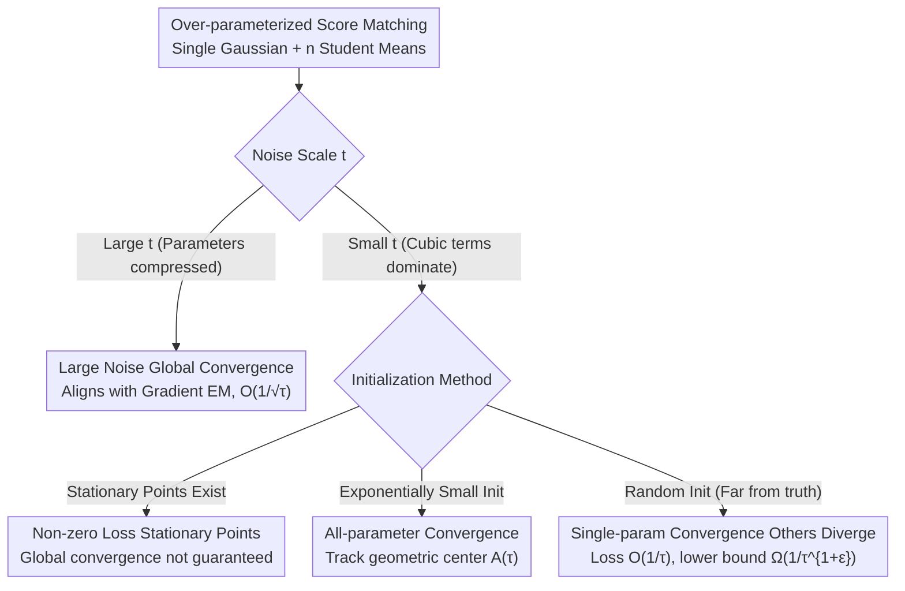

# Convergence Dynamics of Over-Parameterized Score Matching for a Single Gaussian

**Conference**: ICLR 2026  
**OpenReview**: [https://openreview.net/forum?id=VDIH6L8ANo](https://openreview.net/forum?id=VDIH6L8ANo)  
**Code**: Provided in supplementary materials (no public repository given)  
**Area**: Learning Theory / Diffusion Model Theory / Optimization Convergence Analysis  
**Keywords**: Score matching, Over-parameterization, Gradient descent convergence, Gaussian mixture, Optimization dynamics

## TL;DR
This paper theoretically analyzes the convergence dynamics of gradient descent on the score matching objective when learning a single Gaussian distribution using an over-parameterized student model ($n \ge 2$ learnable means). It proves global convergence under large noise scales and reveals two distinct phase transitions at small noise scales: "all parameters converge" vs. "one parameter converges while others diverge to infinity, yet loss vanishes at $O(1/\tau)$". A nearly matching lower bound is also provided.

## Background & Motivation

**Background**: Diffusion models (DDPM, score-based SDE) have become the mainstream framework for image and audio generation. Their core is learning the "score function," which is the gradient of the log-density of the noisy distribution $\nabla_x \ln q_t(x)$ at various noise scales. The training objective is the score matching loss $L_t(s_t)=\mathbb{E}_{X_t\sim q_t}\big[\,\|s_t(X_t)-\nabla_x\ln q_t(X_t)\|^2\,\big]$.

**Limitations of Prior Work**: Most diffusion model theories focus on the "sampling side"—assuming a perfect or approximate score oracle exists to prove that reverse SDE sampling approaches the true distribution. However, on the "training side"—whether gradient descent can actually learn the score function—understanding remains weak. A few training-side works (Shah et al. 2023) only cover the **exactly-parameterized** case, where the number of student components must match the number of components in the true Gaussian mixture.

**Key Challenge**: In practice, the number of components in the true distribution is unknown, and diffusion models are almost always **over-parameterized**, using far more parameters than necessary. Over-parameterization is the most difficult part of the analysis: parameter redundancy leads to non-unique optima, and optimization dynamics exhibit phenomena like "slow convergence" or "parameter divergence" that do not exist in the exactly-parameterized case. Existing over-parameterized results (Xu et al. 2024) are restricted to the **Gradient EM** algorithm, whose updates only contain linear terms. In contrast, score matching gradients contain **cubic terms** that dominate the direction when parameters are far from the truth, leading to completely different dynamics.

**Goal**: To condense the problem into the simplest laboratory setting—the true distribution is a **single** standard Gaussian $q=\mathcal{N}(\tilde\mu^*,I_d)$, and the student uses $n \ge 2$ learnable means $\tilde\mu_1,\dots,\tilde\mu_n$ to fit it. The question is: **Can gradient descent on the score matching objective achieve global convergence under over-parameterization?** This is analyzed across noise scales $t$: large $t$, small $t$, and random initialization.

**Key Insight**: The authors discovered that the first term of the score matching gradient, $w_i(x)v(x)$, exactly equals the gradient of Gradient EM, while the rest are "higher-order cubic corrections." At large noise scales (where parameters are forced to be very small), the cubic terms are negligible, allowing the use of Gradient EM analytical tools. At small noise scales, the cubic terms cannot be ignored, requiring new techniques such as tracking the evolution of the "geometric center" of the parameters.

**Core Idea**: Use the single Gaussian as a toy over-parameterized model to characterize phase transitions in gradient descent across noise scales. It proves global convergence for large noise, whereas for small noise, all-parameter convergence only occurs under exponentially small initialization. Under random initialization, the system degrades to "single-parameter convergence + loss vanishing slowly at $1/\tau$," with a nearly matching lower bound.

## Method

### Overall Architecture

This is a **theoretical analysis** paper rather than an "algorithm/system" paper. The "method" consists of the problem setting and a set of convergence proofs expanded by regime. The logic follows two axes: decreasing noise scale $t$ and initialization ranging from controlled to random.

**Problem Setting**: The true distribution is a single Gaussian which, after the OU forward process, becomes $q_t=\mathcal{N}(\mu^*_t,I_d)$ where $\mu^*_t=\tilde\mu^*\exp(-t)$. The true score is $\nabla_x\ln q_t(x)=\mu^*_t-x$. The student model mimics the Gaussian mixture score form:

$$s_t(x)=\sum_{i=1}^n w_{i,t}(x)\,\mu_{i,t}-x,\qquad w_{i,t}(x)=\frac{\exp(-\|x-\mu_{i,t}\|^2/2)}{\sum_{j=1}^n \exp(-\|x-\mu_{j,t}\|^2/2)},$$

using $n$ softmax-weighted means to approximate the single true mean. Gradient descent $\mu_i^{(\tau+1)}=\mu_i^{(\tau)}-\eta\nabla_{\mu_i}L$ is run on the population loss $L_t(s_t)=\mathbb{E}_{x\sim\mathcal{N}(\mu^*_t,I_d)}\big[\,\|\sum_i w_{i,t}(x)\mu_{i,t}-\mu^*_t\|^2\,\big]$ at a fixed $t$. By shifting $\mu_i \to \mu_i - \mu^*_t$, the target is set to $\mu^*=0$ (Eq. 1), standardizing the analysis to a parameter contraction problem towards the origin.

The conclusions can be visualized as a "regime phase diagram":

### Key Designs

**1. Large Noise Regime: Aligning Score Matching with Gradient EM**

To address the lack of training-side convergence guarantees, the authors first solve the easier large noise case. The intuition is that when $t$ is sufficiently large ($t>\log n+\log M+2$, $M=\max_i\|\tilde\mu_i^{(0)}-\mu^*\|$), then $\|\mu_{i,t}^{(0)}-\mu^*_t\|\le M\exp(-t)\le \tfrac{1}{3n}$, forcing all parameters into a small ball near the origin. Expanding the gradient (Lemma 2.2):

$$\nabla_{\mu_i}L=2\mathbb{E}_x\Big[w_i v + w_i\sum_j w_j\mu_j\mu_j^\top\mu_i - 2w_i v v^\top\mu_i - 2w_i\sum_j w_j(v^\top\mu_j)\mu_j + 3w_i(v^\top v)v\Big],$$

where $v(x)=\sum_i w_i(x)\mu_i$. When $\|\mu_i\|$ is small, the first term $w_i v$ dominates, while the others contain cubic products of $\mu$ and are negligible. The key insight is: **$w_i v$ is exactly the population loss gradient of Gradient EM** (Xu et al. 2024). Adapting the Gradient EM proof yields Theorem 2.1—the loss converges at $L_t(s_t^{(\tau)})\le O\big(\tfrac{n^3 d^2}{\sqrt{\eta\tau}}\big)$. This $O(1/\sqrt\tau)$ rate matches the best known rate for over-parameterized Gradient EM. This design extends the equivalence between DDPM training and Gradient EM to the over-parameterized regime.

**2. The Small Noise "Obstacle": Existence of Non-zero Loss Stationary Points**

At small $t$, cubic terms are non-negligible. Theorem 3.1 proves the existence of stationary points where the gradient is zero but the loss is non-zero ($n \ge 3$). This implies that global convergence cannot be guaranteed from **arbitrary** initialization. The construction involves setting $\mu_1=se_1, \mu_2=-se_1, \mu_i=0 \,(i \ge 3)$. Due to symmetry, gradients are zero for $i \ge 3$, and $\nabla_{\mu_1}L+\nabla_{\mu_2}L=0$. Since the loss is zero at both $s=0$ (origin) and $s \to +\infty$ (ignored components), but strictly positive in between, a local maximum stationary point must exist by continuity.

**3. Exponentially Small Initialization for All-Parameter Convergence: Tracking the "Geometric Center"**

If arbitrary initialization fails, what condition ensures **all** $\mu_i$ converge? Theorem 3.2 guarantees that if $\|\mu_i^{(0)}\|\le \tfrac{1}{108nd}\exp(-106ndM_0^3)$, each $\mu_i$ converges to $\mu^*$, and the loss decays at $O(1/\sqrt{\tau})$. The proof technique involves **maintaining a reference point $A(\tau)$ (the geometric center)** that evolves as $A^{(\tau+1)}=A^{(\tau)}-\tfrac{\eta}{n}A^{(\tau)}$. Lemma 3.3 proves that as long as $A^{(\tau)}>\tfrac{1}{6n}$, all parameters stay close to this contracting reference point. Once $A^{(\tau)}$ shrinks below $\tfrac{1}{6n}$, the problem reduces to the large-noise ball setting of Theorem 2.1.

**4. Necessity of Small Init + Random Init Phase Transition: Single-Param Convergence and $O(1/\tau)$ Rate**

Theorem 3.4 provides a counterexample showing the exponential condition is **necessary**. If $\mu_1^{(0)}=(\epsilon_0,0,\dots)$ with $\epsilon_0=\exp(-M_0/100)$ and other $\mu_i^{(0)}=0$, only $\mu_1$ converges while $\|\mu_i\|\to\infty$, demonstrating extreme sensitivity. For **random initialization** ($M_0>10^9\sqrt d\,n^{10}$), Theorem 3.5/Corollary 3.6 prove a phase transition with high probability: **exactly one parameter converges to the truth, while all others diverge to infinity, yet the training loss still vanishes at $O(1/\tau)$**. Finally, Theorem 3.7 provides a nearly matching **lower bound** $L_0(s_0^{(\tau)})\ge \tfrac{c}{\tau^{1+\epsilon}}$, contrasting sharply with the **linear convergence** of exactly-parameterized cases (Shah et al. 2023). Over-parameterization slows convergence from exponential/linear to polynomial in the small noise regime.

### Loss & Training

The analysis focuses on pure gradient descent (not SGD) on the **population loss**, fixing noise scale $t$ and directly updating parameters $\mu_{i,t}^{(\tau+1)}=\mu_i^{(\tau)}-\eta\nabla_{\mu_i}L_t$. Step sizes are small constants $\eta \le O(1/(n^4 d^2))$ to ensure descent. These results derive strictly from the precise characterization of gradient dynamics.

## Key Experimental Results

The experiments validate the predicted phase transitions. Settings: $n=5, d=3$, true value $\mu^*=(0,0,0)$. $\mu_i$ is initialized as $(M,0,0)+10^{-7}z_i$ with $z_i\sim\mathcal{N}(0,I_d)$. $\eta=0.01$, 20,000 iterations, batch size 20,000.

### Main Results (Verification of Phase Transitions)

| Initial Scale $M$ | Observed $\|\mu_i\|$ Behavior | Loss Behavior | Theorem |
|-------------------|-------------------------------|---------------|---------|
| $M=4$ | **All** parameters converge | Loss $\to 0$ | §3.2 All-param convergence |
| $M=6$ | **Only one** converges; others diverge | Log-log loss slope $\approx -1$ ($O(1/\tau)$) | §3.3 Single-param convergence |

### Key Findings
- **Sensitivity to $M$**: A fixed $10^{-7}$ perturbation leads to qualitatively different outcomes when $M$ changes from 4 to 6, confirming the necessity of exponentially small initialization (Theorem 3.4).
- **Visualization of $1/\tau$ rate**: For $M=6$, the log-log loss curve approaches a slope of $-1$, matching the $O(1/\tau)$ theory and the $\Omega(1/\tau^{1+\epsilon})$ lower bound.
- **Large noise is "better behaved"**: Large noise compresses parameters into a region where dynamics degrade to Gradient EM, making them stable. Small noise is dominated by cubic terms and is highly sensitive—providing a theoretical hint as to why diffusion training averages across multiple noise scales.

## Highlights & Insights
- **Gradient EM Connection**: The observation that the lead term is Gradient EM acts as a pivot, connecting DDPM training to classical statistical algorithms.
- **Geometric Center Tracking**: Maintaining a "self-contracting reference point + total adhesion" is a transferable proof technique for over-parameterized teacher-student analysis.
- **Loss Convergence $\neq$ Parameter Recovery**: Random initialization leads to vanishing loss even as $n-1$ parameters diverge to infinity, serving as a reminder that low training loss does not imply learning the correct solution structure in over-parameterized models.
- **Novelty**: According to the authors, this is the first work to establish global convergence guarantees for Gaussian mixtures with $\ge 3$ components under the score matching framework.

## Limitations & Future Work
- **Single Target Gaussian**: Does not yet handle mixtures of even two Gaussians as targets.
- **Fixed Noise Scale $t$**: Does not account for time-averaging across noise scales used in practice.
- **Population Loss / GD**: Does not address stochastic optimizers (SGD, Adam) or finite-sample noise.
- **Pessimistic Constants**: Thresholds (e.g., $M_0>10^9\sqrt d\,n^{10}$) are far from practical scales.
- **Intermediate Regime**: Dynamics between "exponentially small" and "random/far" initialization remain an open problem.

## Related Work & Insights
- **vs. Shah et al. (2023)**: They analyzed exactly-parameterized cases with linear convergence; **Ours** addresses over-parameterization, revealing polynomial $O(1/\tau)$ rates and removing the known-component assumption.
- **vs. Xu et al. (2024)**: They handled Gradient EM (linear updates); **Ours** manages score matching (cubic terms).
- **vs. Sampling Theory**: While others prove sampling convergence assuming a score oracle, **Ours** bridges the training gap—showing if the score can actually be learned.
- **vs. Classic GMM Learning**: Resonates with findings that over-parameterization slows convergence, a universal phenomenon also seen in two-layer networks and matrix sensing.

## Rating
- Novelty: ⭐⭐⭐⭐⭐ First to characterize phase transitions in over-parameterized score matching.
- Experimental Thoroughness: ⭐⭐⭐ Theoretical paper; experiments are small-scale ($n=5, d=3$) but sufficient to verify phase transitions.
- Writing Quality: ⭐⭐⭐⭐ Clear regime division, though constants are dense.
- Value: ⭐⭐⭐⭐ Fills a gap in "training-side" over-parameterized theory.

<!-- RELATED:START -->

## Related Papers

- [\[ICML 2026\] On the Robustness of Langevin Dynamics to Score Function Error](../../ICML2026/learning_theory/on_the_robustness_of_langevin_dynamics_to_score_function_error.md)
- [\[ICLR 2026\] Score-Based Density Estimation from Pairwise Comparisons](score-based_density_estimation_from_pairwise_comparisons.md)
- [\[ICLR 2026\] Fast Escape, Slow Convergence: Learning Dynamics of Phase Retrieval under Power-Law Data](fast_escape_slow_convergence_learning_dynamics_of_phase_retrieval_under_power-la.md)
- [\[ICLR 2026\] On the Interpolation Effect of Score Smoothing in Diffusion Models](on_the_interpolation_effect_of_score_smoothing_in_diffusion_models.md)
- [\[ICLR 2026\] Parameterized Hardness of Zonotope Containment and Neural Network Verification](parameterized_hardness_of_zonotope_containment_and_neural_network_verification.md)

<!-- RELATED:END -->
