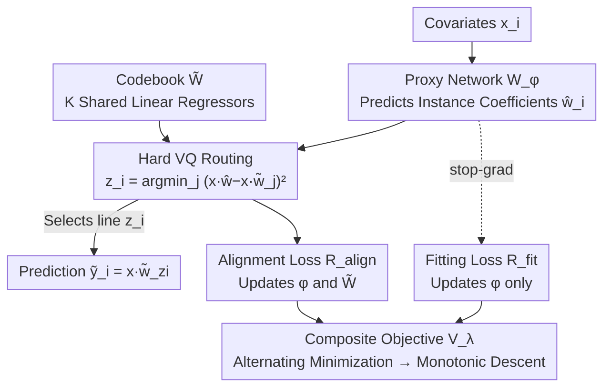

# Covariate-Guided Clusterwise Linear Regression for Generalization to Unseen Data

**Conference**: ICLR2026  
**OpenReview**: [https://openreview.net/forum?id=1XowCDuqSM](https://openreview.net/forum?id=1XowCDuqSM)  
**Code**: TBD  
**Area**: Learning Theory / Tabular Regression / Clusterwise Linear Regression  
**Keywords**: clusterwise regression, covariate-guided routing, vector quantization, convergence analysis, PAC generalization bounds

## TL;DR
Targeting regression tasks where tabular data is only locally linear, this paper proposes CG-CLR: it uses a proxy network to generate local coefficients for each sample, then routes them via **hard vector quantization** to one of $K$ shared linear regressors. This allows **simultaneous learning of "how to allocate new samples" and "linear models for each cluster"** within a single gradient loop, supported by convergence proofs, PAC generalization bounds, and an F-test method for selecting the number of clusters $K$.

## Background & Motivation
**Background**: In many tabular regression problems, the relationship between covariates $x_i \in \mathbb{R}^p$ and responses $y_i \in \mathbb{R}$ is **only approximately linear within local regions** of the input space; a single global line cannot fit this heterogeneity. Classic Clusterwise Linear Regression (CLR) takes a middle ground: it learns $K$ local linear regressors $\{\tilde w_j\}_{j=1}^K$ and $N \times K$ binary indicator variables $\alpha_{i,j}$ (each sample belongs to one cluster), aiming to minimize $\frac{1}{N} \sum_i \big(y_i - x_i^\top \sum_j \alpha_{i,j} \tilde w_j \big)^2$. It preserves the interpretability of local linear models while accommodating heterogeneity through clustering.

**Limitations of Prior Work**: CLR-based methods suffer from two fundamental flaws in "single-point prediction" tasks (where a new covariate $x_{i'}$ arrives without a ground-truth response $y_{i'}$, requiring an immediate prediction). First, **most algorithms decouple clustering from regression**—Mixed Integer Programming, column generation, and alternating algorithms only fit samples to $K$ lines but **lack explicit allocation rules for unseen samples**. At test time, they rely on post-hoc heuristics like "nearest neighbor," leading to assignment bias, overfitting, and generalization loss. Second, although **Sparse MoE or tree-splitting schemes** integrate gating and regression, they suffer from **unstable convergence and heavy reliance on heuristics**, and axis-aligned splits cannot capture true diagonal assignment boundaries.

**Key Challenge**: The two goals of CLR—fitting $K$ local lines and routing new samples to the correct line—either **cannot be achieved simultaneously or lack convergence guarantees** in existing frameworks. More critically, the ideal "select the regressor with the minimum error" objective requires knowing $y_i$ (response-dependent), which is **infeasible at test time** for single-point prediction.

**Goal**: To learn end-to-end (i) a routing rule that depends **only on covariates and is independent of the response**, and (ii) the corresponding $K$ linear regressors, with theoretical guarantees for convergence and generalization, without assuming the data is generated by $K$ specific linear models (agnostic / non-realizable setting).

**Key Insight**: The authors draw inspiration from the "codebook + vector quantization" mechanism of VQ-VAE. Since the response cannot be used to select a regressor at test time, a network is used to **first predict a "most suitable coefficient vector" for a sample**, which then routes the sample to the "closest predicted" line in a codebook. This routing depends only on $x$, naturally satisfying the single-point prediction constraint.

**Core Idea**: Integrate allocation rules and local regressors into the same differentiable gradient loop for joint learning using a "proxy network for coefficient prediction + hard vector quantization for routing to codebook regressors + dual loss (fitting + alignment)."

## Method

### Overall Architecture
CG-CLR (Covariate-Guided CLR) maintains two learnable components: a **codebook** $\tilde W = [\tilde w_1, \dots, \tilde w_K] \in \mathbb{R}^{(p+1) \times K}$ with $K$ columns (each column is an augmented local linear regressor, with the last row as bias), and a **proxy network** $W_\phi$ (an $M$-layer ReLU MLP). During the forward pass, the proxy network maps the covariate $x_i$ to an **instance-specific coefficient vector** $\hat w_i := W_\phi(x_i) \in \mathbb{R}^{p+1}$. A vector quantizer compares the proxy prediction $\hat y_i = x_i^\top \hat w_i$ against the predictions of the $K$ lines in the codebook $\{x_i^\top \tilde w_j\}$, performing **hard routing** to the line with the closest prediction (index $z_i$). The final prediction is $\tilde y_i = x_i^\top \tilde w_{z_i}$. During training, two losses are calculated—fitting loss $R_{\text{fit}}$ and alignment loss $R_{\text{align}}$. Stop-gradient is used to control the flow of gradients, and the entire system is optimized in an **alternating minimization** loop (assignment → update proxy → update codebook).

As $K$ varies, CG-CLR smoothly spans the spectrum from "a single global line ($K=1$)" to "nearly one line per sample ($K \approx N/(p+1)$)," providing users with a continuous knob to adjust between model simplicity and predictive flexibility.

### Key Designs

**1. Covariate-Guided "Proxy Network + Codebook" Dual Structure: Making Routing Differentiable Without Responses**

The bottleneck of CLR is that "regressors cannot be selected at test time without $y_{i'}$." The ideal oracle risk $L^\star(\tilde W) = \mathbb{E} \big[ \min_j (y_i - x_i^\top \tilde w_j)^2 \big]$ requires the response in the inner min, which is NP-hard and test-time infeasible. CG-CLR solves this by introducing a **response-independent proxy** $\hat w_{i'} = W_\phi(x_{i'})$. The proxy network is trained to predict "which line's coefficients this sample most resembles." The routing rule 

$$z_{i'} := \arg\min_{j \in [K]} \big(x_{i'}^\top \hat w_{i'} - x_{i'}^\top \tilde w_j\big)^2$$

**depends only on $x_{i'}$**, making it valid at test time. This step is a form of vector quantization: it tightly couples the proxy space and the codebook, allowing downstream objective gradients to update both the proxy parameters $\phi$ and the codebook $\tilde W$. The proxy network's final layer is linear without activation to ensure $\hat w_i$ can take any real value. Compared to post-hoc nearest-neighbor clustering, the allocation rule here is **learned alongside the regressors**, fundamentally eliminating assignment bias.

**2. Dual Loss + Stop-Gradient: Separating "Fitting" and "Alignment" Functions**

Training the proxy and codebook with a single loss simultaneously can lead to interference; updating the proxy might degrade the current cluster's fit. Based on VQ-VAE, the authors designed two complementary losses. The **fitting loss** $R_{\text{fit}}$ uses stop-gradient to freeze the codebook, allowing gradients to flow only back to the proxy:

$$R_{\text{fit}}(\phi, \tilde W^{\text{stop}}) := \frac{1}{N} \sum_i \Big( y_i - x_i^\top \big( \hat w_i - \hat w_i^{\text{stop}} + \tilde w_{z_i}^{\text{stop}} \big) \Big)^2$$

Since $\hat w_i - \hat w_i^{\text{stop}}$ cancels to 0 during the forward pass, this loss is **equivalent to the squared error of the frozen prediction $x_i^\top \tilde w_{z_i}$**, but in the backward pass, $\nabla_{\tilde W} R_{\text{fit}} = 0$ and $\nabla_\phi R_{\text{fit}} \neq 0$. The proxy receives standard regression gradients **without increasing the current intra-cluster loss**. The **alignment loss** $R_{\text{align}}(\phi, \tilde W) := \frac{1}{N} \sum_i \big( x_i^\top (\hat w_i - \tilde w_{z_i}) \big)^2$ flows to both $\phi$ and $\tilde W$, forcing proxy predictions to align with the routed codebook line, thereby improving subsequent allocation. The composite objective is mixed with weight $\lambda \ge 0$:

$$V_\lambda(\phi, \tilde W) := R_{\text{fit}}(\phi, \tilde W^{\text{stop}}) + (1+\lambda) R_{\text{align}}(\phi, \tilde W)$$

A larger $\lambda$ emphasizes closing the proxy-codebook gap (for faster long-term convergence), while $\lambda=0$ weights fitting and alignment equally. A key observation: as $R_{\text{align}} \to 0$, each proxy prediction converges to its codebook line prediction, and $R_{\text{fit}}$ degenerates back to the response-aware min-loss—meaning **minimizing $V_\lambda$ approaches the oracle goal while keeping the routing response-free throughout**.

**3. Alternating Minimization Training: Block Coordinate Updates + Differentiable Pipeline**

Training involves two-step block coordinate updates per epoch. **Assignment Step**: For each sample in a mini-batch, calculate $\hat w_i = W_{\phi^{(t)}}(x_i)$ and $z_i$, then cache the partitions $\{S_j\}$. **Proxy Update Step**: Fix the assignment, backpropagate $V_\lambda$, and use stop-gradient to update only $\phi$ while the codebook remains frozen: $\phi^{(t+1)} = \phi^{(t)} - \eta \nabla_\phi V_\lambda$. **Codebook Update Step**: Fix the proxy. Since $R_{\text{fit}}$ has a stop-gradient on $\tilde W$, this degenerates into a pure alignment step: $\tilde W^{(t+1)} = \tilde W^{(t)} - \eta \nabla_{\tilde W} R_{\text{align}}$. The codebook is initialized by sampling $\mathrm{Unif}(-1/K, 1/K)$ element-wise, and features are standardized to make slope and bias scales comparable. At test time, given a new $x_{i'}$, either the proxy generates coefficients to route and predict via the codebook $\tilde y(x_{i'}) = x_{i'}^\top \tilde w_{z_{i'}}$, or an alternative mode directly uses the proxy coefficients $\hat y(x_{i'}) = x_{i'}^\top W_\phi(x_{i'})$.

**4. F-test for Selecting $K$: Turning "Should a New Line be Added" into a Statistical Significance Test**

CG-CLR concatenates the covariates of all $K$ regressors into a large design matrix, allowing the entire model to be viewed as a nested linear model. This enables the use of the classic F-statistic to quantify **effective model complexity**. Sequential determination of adding a cluster is done via the nested model F-test:

$$F_{K \to K+1} = \frac{(\text{SSE}_K - \text{SSE}_{K+1}) / (p+1)}{\text{SSE}_{K+1} / \big(N - (K+1)(p+1)\big)} \sim F_{p+1, N-(K+1)(p+1)}$$

For a given significance level $\alpha$, the **smallest $K$ that passes the test** is selected. This provides a statistically grounded standard for selecting the number of clusters rather than relying on heuristics or grid search.

### Loss & Training
The core objective is the composite loss $V_\lambda = R_{\text{fit}} + (1+\lambda)R_{\text{align}}$. In practice, $\lambda=1$ is fixed for real data, and the same proxy network structure/optimizer/regularization are shared across datasets. The only dataset-specific parameter is the coverage budget $K = \lfloor N_{\text{tr}} / (10p+10) \rfloor$ (for the "large-coverage" group). The paper also uses $V_\lambda$ as a Lyapunov function to prove monotonic descent and linear convergence.

### Theoretical Guarantees
- **Monotonic Descent (Prop. 3.1)**: Under Assumption 1 (Proxy network is Lipschitz and its Jacobian is lower-bounded) and Assumption 2 (Alignment loss is strongly convex and smooth w.r.t. the codebook), with a fixed assignment and step size $0 < \eta \le 1/L_V$, $V_\lambda$ strictly decreases every epoch, acting as a Lyapunov function.
- **Linear Convergence (Thm. 3.2)**: With Assumption 3 (Minimum gap $\Delta > 0$ between predictions of different optimal regressors, ensuring stable assignment) and Assumption 4 (Proxy network pseudo-dimension $\ge CK(p+1)$, ensuring sufficient capacity), parameters converge linearly at rate $q = \frac{L_V - \mu_V}{L_V + \mu_V}$.
- **PAC Generalization Bound (Thm. 3.3)**: With high probability, $R_{\text{test}} \le R_{\text{train}} + O\big( \max_j \|\tilde w_j\| \sqrt{dM \log d \log 2N / N} \big) + \dots$, providing an excess risk bound for agnostic single-point prediction.

## Key Experimental Results

### Main Results (Real Tabular Data, Test RMSE, Lower is Better)
Nested 5-fold cross-validation was performed on 7 standard tabular regression benchmarks (20 independent estimates per dataset). Methods were grouped by "coverage": small-coverage (RF/XGBoost/CatBoost/DNN/DC/CG-CLR(PROXY)) and large-coverage (MLR*/EM-MLR*/CART/PILOT/LDT/S-IMEd/CG-CLR(CODEBOOK)). Within the large-coverage group, CG-CLR(CODEBOOK) was universally superior and achieved the **overall best results** on BIKE and ELECTRICAL.

| Dataset | CG-CLR (CODEBOOK) | Best Opponent in Group | Strongest Black-box (CatBoost etc.) |
| :--- | :--- | :--- | :--- |
| BIKE | **[40.77, 41.71]** ✅ Overall Best | S-IMEd [56.13, 58.01] | CatBoost [44.69, 45.29] |
| ELECTRICAL | **[0.006, 0.006]** ✅ Overall Best | S-IMEd [0.010] | CatBoost [0.007] |
| CONDUCT | [10.50, 10.62] | S-IMEd [12.68, 13.04] | CatBoost [9.62, 9.76] |
| HOUSING | [0.485, 0.497] | S-IMEd [0.560, 0.570] | CatBoost [0.440, 0.446] |
| WINE | [0.652, 0.676] | LDT [0.698, 0.718] | XGBoost [0.622, 0.646] |

Note: Using only $K$ shared regressors, CG-CLR reduced RMSE to levels approaching gradient boosting ensembles with thousands of trees, **consistently outperforming all CLR/MoE counterparts**. MLR* results confirmed the harm of post-hoc assignment—local experts fit the training set well but lacked learned allocation rules, leading to the worst generalization in the group.

### Key Findings
- **Codebook vs Proxy Inference Modes**: While both have similar prediction errors, **coefficient recovery differs significantly**. The codebook recovers ground-truth coefficients almost perfectly with only 3 lines, while proxy-generated coefficients exhibit jitter despite being unbiased on average. Codebook should be used for stable, interpretable local linear rules.
- **F-test Selection of $K$ Matches Ground Truth**: On synthetic data where $K=3$ is ground truth, $K=2 \to 3$ was significant at $\alpha=0.01$ ($p<0.001$), while $K=3 \to 4$ was not ($p=0.038 > 0.01$), correctly selecting $K=3$.

## Highlights & Insights
- **Using VQ to solve the "test-time no-response" bottleneck**: Predicting coefficients with a proxy then routing to a codebook makes routing naturally response-free. This satisfies single-point prediction constraints and allows differentiable optimization.
- **Clean role separation with stop-gradient**: $R_{\text{fit}}$ updates the proxy while $R_{\text{align}}$ updates both, preventing fitting degradation during proxy training. This mechanism is transferable to any "routing + expert" joint training.
- **Unifying method, convergence proofs, PAC bounds, and model selection**: Specifically, the use of the F-test for $K$ provides a missing, statistically clear complexity metric for CLR.
- **A single $K$ knob spanning global linearity to instance-level fitting**: Complexity is continuously adjustable, and at small $K$, the codebook provides human-readable local linear rules, balancing accuracy and interpretability.

## Limitations & Future Work
- **Reliance on strong theoretical assumptions**: Linear convergence requires Assumption 3 (Minimum prediction gap $\Delta > 0$), which can be violated when true local rules are close or boundaries are blurred. The authors suggest relaxing this using input-space separation criteria.
- **Still piecewise linear**: Each cluster is restricted to linearity. Strong non-linear local structures require a large $K$. Future work could extend to kernels or splines as non-linear experts.
- **Proxy coefficient jitter**: Proxy inference coefficients fluctuate per point, making them less suitable for direct interpretability compared to the stable codebook.
- **Tabular focus**: Optimized for tabular regression; its applicability to high-dimensional structured data (images/sequences) remains unverified.

## Related Work & Insights
- **vs Traditional CLR (MIP / Column Generation)**: These only fit $K$ lines under realizable settings and lack explicit allocation rules for unseen samples, leading to generalization failure. CG-CLR **jointly learns** allocation and regression under agnostic settings.
- **vs MLR / EM-MLR (Agnostic min-loss)**: Their "min-loss" guarantee only holds under list-decoding (requiring $y_{i'}$ to select the line), which is response-dependent. CG-CLR's routing is response-free.
- **vs Tree/DC Piecewise Linear (LDT, PILOT, CART, DC)**: These are restricted by axis-aligned or locally continuous splits, offering lower geometric flexibility. CG-CLR's VQ routing is not constrained by these splits.
- **vs Sparse MoE / Hypernetworks (S-IMEd, TabNet)**: These often suffer from unstable training with hard selection or instance-level coefficient jitter. CG-CLR provides a stable global objective via VQ alignment and achieves accuracy matching or exceeding black-box models while maintaining a compact codebook.

## Rating
- Novelty: ⭐⭐⭐⭐⭐ Uses VQ to solve the CLR "no response at test time" problem and links end-to-end allocation learning with convergence proofs, PAC bounds, and F-test selection.
- Experimental Thoroughness: ⭐⭐⭐⭐ Accurate reconstruction on synthetic surfaces and nested CV on 7 real benchmarks with clear coverage grouping; however, limited to small-to-medium scale tabular data.
- Writing Quality: ⭐⭐⭐⭐⭐ Logic flows seamlessly from problem definition and surrogate derivation to theoretical assumptions and theorems.
- Value: ⭐⭐⭐⭐ Provides a theoretically grounded, adjustable framework for tabular regression that seeks both black-box level accuracy and interpretable local linear rules.

<!-- RELATED:START -->

## Related Papers

- [\[ICLR 2026\] Closed-form $\ell_r$ norm scaling with data for overparameterized linear regression and diagonal linear networks under $\ell_p$ bias](closed-form_ell_r_norm_scaling_with_data_for_overparameterized_linear_regression.md)
- [\[ICLR 2026\] Learning under Quantization for High-Dimensional Linear Regression](learning_under_quantization_for_high-dimensional_linear_regression.md)
- [\[ICLR 2026\] Two-Layer Convolutional Autoencoders Trained on Normal Data Provably Detect Unseen Anomalies](two-layer_convolutional_autoencoders_trained_on_normal_data_provably_detect_unse.md)
- [\[ICLR 2026\] Memorizing Long-tail Data Can Help Generalization Through Composition](memorizing_long-tail_data_can_help_generalization_through_composition.md)
- [\[ICLR 2026\] Pseudo-Non-Linear Data Augmentation: A Constrained Energy Minimization Viewpoint](pseudo-non-linear_data_augmentation_a_constrained_energy_minimization_viewpoint.md)

<!-- RELATED:END -->
