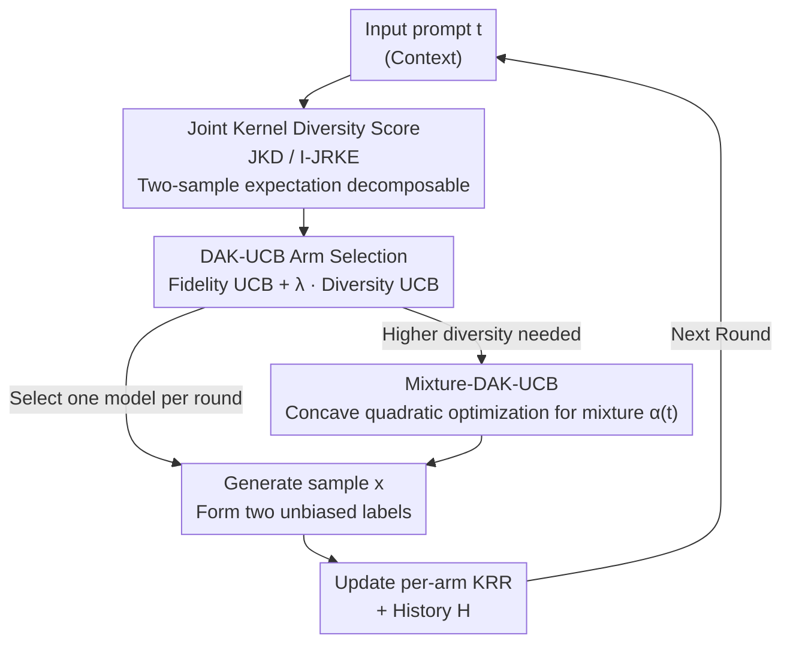

# DAK-UCB: Diversity-Aware Prompt Routing for LLMs and Generative Models

**Conference**: ICLR 2026  
**OpenReview**: [https://openreview.net/forum?id=nnN2TKlS5C](https://openreview.net/forum?id=nnN2TKlS5C)  
**Code**: https://github.com/Donya-Jafari/DAK-UCB  
**Area**: Learning Theory / Contextual Bandits / Generative Model Selection  
**Keywords**: Contextual Bandits, Kernelized UCB, Diversity Metrics, Prompt Routing, Generative Model Selection

## TL;DR
This paper proposes DAK-UCB, an online model selection algorithm that explicitly incorporates "diversity" into Kernelized UCB contextual bandits. By using joint kernel scores (JKD / I-JRKE) that can be decomposed into two-sample expectations as diversity rewards, it balances fidelity and diversity when routing generative models for a stream of prompts, providing regret bound guarantees.

## Background & Motivation

**Background**: As services for LLMs, text-to-image, and video generation proliferate, the core problem becomes "which model to invoke for a given prompt." Leading approaches fall into two categories: offline learning, which trains a selector using a batch of model responses to prompts, and online learning, which models the task as a contextual bandit problem (with the prompt as context). A representative method is PAK-UCB (Hu et al. 2025), which uses Kernelized UCB to select arms based on historically observed model performance.

**Limitations of Prior Work**: Existing methods focus exclusively on **fidelity scores** (e.g., CLIP-Score in text-to-image generation), completely ignoring the **diversity** of generated results. Consequently, while individual samples may align well with the prompt, the overall output is highly homogenized—for instance, consistently generating images of "young males," thereby narrowing the representation of sensitive attributes like gender or ethnicity. Figure 1 provides an intuitive example: between an unconditional, more diverse model G2 and a more monotonic G1 conditioned on "young male," baseline Kernelized UCB splits selections nearly 50/50 because it only considers CLIP-Score, failing to favor the more diverse option.

**Key Challenge**: Diversity is inherently a **group-level property** determined by the relative distribution of multiple samples, whereas rewards in standard contextual bandits are **means of sample-level scores**. Integrating the diversity of a sample set into a bandit framework based on "per-sample averaging" is mathematically incompatible; average individual rewards can never express how different the samples in a set are from one another.

**Goal**: To design an online selection algorithm that utilizes historical generation data to achieve an optimal balance between fidelity and diversity with provable regret bounds.

**Key Insight**: The authors discovered that not all diversity scores can be integrated into a bandit framework. The key is to identify a family of diversity scores that can be expressed as a **two-sample quadratic expectation** of $(prompt, output)$. Once a diversity score is decomposed into an expectation over single generated samples, each individual sample obtained from a model interaction serves as an unbiased stochastic label for that diversity function. This allows the use of Kernel Ridge Regression (KRR) to derive UCB confidence bounds, similar to how fidelity scores are handled.

**Core Idea**: Extend Kernel Distance (KD) and Rényi Kernel Entropy (RKE) into prompt-conditioned "joint kernel scores" (JKD, I-JRKE). These decompose into two-sample expectations, enabling seamless integration into Kernelized UCB by combining an upper confidence bound for fidelity with a confidence bound for diversity as the selection objective.

## Method

### Overall Architecture
DAK-UCB models the selection of a generative model for each arrival prompt as a per-arm Kernelized Contextual Bandit: prompt $t$ is the context, and $G$ candidate generative models are the arms. Each arm maintains two sets of KRR estimators—one to predict **fidelity** $s_g(t)$ (instantiated as CLIP-Score in experiments) and one to predict **diversity** $D_g(t)$ (instantiated as joint kernel scores). In each round, for every arm, the predicted values and confidence radii for both metrics are calculated and combined into a composite UCB score $J_g(t)=s_g(t)+\lambda D_g(t)$. The arm with the highest score is selected for generation. After obtaining a sample, two unbiased labels are formed to update the two KRR estimators and the history $H$. This allows diversity, like fidelity, to be "learned online" and influence selection.

The critical prerequisite for this process is the decomposition of diversity scores into two-sample expectations (Proposition 1), allowing a single sample per round to serve as an unbiased label. Beyond "hard selection" of a single model per round, the paper provides a **Mixture** version: relaxing the selection to a prompt-dependent probability distribution $\alpha(t)\in\Delta_G$ (equivalent to a biased multi-sided die). The optimal mixture for each prompt is solved via concave quadratic optimization to further enhance diversity.

### Key Designs

**1. Joint Kernel Diversity Score: Expressing "Group-level Diversity" via Two-sample Expectations**

This is the structural foundation of the paper, directly resolving the core contradiction that diversity is a group property incompatible with sample-averaging bandits. The authors extend unconditional Kernel Distance (KD) and Rényi Kernel Entropy (RKE) to conditional generation scenarios using a **product kernel** $k_{\text{joint}}([t,x],[t',x'])=k_T(t,t')\cdot k_X(x,x')$ to bind the prompt and output. This yields two scores: Joint Kernel Distance (JKD, measuring distribution matching/accuracy):
$$\mathrm{JKD}(P_{X|T},Q_{X|T}):=\mathrm{KD}(P_T\cdot P_{X|T},\,P_T\cdot Q_{X|T})$$
and Inverse Joint RKE (I-JRKE, measuring diversity):
$$\text{I-JRKE}(P_{X|T}):=\mathbb{E}_{t,t'\sim P_T,\,x,x'}\big[k_T(t,t')^2 k_X(x,x')^2\big].$$
The elegance of these scores (Proposition 1) lies in their ability to be written as $\mathbb{E}_{t,x}[\phi(t,x)]$, a two-sample form based on expectations over single generated samples. Consequently, even though diversity is defined over prompt-output **pairs**, generating **one** sample per prompt is sufficient to obtain an unbiased stochastic label for the diversity function. This decomposition grants diversity scores the same "online estimability" as fidelity scores.

**2. DAK-UCB Selection Rule: Combining Dual Confidence Bounds**

With decomposable diversity labels, the authors integrate them into a per-arm Kernelized UCB. For each arm $g$, two prompt-level objective functions are defined: $s_g(t)$ (fidelity, targeting CLIP-Score) and $D_g(t)$ (diversity, targeting I-JRKE or the negative of JKD), both fitted online using KRR. Arm selection uses optimistic estimation:
$$\hat J^{\text{UCB}}_g(t_i)=\big(\hat s_g(t_i)+\beta^{(s)}\hat\sigma^{(s)}_g(t_i)\big)+\lambda\big(\hat D_g(t_i)+\beta^{(D)}\hat\sigma^{(D)}_g(t_i)\big),$$
where the fidelity term takes the upper bound and the diversity term also provides a confidence radius in the standard KRR-UCB form ($D_g$ is a signed diversity reward). $\lambda$ is the fidelity-diversity tradeoff coefficient. Upon receiving sample $x_i$, unbiased labels $y^{(s)}_i=\phi_{\text{fid}}(t_i,x_i)$ and $y^{(D)}_i=\psi_{g_i}(t_i,x_i;H_i)$ are formed to update the KRR estimators. Compared to fidelity-only PAK-UCB, DAK-UCB incorporates diversity into the "optimism in the face of uncertainty" exploration logic. The authors prove a regret bound for a phased variant, Sup-DAK-UCB: $\tilde O(\sqrt{GT\Gamma^{(s)}_T}+\lambda\sqrt{GT\Gamma^{(D)}_T})$.

**3. Mixture-DAK-UCB: Relaxing Selection to "Prompt-dependent Mixtures" via Concave Quadratic Optimization**

Single-point selection has a theoretical limitation: to maximize diversity, the optimal strategy might be a **non-degenerate model mixture** (as noted by Rezaei et al. in unconditional settings). This paper extends this to the prompt-conditioned setting, assigning a mixture probability $\alpha(t)\in\Delta_G$ to each prompt $t$ to obtain $P_\alpha(\cdot|t)=\sum_g\alpha_g(t)P_g(\cdot|t)$. Using product kernels, I-JRKE becomes quadratic under the mixture: $\mathbb{E}_t[\alpha(t)^\top M(t)\alpha(t)]$, where $M(t)$ collects cross-model kernel expectations. To ensure stability (similar mixture for similar prompts), the authors restrict valid mixtures to a kernel-Lipschitz competition set $A_\epsilon$, reducing the decision for each prompt to a **concave quadratic maximization**:
$$\alpha^*_t=\arg\max_{\alpha\in\Delta_G}\langle\alpha,\hat s_{\text{UCB}}(t)\rangle-\lambda\,\alpha^\top\widehat M_{\text{UCB}}(t)\alpha,$$
where $\widehat M_{\text{UCB}}(t)$ projects UCB estimates to a PSD matrix. This version is particularly effective when individual models collapse in complementary ways.

## Key Experimental Results

### Main Results
Using 2,000 rounds averaged over 10 trials on MS-COCO prompts (cat, dog, bike, etc.), with Kandinsky, SDXL, and GigaGAN as candidate arms. Baselines include One-Arm Oracle, Random, and PAK-UCB (diversity-agnostic).

| Metric | Meaning | Best Method | Note |
|------|------|---------|------|
| Joint-RKE Score | Diversity (Higher is better) | Mixture-DAK-UCB | Highest diversity among methods |
| KD Score (×10³) | Distribution match with reference | Mixture-DAK-UCB | Achieves optimal KD score |
| CLIP Score | Fidelity | All methods similar | DAK-UCB maintains fidelity while increasing diversity |

In a "animal image" simulation with three arms (two SDXL arms biased towards "cat" or "dog" and one diverse arm), DAK-UCB significantly favors the diverse arm, while PAK-UCB splits between the low-diversity arms.

### Ablation Study
| Configuration / Setting | Key Observation | Note |
|------|---------|------|
| DAK-UCB (JKD diversity term) | Avoids irrelevant content | Correctly avoids prompt-irrelevant outputs in expert arm tests |
| DAK-UCB (CLIP+I-JRKE) | Same as above | Both diversity scores maintain prompt relevance |
| Mixture-DAK-UCB vs Single Model (LLM) | Significantly higher Cond-Vendi | Mixing LLMs with different geographic collapses boosts diversity |

### Key Findings
- **Diversity term is the core source of gain**: Removing the diversity term (reducing to PAK-UCB) eliminates the preference for diverse models.
- **"Expert arm" experiments validate prompt relevance**: DAK-UCB does not "cheat" for diversity by generating irrelevant but varied content; it still selects the expert arm for each prompt cluster.
- **Mixture version yields maximum benefits when LLM collapses are complementary**: When models have different failure modes (e.g., city preferences), Mixture-DAK-UCB significantly outperforms any single model.

## Highlights & Insights
- **Translating "group-level diversity" to "two-sample expectations" is the pivotal step**: It makes a seemingly incompatible metric estimable online, allowing the reuse of the full Kernelized UCB machinery.
- **Clever use of the product kernel $k_T\cdot k_X$**: Jointly encoding the prompt and output maintains prompt conditioning and naturally formulates JKD/I-JRKE as quadratic forms for the mixture optimization.
- **Intuitive motivation for mixture selection**: The LLM experiment showing "complementary geographic collapses" provides a very clear justification for why mixtures are necessary.

## Limitations & Future Work
- **Expansion to other domains**: Currently validated on text-to-image and LLMs; future work could include protein or molecule generation.
- **Computational overhead**: Kernel methods are computationally intensive; while kernel approximations are cited, scalability to massive model pools is not deeply discussed.
- **Theory-practice gap**: Regret bounds are proven for the Sup-DAK-UCB variant rather than the implemented Algorithm 1.
- **Reliance on embedders**: Diversity semantics are determined by the embedding space (CLIP/DINOv2).

## Related Work & Insights
- **vs PAK-UCB (Hu et al. 2025)**: Both use Kernelized UCB for prompt routing, but DAK-UCB adds a decomposable diversity term and corresponding confidence bounds.
- **vs Mixture-UCB (Rezaei et al. 2025)**: Mixture-UCB optimizes mixtures for diversity but is prompt-agnostic; DAK-UCB extends this to prompt-aware mixtures.
- **vs Diversity-guided Diffusion**: Those methods modify the **internal generation process**; DAK-UCB performs **online selection between pre-trained models**, which is an orthogonal approach.

## Rating
- Novelty: ⭐⭐⭐⭐⭐ 
- Experimental Thoroughness: ⭐⭐⭐⭐ 
- Writing Quality: ⭐⭐⭐⭐ 
- Value: ⭐⭐⭐⭐ 

<!-- RELATED:START -->

## Related Papers

- [\[ICLR 2026\] Finite-Time Convergence Analysis of ODE-based Generative Models for Stochastic Interpolants](finite-time_convergence_analysis_of_ode-based_generative_models_for_stochastic_i.md)
- [\[ICLR 2026\] Data-Aware and Scalable Sensitivity Analysis for Decision Tree Ensembles](data-aware_and_scalable_sensitivity_analysis_for_decision_tree_ensembles.md)
- [\[ICLR 2026\] Online Decision Making with Generative Action Sets](online_decision_making_with_generative_action_sets.md)
- [\[ICLR 2026\] Trained on Tokens, Calibrated on Concepts: The Emergence of Semantic Calibration in LLMs](trained_on_tokens_calibrated_on_concepts_the_emergence_of_semantic_calibration_i.md)
- [\[ICLR 2026\] Intrinsic Entropy of Context Length Scaling in LLMs](intrinsic_entropy_of_context_length_scaling_in_llms.md)

<!-- RELATED:END -->
