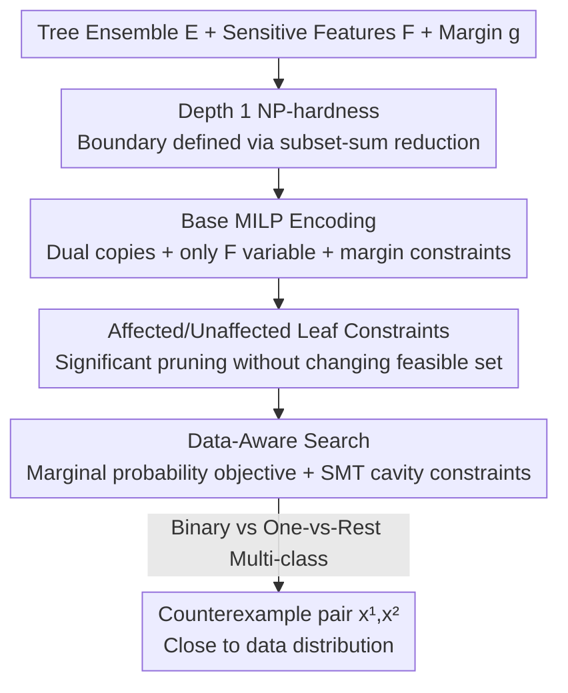

# Data-Aware and Scalable Sensitivity Analysis for Decision Tree Ensembles

**Conference**: ICLR 2026  
**OpenReview**: [https://openreview.net/forum?id=q8KqAvdfZK](https://openreview.net/forum?id=q8KqAvdfZK)  
**Code**: https://github.com/formal-trust-AI/ensense  
**Area**: Formal Verification / Learning Theory / Trustworthy Machine Learning  
**Keywords**: Decision Tree Ensembles, Sensitivity Verification, MILP Encoding, SMT Solving, Data-Awareness

## TL;DR
This paper researches the formal verification problem of "whether a decision tree ensemble is sensitive to certain (e.g., protected) features," proving the problem is NP-hard even for tree ensembles of depth $1$, and proposes a set of MILP/SMT encoding ENSENSE with new optimizations, which not only improves verification speed by approximately $5\times$ (binary classification) / $15\times$ (multi-class) over the previous SOTA, but also for the first time lets counterexample pairs fall near the training data distribution, thereby giving more meaningful evidence of sensitivity.

## Background & Motivation
**Background**: Decision tree ensembles (XGBoost, Random Forest, etc.), because they are simple, powerful, and relatively interpretable, are widely used in high-risk decision scenarios such as bank credit, healthcare, and telecommunications. To "trust" these models, a large number of works on formal verification of safety properties of tree ensembles have appeared in the past decade, one core question among them is **feature sensitivity**: given a feature subset $F$ (such as protected attributes like gender and race), does there exist two inputs that are completely identical on all features outside $F$ and only differ on $F$, yet result in the model giving **different predicted labels**? If such a "counterexample pair" exists, it indicates the model is sensitive to $F$, which directly relates to individual fairness and causal discrimination.

**Limitations of Prior Work**: Existing methods have two major flaws. One, the recent Ahmad et al. (2025) used pseudo-Boolean encoding to prove sensitivity verification is NP-hard when tree depth $\ge 3$, but their 3-SAT-based reduction **fails for depth 1 and 2 trees**, while depth 1 trees (decision stumps) are precisely important objects in many scenarios, leaving the complexity problem unresolved. Second, and even more fatal: the found counterexample pairs **may be arbitrarily far from the real data distribution**. The paper uses tree ensembles trained on MNIST as an example—the left counterexample pair although flips the label from 3 to 8, both images are meaningless noise clusters, which would never appear in the training set, thus failing to reveal the model's true weaknesses; only the right kind of counterexample—"looks like a real 3, but is misclassified as 8 with only 20/786 pixels changed and still close to data distribution"—is useful evidence of sensitivity.

**Key Challenge**: The definition of sensitivity itself **only depends on the trained model and is data-independent**, so the solver just hands over any counterexample pair satisfying the constraints and doesn't care at all if it's "realistic". To make counterexample pairs fall near the data, extra data distribution information must be injected into the search, which is exactly what original efficient pseudo-Boolean encodings find hard to carry—it's difficult to attach a "close to data" objective function.

**Goal**: Decomposed into three sub-problems—(1) complete the complexity landscape, figuring out if it's hard at depth 1; (2) design a set of verification encodings that are both fast and scalable to large ensembles and can handle multi-class; (3) embed "data-awareness" into the search, letting counterexample pairs stay close to the training distribution.

**Key Insight**: The authors abandon the pseudo-Boolean route and **return to Mixed-Integer Linear Programming (MILP)**. Although naive MILP encoding (derived from Kantchelian et al. 2016) was initially slower than pseudo-Boolean, MILP solvers are naturally good at searching guided by objective functions, leaving space for "writing proximity to data as an objective function".

**Core Idea**: Use "MILP encoding with new optimizations + writing data likelihood into objective function/using SMT to learn data cavity constraints" to replace pseudo-Boolean encoding, simultaneously achieving "faster" and "more realistic counterexamples".

## Method

### Overall Architecture
ENSENSE receives a trained tree ensemble $E$, a sensitive feature subset $F$, and a margin parameter $g$, and outputs a pair of counterexamples $x^{(1)}, x^{(2)}$: they are completely identical on features outside $F$, but the model's prediction confidence for the two is pulled apart to $E^{prob}_1(x^{(1)})\ge 0.5+g$ and $E^{prob}_1(x^{(2)})\le 0.5-g$ (i.e., one high-confidence positive example, one high-confidence negative example). The entire pipeline has two layers: the bottom layer encodes "finding such a pair of inputs" into MILP constraints and solves them using Gurobi; the top layer injects "counterexamples should be close to data" through two complementary strategies—one changes the MILP objective function (marginal probability product), and another uses an SMT solver to pre-learn "cavity" regions in data and adds them as constraints.

The entire paper logic is: first nail down the complexity boundary (depth 1 is also NP-hard), then iteratively optimize naive MILP encoding to surpass original SOTA, and finally attach data-aware objectives to optimized encoding and generalize the mechanism to multi-class.

### Key Designs

**1. Depth-1 NP-hardness: pushing the hardness boundary to the limit with subset-sum**

Addressing the gap of "unknown complexity at depth 1", the authors prove via a **reduction from subset-sum problem**: even if the ensemble consists entirely of depth 1 decision stumps and only one feature change is allowed ($|F|=1$), sensitivity verification is still NP-hard (Theorem 3.2). The construction is elegant: given a subset-sum instance (integer set $U$, target value $k$), create a Boolean feature $f_i$ and a depth 1 tree for each integer $u_i$—outputs 0 if $f_i$ is false, $u_i$ if true; then create a feature $f'$ and a tree—outputs $-k-0.5$ if $f'$ is false, $-k+0.5$ if true. Thus the entire ensemble is $\{f'\}$-sensitive if and only if there exists a subset $U\subseteq U$ such that $\sum_{l\in U} l = k$. This result completes the complexity map of the sensitivity problem: depth $\ge 1$ are all NP-hard, and only when $|F\setminus F|$ is bounded can depth 1 be solved in polynomial time. Its significance lies in **negating the fantasy that "shallow trees can escape computational difficulty"**, and in turn argues for the necessity of designing efficient solvers later.

**2. Base MILP Encoding: using dual-copy variables to write "two inputs differ only on F" as linear constraints**

Addressing "how to hand over the existence problem of sensitivity for two inputs to a solver", the authors perform dual-copy extension on the single-input MILP encoding from Kantchelian et al. (2016). Guard predicates $X_f<\tau$ of each internal node are represented by binary variables $p_{fk}$, and leaves by continuous variables $0\le l_n\le 1$. Predicates of the same feature must satisfy monotonic consistency $p_{f1}\le p_{f2}\le\cdots\le p_{fK_f}$ (because when $\tau_1<\tau_2$, $X_f<\tau_1$ implies $X_f<\tau_2$); exactly one leaf per tree is activated $\sum_n l_n=1$, and leaf activation must be consistent with guard predicate values on the path (Eq. 4, 5). To express "two inputs", the authors duplicate all variables into two copies with superscripts $(1),(2)$, and add constraints that they **can only differ on $F$**: for all predicates whose guards do not contain features in $F$, force $p^{(1)}_{fk}=p^{(2)}_{fk}$. Finally, the confidence interval is converted into linear constraints on original output—let $\delta=\text{SIGMOID}^{-1}(0.5+g)$, using the symmetry of sigmoid around 0.5 to get $\sum_n l^{(1)}_n\, n.val\ge\delta$ and $\sum_n l^{(2)}_n\, n.val\le-\delta$. Any feasible solution corresponds to a pair of legal counterexamples. This step itself just "translates" the problem into MILP, performance is even worse than pseudo-Boolean, real speedup comes from the following optimizations.

**3. Affected/Unaffected Leaf Constraints: Pruning heavily by identifying "leaves unreachable by sensitive features"**

Addressing "naive MILP is too slow", the authors observe a structural fact: **sensitive features often only affect a small portion of leaves**. All guards from root to a leaf are called its ancestry; if no guards in ancestry involve variable features $F$, this leaf is called "unaffected". For each unaffected leaf, two copies must land on the same leaf, so directly add constraint $l^{(1)}_n=l^{(2)}_n$ (Eq. UnAff). In practice, the vast majority of leaves belong to this category, and explicitly adding this allows the solver to converge quickly. Further, subtracting two interval constraints (Eq. Gap-bin) and using UnAff to eliminate terms of unaffected leaves, results in an **equivalent constraint involving only "affected" leaves with greatly reduced number of terms** $\sum_{l_n\notin U}(l^{(1)}_n\,n.val - l^{(2)}_n\,n.val)\ge 2\delta$ (Eq. Aff-bin). Crucially, Theorem 5.1 proves: adding UnAff and Aff-bin **does not change the feasible solution set**, it's purely for speedup. This is the core engine for ENSENSE to overtake pseudo-Boolean. Additionally, the authors directly write the difference of "two outputs should be different" as the maximization objective of MILP $\text{MAX}\sum_n(l^{(1)}_n\,n.val - l^{(2)}_n\,n.val)$ (Eq. Obj-bin), giving the solver direction when facing multiple candidate edges in simplex process, rather than choosing arbitrarily—although we only need one feasible solution, giving a "right direction" can significantly speedup.

**4. Data-Aware Search: Marginal probability objective + SMT learned data cavity, letting counterexamples fall into distribution**

Addressing "counterexamples far from data are meaningless", the authors formalize "proximity to data" as a utility function $u(x^{(1)},x^{(2)})$ (Definition 4.1), and provide two complementary strategies. **One is Marginal Probability Product Objective (Prob)**: assuming feature independence, for each feature $f$, use the ratio of points in training set falling into adjacent threshold intervals $[\tau_{f(k-1)},\tau_{fk})$ to estimate marginal probability $\pi_f$, then let $\pi(x)=\prod_f\pi_f(x_f)$, utility $u(x^{(1)},x^{(2)})=\pi(x^{(1)})\cdot\pi(x^{(2)})$. Since MILP can only handle additive objectives, the authors take log to convert product to sum, getting objective in Eq. (7) $\text{MAX}\sum_{f}\sum_k(\log\pi_f(\tau_{f(k-1)})-\log\pi_f(\tau_{fk}))(p^{(1)}_{fk}+p^{(2)}_{fk})$, and use Lemma 5.2 to prove it indeed maximizes $u$. **The other is Clause Summarization (Clause)**: when features are highly correlated, independent assumption fails, so use SMT solver (z3) to learn "cavity" from data—box-shaped regions in input space without any training points. For each data point, require it not to fall into a box enclosed by feature boundaries $lb_i,ub_i$ (negation of Eq. 1 is a clause handleable by constraint solver), and pair with a minimization objective to learn as tight a box as possible, iteratively learning one clause at a time and adding learned clauses to constraints to avoid repetition. These clauses correspond to a summary of "how data is distributed in input space", forcing counterexample search to bypass empty data areas. Combining both strategies is **Probclause** used by ENSENSE.

### Loss & Training
This paper does not train neural networks, no traditional loss function. "Objective functions" at solver end are given in Key Designs 3, 4: basic version maximizes difference between two outputs (Eq. Obj-bin), data-aware version replaces it with sum of log marginal probabilities (Eq. 7); SMT end uses objective of minimizing clause width to learn tight cavities. Generalization to multi-class only needs changing three constraints Gap-bin, Aff-bin, Obj-bin—dividing tree ensemble into $C$ one-vs-rest classifiers by class, outputting $E^{prob}_c(x)=\text{SOFTMAX}_c(E^{raw}_0,\dots,E^{raw}_{C-1})$, and requiring probability difference between the most likely class and the second most likely class to be large enough (Definition 6.1).

## Key Experimental Results

Implementation uses XGBoost v1.7.1 to train models, Gurobi as MILP solver, z3 to learn clauses, single CPU core, timeout of 3600 seconds per instance. Benchmarks cover 18 datasets, 36 tree ensembles, scales up to 800 trees, depth 8.

### Main Results

| Setting | Comparison Baseline | Avg Gain/Speedup | Timeouts |
|------|---------|---------|---------|
| Binary (1103 instances $\ge 1s$) | KANT (Naive MILP) | $\approx 8\times$ | KANT timeouts 153, ENSENSE 0 |
| Binary | SENSPB (Pseudo-Boolean, 2025 SOTA) | $\approx 5\times$ | SENSPB timeouts 205, ENSENSE 0 |
| Multi-class (521 instances $\ge 1s$) | KANT | $\approx 15\times$ | KANT timeouts 256, ENSENSE 0 |

Multi-class also compared with transforming robustness verification tool VERITAS to solve sensitivity, result is it **timed out on all but 2 instances**, showing sensitivity (universal quantification for two inputs) is indeed harder than local robustness.

### Data-Aware Quality Comparison

Metric is $\ell_2$ distance from counterexample region to data (on non-sensitive features), smaller distance means closer to data. Here counterexample "region" instead of single point is used: tree ensemble carves input space into axis-aligned polytopes, output is constant within the same polytope, if closest data point is in the same region, correct distance should be 0.

| Method | Avg $\ell_2$ Distance | Win Rate vs Baseline |
|------|-----------------|-----------|
| None (No data-awareness, baseline) | $0.57$ | — |
| Prob (Marginal probability objective) | $0.26$ | $76.7\%$ (Loss $22.1\%$, Draw $1.2\%$) |
| Clause (Clause summary) | $0.306$ | $80.6\%$ (Loss $16.1\%$, Draw $3.3\%$) |
| Probclause (Combined, ENSENSE) | $0.17$ | $86.0\%$ (Loss $12.1\%$, Draw $1.1\%$) |

### Key Findings
- **Two data-aware strategies are complementary and stackable**: Prob is effective when features are approximately independent, Clause fills in when features are highly correlated, combined Probclause has lowest average distance ($0.17$, down nearly $70\%$ from baseline $0.57$), and highest win rate against baseline ($86\%$), with average lead of $0.47$ when winning and only $0.06$ behind when losing.
- **Structural optimization (affected/unaffected leaf constraints) is main force for speedup**: pulling naive MILP from "slower than pseudo-Boolean" to "5× faster" relies on pruning guaranteed by Theorem 5.1, not solver itself.
- **Multi-class speedup is more intense (15×)**: because in one-vs-rest structure, a large number of leaves are "unaffected" by a single sensitive feature, resulting in larger pruning gain; this is also the first tool capable of handling multi-class tree ensemble sensitivity.

## Highlights & Insights
- **Using "optimizations that don't change feasible set" and "objective function that changes search direction" separately**: UnAff/Aff-bin are strictly equivalent pruning (backed by Theorem 5.1), Obj-bin is heuristic giving solver direction—clearly distinguishing "which are logic equivalent, which are guidance", makes speedup both safe and effective, this separation thought can migrate to any MILP/SAT problem where "only one feasible solution is needed but want it faster".
- **Using SMT to learn "data cavity" is counter-intuitive but smart**: Most data-aware methods try to fit "where data is", here it learns "where data is NOT" (cavity) instead, the negation of which is naturally clause form favored by constraint solvers, exactly to be embedded into search to prune unrealistic counterexamples.
- **Complexity results serve engineering motivation**: the theorem that depth 1 is also NP-hard is not just for proof, it directly kills the lazy route of "escaping calculation difficulty by using shallow trees", reflecting the value of making efficient solvers—theory and system support each other in the same paper.
- **"Counterexample region" instead of "counterexample point" distance metric** is very worth referencing: on piecewise constant models, using single point distance would misjudge situations "actually falling into the same decision region" as non-zero distance, using region distance is more honest.

## Limitations & Future Work
- **Only "identification" not "repair"**: Authors explicitly say this paper only solves finding sensitive counterexample pairs, retraining/hardening models left as future work; by analogy many tools for "training robust trees" already exist in robustness field, "training low sensitivity trees" method is still missing in sensitivity direction.
- **From "finding point" to "quantifying region" still unresolved**: currently a pair of counterexamples is given, future hopes to quantify size/proportion of sensitive region in entire input space, which is more complete trustworthiness characterization.
- **Marginal probability strategy relies on feature independence assumption**: authors themselves admit Prob effect will degrade on high feature correlation data, hence supplementing Clause; but Clause is limited by number of learned box cavities (limit of 1500 clauses, max 3 literals per clause in experiment), characterization capability for complex distributions has upper bound.
- **Scalability although strong is still constrained by MILP solver**: 800 trees depth 8 is already near upper bound, multi-class forced to downsample features at larger scales or higher dimensions (e.g., full 784 pixels instead of 100 high-frequency features), indicating complete high-dimensional sensitivity is still strenuous.

## Related Work & Insights
- **vs SENSPB (Ahmad et al. 2025)**: also does tree ensemble sensitivity verification, but they use pseudo-Boolean encoding, only proved depth $\ge 3$ is NP-hard, only support binary classification, and find it hard to attach data-aware objective function. This paper replaces it with MILP, completes depth 1 hardness, first time support multi-class, and writes data-awareness into objective function, and is $5\times$ faster (binary).
- **vs Kantchelian et al. (2016)**: base MILP encoding of this paper directly sources from it (originally designed for local robustness), but authors point out naive copying is actually slower than pseudo-Boolean, real contribution is saving it and surpassing with new optimizations like affected/unaffected leaf constraints.
- **vs local robustness verification (VERITAS, Devos et al. 2021/2024 etc.)**: robustness is finding adversarial perturbation given one input, sensitivity is universal quantification for two inputs, the latter is harder—experiment shows transforming VERITAS to solve sensitivity timed out on almost all instances. Simplified optimizations in robustness that come from "knowing one input" cannot be used in sensitivity, this is the essential difference between the two types of problems.

<!-- RELATED:START -->

<!-- RELATED:END -->

## Related Papers

- [\[ICLR 2026\] High-dimensional Analysis of Synthetic Data Selection](high-dimensional_analysis_of_synthetic_data_selection.md)
- [\[ICLR 2026\] On Coreset for LASSO Regression Problem with Sensitivity Sampling](on_coreset_for_lasso_regression_problem_with_sensitivity_sampling.md)
- [\[ICLR 2026\] Robustness of Probabilistic Models to Low-Quality Data: A Multi-Perspective Analysis](robustness_of_probabilistic_models_to_low-quality_data_a_multi-perspective_analy.md)
- [\[ICLR 2026\] Online Decision-Focused Learning](online_decision-focused_learning.md)
- [\[ICLR 2026\] Conformalized Decision Risk Assessment](conformalized_decision_risk_assessment.md)

<!-- RELATED:END -->
