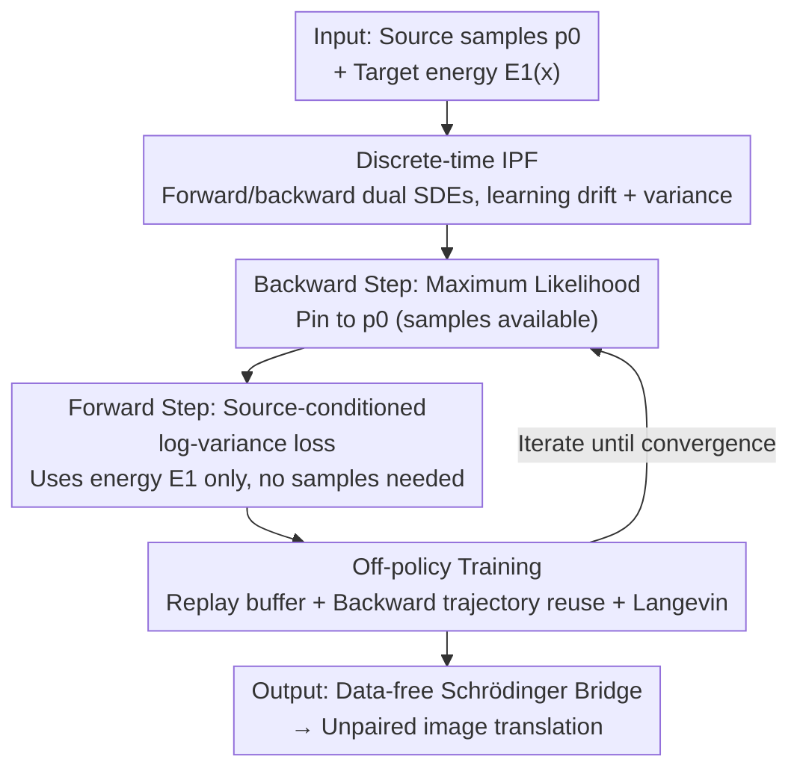

# Data-to-Energy Stochastic Dynamics

**Conference**: ICLR2026  
**OpenReview**: [https://openreview.net/forum?id=S1JJyWg1VG](https://openreview.net/forum?id=S1JJyWg1VG)  
**Code**: [mmacosha/d2e-stochastic-dynamics](https://github.com/mmacosha/d2e-stochastic-dynamics)  
**Area**: Probabilistic Methods / Generative Modeling / Stochastic Optimal Transport  
**Keywords**: Schrödinger Bridge, Iterative Proportional Fitting, Diffusion Sampler, off-policy Reinforcement Learning, data-free  

## TL;DR
This paper proposes the first "data-to-energy" Schrödinger Bridge (SB) solver: when the target distribution is only given as an unnormalized density (energy function) and no samples are available, the classic Iterative Proportional Fitting (IPF) is generalized to the data-free setting. By replacing the maximum likelihood step—which traditionally requires samples—with an off-policy reinforcement learning loss (log-variance loss) from diffusion samplers, the method learns optimal stochastic dynamics between two distributions and is implemented as an "unpaired image-to-image translation" method.

## Background & Motivation
**Background**: Diffusion models and flow matching are currently the two dominant paradigms for high-fidelity generation, both essentially being special cases of "learning a stochastic dynamic trajectory between two distributions." Generalizing this leads to the Schrödinger Bridge (SB) problem: among all stochastic processes transporting distribution $p_0$ to $p_1$, find the one with the minimum KL divergence from a reference process $\mathbb{Q}_t$ (usually Wiener / OU processes). SB is the dynamic version of entropy-regularized optimal transport. The classic tool for solving it is Iterative Proportional Fitting (IPF), which maintains a pair of forward/backward-in-time processes and alternately solves "half-bridge" problems. Upon convergence, the two processes are time-reversals of each other, representing the SB solution.

**Limitations of Prior Work**: All existing IPF variants (DSB, DSBM, SF²M, etc.) have a strict prerequisite: **samples must be accessible from both $p_0$ and $p_1$**. The even-numbered steps of IPF (pinning the process to $p_1$) are achieved by "sampling from $p_1$, rolling out the trajectory, and maximizing the trajectory likelihood." This step is infeasible without samples from $p_1$.

**Key Challenge**: However, in many natural science and Bayesian inference scenarios, the target distribution is only provided as an **unnormalized density**: $p(x) = e^{-\mathcal{E}(x)}/Z$, where the energy $\mathcal{E}$ is queryable, but the partition function $Z$ is unknown and no samples are available. Sample-dependent IPF completely fails here.

**Key Insight**: The authors observe that a parallel research line—"diffusion samplers" (specifically designed to learn to sample from unnormalized densities)—has developed a set of **sample-free training losses based solely on energy functions** (off-policy RL losses, such as log-variance / VarGrad loss). If the "requires $p_1$ samples" step in IPF can be replaced with these energy-only losses from diffusion samplers, IPF can function in data-free scenarios.

**Core Idea**: Replace the maximum likelihood step of IPF with a **source-conditioned log-variance loss**, training the forward process via off-policy RL to obtain the first general data-to-energy (and even energy-to-energy) Schrödinger Bridge algorithm. Additionally, it was discovered that using this discrete-time framework in data-rich settings and **learning the diffusion coefficients** (not just the drift) significantly improves existing IPF algorithms.

## Method

### Overall Architecture
The method is built upon discrete-time IPF. The reference SDE is first discretized over $K$ steps using Euler-Maruyama (step size $\Delta t = 1/K$), resulting in two discrete Markov chains: the forward process $\overrightarrow{p}_\theta$ and the backward process $\overleftarrow{p}_\varphi$. Their transition kernels are Gaussian:

$$\overrightarrow{p}_\theta(x_{(k+1)\Delta t}\mid x_{k\Delta t}) = \mathcal{N}\big(x_{k\Delta t} + \overrightarrow{F}_\theta(x_{k\Delta t}, k\Delta t)\Delta t,\ \sigma^2_{k\Delta t}\Delta t\big)$$

IPF alternately optimizes these two chains: the **backward step** pins the process to $p_0$ (training $\varphi$), and the **forward step** pins the process to $p_1$ (training $\theta$). The SB is solved when they converge as time-reversals.

In classic data-to-data IPF, both steps use maximum likelihood: sampling from one end, rolling out trajectories, and maximizing log-likelihood in the opposite direction. The key pivot here: when $p_1$ only provides energy $\mathcal{E}_1$, the forward step cannot sample $p_1$, so it is replaced with a variance-based loss dependent only on energy. To make this data-free loss effective in high dimensions, off-policy training techniques (replay buffer, backward trajectory reuse, Langevin correction) are introduced. The pipeline is as follows:

### Key Designs

**1. Source-conditioned log-variance loss: Replacing "sample-required" IPF steps with "energy-only"**

This is the core contribution. The forward IPF step requires the proportional relationship $\overrightarrow{p}_\theta(\tau\mid x_0) \propto \overleftarrow{p}_\varphi(\tau\mid x_1)\, p_1(x_1)$ to hold for every trajectory $\tau$ starting from $x_0$. Given $p_1(x_1)=e^{-\mathcal{E}_1(x_1)}/Z$, a **$Z$-insensitive** loss can be constructed. Borrowing the log-variance (VarGrad) loss from diffusion samplers, the source-conditioned variant is defined:

$$\mathcal{L}_{\mathrm{LV}}(x_0, \theta) = \mathrm{Var}\left(\sum_{k=1}^{K}\log\frac{\overrightarrow{p}_\theta(x_{k\Delta t}\mid x_{(k-1)\Delta t})}{\overleftarrow{p}_\varphi(x_{(k-1)\Delta t}\mid x_{k\Delta t})} + \mathcal{E}_1(x_1)\right)$$

The variance is taken over a batch of trajectories sharing the same $x_0$. The brilliance lies in: **the unknown normalization constant $Z$ is a constant and does not affect the variance**, thus $Z$ is automatically eliminated; moreover, the marginal density of the process at $t=0$ does not need to be known. Averaging this loss over $x_0 \sim p_0^{\mathrm{train}}$ yields the full objective for the forward IPF step. This replacement removes the hard constraint of "must sample from $p_1$," enabling IPF to operate in data-free settings for the first time.

**2. Off-policy training triade: Making data-free loss work in high dimensions**

Loss alone is insufficient; naive on-policy selection ($p^{\mathrm{train}}_0 = p_0$, trajectories sampled directly from $\overrightarrow{p}_\theta$) fails on complex high-dimensional distributions because modes not explored by the sampler are rarely discovered. The authors import exploration techniques from diffusion sampler literature, turning training into an off-policy reinforcement learning process:

- **Replay buffer**: Caches terminal samples $x_1$ produced by the forward process. During training, an $x_1$ is sampled from the buffer, and a backward rollout $\tilde{x}_0 \sim \overleftarrow{p}_\varphi(\cdot\mid x_1)$ is performed as the training starting point. As the model improves, the buffer accumulates high-probability samples under $p_1$, guiding the sampler toward high-density regions and retaining memory of discovered modes.
- **Backward trajectory reuse**: For each $x_0$, the "backward trajectory that generated it" and $N-1$ on-policy forward trajectories are combined into a batch of $N$ trajectories sharing the same start (fixed to $N=2$ in experiments). Reusing backward trajectories allows learning on trajectories that have already reached high-density regions of $p_1$.
- **Langevin correction**: Periodically updates buffer samples using unadjusted Langevin steps on density $p_1$ to correct fitting biases.

**3. Learnable diffusion coefficients: Enhancing data-rich IPF through a data-free framework**

Most existing works only train the drift terms $\overrightarrow{F}_\theta, \overleftarrow{F}_\varphi$, keeping the diffusion coefficient $\sigma_{k\Delta t}$ fixed. Inspired by diffusion sampler results, the authors propose making the variance $\sigma^2_{k\Delta t}$ a learnable function $\overrightarrow{\sigma}^2_\theta(x_k, k\Delta t), \overleftarrow{\sigma}^2_\varphi(x_k, k\Delta t)$. The motivation is specific: time discretization introduces errors, and the discrete process may not correspond to a consistent continuous-time process. **Learning the variance compensates for this discretization error**, with significant gains particularly when the number of discrete steps $K$ is small. This is a "by-product" contribution that improves accuracy even in standard data-to-data IPF.

**4. Outsourced sampling: Implementing data-to-energy SB for unpaired image translation**

Finally, the algorithm is applied to Bayesian posterior sampling in the latent space of generative models. Given a posterior $p(x\mid y)\propto p(x)\,r(x,y)$ (where $p(x)$ is an image prior and $r$ is a digit/text constraint), if the pretrained generator is a deterministic function $f$ of noise $z$, the sampling problem can be pulled back to noise space: $p(z\mid y)\propto p(z)\,r(f(z), y)$. Instead of using a diffusion sampler, this work **builds a Schrödinger Bridge between $p(z)$ and $p(z\mid y)$**. Since the latter has no normalization constant or samples, it is solved using the §3.1 data-to-energy algorithm. The benefit of building a bridge over simple sampling is that it transports prior samples to **nearby** posterior samples in latent space, preserving semantic content (background, global structure) not constrained by $y$, naturally resulting in a style-preserving, unpaired image-to-image translation method.

### Loss & Training
The full data-to-energy IPF (Algorithm 2) executes alternately: the backward step uses the maximum likelihood objective (6a) until $\varphi$ converges (using $p_0$ samples + forward trajectories $\overrightarrow{p}_\theta$); the forward step uses the variance loss (8) until $\theta$ converges (using off-policy trajectories), while terminal samples $x_1$ are continuously written to the buffer. Model weights and buffer states are reused across IPF steps. 2D experiments use reference process $\mathrm{d}X_t=\sqrt{2}\,\mathrm{d}W_t$, with 4000 training steps for both forward/backward processes, totaling 20 IPF steps and $K=20$ discrete steps. Evaluation uses ELBO, path KL, and Wasserstein distance to oracle target samples.

## Key Experimental Results

### Main Results
Comparison of data-to-data IPF methods on 2D synthetic benchmarks (Gauss↔GMM, Two Moons, etc.), $K=20$. Focus is on the benefit of "learning variance":

| Configuration | Gauss↔GMM $W_2^2$↓ | Two Moons↔GMM $W_2^2$↓ | Gauss↔Two Moons $W_2^2$↓ |
|--------|------|------|------|
| DSB score (De Bortoli 2021) | 0.052 | 0.066 | 0.171 |
| SDE (Chen 2021b) | 0.037 | 0.025 | 0.033 |
| LL fixed var. (≈Vargas 2021) | 0.037 | 0.031 | 0.033 |
| **LL learnt var. (Ours)** | 0.042 | **0.023** | **0.022** |

Learnable variance achieves optimal $W_2^2$ in Two Moons related sets; Figure 2 shows **the fewer the discrete steps, the more pronounced the advantage of learning variance**—consistent with the "compensating for discretization error" motive. The data-to-energy version performs comparably to the data-to-data version in Gauss↔GMM (Table 4), proving data-free training is feasible.

FID for Outsourced Sampling (CIFAR-10, GAN prior + classifier reward):

| Method | Car (SN-GAN) | Dog (SN-GAN) | Truck (StyleGAN) |
|------|------|------|------|
| Same class (Real images) | 10.4 | 15.0 | 9.3 |
| Rejection sampling (Oracle) | 31.3 | 43.7 | 76.4 |
| Diffusion sampler | 83.9 | 60.5 | — |
| **Outsourced SB (Ours)** | **22.3** | **37.3** | **55.3** |

Ours SB **significantly outperforms the diffusion sampler**, with FID often lower than rejection sampling from the "true posterior"—because SB transports prior images to nearby posterior samples, preserving background and global structure.

### Ablation Study
Ablation of off-policy techniques on SN-GAN outsourced sampling (learning single class "dog") (Table 3):

| Configuration | Path KL↓ | mean log-reward↑ | Note |
|------|---------|------|------|
| on-policy | 1506.4 | −0.233 | Naive baseline |
| + buffer | 622.9 | −0.125 | replay buffer |
| + Langevin | 383.5 | −0.286 | Langevin corrected buffer |
| + Backward trajectory reuse | **206.1** | −0.657 | Optimal Path KL |
| + Annealed off-policy ratio | 244.3 | −0.149 | Balance mode & cost |

### Key Findings
- **Backward trajectory reuse contributes most to Path KL reduction** (1506→206), but lowers mean log-reward—suggesting it **suppresses mode collapse**, creating a tension between "low transport cost" and "mode coverage."
- **Learning diffusion coefficients yields max gain at small discrete steps**, converging with fixed variance as steps increase, confirming its role in compensating discretization errors.
- On Gauss↔Gauss with analytical solutions, the algorithm closely matches the analytical SB at each time step, verifying correctness.

## Highlights & Insights
- **Eliminating $Z$ using "variance loss insensitivity to constants"**: The key to data-free IPF. Clean logic—no $Z$ estimation, no initial marginal needed, only queryable energy.
- **Bridging "Schrödinger Bridge" and "Diffusion Sampler"**: Grafting off-policy RL exploration (buffer/Langevin/reuse) onto IPF provides a high-dimensional scalable engine for a classic tool.
- **Empirical Insight: "Building a bridge is better than building a sampler"**: Performing SB in latent space preserves irrelevant semantics, yielding style-preserving translation and superior FID.
- **Learnable diffusion coefficient as an independent contribution**: Can be added to any discrete-time IPF to compensate for errors and improve precision.

## Limitations & Future Work
- **High-dimensionality and Prior Constraints**: Experiments are 2D or in GAN/VAE latent spaces (128/512 dimensions) with Gaussian priors. Scaling to higher dimensions and arbitrary priors is future work.
- **Mode Collapse Tendency**: Samplers prone to mode collapse; tension exists between transport cost and coverage.
- **Instance-based training**: Currently, a model must be trained for each condition; amortization is suggested for future utility.
- **off-policy Hyperparameter Sensitivity**: Ratio, $N$, and Langevin frequency require tuning to balance exploration and exploitation.

## Related Work & Insights
- **vs. Classic IPF / DSB / DSBM (De Bortoli 2021, Shi 2023)**: These use maximum likelihood and require samples from both ends; Ours replaces the forward step with energy-only variance loss, supporting for the first time data-to-energy and energy-to-energy setups.
- **vs. Diffusion Samplers (Sendera 2024, etc.)**: Samplers learn one-way sampling from energy; Ours integrates off-policy loss/exploration into the two-way bridge framework.
- **vs. Outsourced Diffusion Sampling (Venkatraman 2025)**: They sample posterior in latent space; Ours builds an SB to transport prior samples, preserving semantics for data-free image translation.

## Rating
- Novelty: ⭐⭐⭐⭐⭐ First data-free SB solver; the "variance cancels $Z$" + IPF×off-policy RL synthesis is elegant and fills a gap.
- Experimental Thoroughness: ⭐⭐⭐⭐ 2D benchmarks + analytical verification + latent space applications + full ablations provided, though dimensions remain relatively low.
- Writing Quality: ⭐⭐⭐⭐ Clear derivations, logical motivation, but mathematically dense.
- Value: ⭐⭐⭐⭐ Extends SB to "energy-only" domains like natural sciences and Bayesian inference with high methodology transferability.

<!-- RELATED:START -->

## Related Papers

- [\[ICLR 2026\] Pseudo-Non-Linear Data Augmentation: A Constrained Energy Minimization Viewpoint](pseudo-non-linear_data_augmentation_a_constrained_energy_minimization_viewpoint.md)
- [\[ICLR 2026\] Improved High-Dimensional Estimation with Langevin Dynamics and Stochastic Weight Averaging](improved_high-dimensional_estimation_with_langevin_dynamics_and_stochastic_weigh.md)
- [\[ICLR 2026\] Theoretical Analysis of Contrastive Learning under Imbalanced Data: From Training Dynamics to a Pruning Solution](theoretical_analysis_of_contrastive_learning_under_imbalanced_data_from_training.md)
- [\[ICLR 2026\] Lipschitz Bandits with Stochastic Delayed Feedback](lipschitz_bandits_with_stochastic_delayed_feedback.md)
- [\[ICLR 2026\] Fast Escape, Slow Convergence: Learning Dynamics of Phase Retrieval under Power-Law Data](fast_escape_slow_convergence_learning_dynamics_of_phase_retrieval_under_power-la.md)

<!-- RELATED:END -->
