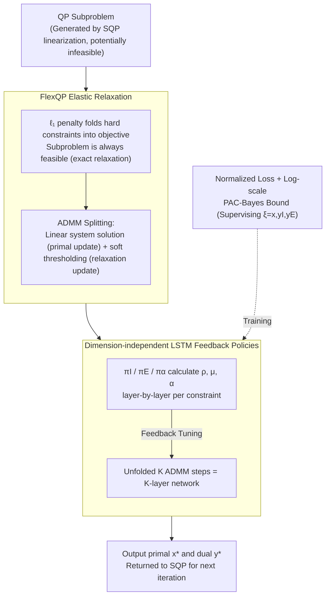

# Deep FlexQP: Accelerated Nonlinear Programming via Deep Unfolding

**Conference**: ICLR2026  
**arXiv**: [2512.01565](https://arxiv.org/abs/2512.01565)  
**Code**: TBD  
**Area**: LLM Evaluation  
**Keywords**: Quadratic Programming, Deep Unfolding, ADMM, Sequential Quadratic Programming, LSTM Policy, PAC-Bayes  

## TL;DR
FlexQP is proposed—an "always feasible" convex Quadratic Programming (QP) solver based on $\ell_1$ elastic relaxation. It is combined with deep unfolding to learn LSTM feedback policies for accelerated convergence, resulting in Deep FlexQP. When used as a sub-module in an SQP framework, it solves nonlinear trajectory optimization 4-16× faster than OSQP, while reducing safety violations in predictive safety filters by over 70% and increasing task completion rates by 43%.

## Background & Motivation

**Background**: Quadratic Programming (QP) is a fundamental subproblem in optimal control, combinatorial optimization, and machine learning. Sequential Quadratic Programming (SQP) handles nonlinear non-convex constrained optimization by iteratively solving QP subproblems.

**Limitations of Prior Work**: Constraint linearization in SQP often leads to infeasible QP subproblems. Traditional solvers (e.g., OSQP) either terminate with errors or require specialized infeasibility recovery procedures (such as SNOPT's elastic mode), which are non-scalable. Furthermore, tuning ADMM hyperparameters ($\rho, \sigma, \alpha$) is challenging.

**Core Idea**: Convert constrained QP into unconstrained optimization via $\ell_1$ exact relaxation—recovering the original solution when feasible (Theorem 3.1) and automatically finding the sparse point of minimum violation when infeasible. Then, employ deep unfolding and LSTM to learn dimension-independent feedback policies to replace manual parameter tuning.

## Method

### Overall Architecture

Deep FlexQP addresses recurring subproblems in nonlinear optimization: each SQP constraint linearization produces a QP subproblem. These QPs are frequently infeasible due to linearization distortion, causing traditional solvers to fail or require external repair. The paper decomposes the solution process into two layers. The bottom layer is **FlexQP**, which incorporates hard constraints $Gx \leq h, Ax = b$ into the objective via $\ell_1$ elastic relaxation, ensuring the subproblem is "always feasible" for any input. ADMM is then used to split it into "solving a linear system (primal update)" and "performing soft thresholding (relaxation update)" iterations. The top layer is **deep unfolding**: the $K$-step ADMM iteration is unfolded into a $K$-layer network, where a set of LSTM feedback policies calculates penalty parameters $\rho, \mu, \alpha$ at each layer based on current residuals. The trained structure is integrated into SQP, solving QP subproblems generated in each linearization step.

### Key Designs

**1. FlexQP Elastic Relaxation: Making Infeasible Subproblems Solvable**

This step addresses the primary pain point where SQP linearization often yields infeasible QPs. FlexQP incorporates inequality and equality constraints into the objective using $\ell_1$ penalty terms $\mu_I \|Gx+s-h\|_1 + \mu_E \|Ax-b\|_1$, ensuring the optimization problem is solvable for any input. Theorem 3.1 proves this relaxation is "exact": as long as penalty coefficients are sufficiently large—$\mu_I \geq \|y_I^*\|_\infty$ and $\mu_E \geq \|y_E^*\|_\infty$—the relaxation solution matches the original QP solution. If the problem is truly infeasible, the variables $z_I^*, z_E^*$ converge to sparse points, providing certificates of "which constraints are violated and by how much."

**2. Dimension-independent LSTM Feedback Policies: Learning Feedback Control for Parameter Tuning**

While FlexQP is always feasible, ADMM convergence speed depends heavily on parameters like $\rho, \sigma, \alpha$. Manual tuning is difficult and non-transferable. Here, each unfolded ADMM step is treated as a feedback control step. Three policies—$\pi_I, \pi_E, \pi_\alpha$—are trained for inequality constraints, equality constraints, and relaxation parameters. Each layer takes current ADMM variables and residuals as input to output the step-specific penalty parameters. Crucially, policies are applied per "individual constraint" rather than the whole vector, making the parameter count independent of problem size. This allows generalizing from 500-D training problems to 10k-D testing problems.

**3. Normalized Training Loss and Log-scale PAC-Bayes Bound: Supervising Dual Variables with Generalization Guarantees**

The training objective encourages the $k$-th layer solution to approach the ground truth using a relative error loss:

$$\min_\theta \sum_k \frac{\|\xi^k(\theta) - \xi^*\|_2}{\|\xi^*\|_2},\quad \xi = (x, y_I, y_E)$$

Supervising dual multipliers $y_I, y_E$ alongside the primal solution $x$ implicitly forces learned penalty coefficients to satisfy $\mu \geq |y^*|$, aligning learned parameters with the theoretical requirements for exact relaxation. To improve generalization guarantees, a log-scale PAC-Bayes loss is utilized, which remains informative even at small residual levels where standard losses plateau.

## Key Experimental Results

### Small/Medium QP (500 Training/1000 Testing Problems)

| Solver | Convergence Speed (Iterations) | Final Residual |
|--------|-------------------|---------|
| OSQP (Manually Tuned) | Baseline | Baseline |
| Deep OSQP | Better than OSQP | Better than OSQP |
| Deep OSQP-Improved | Further improved | Further improved |
| **Deep FlexQP** | **Fastest among all** | **Lowest among all** |

### Large-scale QP (10k variables/10-20k constraints)

| Problem Class | Deep FlexQP Advantage |
|--------|-----------------|
| Portfolio Optimization (10k var, 10k con) | Fewest iterations; generalizes via fine-tuning from small models |
| SVM (10k var, 20k con) | Fewest CG iterations |

### SQP Nonlinear Optimization

| Metric | Deep FlexQP + SQP vs OSQP + SQP |
|------|-------------------------------|
| Trajectory Optimization Speed | **4-16× Faster** (average over 100 problems) |
| Safety Filter Violations | **Reduced >70%** |
| Safety Filter Task Completion | **Increased 43%** |

### Key Findings
- The FlexQP architecture (elastic relaxation + LSTM) is the primary driver of performance; Deep OSQP variants perform significantly worse under the same loss function.
- Models trained on small problems generalize to 10k+ dimensions with only 5 rounds of fine-tuning on 100 large-scale instances.
- The log-scale PAC-Bayes bound provides meaningful generalization guarantees where standard bounds become uninformative.

## Highlights & Insights
- **Theoretical Elegance**: Combines $\ell_1$ exact relaxation, ADMM, and deep unfolding with rigorous mathematical guarantees.
- **High Practical Value**: Directly addresses the core engineering bottleneck of infeasible subproblems in SQP without requiring external repair procedures.
- **Dimension Independence**: The LSTM policy design allows a single trained model to generalize across problems of arbitrary scale.

## Limitations & Future Work
- High training overhead for large-scale problems (approx. 3 hours per epoch; full training would take 300+ days).
- Validation was restricted to dense QPs; sparse QPs (e.g., power grid optimization) might require different strategies.
- Limited interpretability of LSTM policies makes it difficult to extract explicit parameter-tuning rules.

## Related Work & Insights
- Compared to Deep OSQP (Saravanos et al., 2025), the key advantages of FlexQP are native handling of infeasibility and vector-level (rather than scalar-level) penalty policies.
- This work inspires the application of deep unfolding to other optimization algorithms like interior-point methods or Frank-Wolfe.

## Rating
- Novelty: ⭐⭐⭐⭐ The combination of elastic relaxation and deep unfolding is novel, though individual components are established.
- Experimental Thoroughness: ⭐⭐⭐⭐⭐ Covers small to large-scale QP and nonlinear SQP across finance, ML, and control.
- Writing Quality: ⭐⭐⭐⭐ Clear structure with rigorous theoretical derivation.
- Value: ⭐⭐⭐⭐⭐ High potential for impact by resolving a critical engineering pain point in SQP.

<!-- RELATED:START -->

## Related Papers

- [\[ICLR 2026\] On Universality of Deep Equivariant Networks](on_universality_of_deep_equivariant_networks.md)
- [\[ICLR 2026\] Deep Learning with Learnable Product-Structured Activations](deep_learning_with_learnable_product-structured_activations.md)
- [\[ICLR 2026\] Variational Deep Learning via Implicit Regularization](variational_deep_learning_via_implicit_regularization.md)
- [\[ICLR 2026\] Diffusion Bridge Variational Inference for Deep Gaussian Processes](diffusion_bridge_variational_inference_for_deep_gaussian_processes.md)
- [\[ICLR 2026\] Random Label Prediction Heads for Studying Memorization in Deep Neural Networks](random_label_prediction_heads_for_studying_memorization_in_deep_neural_networks.md)

<!-- RELATED:END -->
