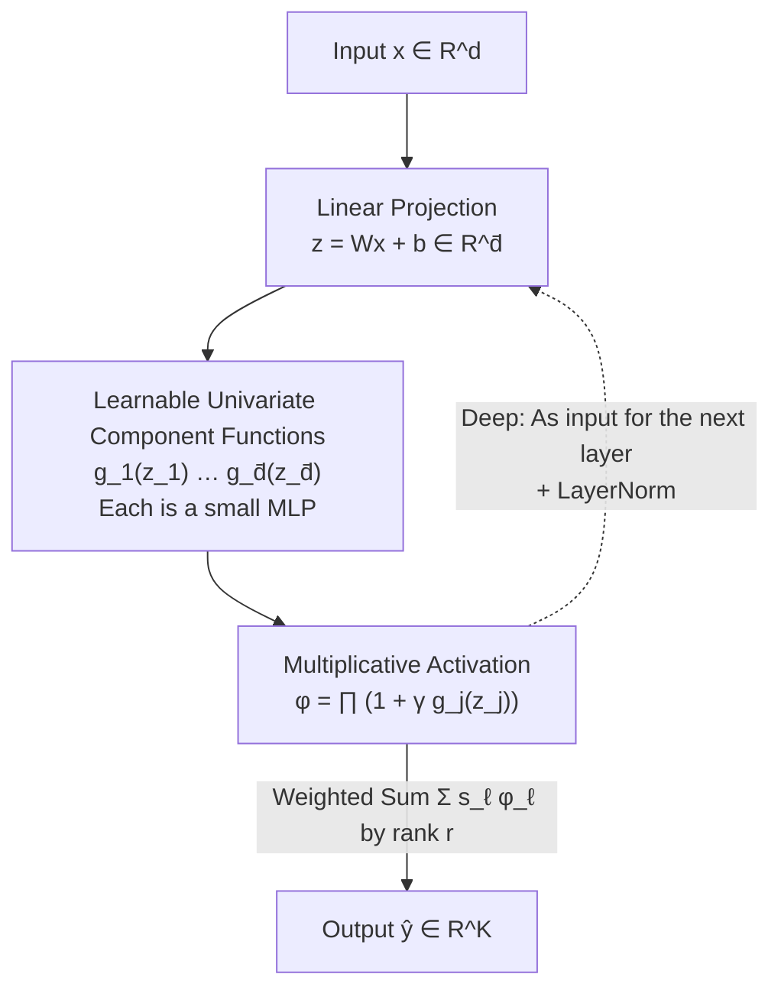

# Deep Learning with Learnable Product-Structured Activations

**Conference**: ICLR2026  
**OpenReview**: [https://openreview.net/forum?id=EB2Qgp5Vb0](https://openreview.net/forum?id=EB2Qgp5Vb0)  
**Code**: https://github.com/dacelab/lrnn  
**Area**: Neural Network Architecture / Representation Learning / Learning Theory  
**Keywords**: Learnable Activation Functions, Low-rank Separation, Multiplicative Interaction, Implicit Neural Representation, Spectral Bias

## TL;DR
This paper introduces LRNN (deep low-rank separated neural networks), which replaces the fixed scalar non-linearity of each neuron with a "product of multiple learnable univariate functions." This allows neurons to naturally capture high-order multiplicative interactions and adaptively adjust spectral bias, achieving state-of-the-art accuracy with fewer parameters in tasks such as image/audio representation, PDEs, and sparse-view CT.

## Background & Motivation
**Background**: Modern neural networks are almost entirely built on **fixed** activation functions like ReLU, Tanh, or Sigmoid, with expressive power gained through "stacking depth." To represent high-fidelity continuous signals (images, 3D shapes, PDE solutions), the Implicit Neural Representation (INR) field has developed several carefully designed activations—SIREN's sine, Gaussian, WIRE's wavelet, SPDER's half-cycle damping, HOSC, sinc, FINER, etc. Each is manually tailored for specific signal characteristics (periodicity, multiscale).

**Limitations of Prior Work**: Fixed activations have two fundamental drawbacks. The first is **spectral bias**—activations like ReLU struggle to represent high-frequency details (a phenomenon noted by Rahaman et al.); choosing or designing the right activation for different signals relies heavily on manual priors. The second is **additive synthesis**—standard neurons apply a scalar non-linearity after a linear weighting of features, which is essentially an "additive" combination. Representing **multiplicative interactions** (such as $x_1 x_2$ terms) is highly inefficient and requires significant depth. Recent KANs place learnable activations on edges to enhance expressivity but suffer from slow training and optimization instability as the grid size increases.

**Key Challenge**: The goal is to design a neuron/network architecture that possesses **high expressivity + adaptive non-linearity** (without manual activation design), while remaining **computationally efficient + optimization stable**. Fixed activations satisfy the latter but sacrifice the former, while KAN improves the former but worsens the latter.

**Goal**: Design a new neuron/network architecture where each neuron can **learn** a highly flexible, data-dependent activation function, while building multiplicative interactions directly into the structure and maintaining trainability.

**Key Insight**: The authors leverage the concept of **separated rank decomposition (SRD)**, which approximates multivariate functions as a "sum of products of univariate basis functions": $\hat y(x)=\sum_{i=1}^r s_i\prod_{j=1}^d g_{i,j}(x_j)$. This is the continuous version of Tensor CP decomposition. By elevating it from "approximating a fixed function" to a "learnable layer in deep learning," the product structure naturally encodes multiplicative interactions.

**Core Idea**: Replace the "fixed scalar activation" $\sigma(\cdot)$ in a neuron with a "product of learnable univariate functions" $\prod_j(1+\gamma g_j(z_j))$. This allows each neuron to learn its own vector-to-scalar multiplicative activation, generalizing SRD/CP decomposition into stackable deep networks.

## Method

### Overall Architecture
LRNN is a strict generalization of the MLP. For an input $x\in\mathbb R^d$, it outputs a $K$-dimensional regression target or category. A shallow MLP layer is written as $y_{\text{mlp}}(x)=\sum_{\ell=1}^r v_\ell\,\sigma(w_\ell^\top x+b_\ell)$—where each neuron projects the input into a **scalar** $z_\ell$ followed by a **shared fixed** activation $\sigma$. LRNN modifies this: it first projects the input into a $\bar d$-dimensional vector $z^\ell=W^\ell x+b^\ell$, applies $\bar d$ **individually learnable** univariate functions $g_j^\ell$, and then calculates their **product** to obtain a scalar activation. These are then summed with output weights per rank $r$. Deep LRNN stacks these "projection + multiplicative activation" layers $\varphi^{(k)}$ sequentially ($x^{(0)}\!\to\!x^{(1)}\!\to\cdots\to\!\hat y$), adding LayerNorm after each multiplicative calculation to stabilize training.

The following diagram illustrates the data flow of a single LRNN neuron (shallow):

### Key Designs

**1. Multiplicative Structured Activation: Replacing "Additive Neurons" with "Product Neurons"**

This is the foundation of the work, directly addressing the difficulty of expressing multiplicative interactions via additive synthesis. A shallow LRNN is expressed as:

$$\hat y_{\text{lrnn}}(x)=\sum_{\ell=1}^r s_\ell\prod_{j=1}^{\bar d}\bigl(1+\gamma\,g_j^\ell(z_j^\ell)\bigr),\qquad z^\ell=W^\ell x+b^\ell,$$

where $r$ is the separation rank (controlling expressivity), $\bar d$ is the projection dimension, $s_\ell\in\mathbb R^K$ are output weights, and $g_j^\ell:\mathbb R\to\mathbb R$ are univariate component functions. The key is the **product** $\prod_j$: expanding it naturally generates cross-terms like $g_1g_2$ and $g_1g_2g_3$, effectively encoding high-order multiplicative interactions "for free" within a single neuron's activation. Standard neurons require multiple layers to represent the same interactions. This makes LRNN a generalization of CP/SRD decomposition—if $K=1$, the projection is identity, and $(1+\gamma g_j)$ is replaced with $g_j$, it reduces to the SRD model of Beylkin et al. If $\bar d=1$ and $g_j$ is a fixed activation, it reduces to a standard shallow MLP. Unlike Maxout, which also maps vector-to-scalar, LRNN uses "products" instead of "maximums."

**2. Learnable Univariate Component Functions: Each Neuron Learns Its Own Activation**

The pain point is that fixed activations are manually selected and spectral bias is hard-coded. LRNN makes each univariate component $g_j^\ell$ a **small MLP**, whose parameters are trained end-to-end with the output weights $s_\ell$. Thus, the equivalent activation of each LRNN neuron $\varphi_\ell(z^\ell)=\prod_j(1+\gamma g_j^\ell(z_j^\ell))$ is a **data-dependent, unique**, and flexible non-linear curve—whereas all neurons in an MLP share the same $\sigma$. These embedded small MLPs still use standard scalar activations: $\sin(x)$ from SIREN or $\sin(x)\sqrt{|x|}$ and $\sin(x)\arctan(x)$ from SPDER are used for INR tasks. Interestingly, feeding SPDER activations into LRNN components (denoted as LRNN-SPDER) **outperforms** the pure SPDER baseline itself, indicating gains come from the multiplicative structure rather than just the choice of activation.

**3. Variance-Controlled Initialization: Why $1+\gamma g$ and $\gamma=\bar d^{-1/2}$ are Essential**

Naively multiplying $\bar d$ functions causes the variance to explode or vanish exponentially with $\bar d$, making deep networks untrainable. The authors introduce two mechanisms: wrapping each component in an "identity + perturbation" form $(1+\gamma g_j)$ and setting the scaling factor $\gamma=\bar d^{-1/2}$ (analogous to Xavier/He initialization or scaling in LoRA). Lemma 1 proves that under mild assumptions where component functions are initialized with zero mean and finite variance, the activation variance is bounded $\mathrm{Var}[\varphi(z)]\le e^{\sigma_g^2}-1$, and the sum of gradient variances $\sum_k\mathrm{Var}[\partial\varphi/\partial z_k]\le\sigma_{g'}^2 e^{\sigma_g^2}$—**both bounds are independent of the projection width $\bar d$**. This provides two benefits: stable forward/backward propagation in product structures of any width, and the natural implementation of **Automatic Relevance Determination (ARD)**—the gradient contribution of a single coordinate $\mathrm{Var}[\partial\varphi/\partial z_k]=O(1/\bar d)$ decays as $\bar d$ increases, but the collective force remains constant, allowing the model to automatically identify important coordinates in high-dimensional projections.

**4. Deep Stacking and Parameter Sharing: From Neurons to Trainable Deep Networks**

By stacking the multiplicative layers $\varphi^{(k)}:\mathbb R^{r_{k-1}}\to\mathbb R^{r_k}$ into $L$ layers, $\hat y(x)=S_{\text{out}}(\varphi^{(L)}\circ\cdots\circ\varphi^{(1)})(x)$, the input is transformed layer-by-layer into latent representations suitable for low-rank approximation, while benefiting from hierarchical composition. Since the multiplicative structure changes activation statistics, **adding LayerNorm after each multiplicative calculation** is critical for convergence (as confirmed by ablation). Parameter complexity can be reduced via sharing: sharing univariate components $g_j^{(k)}$ across all neurons in a layer reduces learnable functions from $r_k\bar d_k$ to $\bar d_k$. However, the authors found that while shared activations are more efficient at low parameter counts, "per-neuron independent activations" are still needed for extreme fidelity in high-frequency signals. Sharing projection layers significantly degrades expressivity.

### Loss & Training
Implemented in PyTorch, optimized with Adam on a single NVIDIA 4090. Task-specific losses include MSE for INR reconstruction and Cross-Entropy for classification. Hyperparameters primarily include separation rank $r$, projection dimension $\bar d$ (usually identical across layers), and the frequency factor $\omega_0$ for embedded MLP components. For PDE tasks, forward-mode automatic differentiation is used to efficiently calculate the Laplacian.

## Theory Analysis
- **Universal Approximation (Theorem 1)**: Any continuous function on $[0,1]^d$ can be approximated to arbitrary precision by an LRNN with a suitable separation rank $r$ (derived from the Stone-Weierstrass theorem and the fact that LRNN can represent arbitrary polynomial expansions). However, "universal" does not guarantee a small $r$—$r$ is small only if the target function itself has a low-rank/near-separable structure.
- **Mitigating the Curse of Dimensionality (Theorem 2)**: If the ANOVA decomposition of a function is dominated by terms with at most $m\ll d$ variables, the parameter complexity for LRNN to achieve error $\varepsilon$ is $O(\mathrm{poly}(d)/\varepsilon)$ rather than increasing exponentially with $d$. This is because the "sum-product" structure of LRNN naturally fits ANOVA decomposition, which is common in physical system functions, making it particularly suitable for scientific computing.
- **Adaptive Spectral Bias (Lemma 2)**: When paired with periodic activations (SIREN/SPDER) and $\bar d>1$, a single LRNN neuron generates not just $\bar d$ fundamental frequencies but all $2^{\bar d}-1$ combinations of sum and difference frequencies through **combined frequency synthesis**. This contrasts with the "additive synthesis" of MLPs (where each neuron only contributes one pair of frequencies) and explains why LRNN can represent high-frequency details in audio and images with fewer parameters.

## Key Experimental Results

### Main Results

| Task / Data | Metric | LRNN | Best Baseline | Gain |
|------|------|------|----------|------|
| Cameraman Image (~197k params) | PSNR | **107.9 dB** | SPDER 49.0 dB | +58.9 dB |
| ImageNet 1000, 40 dB target | Success Rate | **100%** | SPDER 26.4% / SIREN 1.8% | Others failed mostly |
| Audio bach | MSE($\times10^{-4}$) | **0.10** | SPDER 1.12 | ~11× lower |
| Audio counting/reggae/reading | MSE | See below | SIREN/SPDER | 3–11× lower |
| High-freq Poisson PDE | Param Efficiency | 16k params 2-layer LRNN | 132k params SIREN | 8× compression |
| PDE vs KAN | MSE | — | KAN | 100–1000× lower |
| Sparse-view CT (~180k params) | PSNR / SSIM | **29.13 / 0.7455** | WIRE 28.83 / 0.6413 | Highest / no artifacts |

Audio MSE Details ($\times10^{-4}$, mean of 10 runs):

| Method | bach | counting | reggae | reading |
|------|------|----------|--------|---------|
| SIREN | 1.21 | 2.77 | 21.5 | 9.98 |
| SPDER | 1.12 | 2.29 | 24.8 | 8.88 |
| LRNN-SPDER | **0.10** | **0.72** | **7.93** | **1.86** |

LRNN-SPDER also leads across all frequency similarity metrics $\rho_{AG}$ (e.g., reading 0.9862 vs SPDER 0.9324) and converges faster.

### Ablation Study

| Configuration | Impact | Description |
|------|------|------|
| w/o LayerNorm | Deep nets fail to converge | Multiplicative structure changes stats; LayerNorm is essential for convergence (Appendix C.2). |
| Non-periodic components | Severe spectral bias | For high-frequency tasks, periodic activations like SIREN/SPDER are required as components (C.3). |
| Shared vs Independent | Shared is efficient; high fidelity needs independent | Sharing improves efficiency, but complex high-frequency signals require per-neuron activations. |
| Shared Projection layers | Significant drop in expressivity | Not recommended. |
| 2-layer LRNN vs 3/5-layer SPDER/MLP | LRNN shallower but superior | Consistently leads across all parameter scales, verifying parameter efficiency. |

### Key Findings
- LRNN-SPDER pushed PSNR to 107.9 dB on "cameraman," exceeding visual distinguishability limits, indicating it **circumvents the spectral saturation** that limits standard architectures.
- Using the same SPDER/SIREN component activations, LRNN outperformed the corresponding pure SPDER/SIREN baselines—confirming that gains stem from the **multiplicative structure** rather than just activation choice.
- In sparse-view CT, LRNN's training loss convergence was similar to the second-best WIRE, but the reconstruction was **free of high-frequency artifacts** seen in WIRE, better capturing perceptually accurate image features—crucial for reducing patient radiation doses.

## Highlights & Insights
- **"Multiplicative Activation" is a true new primitive**: By changing neurons from "weighted sum + scalar non-linearity" to "projection + product of univariate functions," high-order multiplicative interactions are built directly into the activation. It strictly generalizes MLPs and SRD/CP decomposition.
- **The $1+\gamma g$ design with $\gamma=\bar d^{-1/2}$ enables trainability**: By using a width-independent variance bound, it solves the long-standing problem of numerical explosion in products while providing ARD.
- **Combined Frequency Synthesis provides a tunable knob for spectral bias**: $\bar d$ fundamental frequencies automatically generate $2^{\bar d}-1$ sum/difference frequencies. This explains its superiority in audio/image high-frequency tasks—a perspective transferable to any representation task requiring rich spectra (e.g., NeRF).
- **Cross-domain Versatility**: The same architecture achieved SOTA performance across four disparate domains—image, audio, PDE, and CT—often winning with shallower networks and fewer parameters.

## Limitations & Future Work
- The authors acknowledge that universal backpropagation requires storing intermediate products, resulting in **higher VRAM usage than standard MLPs**; mitigation involves kernel fusion and mixed precision (Appendix B.2).
- "Universal approximation" does not guarantee a small separation rank $r$; efficiency is only realized if the target function has an inherent low-rank/near-separable structure.
- The main focus is on continuous signal representation (INR); discrete supervised tasks (like classification) only have preliminary evidence in the appendix and require more systematic validation.
- The authors list 3D scene reconstruction (NeRF), video modeling, and non-stationary PDEs as promising next steps—suggesting that the multiplicative structure is particularly suited for capturing viewpoint-dependent high-frequency effects.

## Related Work & Insights
- **vs. Fixed/Manual Activations (SIREN, Gaussian, WIRE, SPDER, HOSC, sinc, FINER)**: These are manually designed for specific signal properties; LRNN lets each neuron **learn** its activation, outperforming them even when using them as components.
- **vs. KAN**: Both use learnable activations, but KAN puts them on edges, causing slow training and instability in large grids. LRNN places learnable univariate functions inside neurons as products, proving more stable with LayerNorm and variance-controlled initialization (100–1000× lower error in PDEs).
- **vs. Maxout**: Both map vectors to scalars, but Maxout uses "max" while LRNN uses "products," allowing the latter to encode multiplicative interactions.
- **vs. Low-rank for Compression (TT-decomposition, LoRA)**: While low-rank is typically used to compress weights or save memory, this work uses the **multiplicative structure of low-rank function decomposition to enhance expressivity**.
- **vs. SRD / Projection Pursuit Regression / NAM / Tree Tensor Networks**: LRNN is a deep learnable generalization of SRD, avoiding the slow convergence/ill-conditioning of SRD's alternating least squares and the combinatorial difficulty of finding optimal tree structures in Tree Tensor Networks.

## Rating
- Novelty: ⭐⭐⭐⭐⭐ Upgrading activations from "fixed scalar" to "product of learnable univariate functions" is a rare, genuine new primitive with solid theory.
- Experimental Thoroughness: ⭐⭐⭐⭐⭐ Covers four domains (Image/Audio/PDE/CT) plus 3000 ImageNet robustness tests and extensive ablations.
- Writing Quality: ⭐⭐⭐⭐ Clear connection between theory and experiments; extreme values (107.9 dB) are well-explained but slightly counter-intuitive.
- Value: ⭐⭐⭐⭐⭐ A general building block; insights like variance-controlled initialization and combined frequency synthesis are broadly transferable.

<!-- RELATED:START -->

## Related Papers

- [\[ICLR 2026\] Variational Deep Learning via Implicit Regularization](variational_deep_learning_via_implicit_regularization.md)
- [\[NeurIPS 2025\] Product Distribution Learning with Imperfect Advice](../../NeurIPS2025/learning_theory/product_distribution_learning_with_imperfect_advice.md)
- [\[ICLR 2026\] Understanding In-Context Learning on Structured Manifolds: Bridging Attention to Kernel Methods](understanding_in-context_learning_on_structured_manifolds_bridging_attention_to_.md)
- [\[ICLR 2026\] Deep FlexQP: Accelerated Nonlinear Programming via Deep Unfolding](deep_flexqp_accelerated_nonlinear_programming_via_deep_unfolding.md)
- [\[ICML 2026\] Is Spurious Correlation Removal Always Learnable?](../../ICML2026/learning_theory/is_spurious_correlation_removal_always_learnable.md)

<!-- RELATED:END -->
