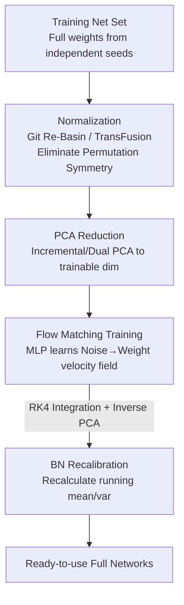

# DeepWeightFlow: Re-Basined Flow Matching for Generating Neural Network Weights

**Conference**: ICLR2026  
**OpenReview**: [https://openreview.net/forum?id=fOwsr1VTi8](https://openreview.net/forum?id=fOwsr1VTi8)  
**Code**: https://github.com/NNeuralDynamics/DeepWeightFlow  
**Area**: Weight Generation / Hypernetworks / Generative Models  
**Keywords**: Flow Matching, Neural Network Weight Generation, Permutation Symmetry, Git Re-Basin, Hypernetworks

## TL;DR
DeepWeightFlow utilizes a simple MLP-based flow matching model to directly learn a velocity field in the "weight space," mapping Gaussian noise to trained full network weights in a single pass. It first normalizes the training set networks using Git Re-Basin or TransFusion (eliminating permutation symmetries) and employs PCA to compress dimensions to a trainable scale. This allows the generation of hundreds of high-precision, ready-to-use networks (covering MLP, ResNet, ViT, and BERT, up to O(100M) parameters) within minutes without fine-tuning, significantly faster than diffusion-based approaches.

## Background & Motivation
**Background**: Generating trained network weights as high-dimensional data is an emerging direction. Sampling from weight distributions can accelerate transfer learning, facilitate ensembles, enable uncertainty estimation, and assist in neural architecture search. Mainstream approaches use diffusion models (e.g., P-diff, RPG, D2NWG) or conditional flow matching (e.g., FLoWN) to model weight distributions.

**Limitations of Prior Work**: Existing methods suffer from several fatal flaws. One category (P-diff, FLoWN) can only generate **partial weights** (typically limited to BatchNorm parameters because they cannot scale to full parameters of large models), resulting in incomplete networks. Another category capable of generating full weights is either extremely slow (RPG uses recursive diffusion, taking hours to generate one set of networks) or requires **fine-tuning** post-generation to be functional (SANE). A third category (D2NWG, FLoWN) requires training an additional VAE or graph autoencoder for dimensionality reduction, adding model complexity and potentially hurting weight quality through lossy compression.

**Key Challenge**: Weight generation is constrained by three factors: **permutation symmetry** (joint permutations of hidden neurons do not change function, creating highly multi-modal loss surfaces that are hard for generative models to learn), **ultra-high dimensionality** (even a small ResNet has millions of parameters), and the **trilemma of efficiency, completeness, and usability** (it is difficult to achieve full weights that are fast to generate and ready without fine-tuning).

**Goal**: To create a model that operates **directly in the weight space**, generates **complete** weights that are **ready-to-use without fine-tuning**, and is **extremely fast**, while scaling to O(100M) parameters across various architectures (MLP, ResNet, ViT, BERT) and data modalities.

**Key Insight**: The authors bet on two judgments. First, **flow matching is more suitable for weight generation than diffusion**—it directly regresses a velocity field that moves noise to the target. The sampling path is linear, allowing high-order integrators to reach the target efficiently, which is naturally suited for high dimensions. Second, **rather than using equivariant architectures to handle permutation symmetry, it is better to eliminate it on the data side via canonicalization**—aligning every network in the training set to a single reference representation so the generative model faces a simplified, single-modal distribution.

**Core Idea**: By combining "normalized training data + simple MLP flow matching + PCA dimensionality reduction," the model learns the velocity field directly in the weight space. The difficulty of symmetry is offloaded to preprocessing, and the challenge of scaling is handled by PCA, keeping the core generative model minimalist and fast.

## Method

### Overall Architecture
The input to DeepWeightFlow is a batch of full weights $\{W_1,\dots,W_L\}$ independently trained on a target task, and the output is newly sampled ready-to-use full weights from the same distribution. The pipeline consists of three steps: first, the trained networks are **normalized** (optional but critical for large models) to align multi-modalities caused by permutation symmetry to a reference; second, **PCA** is applied (for large networks) to compress flattened weight vectors to trainable dimensions; third, a **time-conditioned MLP flow matching model** is trained to learn the velocity field from Gaussian noise to target weights. During generation, RK4 integration flows noise into a full network, followed by a statistical **recalibration** for networks containing BatchNorm. The generative model itself is a shallow MLP with LayerNorm, GELU, and Dropout, lacking any equivariant structures as the "symmetry" work is handled during preprocessing.

### Key Designs

**1. Direct Flow Matching in Weight Space: Learning Velocity with a Shallow MLP**

To address the slowness of diffusion and the need for extra VAE reduction, DeepWeightFlow applies flow matching directly to the flattened weight space. The source distribution is Gaussian noise $x_0 \sim \mathcal{N}(0,\sigma^2 I)$ of the same dimension as the target, and the target is the trained weight distribution $x_1 \sim p_{\text{target}}$. Given uniformly sampled time $t\in[0,1]$, interpolation points $\mu_t=(1-t)x_0+tx_1$ are taken along a linear trajectory, with noise $x_t=\mu_t+\epsilon$ added for stability. The instantaneous velocity of this line is constant $u_t=x_1-x_0$ (since $\frac{d\mu_t}{dt}=x_1-x_0$). The model $v_\theta(x_t,t)$ maps the current point and time embedding to velocity, optimized via the standard flow matching regression loss:

$$\mathcal{L}_{\text{FM}}(\theta)=\mathbb{E}_{t\sim U[0,1],\,x\sim p_t(x)}\big[\lVert v_\theta(x,t)-u(x,t)\rVert^2\big].$$

Time $t$ is embedded via a small MLP into $t_{\text{embed}}\in\mathbb{R}^{d_{\text{time}}}$, concatenated with $x_t$, and fed into the main network (Linear + LayerNorm + GELU + Dropout). Generation starts from Gaussian noise and uses **fourth-order Runge–Kutta (RK4)** integration of the learned velocity field to obtain new weights. Compared to multi-step diffusion with latent encoders, this direct vector field regression and linear integration remain simple and fast.

**2. Normalization to Eliminate Permutation Symmetry: Offloading Symmetry to Preprocessing**

This is the core insight of the paper. Functionality remains unchanged when hidden neurons in adjacent MLP layers undergo joint permutation $P$ ($P^TP=I$): $z_{\ell+1}=P^T\sigma(PW_\ell z_\ell+Pb_\ell)$. Similar symmetries exist in convolutional channels and Transformer attention heads. This leads to many equivalent but scattered points in weight space, causing high multi-modality. Rather than designing expensive equivariant networks, DeepWeightFlow aligns training networks to a single reference on the **data side**: using **Git Re-Basin** for MLPs/ResNets (formulated as a sequence of Bilinear Assignment Problems solved via coordinate descent over 100 iterations) and **TransFusion** for ViTs (extending alignment to permutations within and between attention heads, involving spectral decomposition over 10 iterations). Normalization collapses equivalent weights into a single canonical representative, presenting a unimodal distribution to the flow model. Experiments show this is **capacity-dependent**: normalization improves accuracy and reduces variance when the flow model capacity is limited, whereas results converge as capacity increases.

**3. Incremental / Dual PCA: Scaling to O(100M) Parameters Without Autoencoders**

Training directly on raw flattened weights for large networks would be bottlenecked by GPU memory. DeepWeightFlow uses PCA for training-free dimensionality reduction: **Incremental PCA** for weights up to O(10M) and **Dual PCA / Gram PCA** for O(100M) (decomposing the dual form of covariance when sample size is much smaller than dimensionality). This avoids VAE-based reduction in two ways: it **obviates training an additional autoencoder** and, since PCA is a linear invertible transform, fidelity is more controllable. Ablations show PCA significantly reduces training time while maintaining accuracy, suggesting potential scalability to O(1B) parameters.

**4. BatchNorm Statistics Recalibration: Solving the Weight-to-Stats Mismatch**

Networks with BN (e.g., ResNet-18/20) face a risk: even if weights are generated perfectly, the network fails if BN running mean/variance do not match. Flow matching learns the learnable $\gamma, \beta$, but "non-parametric" running stats are tied to data distribution and perform poorly if simply copied from reference models. DeepWeightFlow's solution is to **recompute BN running statistics** by performing a single forward pass with a small subset of the training set (Algorithm 1). LayerNorm, being permutation-invariant and independent of running stats, requires no such calibration. This step allows generated ResNets to reach training-target performance with zero fine-tuning.

### Training Strategy
Training data consists entirely of **final weights independently trained from random seeds** (typically 100 networks per dataset), rather than sequences of checkpoints from a single run. This ensures the training set itself is diverse. The choice of source distribution standard deviation is critical; performance peaks when it **matches or is slightly lower** than the target weight standard deviation. Gaussian noise consistently outperforms Kaiming initialization, a sensitivity especially pronounced in smaller flow models.

## Key Experimental Results

### Main Results
Full weight generation across architectures (No fine-tuning, accuracy of generated vs. original training set):

| Architecture / Task | Original Net | DeepWeightFlow (Full) | SOTA Comparison |
|:---|:---|:---|:---|
| 3-layer MLP / MNIST | 96.32 ± 0.20 | 96.17 ± 0.31 (w/ Re-Basin) | FLoWN: 83.58; WeightFlow: 78.6 |
| ResNet-18 / CIFAR-10 | 94.45 ± 0.14 | 93.55 ± 0.13 (Full) | RPG: 95.1 (Slow autoregressive); SANE: 68.6 |
| ResNet-18 / STL-10 | 62.30 ± 0.77 | 62.46 ± 0.79 | P-diff: 62.24; FLoWN: 62.00 |
| ViT-Small-192 / CIFAR-10| 83.30 ± 0.29 | 83.07 ± 0.42 (w/ TransFusion) | P-diff (ViT-mini): 73.6 |
| BERT-118M / Yelp (Spearman) | 0.7902 ± 0.061 | 0.7909 ± 0.005 (Dual PCA) | — |

Key Insight: DeepWeightFlow generates **complete** weights with accuracy nearly identical to the training set, whereas FLoWN/P-diff often generate only partial weights, and RPG/SANE are either slow or require fine-tuning. The BERT-118M result demonstrates scalability to O(100M) parameters using Dual PCA.

### Ablation Study
Capacity dependence of normalization (Comparing Re-Basin with $d_h$ as flow model hidden dimension):

| Task / Architecture | $d_h$ | w/ Re-Basin | w/o Re-Basin | Insight |
|:---|:---|:---|:---|:---|
| MNIST / MLP | 512 | 96.17 ± 0.31 | 96.19 ± 0.27 | Negligible diff at high capacity |
| MNIST / MLP | 64 | 57.80 ± 9.85 | 25.54 ± 12.90 | Normalization wins at low capacity |
| Fashion-MNIST / MLP | 64 | 77.76 ± 3.72 | 53.35 ± 30.49 | Higher accuracy and lower variance |
| ViT-Small-192 / CIFAR-10 | 128 | 69.09 ± 25.20 | 41.15 ± 25.26 | Transfer results benefit from normalization |

Transfer Learning: Generated ResNet-18 weights on CIFAR-10 transferred to STL-10 and SVHN consistently outperformed FLoWN and random initialization, matching the performance of networks trained directly on the source dataset.

### Key Findings
- **Normalization as "Capacity Insurance"**: While high-capacity models can compensate for lack of normalization, it is essential for lower-capacity models or ultra-high dimensional weights to maintain accuracy and stability.
- **Source Variance Sensitivity**: Optimal performance is achieved when source variance matches or is slightly below target variance.
- **Efficiency Gains**: Generations that take hours for diffusion methods like RPG are completed in minutes.
- **True Diversity**: Using mIoU to measure prediction error overlap, generated networks maintain the diverse error patterns seen in the original training set.

## Highlights & Insights
- **Decoupling Symmetry via Preprocessing**: Offloading the handling of permutation symmetry to Git Re-Basin/TransFusion allows the generative model to remain a standard MLP. This "complexity-shifting" approach could apply to other highly symmetric generation tasks.
- **PCA as a VAE Alternative**: Using linear, invertible, and training-free PCA (especially Dual PCA) instead of lossy VAEs is the key to scaling to O(100M) without extra model training.
- **BN Recalibration**: Highlighting and solving the mismatch between generated weights and running statistics is vital for "zero fine-tuning" usability.
- **Flow Matching Speed**: The use of RK4 integration on a linear trajectory transforms multi-step denoising into an efficient field integration.

## Limitations & Future Work
- **Architecture Specificity**: Each model is essentially tied to a specific architecture and lacks cross-architecture generalization without retraining.
- **Scale Limits**: Scalability to O(1B) is projected via resource estimates but not yet empirically verified.
- **Linearity of PCA**: As a linear method, PCA may lose non-linear manifold information, which could degrade generation quality compared to perfectly optimized non-linear autoencoders.
- **Cost of Normalization**: For intermediate dimensions, the computational overhead of TransFusion (with spectral decomposition) may not justify the marginal gains.
- **Dataset Availability**: While generation code is available, the large-scale weight datasets themselves are not yet fully public.

## Related Work & Insights
- **vs. P-diff / FLoWN (Partial weights)**: These primarily generate subsets of parameters (e.g., BN). DeepWeightFlow generates **full** weights with high precision up to ViT/BERT scales.
- **vs. RPG (Autoregressive Diffusion)**: RPG is extremely slow due to its recursive nature; DeepWeightFlow provides minute-level generation via flow matching.
- **vs. SANE (Normalization + Autoregressive)**: Both use Re-Basin, but SANE tokenizes weights by layer and requires fine-tuning, whereas DeepWeightFlow is a direct single-pass generator.
- **vs. D2NWG (VAE + Diffusion)**: DeepWeightFlow replaces the VAE with PCA (no extra training, controllable loss) and extends normalization to Transformers.

## Rating
- Novelty: ⭐⭐⭐⭐ Combines existing components (Flow Matching + Re-Basin + PCA) in a technically sound way to solve the completeness/speed/usability trilemma.
- Experimental Thoroughness: ⭐⭐⭐⭐ Comprehensive coverage across MLP/ResNet/ViT/BERT, but lacks a 1B+ parameter verification.
- Writing Quality: ⭐⭐⭐⭐ Clear motivation, thorough explanation of symmetry, and well-structured evidence.
- Value: ⭐⭐⭐⭐ Moves "full weight generation" toward practical utility in minutes without fine-tuning, advancing the study of weight-space dynamics.

<!-- RELATED:START -->

## Related Papers

- [\[ICLR 2026\] Parameterized Hardness of Zonotope Containment and Neural Network Verification](parameterized_hardness_of_zonotope_containment_and_neural_network_verification.md)
- [\[ICLR 2026\] Training-Free Determination of Network Width via Neural Tangent Kernel](training-free_determination_of_network_width_via_neural_tangent_kernel.md)
- [\[ICLR 2026\] Diffusion and Flow-based Copulas: Forgetting and Remembering Dependencies](diffusion_and_flow-based_copulas_forgetting_and_remembering_dependencies.md)
- [\[ICLR 2026\] Toward Practical Equilibrium Propagation: Brain-Inspired Recurrent Neural Network with Feedback Regulation and Residual Connections](toward_practical_equilibrium_propagation_brain-inspired_recurrent_neural_network.md)
- [\[ICLR 2026\] Conformal Prediction with Corrupted Labels: Uncertain Imputation and Robust Re-weighting](conformal_prediction_with_corrupted_labels_uncertain_imputation_and_robust_re-we.md)

<!-- RELATED:END -->
