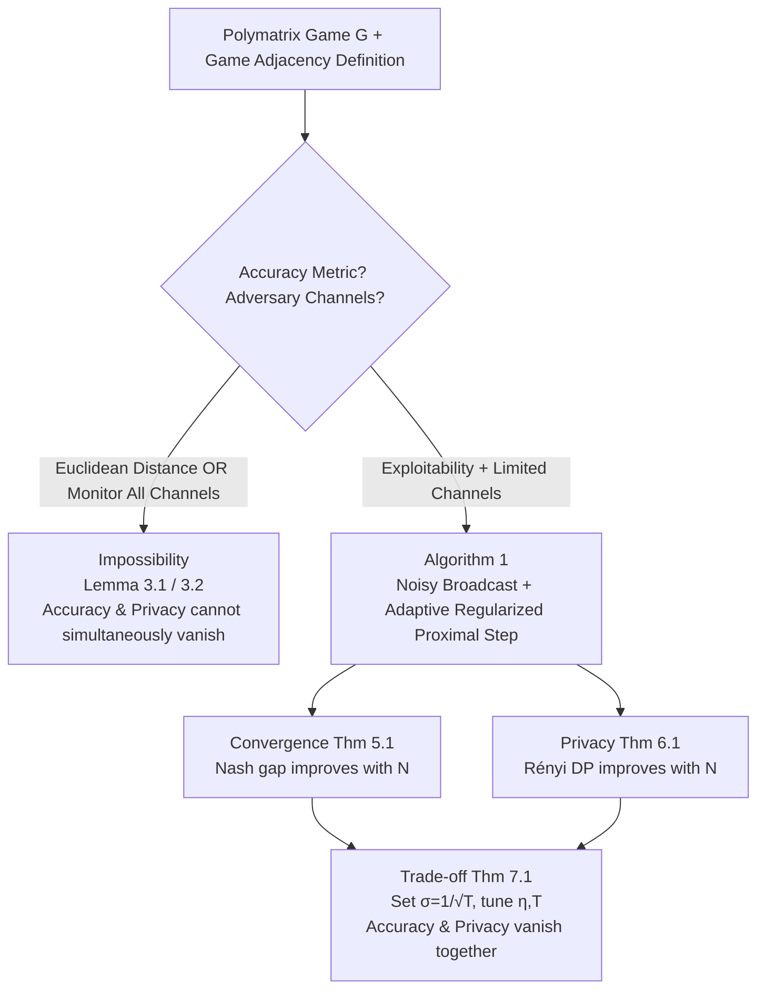

# Differentially Private Equilibrium Finding in Polymatrix Games

**Conference**: ICLR 2026  
**OpenReview**: [https://openreview.net/forum?id=7qNbWQTV26](https://openreview.net/forum?id=7qNbWQTV26)  
**Code**: TBD  
**Area**: Learning Theory / Differential Privacy / Game Theory  
**Keywords**: Differential Privacy, Polymatrix Games, Nash Equilibrium, Coarse Correlated Equilibrium, Distributed Optimization, Impossibility Bounds  

## TL;DR
This paper characterizes the boundaries of **distributed equilibrium finding in polymatrix games that simultaneously satisfy high accuracy and low differential privacy budgets**. It proves that this is impossible if an adversary monitors all channels or if accuracy is measured by Euclidean distance. However, by replacing the distance metric with exploitability and assuming the adversary monitors limited channels, the authors propose an adaptive regularization algorithm where the Nash gap and privacy budget **both vanish as the number of players increases**.

## Background & Motivation

**Background**: Polymatrix games use a graph to model local interactions, where nodes represent players and edges represent pairwise games. Players use the same strategy across all incident edges, and their total utility is the sum of payoffs from each edge. This model covers security games, financial markets, and decentralized bilateral trading networks, making it one of the few multi-agent models that are both expressive and computationally tractable.

**Limitations of Prior Work**: In these scenarios, players' utility matrices often encode sensitive information (e.g., reservation prices, private valuations), which must remain confidential during the evolution toward equilibrium. Without a trusted central server, distributed algorithms are required where players compute locally and exchange information with neighbors. However, adversaries monitoring communication channels could potentially infer utility functions. Existing Differentially Private (DP) equilibrium computation works suffer from two major flaws: either **accuracy and privacy budgets cannot be lowered simultaneously** (Ye 2021, Wang 2022), or only **weakened forms of privacy** are provided, allowing adversaries to infer partial private information (Wang & Bașar 2024, etc.).

**Key Challenge**: The essence of DP is adding noise to make adjacent inputs indistinguishable, whereas equilibrium finding requires iterative convergence toward the true optimal. More noise increases privacy but degrades accuracy. It remained unclear whether this trade-off was a limitation of current algorithms or a fundamental lower bound.

**Goal**: (1) Establish **impossibility bounds** for DP equilibrium computation to define the feasible region; (2) Design a distributed algorithm within the feasible region where both **accuracy and privacy improve with the number of players $N$**.

**Key Insight**: **① The choice of accuracy metric is critical**: Euclidean distance to the equilibrium set is too restrictive; switching to "exploitability" (the gain from unilateral deviation) provides a path forward. **② Adaptive Regularization**: A weight decay $\tau_i$ is applied to each player, inversely proportional to their degree and proportional to the harmonic mean of degrees. Since gradients of low-degree players are more sensitive to a single utility matrix, more regularization is used to "smooth" trajectories across adjacent games, trading a controlled convergence for enhanced privacy.

## Method

### Overall Architecture
This is a two-part theoretical work that first defines "red lines" and then builds an algorithm within them. The first half uses **game adjacency** to define DP: two polymatrix games are adjacent if they differ only in the utility matrix of a single edge. If an algorithm is DP, an adversary cannot distinguish the original game from any adjacent one via observed signals. After proving two impossibility lemmas, the paper introduces Algorithm 1—a distributed CCE solver utilizing noisy broadcasting and adaptive regularized proximal gradient steps—alongside theorems for convergence, privacy, and their trade-off.

### Key Designs

**1. Game Adjacency + Rényi DP**: Protecting utility matrices is translated into formal privacy language. Two polymatrix games are adjacent ($G\sim G'$) if they differ only on a single edge $(i,j)$'s utility matrix $U_{i,j}$. $(\epsilon, \delta)$-DP requires that for any adjacent games and any set of observations $S$, $P_G(R_G(\theta)\in S)\le e^{\epsilon}P_{G'}(R_{G'}(\theta)\in S)+\delta$. The paper specifically utilizes **Rényi DP** ($D_\alpha(\mu_G^{(t)},\mu_{G'}^{(t)})\le\epsilon$) for its superior composition properties.

**2. Two Impossibility Bounds**: Zero-sum polymatrix games are used to define the boundaries. **(i) Full channel monitoring is infeasible**: Lemma 3.1 shows that for $N \ge 12$, any algorithm satisfying accuracy $\zeta$ and privacy $\epsilon$ must have $\zeta \ge \min\{\frac{3\exp(-2\epsilon)}{112}, \frac{1}{112}\}$. If an algorithm converges too accurately, an adversary can infer the game via the observed equilibrium. **(ii) Euclidean distance metric is infeasible**: Lemma 3.2 shows that even with limited monitoring, Euclidean distance is too sensitive; a slight shift in one player's strategy can flip another's best response, causing equilibrium jumps to propagate through the graph. These bounds dictate that positive results can only exist in the **"Limited Channels + Exploitability"** quadrant.

**3. Adaptive Regularized Proximal Gradient Steps**: Each player $i$ samples Gaussian noise $n_i^{(t)}\sim N(0,\sigma^2 I)$, broadcasts $\pi_i^{(t)}+n_i^{(t)}$, and performs a gradient step with weight decay:
$$\pi_i^{(t+1)}\leftarrow\arg\min_{\pi_i\in\Delta_{A_i}}\langle\pi_i,g_i^{(t)}\rangle+\tau_i\|\pi_i\|^2+\frac1\eta\|\pi_i-\pi_i^{(t)}\|^2,$$
which is equivalent to $\pi_i^{(t+1)}\leftarrow\mathrm{Proj}_{\Delta_{A_i}}\big(\frac{\pi_i^{(t)}-\eta g_i^{(t)}}{1+\eta\tau_i}\big)$. The **Adaptive Regularization** $\tau_i=\frac{(\bar N)^{5/9}}{|N(i)|\log N}$ (where $\bar N$ is the harmonic mean of degrees) is the core. Low-degree players receive more regularization to suppress trajectory differences, while high-degree players naturally dilute individual edge perturbations through utility aggregation.

**4. Unified Privacy Analysis and Trade-off**: Theorem 7.1 demonstrates that by selecting $\sigma = 1/\sqrt{T}$ and tuning $\eta, T$, the accuracy and privacy scale as $O\big(\frac{(\log N)^{2/3}}{N^{4p/27}}\big)$ for dense graphs and $O\big(\frac{1}{(\log N)^{1/3}}\big)$ for sparse graphs. This ensures both **vanish as $N \to \infty$**, a breakthrough compared to prior literature.

## Key Experimental Results

Experiments conducted on synthetic graphs compare the proposed method with a baseline modified from Huang et al. (2015), comparing exploitability under **identical DP budgets**.

### Main Results (Dense Erdős–Rényi Graphs)

| Setting | Player Count $2^7\to2^{11}$ | Ours | Baseline |
|------|------|---------|----------|
| $A=5, p\in\{0.1, 0.3, 0.5\}$ | Exploitability vs N | **Consistently lower, decreases with N** | Does not decrease with N |
| $A=10$ | Exploitability vs N | **Consistently lower** | Plateaus |

The exploitability magnitude ranges from $2.2\times10^{-1}$ to $2.8\times10^{-1}$. The curves for the proposed method monotonically decrease as the number of players increases.

### Key Findings
- **Superior trade-off**: Under the same privacy budget, the proposed method consistently achieves lower exploitability, validating the effectiveness of adaptive regularization.
- **Scaling Law**: Exploitability decreases as $N$ increases, perfectly matching Theorem 7.1, whereas the baseline does not improve with $N$.

## Highlights & Insights
- **Metric choice as a first-class citizen**: The most profound insight is the gap between Euclidean distance and exploitability—the former is too sensitive to equilibrium jumps, while the latter focuses on deviation payoffs.
- **Impossibility bounds as guardrails**: By first proving what cannot be done, the paper focuses the algorithm design entirely on the feasible region (limited channels + exploitability).
- **Degree-aware regularization**: The strategy $\tau_i \propto 1/|N(i)|$ leverages the "dilution" inherent in dense graphs and the "distance" inherent in sparse graphs.
- **Counter-intuitive scaling**: Usually, coordination becomes harder with more players; here, $N$ serves as a source of "privacy dilution," making the system simultaneously more accurate and more private.

## Limitations & Future Work
- **Reliable network assumption**: Privacy analysis assumes Rényi composition across channels, implying the network structure is largely static and reliable.
- **Large theoretical constants**: The constants in the impossibility bounds and the exponents in the scaling laws (e.g., $N^{4p/27}$) suggest that the "vanishing" effect might require very large $N$ to be practically significant.
- **Synthetic evaluation**: Experiments lack validation on real-world security games or financial networks.
- **Equilibrium concepts**: The findings are focused on CCE/NE; applicability to stronger concepts like Correlated Equilibrium (CE) remains unknown.

## Related Work & Insights
- **Game-theoretic adaptation of distributed optimization**: The work migrates the adjacency framework from Huang et al. (2015) to multi-agent games.
- **Exploiting zero-sum structures**: Utilizing the CCE-NE collapse in zero-sum polymatrix games (Cai et al. 2016) is a clever application of classic game theory for proving modern privacy bounds.
- **No-regret perspective**: Without privacy, the algorithm reverts to Online Mirror Descent with Euclidean regularization. Viewing privacy as "No-regret learning + Adaptive noise/regularization" provides a useful template for other private multi-agent tasks.

## Rating
- Novelty: ⭐⭐⭐⭐⭐ (Characterizes boundaries and provides the first $N\to\infty$ vanishing budget algorithm).
- Experimental Thoroughness: ⭐⭐⭐ (Sufficient for theory verification but lacks diverse baselines and real-world scale).
- Writing Quality: ⭐⭐⭐⭐ (Clear logic with well-structured "red line" vs "algorithm" narrative).
- Value: ⭐⭐⭐⭐ (Provides critical theoretical guardrails for the intersection of DP and game theory).

<!-- RELATED:START -->

## Related Papers

- [\[ICLR 2026\] Online Learning and Equilibrium Computation with Ranking Feedback](online_learning_and_equilibrium_computation_with_ranking_feedback.md)
- [\[ICLR 2026\] Computing Equilibrium beyond Unilateral Deviation](computing_equilibrium_beyond_unilateral_deviation.md)
- [\[NeurIPS 2025\] Efficient Kernelized Learning in Polyhedral Games Beyond Full-Information: From Colonel Blotto to Congestion Games](../../NeurIPS2025/learning_theory/efficient_kernelized_learning_in_polyhedral_games_beyond_full-information_from_c.md)
- [\[ICLR 2026\] Toward Practical Equilibrium Propagation: Brain-Inspired Recurrent Neural Network with Feedback Regulation and Residual Connections](toward_practical_equilibrium_propagation_brain-inspired_recurrent_neural_network.md)
- [\[NeurIPS 2025\] Optimism Without Regularization: Constant Regret in Zero-Sum Games](../../NeurIPS2025/learning_theory/optimism_without_regularization_constant_regret_in_zero-sum_games.md)

<!-- RELATED:END -->
