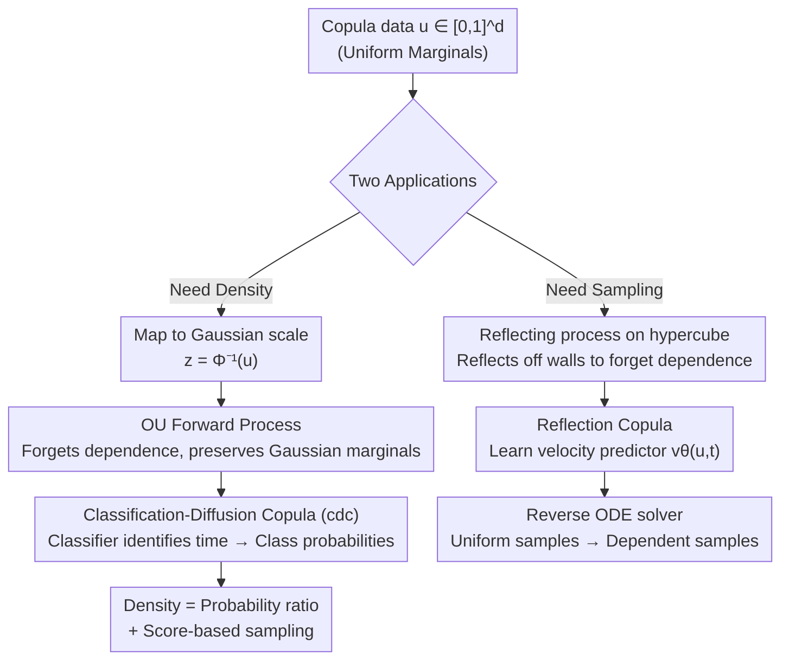

# Diffusion and Flow-based Copulas: Forgetting and Remembering Dependencies

**Conference**: ICLR2026  
**OpenReview**: [https://openreview.net/forum?id=YrX77XRgku](https://openreview.net/forum?id=YrX77XRgku)
**Code**: https://github.com/Huk-David/Diffusion-and-Flow-based-Copulas  
**Area**: Probabilistic Generative Models / Copula / Diffusion & Flow  
**Keywords**: Copula, Diffusion Process, Flow Models, Dependence Structure Modeling, Density Estimation

## TL;DR
This paper applies diffusion and flow concepts to copula modeling by designing two forward stochastic processes that "forget dependencies between variables while preserving univariate marginal distributions." By training models to "remember" these forgotten dependencies, the authors enable copulas to scale to high-dimensional ($d > 1000$) and multimodal structures (e.g., images) for the first time, outperforming classical and existing deep copulas on scientific and image data.

## Background & Motivation
**Background**: Modeling the joint distribution of a set of continuous random variables can be elegantly decoupled: first, individual univariate marginal distributions are modeled, and then a copula is used specifically to characterize the dependencies between variables. Sklar’s Theorem guarantees the unique existence of such a decomposition—any joint CDF can be written as $P(x_1,\dots,x_d)=C(P^1(x_1),\dots,P^d(x_d))$, where $C$ is a copula defined on the unit hypercube $[0,1]^d$ with uniform marginals. Because copulas decouple "marginal behavior" from "dependence structure," they are the preferred tool in fields requiring calibrated marginals (e.g., extreme events), such as weather forecasting, hydrology, risk management, causal inference, and uncertainty quantification.

**Limitations of Prior Work**: However, the expressivity of mainstream copula models is limited by rigid assumptions and poor scalability. Gaussian copulas only capture diagonally symmetric dependencies; vine copulas discard parts of the dependence structure, and their model space grows exponentially with dimension. Existing deep copulas (based on GANs or Moment Matching Networks) suffer from mode collapse and struggle with sampling in high-dimensional, multimodal settings. The recent ratio copula (Huk et al., 2025), which equates copula density to a binary classifier ("dependent vs. independent data"), is expressive but **only estimates density**. Sampling requires expensive MCMC with complexity scaling at $O(d^{4/3})$, making it impractical for high-dimensional multimodal scenarios.

**Key Challenge**: Existing copulas either lack expressivity (rigid parametric assumptions), offer density estimation without efficient sampling, or provide sampling without tractable densities. Furthermore, none can maintain uniform marginals while capturing complex dependencies in high dimensions.

**Goal**: The problem is decomposed into two specific sub-questions: (Q1) How to design a stochastic process that **forgets dependencies while keeping marginal distributions invariant**? (Q2) Can the forgotten dependencies be "remembered" to reconstruct the copula's density and generate samples?

**Key Insight**: The authors observe that copula data is naturally constrained by "uniform marginals." Diffusion and flow models excel at the paradigm of "gradually degrading a data distribution to a simple prior and then reversing it for generation." If a forward process can be designed to **specifically destroy dependencies without touching marginal uniformity**, then the endpoint is the "independence copula." Learning to invert this process is equivalent to learning the true dependence structure.

**Core Idea**: The traditional parametric assumptions of copulas are replaced with a "forget dependencies (forward) + remember dependencies (reverse learning)" framework. This introduces the scalable sampling capabilities of diffusion and flow models to dependence modeling. Theoretically, the forward process **always results in valid copulas**, and the reverse model **provably recovers the true copula** when optimal.

## Method

### Overall Architecture
The paper presents a unified framework implemented as two complementary instances. The framework consists of two steps: first, designing a **forward process** that monotonically decays dependencies over time $t$ toward independence while keeping univariate marginals invariant (retaining a "continuum from dependent to independent copulas"); second, training a model to "remember" the dependencies forgotten by this process, thereby recovering the true copula at $t=0$ for density evaluation or sampling.

The two instances address the two primary use cases of copulas:

- **Classification-Diffusion Copula (cdc)**: Targeted at **density estimation**. It maps copula data $u$ to the Gaussian scale $z=\Phi^{-1}(u)$, runs an Ornstein–Uhlenbeck (OU) process on $z$ to gradually forget dependencies, and trains a multi-class classifier to identify "which diffusion time step a sample belongs to." The density is retrieved directly from class probabilities, and it also supports score-based diffusion sampling.
- **Reflection Copula (reflection)**: Targeted at **efficient sampling**. It operates directly on the $[0,1]^d$ hypercube, assigning random velocities to samples so they "reflect off walls" to forget dependencies. It then learns a velocity predictor to solve a reverse ODE, generating dependent samples from uniform noise.

### Key Designs

**1. Forward Forgetting: OU Process on the Gaussian Scale**

The key to cdc is building the process on the Gaussian scale $z$ rather than the copula scale. Since $u$ has uniform marginals, $z=\Phi^{-1}(u)$ has standard Gaussian marginals via Probability Integral Transform. The authors apply a **dimension-wise independent** OU process on $z$:

$$\mathrm{d}z_t = -z_t\,\mathrm{d}t + \sqrt{2}\,\mathrm{d}B_t,$$

Its stationary distribution is the standard $d$-dimensional Gaussian—meaning each univariate marginal **remains standard Gaussian**, satisfying the requirement of invariant marginals. Proposition 2 further proves that mapping $z_t$ back to the copula scale $u_t=\Phi(z_t)$ ensures: (i) univariate marginals **remain uniform** $u_t^i\sim U(0,1)$, and (ii) the copula $c_t$ converges to the independence copula at an $O(e^{-2t})$ rate in KL divergence. The OU process is chosen for its analytic tractability and known convergence rate, allowing the selection of discrete time steps $T_1,\dots,T_k$ such that the dependence changes are "proportional."

**2. Classification-Diffusion Copula: Density via Time-Identification**

This is the core innovation of cdc, transforming the difficult task of "calculating density" into a classification problem. The authors discretize the forward process into $k$ time steps $T_1=0,\dots,T_k=\infty$ and define a classifier $c_{dc}(z)$ that outputs a $k$-dimensional probability vector, where the $s$-th component is the posterior $P(t=T_s\mid z)$. Proposition 3 provides the key equality: the true copula density equals the ratio of the "most dependent" to "most independent" class probabilities:

$$c(u) = P\big(t=T_1\mid z=\bar\Phi^{-1}(u)\big)\big/\,P\big(t=T_k\mid z=\bar\Phi^{-1}(u)\big),$$

Thus, the density is obtained in **a single forward pass**, avoiding the expensive numerical integration required by standard diffusion models. This generalizes the binary ratio copula (Huk et al., 2025) to a "multi-step classification" spectrum. Proposition 4 also proves that the copula score $\nabla_u\log c_s(u)$ can be expressed using only the gradients of class probabilities (with weight $w(u)$ for the Jacobian correction), enabling score-based sampling via Langevin dynamics.

**3. Reflection Forward Process: Forgetting Dependencies on the Hypercube**

The Reflection copula bypasses the Gaussian scale and designs a process directly on $[0,1]^d$. It assigns each copula sample $u_0$ a random velocity $v_0\sim N(0,I_d)$, moving samples in straight lines and **reflecting** them at the hypercube boundaries. Specifically, a 1D reflection operator $R(x,y)$ is defined such that when $\lfloor x\rfloor$ is even, the position is $x-\lfloor x\rfloor$ with unchanged velocity; when odd, the position is $1-x+\lfloor x\rfloor$ with flipped velocity. Proposition 7 proves that $u_t$ converges in distribution to the independence copula and remains a valid copula with uniform marginals for any $t>0$.

**4. Reflection Copula: Velocity Prediction and Reverse ODE Sampling**

Since the randomness comes only from the initial velocity, learning the "average velocity" is equivalent to learning the aggregate system behavior. Using results from Holderrieth et al. (2024) (Proposition 8), the authors link velocity to the probability path: let $v^*(u,t)=\mathbb{E}[v_t\mid u_t=u]$ be the expected velocity. Starting from uniform samples $u_T\sim c_T$ at a large time $T$, one can solve the **reverse** ODE:

$$\frac{\mathrm{d}}{\mathrm{d}t}u_t = v^*(u,t)$$

integrating back to $t=0$ to obtain samples from the true copula $c(u)$. The velocity predictor $v_\theta(u,t)$ is trained by minimizing the Mean Squared Error (MSE) $\mathbb{E}\|v_\theta(u_t,t)-v_t\|^2$. This is the first application of "marginal-preserving flows" for generative copula modeling on $[0,1]^d$.

### Loss & Training
The cdc model is trained using a **hybrid loss** to balance density estimation and sampling quality: cross-entropy for time-step classification and MSE for score matching. Theorem 5 proves that this hybrid loss recovers the true class probabilities at its optimum:

$$L_{cdc}(\theta)=\alpha\sum_{s=1}^k \mathbb{E}_{z\sim\tilde p_{T_s}}\big[-\log c_{dc}^{(s)}(z;\theta)\big]+\sum_{s=1}^k \mathbb{E}_{z_{T_1},\epsilon}\big\|\hat\epsilon_s(c_{dc}(\cdots;\theta))-\epsilon\big\|^2,$$

where $\alpha>0$ is a weight. The Reflection copula's training objective is the velocity-matching MSE. Both ensure recovery of the true copula only at the optimum, so the authors use statistical tests and calibration metrics in the appendix to verify marginal uniformity.

## Key Experimental Results

### Main Results
The models are compared against specialized dependence models: Gaussian copulas, vine copulas, and SOTA deep copulas—IGC (Janke et al., 2021) and Ratio copula (Huk et al., 2025). Metrics include Log-Likelihood (LL ↑), Wasserstein-2 (W2 ↓), Frobenius norm of the Kendall's tau matrix error (Frob ↓), and FID for images.

Dependence modeling on scientific datasets (Selected):

| Dataset | Metric | Ours (cdc) | Ours (reflection) | Best Prior Baseline |
| :--- | :--- | :--- | :--- | :--- |
| Magic ($d{=}10$) | LL ↑ | **18.65** | — | 6.76 (Ratio) |
| Magic | W2 ↓ | 1.33 | **1.34** | 1.44 (Vine) |
| Dry Bean ($d{=}16$) | LL ↑ | **50.21** | — | 48.21 (Ratio) |
| Dry Bean | W2 ↓ | **1.12** | 1.35 | 1.57 (Gaussian) |
| Robocup ($d{=}20$) | LL ↑ | **3.40** | — | 2.30 (Ratio) |
| Robocup | W2 ↓ | 3.87 | **3.84** | 3.93 (Ratio) |

cdc leads significantly in LL (e.g., 18.65 vs. 6.76 on Magic). In W2, cdc and reflection alternate as leaders.

High-dimensional image dependence (Selected):

| Dataset | Metric | Ours (cdc) | Ours (reflection) | Best Prior Baseline |
| :--- | :--- | :--- | :--- | :--- |
| digits ($d{=}64$) | LL ↑ | **13.80** | — | 13.29 (Ratio) |
| MNIST ($d{=}784$) | LL ↑ | **346.70** | — | 334.42 (Ratio) |
| MNIST | FID ↓ | 7.38 | **9.13** | 66.56 (Ratio) |
| Cifar Grayscale ($d{=}1024$) | FID ↓ | 80.51 | **42.14** | 100.04 (Vine) |

cdc achieves the highest LL across all datasets. In terms of FID, reflection generates smoother samples (cdc samples contain slight noise due to diffusion sampling stochasticity). Vine copulas failed (NaN) on Cifar regardless of tuning. This marks the first time copulas have scaled to $d > 1000$ with complex multimodal dependencies.

### Ablation Study

| Configuration | Key Findings |
| :--- | :--- |
| Hybrid loss weight $\alpha$ | Optimal density and sample quality are reached when both loss components reach similar scales. |
| Forward convergence rate | The $O(e^{-2t})$ rate of the OU process is critical for proportional time-step selection $T_1,\dots,T_k$. |
| Marginal uniformity diagnostics | Statistical tests and rank diagnostics verify that samples from both models maintain uniform marginals. |

### Key Findings
- cdc excels at density (LL), while reflection excels at sampling smoothness (FID)—perfectly matching the two primary use cases of copulas.
- Stochasticity in cdc sampling is a beneficial trade-off to maintain exact marginal uniformity.
- Classical copulas essentially fail when $d \geq 784$ (vine copulas produced NaN on Cifar), highlighting the scalability of the "forward process + learned inversion" paradigm.

## Highlights & Insights
- **Density Estimation as Classification**: cdc converts the hard task of density estimation into a classification problem, allowing single-forward pass density retrieval—a major leap over the MCMC requirements of previous ratio copulas.
- **Intrinsic Marginal Preservation**: By using processes like OU (with Gaussian stationary distribution) and Reflection (confined to the hypercube), marginal uniformity is satisfied by "fabric" rather than penalty terms.
- **Unified Framework, Complementary Instances**: The same "forget/remember" principle yields both a density estimator (cdc) and a fast sampler (reflection).
- **Deterministic Trajectories in Reflection**: By concentrating randomness in the initial velocity, the model cleanly demonstrates that "learning expected velocity = learning aggregate behavior."

## Limitations & Future Work
- **Theoretical vs. Practical Validity**: Valid copula properties are only guaranteed at the global optimum of the model; practical neural network implementations may deviate slightly from perfect marginal uniformity and normalization.
- **Extreme Dependence and Discrete Variables**: Current processes might not be optimal for heavy tail dependence. Extending the method to discrete variables (discrete copulas) remains an open challenge.
- **Evaluation**: Image experiments were restricted to grayscale and focused on dependence modeling rather than competing with state-of-the-art image generators.

## Related Work & Insights
- **vs. Ratio Copula (Huk et al., 2025)**: Directly surpasses ratio copulas by generalizing them to a multi-time-step spectrum, enabling efficient diffusion sampling in high dimensions.
- **vs. Normalizing Flow Copulas (Kamthe et al., 2021)**: While both can learn valid copulas at the optimum, this work provides rigorous guarantees (Propositions 2/7/9) that the forward process remains in a valid copula state throughout.
- **Insight**: While Gaussian processes are common in diffusion models, this paper is among the first to exploit their marginal-preserving properties to satisfy the rigid constraints of copula modeling, providing a new perspective on "constrained generation."

## Rating
- Novelty: ⭐⭐⭐⭐⭐ (First application of diffusion/flow "forget-remember" paradigm to copulas with provable validity).
- Experimental Thoroughness: ⭐⭐⭐⭐ (Extensive benchmarks and metrics, though image data is limited to grayscale).
- Writing Quality: ⭐⭐⭐⭐⭐ (Clear problem framing via Q1/Q2, unified framework).
- Value: ⭐⭐⭐⭐⭐ (Scales copulas to $d > 1000$, highly relevant for scientific fields requiring marginal calibration).

<!-- RELATED:START -->

## Related Papers

- [\[ICLR 2026\] DeepWeightFlow: Re-Basined Flow Matching for Generating Neural Network Weights](deepweightflow_re-basined_flow_matching_for_generating_neural_network_weights.md)
- [\[ICLR 2026\] Understanding the Dynamics of Forgetting and Generalization in Continual Learning via the Neural Tangent Kernel](understanding_the_dynamics_of_forgetting_and_generalization_in_continual_learnin.md)
- [\[ICLR 2026\] A Unification of Discrete, Gaussian, and Simplicial Diffusion](a_unification_of_discrete_gaussian_and_simplicial_diffusion.md)
- [\[ICLR 2026\] Quotient-Space Diffusion Models](quotient-space_diffusion_models.md)
- [\[ICLR 2026\] Information Estimation with Discrete Diffusion](information_estimation_with_discrete_diffusion.md)

<!-- RELATED:END -->
## Related Papers

- [\[ICLR 2026\] DeepWeightFlow: Re-Basined Flow Matching for Generating Neural Network Weights](deepweightflow_re-basined_flow_matching_for_generating_neural_network_weights.md)
- [\[ICLR 2026\] A Unification of Discrete, Gaussian, and Simplicial Diffusion](a_unification_of_discrete_gaussian_and_simplicial_diffusion.md)
- [\[ICLR 2026\] Understanding the Dynamics of Forgetting and Generalization in Continual Learning via the Neural Tangent Kernel](understanding_the_dynamics_of_forgetting_and_generalization_in_continual_learnin.md)
- [\[ICLR 2026\] Quotient-Space Diffusion Models](quotient-space_diffusion_models.md)
- [\[ICLR 2026\] Information Estimation with Discrete Diffusion](information_estimation_with_discrete_diffusion.md)

<!-- RELATED:END -->
