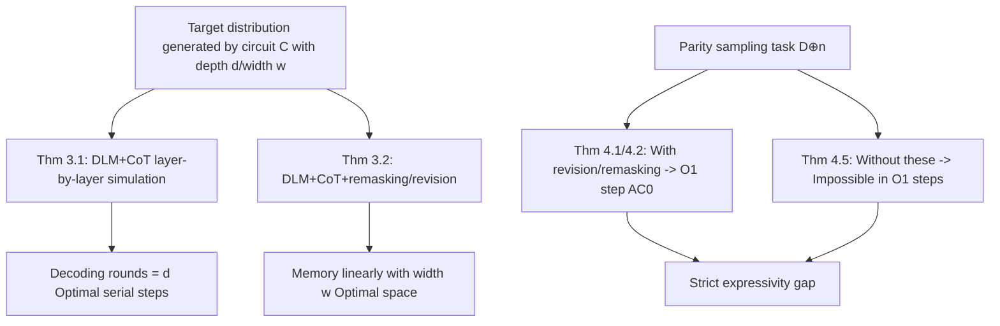

# Diffusion Language Models are Provably Optimal Parallel Samplers

**Conference**: ICLR 2026  
**OpenReview**: [https://openreview.net/forum?id=5bkAbueJwM](https://openreview.net/forum?id=5bkAbueJwM)  
**Code**: None (Purely Theoretical)  
**Area**: learning theory  
**Keywords**: diffusion language models, parallel sampling, circuit complexity, Chain-of-Thought, remasking, revision, expressivity lower bounds  

## TL;DR
This paper establishes a rigorous theory using the language of circuit complexity to explain why "Diffusion Language Models (DLMs) are faster": it proves that DLMs equipped with polynomial-length CoT can simulate any parallel sampling algorithm using the **optimal serial steps** (equal to circuit depth rather than size). Furthermore, by adding remasking or revision, they can simultaneously achieve **optimal space complexity**. The paper also provides a parity sampling task to prove that revision/remasking makes DLMs **strictly more expressive**.

## Background & Motivation
**Background**: Diffusion Language Models (DLMs) are expected to be faster alternatives to Autoregressive (AR) models by iteratively denoising masked sequences and decoding multiple positions in parallel. Recent works like LLaDA and Mercury have scaled DLMs to approach AR performance with faster generation, attracting widespread attention.

**Limitations of Prior Work**: The "speed" of DLMs currently remains mostly an empirical observation, lacking theoretical support. In contrast, the capabilities of AR models under CoT (Li et al. 2024 proved AR+CoT can simulate any Boolean circuit) have been thoroughly studied, whereas the fundamental limits of DLMs—specifically how much serial computation they save and how much space/memory parallel decoding requires—remain uncharacterized.

**Key Challenge**: Is the parallel advantage of DLMs a genuine algorithmic advantage, or does it merely appear faster? Specifically, are DLM-unique inference mechanisms like remasking (re-masking revealed tokens) and revision (allowing revealed tokens to be changed) essential for capability improvement or merely optional engineering tricks? There are no theoretical answers to these questions.

**Goal**: Use circuit depth/width as abstractions for "parallel time/space" to characterize the upper and lower bounds of DLM expressivity as parallel samplers and clarify the roles of remasking/revision.

**Core Idea**: **Treat DLMs as parallel samplers and use circuit complexity as a benchmark**—circuit depth $d$ = minimum serial steps required for sampling, and circuit width $w$ = minimum memory bits required. The paper proves that DLM+CoT can implement any depth-$d$ circuit in exactly $d$ decoding rounds (time optimal). With remasking/revision, the memory grows only linearly with width (space optimal). Finally, it constructs a parity sampling task to prove a **strict expressivity gap** between DLMs with and without revision.

## Method

### Overall Architecture
The paper does not design a new model but models the entire DLM inference process (predictor $p(\cdot|x_t)$, unmasking strategy $F$, and optional remasking $G$) as Boolean circuits. It proves three properties within the circuit complexity framework: time optimality (Thm 3.1), space optimality (Thm 3.2), and strict expressivity hierarchy (Section 4). The main proof line is a bidirectional simulation "DLM $\leftrightarrow$ Circuits"—simulating any circuit with a DLM and compressing the DLM generation process back into a circuit to derive lower bounds.

### Key Designs

**1. Circuit complexity as a unified metric for samplers: depth for time, width for space.** The paper models a random mapping as a layered Boolean circuit $C(\chi,R)$ accepting input $\chi\in\{0,1\}^n$ and random bits $R\sim U_r$. It defines depth $d=\max_v l(v)$ and width $w=\max_\ell|\{v:l(v)=\ell\}|$. Depth is interpreted as the "minimum serial steps to complete the computation," and width as the "minimum memory bits required." On the DLM side, a binary vocabulary $\{a,b\}$ plus mask $M$ is encoded with 2-bits ($a\to00,b\to01,M\to10$). Predictors are split into $L$ position circuits $C_i:\{0,1\}^{2L}\times\{0,1\}^{r_i}\to\{00,01,10\}$, constrained to only unmask and use independent random bits per position to strictly correspond to the conditional independence structure of $p(x_0|x_t)=\prod_i p_i(x_0^i|x_t)$. This translates the "sampling speed" problem into "what depth/width circuit is required to realize this distribution," making DLMs comparable to AR in the same coordinate system.

**2. Layer-by-layer simulation for time optimality (Theorem 3.1): Decoding rounds = circuit depth, not size.** Given a circuit $C$ with $N$ vertices and depth $d$, a DLM of length $L=N$ is constructed. In the $i$-th decoding round, it computes exactly the $i$-th layer of the circuit: maintaining intermediate sequences $x_i^j=u_j$ (if vertex $j$ is in a computed layer) else $M$. Thus, the $i$-th round reveals all outputs of the $i$-th layer vertices in parallel. After $d$ rounds, the sequence $x_d=u_1\cdots u_N$ is complete, and the last $m$ bits are taken as output. The key is that $F$ and the predictor $p$ only require constant-depth circuits to recognize "which layer is currently being computed" and fill in corresponding values. The significance of this conclusion lies in the contrast: Li et al. (2024) proved that AR+CoT requires serial steps (CoT length) growing **linearly with circuit size $N$ (total nodes)**, while DLM requires only $d$ (**depth**) steps. For wide and shallow computations where $d\ll N$, DLM's serial steps can be much smaller than AR—the rigorous source of its "parallel advantage."

**3. Remasking/revision for space optimality (Theorem 3.2).** In naive layer-by-layer simulation, DLMs write every intermediate vertex permanently into the sequence, causing the memory footprint to bloat with circuit **size** rather than width. The paper proves that if remasking (where $G$ resets revealed positions to $M$) or revision (relaxing the constraint that revealed tokens must be fixed, allowing $p_i(x_t^i|x_t)<1$) is allowed, old vertices can be recycled or overwritten after passing results to the next layer. This allows the memory footprint to grow only **linearly with circuit width $w$**, reaching the information-theoretic optimal space. This provides a clear theoretical judgment: these two mechanisms are not engineering tricks but are key to pushing DLMs from "time optimal" to "time + space dual optimal."

**4. Strict expressivity gap via parity sampling (Theorems 4.1/4.2 vs 4.5).** The paper uses the distribution $D^{\oplus}_n$ (uniform over all strings in $\{0,1\}^n$ with even parity) as a separation tool. On the positive side: DLMs with revision (Thm 4.1) or remasking (Thm 4.2) can sample $D^{\oplus}_n$ in $O(1)$ steps using predictors and unmasking strategies in $\mathrm{AC}^0$. The remasking version uses a two-stage strategy: first sampling parities for pairs of positions, then expanding each 2-bit block uniformly while maintaining parity constraints (e.g., turning an $M0$ block into $00$ or $11$ with equal probability through "remask and rewrite"). On the negative side (Thm 4.5): Standard DLMs without remasking/revision **cannot** sample $D^{\oplus}_n$ in $O(1)$ steps even if the predictor and $F$ are allowed to be in $\mathrm{AC}^0$. The proof utilizes Håstad’s average-case lower bound for parity against $\mathrm{AC}^0$ (any $\mathrm{AC}^0$ circuit computes PARITY with accuracy $<1/2+2^{-c_d\cdot n/(\log S)^{d-1}}$), extended to probabilistic circuits. Intuitively, standard DLMs can only change mask bits; when only one mask remains, it must compute the global parity in one step, but parity $\notin\mathrm{AC}^0$. This establishes the presence of revision/remasking as a **strict capability gap** rather than a performance difference.

## Key Experimental Results

### Summary of Main Conclusions

| Theorem | Model Configuration | Conclusion | Optimality Meaning |
|------|----------|------|-----------|
| Thm 3.1 | DLM + CoT | Depth-$d$, $N$-node circuit simulated by $L=N$ DLM in **$d$ rounds** | Optimal serial steps (=depth, not size) |
| Thm 3.2 | DLM + CoT + (remasking or revision) | Any circuit can be simulated with memory growing **linearly with width $w$** | Optimal space |
| Thm 4.1 | DLM + revision, $L=n$ | Samples $D^{\oplus}_n$ in $O(1)$ steps with $\mathrm{AC}^0$ circuits | Expressivity upper bound (Positive) |
| Thm 4.2 | DLM + remasking, $L=n$ | Samples $D^{\oplus}_n$ in $O(1)$ steps with $\mathrm{AC}^0$ circuits | Expressivity upper bound (Positive) |
| Thm 4.5 | Standard DLM (None), $L=n$ | **Cannot** sample $D^{\oplus}_n$ in $O(1)$ steps (even if $p,F\in\mathrm{AC}^0$) | Expressivity lower bound (Negative) |

### Serial Cost Comparison: AR vs DLM

| Model | Serial Steps to Simulate Circuit under CoT | Growth Factor |
|------|---------------------------|-----------|
| Autoregressive (AR) (Li et al. 2024) | $\Theta(N)$ | Circuit **size** (total nodes) |
| Diffusion (DLM) (Ours Thm 3.1) | $d$ | Circuit **depth** |

## Key Findings
- The parallel advantage of DLMs is most significant for wide and shallow computations: when $d\ll N$, serial steps are far fewer than AR.
- Remasking and revision are not engineering tricks but essential mechanisms for unlocking "space optimality" and "stronger expressivity."
- Key constraint in Thm 4.5 proof: A valid DLM predictor must satisfy spatial independence $p(x|x_t)=\prod_i p_i(\cdot)$, preventing it from sampling correlated distributions in a single step—this is the root cause why standard DLMs cannot sample parity in one step.
- The base primitive $\mathrm{ShiftR}$ (shifting the sequence right by one, filling the head with constant $1$) used repeatedly in constructions can be implemented in $\mathrm{NC}^0$ (constant depth, polynomial 2-input gates), serving as an inexpensive block for moving results between layers.

## Highlights & Insights
- **Translating "speed" into "depth vs size"**: Using circuit depth as the benchmark for serial steps, the paper provides a clean theoretical explanation for DLM's parallel advantage over AR.
- **Strict gaps from both sides**: Beyond giving upper bounds on what DLMs can do, it uses Håstad’s parity lower bound to prove what standard DLMs cannot do, elevating the value of revision/remasking from "better performance" to "strictly stronger capability."
- **Clear correspondence of complexity classes**: Mapping different DLM inference mechanisms to the classic hierarchy $\mathrm{NC}^0\subseteq\mathrm{AC}^0\subseteq\mathrm{TC}^0$ provides a standard answer for which mechanisms are inherently stronger.
- **Direct guidance for design**: The conclusions clearly suggest that designing forward processes involving revision and collecting training data with revision/remasking are critical design points for DLMs to reach their full potential.

## Limitations & Future Work
- **Purely theoretical without empirical validation**: All conclusions are based on circuit complexity abstractions. Whether real Transformer-based DLMs can approximate these constructions or whether training can learn these strategies remains unverified.
- **Binary vocabulary and separable tasks**: The proofs assume a binary vocabulary $\{a,b\}$ and use parity as a carefully chosen separable task, which is still distant from the real distribution of natural language.
- **Existence vs Learnability**: The theorems prove that "there exists such a DLM," which does not guarantee that current training paradigms will automatically learn optimal remasking/revision strategies.
- **Strong conditions for lower bounds**: Thm 4.5 restricts predictors and $F$ to $\mathrm{AC}^0$. Separation results under stronger predictors (e.g., $\mathrm{TC}^0$ with MAJORITY gates, corresponding to Attention sums in Transformers) are not yet characterized.

## Related Work & Insights
- **DLM Spectrum**: From continuous diffusion (DDPM) to discrete D3PM (absorbing state mask), then to large-scale works like LLaDA and Mercury. This paper provides the missing theoretical foundation for this line of work.
- **Decoding Order/Remasking/Revision**: Kim et al. 2025 noted decoding order affects performance; Nie et al. 2025 proposed remasking; Song et al. 2025 proposed revision. This paper clarifies their fundamental differences from a complexity perspective.
- **CoT and Circuit Complexity**: Li et al. 2024 proved AR+CoT simulates circuits with steps growing with size; this paper provides a parallel counterpart and improvement in the diffusion paradigm.
- **Hard Lower Bound Tools**: The hardness of expressivity separation comes from Håstad (2014) and Furst–Saxe–Sipser. This paper ingeniously grafts these to the multi-token parallel decoding scenario of DLMs.

## Rating
- **Novelty**: ⭐⭐⭐⭐⭐ First to rigorously characterize DLM time/space optimality as parallel samplers and provide strict separation for revision/remasking.
- **Experimental Thoroughness**: ⭐⭐⭐ Purely theoretical. Theorem sets are complete and closed, but there is no empirical validation to bridge the gap to trainable DLMs.
- **Writing Quality**: ⭐⭐⭐⭐ Clear framework with good alignment between theorem statements and intuitive explanations. High symbolic density may be difficult for non-complexity specialists.
- **Value**: ⭐⭐⭐⭐⭐ Provides a hard theoretical basis for "why DLMs are faster" and "why revision is important," with direct implications for training and architecture design.

<!-- RELATED:START -->

## Related Papers

- [\[ICLR 2026\] Quotient-Space Diffusion Models](quotient-space_diffusion_models.md)
- [\[ICLR 2026\] Automata Learning and Identification of the Support of Language Models](automata_learning_and_identification_of_the_support_of_language_models.md)
- [\[ICLR 2026\] Polynomial Convergence of Riemannian Diffusion Models](polynomial_convergence_of_riemannian_diffusion_models.md)
- [\[ICLR 2026\] On the Interpolation Effect of Score Smoothing in Diffusion Models](on_the_interpolation_effect_of_score_smoothing_in_diffusion_models.md)
- [\[ICLR 2026\] Unveiling the Basin-like Loss Landscape in Large Language Models](unveiling_the_basin-like_loss_landscape_in_large_language_models.md)

<!-- RELATED:END -->
