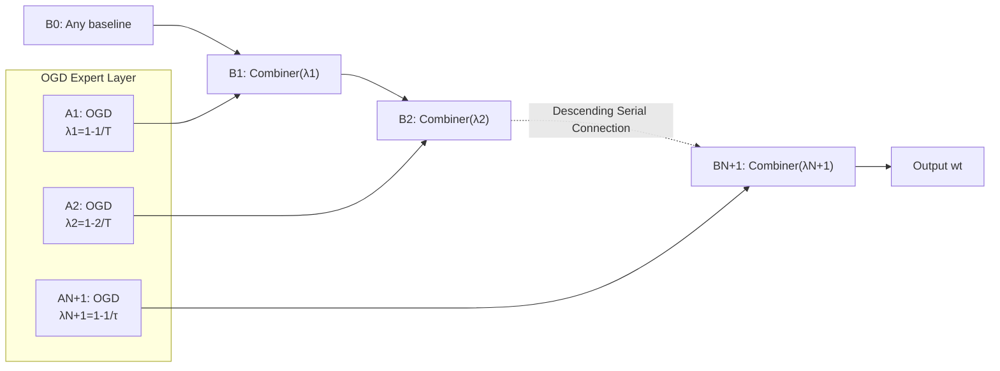

# Discounted Online Convex Optimization: Uniform Regret Across a Continuous Interval

**Conference**: ICLR 2026  
**OpenReview**: [https://openreview.net/forum?id=65iFtHZ8Cu](https://openreview.net/forum?id=65iFtHZ8Cu)  
**Code**: To be confirmed  
**Area**: learning_theory  
**Keywords**: Online Convex Optimization, Discounted Regret, Adaptive Regret, Discounted-Normal-Predictor, Unknown Discount Factor  

## TL;DR
Addressing the open problem of the unknown discount factor $\lambda$ in Online Convex Optimization (OCO), this paper proves that Smoothed OGD (SOGD) achieves a uniform discounted regret bound of $O(\sqrt{\log T/(1-\lambda)})$ across a continuous interval for **all** $\lambda$ **simultaneously**, without prior knowledge of the true discount factor.

## Background & Motivation
- **Background**: Online Convex Optimization (OCO) is a core framework for online learning, with static regret as the standard metric. However, in non-stationary environments, recent data is more significant than distant history. Consequently, $\lambda$-discounted regret $\text{D-Regret}(T,\lambda)=\sum_t \lambda^{T-t}f_t(w_t)-\min_w\sum_t \lambda^{T-t}f_t(w)$ was proposed to "forget" the past via exponential weights. When $\lambda$ is given, constant step-size OGD achieves a discounted regret of $O(1/\sqrt{1-\lambda})$.
- **Limitations of Prior Work**: The discount factor $\lambda$ is often **unpredictable** in practice. In scenarios such as intertemporal economic models, $\lambda$ reflects the intrinsic preferences of an agent (determined by market experience) and is an "objective parameter" rather than a tunable hyperparameter. Zhang et al. (2024) established discounted regret bounds for known $\lambda$ and explicitly left the problem of adapting to unknown $\lambda$ as an open question.
- **Key Challenge**: Intutively, one could apply the classic meta-expert framework—running an OGD expert for each candidate $\lambda$ and using a meta-algorithm (e.g., Hedge / Fixed-Share) to track the best one. However, this framework requires **all experts and the meta-algorithm to operate under a unified performance measure**. In discounted scenarios, each expert corresponds to a different $\lambda$, meaning they are evaluated under **different discounted regret measures**, which traditional meta-expert frameworks cannot aggregate.
- **Goal**: Design a discounted OCO algorithm providing near-optimal discounted regret guarantees for all discount factors in a continuous interval $\lambda\in[1-1/\tau,\,1-1/T]$ simultaneously, **independent** of the value of $\lambda$.
- **Core Idea**: **Reuse Smoothed OGD (SOGD) + re-analyze DNP-cu**. Construct a set of OGD experts with different step sizes to cover candidate $\lambda$ values, and use the Discounted-Normal-Predictor with conservative updates (DNP-cu) as a meta-algorithm for **sequential pairwise aggregation**. The key breakthrough is proving that DNP-cu can aggregate **two experts with different discount factors**, thereby bypassing the restriction of a unified measure.

## Method

### Overall Architecture
The method implements "adaptation to unknown discount factors" in three steps: ① Geometrically discretize the continuous $\lambda$ interval into $N+1$ candidate values, assigning an OGD expert $A_i$ with an optimal step size to each; ② Construct a binary aggregator, Combiner, using DNP-cu to combine pairs of experts with adjacent discount factors; ③ Chain these Combiners sequentially in **descending order** of discount factors as $B_1,\dots,B_{N+1}$, outputting the decision of the final stage $B_{N+1}$, and leverage a technical lemma to extend from the discrete set to the continuous interval.

### Key Designs

**1. Constant Step-size OGD as a T-independent Foundation**: First, the single discount factor case is solidified. This paper proves (Theorem 1) that constant step-size OGD $w_{t+1}=\Pi_W[w_t-\eta\nabla f_t(w_t)]$ with step size $\eta=D\sqrt{2(1-\lambda)}/G$ yields a $\lambda$-discounted regret of at most $DG\sqrt{2}/\sqrt{1-\lambda}$, i.e., $O(1/\sqrt{1-\lambda})$. This bound is of the same order as $O(1/\sqrt{1-\lambda^2})$ in Zhang et al. (2024) (since $1-\lambda<1-\lambda^2<2(1-\lambda)$), but crucially, **both the step size and the bound are independent of the total rounds $T$**. Thus, the bound holds uniformly over time—a prerequisite for assembling single experts into an interval-adaptive algorithm. In the near-static regime $\lambda\in[1-1/T, 1]$, $\eta=D/(G\sqrt{T})$ is used to obtain an $O(\sqrt{T})$ bound.

**2. Re-analysis of DNP-cu for "Cross-Discount" Aggregation**: This is the primary technical contribution. DNP-cu (Algorithm 2) maintains a discounted bias $x_{t+1}=\rho x_t+b_t$, outputs predictions using a confidence function $g(x)=\Pi_{[0,1]}[\tilde g(x)]$ (where $\tilde g(x)=\sqrt{n/8}\,Z\cdot\text{erf}(x/\sqrt{8n})e^{x^2/16n}$), and updates the bias with $b_t$ only during low confidence or incorrect predictions. Prior analyses (Zhang et al. 2022a) only covered standard payoffs. Theorem 2 generalizes this to discounted payoffs, providing two core inequalities: when the meta discount factor is $\rho$, for **any** $\eta\ge\rho$, $\sum_t \eta^{T-t}g(x_t)b_t\ge -Z/(2(1-\eta))$; and when $\eta=\rho$, $\sum_t \rho^{T-t}g(x_t)b_t\ge \sum_t\rho^{T-t}b_t - Z/(2(1-\rho)) - U(n)-1$. The former implies that a DNP-cu running with $\rho$ can simultaneously provide payoff guarantees for **another different discount factor $\eta$** (as long as $\eta\ge\rho$)—the key to breaking the "unified measure" constraint.

**3. Combiner: Convex Combination of Experts via DNP-cu**: Based on Theorem 2, the Combiner (Algorithm 3) performs a convex combination $w_t=(1-\omega_t)w_{t,1}+\omega_t w_{t,2}$ of two OGD experts $A_1, A_2$ (with $\lambda_1\ge\lambda_2$). The weight $\omega_t$ is determined by a DNP-cu with $\rho=\lambda_2$, fed with the normalized loss difference $\ell_t=(f_t(w_{t,1})-f_t(w_{t,2}))/GD\in[-1,1]$. By the convexity of $f_t$, $f_t(w_t)\le(1-\omega_t)f_t(w_{t,1})+\omega_t f_t(w_{t,2})$. Using (13) and (14) to bound the discounted regret on both sides: relative to $A_1$ (using $\eta=\lambda_1\ge\rho$), it is $\le GDZ/(2(1-\lambda_1))$; relative to $A_2$, it is $\le GD(Z/(2(1-\lambda_2))+U(n)+1)$. Setting $Z=1/T$ yields a minimal meta-regret, resulting in an optimal $O(1/\sqrt{1-\lambda})$ for $\lambda\in\{\lambda_1, \lambda_2\}$.

**4. SOGD Chaining + Continuous Interval Extension**: Candidate discount factors are discretized into a geometric set $S=\{1-2^{i-1}/T\}_{i=1}^{N+1}$ ($N=\lceil\log_2(T/\tau)\rceil$), each $\lambda_i$ assigned an OGD expert $A_i$ with step size $\eta_i=\frac{D}{G}\sqrt{2^i/T}$. SOGD (Algorithm 4) starts from an arbitrary baseline $B_0$ and uses Combiners to sequentially combine $B_{i-1}$ with $A_i$ to form $B_i$ (with discount factor $\rho=\lambda_i$). They **must be chained in descending order of discount factors** (crucial for propagating regret analysis through layers). Finally, Theorem 3 proves: for all $\lambda\in[1-1/\tau, 1-1/T]$, $\text{D-Regret}(T,\lambda)\le \frac{2GD}{\sqrt{1-\lambda}}(4\sqrt{\log T}+\sqrt{2})+\frac{GD(N+1)}{(1-\lambda)T}+2GD$, forming a uniform $O(\sqrt{\log T/(1-\lambda)})$ bound. Compared to $O(1/\sqrt{1-\lambda})$ for known $\lambda$, it only adds an $O(\sqrt{\log T})$ factor—the necessary cost for adaptation (similar to the $\log T$ term in adaptive regret).

## Key Experimental Results

### Main Results
Online classification was conducted on the LIBSVM ijcnn1 dataset (feature dimension $d=22$), with $T=10000$, absolute loss, 5 repetitions, evaluated by discounted cumulative loss for various discount factors (0.5 to 0.999). Baselines include OGD with tuned step sizes (Theorem 1), strongly adaptive algorithms SAOL / SCB, and untuned OGD variants.

| Discount Factor $\lambda$ | SOGD (Unknown $\lambda$) | OGD (Tuned $\eta$ per $\lambda$) | Conclusion |
|---|---|---|---|
| 0.999 | Comparable to tuned OGD | Baseline | Loss curves almost overlap |
| 0.998 | Comparable to tuned OGD | Baseline | Loss curves almost overlap |
| 0.996 | Comparable steady state | Slightly lower initially | SOGD quickly catches up |

Key point: SOGD **requires no prior knowledge of $\lambda$** yet approximates the performance of OGD specifically tuned for that $\lambda$, while strong adaptive baselines like SAOL / SCB and untuned OGD perform worse.

### Ablation Study

| Parameter $Z$ | Performance at $\lambda=0.999/0.998/0.996$ | Conclusion |
|---|---|---|
| $1/(10T)$ | Strong | Performance similar across four values |
| $1/T$ | Strong | Theoretically recommended value |
| $10/T$ | Strong | Remains robust |
| $100/T$ | Strong | Insensitive within a reasonable range |

### Key Findings
- SOGD is **insensitive** to the meta-parameter $Z$ within a reasonable range, yielding consistently strong performance across four values, aligning with theoretical analysis.
- SOGD uses a "single algorithm" to cover performance that would otherwise require "per-$\lambda$ parameter tuning" for OGD, validating its adaptive value for unknown discount factors.
- While strongly adaptive baselines like SAOL / SCB provide guarantees for all intervals, they underperform SOGD in discounted cumulative loss, suggesting that "adaptive intervals" and "adaptive discount factors" are not simply equivalent; the latter requires specialized cross-measure aggregation.
- Untuned OGD (with fixed $\eta_1=D/2G$) shows significant performance fluctuations across different $\lambda$, highlighting the importance of matching step-sizes with discount factors and the advantage of SOGD's automatic matching.

## Highlights & Insights
- **Resolving an Explicit Open Problem**: Provides a definitive answer to whether discounted OCO can adapt to unknown $\lambda$, an open question from Zhang et al. (2024).
- **Bypassing Fundamental Meta-Expert Constraints**: Recognizing that varying measures across experts is the bottleneck, the paper uses the "cross-discount factor payoff guarantee" ($\eta\ge\rho$) of DNP-cu to achieve cross-measure aggregation.
- **Unified Interval Bound**: A single algorithm simultaneously satisfies $O(\sqrt{\log T/(1-\lambda)})$ for **all** $\lambda$ in a continuous interval; the $O(\sqrt{\log T})$ overhead is argued as an inherent necessity for adaptation.
- **Technical Completeness**: While the idea of a unified discounted regret in continuous intervals appeared in the PEA setting by Kapralov & Panigrahy (2010), this work completes the rigorous proof under the OCO setting and corrects inaccuracies in earlier formulations.

## Limitations & Future Work
- **Fixed Discount Factor Assumption**: The current framework assumes $\lambda$ is constant; extending this to time-varying discount factors is an important but more difficult direction.
- **Underutilization of Curvature**: For benign structures like strong convexity or exp-concavity, classic OCO achieves tighter bounds. Whether these can improve discounted regret remains open.
- **Extra $\log T$ Cost**: Though justified as necessary for adaptation, whether it is unavoidable in all settings requires further characterization.
- **Limited Experimental Scale**: Validated only on a single dataset (ijcnn1) for online classification; lacks empirical evidence in broader non-stationary real-world scenarios.
- **Computational Overhead**: Requires maintaining $N+1=O(\log(T/\tau))$ OGD experts and a corresponding chain of Combiners. Computation and storage grow logarithmically with the interval width, leaving room for efficiency optimization in large-scale deployments.

## Related Work & Insights
- **Discounted Online Learning**: Originates from discounted regret in PEA (Discounted Hedge by Freund & Hsu 2008, $O(\sqrt{\ln N/(1-\lambda)})$); in OCO, works include adaptive OGD/FTRL (Zhang et al. 2024), discounted VAW (Jacobsen & Cutkosky 2024), and discount-to-dynamic regret transformations (Ahn et al. 2024), but none adapt to unknown $\lambda$.
- **Adaptive Regret**: Discounted regret and strongly adaptive regret are similar in their focus on time windows (small $\lambda$ ≈ short interval). The $O(\sqrt{\tau\log T})$ adaptive bound (Jun et al. 2017) inspired the $\log T$ overhead and the goal of simultaneous guarantees.
- **DNP Lineage**: From the original DNP and conservative updates (Kapralov & Panigrahy 2010/2011) to switching cost support (Daniely & Mansour 2019) and SOGD (Zhang et al. 2022a); this work extends the DNP-cu to discounted payoffs and cross-factor aggregation as a substantial expansion of the toolchain.
- **Insight**: When multiple sub-learners operate under different evaluation measures and traditional meta-frameworks fail, seeking an aggregator whose guarantees hold across a family of measures simultaneously (e.g., the $\eta\ge\rho$ property of DNP-cu) is a transferable paradigm for breaking the unified measure assumption.

## Rating
- Novelty: ⭐⭐⭐⭐⭐ Resolves a specific open problem and proposes a new perspective on cross-discount aggregation.
- Experimental Thoroughness: ⭐⭐⭐ Appropriate for a theory paper (verifying approximation of tuned OGD and robustness), but limited in scale and variety.
- Writing Quality: ⭐⭐⭐⭐ Clear logic from motivation to challenge to solution; figures intuitively explain framework failures and the proposed process.
- Value: ⭐⭐⭐⭐ Provides a plug-and-play adaptive algorithm for practical scenarios where discount factors are intrinsic; solid theoretical contributions with transferable tools.

<!-- RELATED:START -->

## Related Papers

- [\[ICLR 2026\] Online Inventory Optimization in Non-Stationary Environment](online_inventory_optimization_in_non-stationary_environment.md)
- [\[AAAI 2026\] A Switching Framework for Online Interval Scheduling with Predictions](../../AAAI2026/learning_theory/a_switching_framework_for_online_interval_scheduling_with_pr.md)
- [\[ICML 2026\] On Regret Bounds of Thompson Sampling for Bayesian Optimization](../../ICML2026/learning_theory/on_regret_bounds_of_thompson_sampling_for_bayesian_optimization.md)
- [\[ICLR 2026\] Online Conformal Prediction with Adversarial Semi-bandit Feedback via Regret Minimization](online_conformal_prediction_with_adversarial_semi-bandit_feedback_via_regret_min.md)
- [\[ICLR 2026\] Stable Coresets: Unleashing the Power of Uniform Sampling](stable_coresets_unleashing_the_power_of_uniform_sampling.md)

<!-- RELATED:END -->
