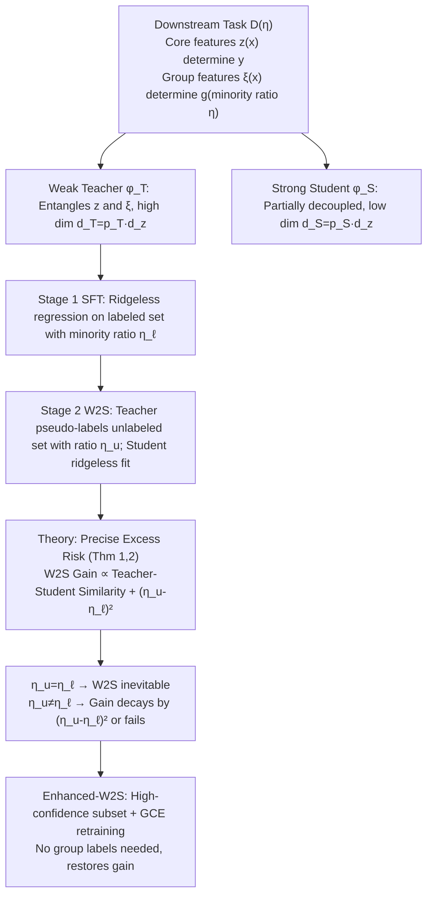

# Does Weak-to-strong Generalization Happen under Spurious Correlations?

**Conference**: ICLR 2026  
**OpenReview**: [https://openreview.net/forum?id=5hfa2itwGz](https://openreview.net/forum?id=5hfa2itwGz)  
**Code**: TBD  
**Area**: learning theory / weak-to-strong generalization  
**Keywords**: weak-to-strong generalization, superalignment, spurious correlations, group imbalance, ridgeless regression, proportional asymptotics  

## TL;DR
This paper provides the first precise theoretical characterization of Weak-to-Strong (W2S) generalization on downstream tasks with spurious correlations. It demonstrates that W2S inevitably occurs when the minority group proportions in the weak teacher's labeled data and the unlabeled data are equal ($\eta_u=\eta_\ell$); otherwise, the W2S gain decays by $(\eta_u-\eta_\ell)^2$ or even fails. Based on this, a simple remedy algorithm named "High-confidence Subset + Generalized Cross-Entropy Retraining" is proposed, which consistently improves W2S across 10 teacher-student pairs without requiring group labels.

## Background & Motivation

**Background**: The core problem of superalignment is whether superhuman intelligence can learn from weaker human supervision. The Weak-to-Strong (W2S) generalization proposed by Burns et al. (2024) provides an optimistic answer: by fine-tuning a strong pre-trained student with pseudo-labels generated by a weak teacher, the student often outperforms the teacher. Subsequently, the mechanisms of W2S have been extensively studied through empirical and theoretical work (neighborhood expansion, data overlap density, teacher-student disagreement, benign overfitting, low intrinsic dimension fine-tuning, etc.).

**Limitations of Prior Work**: Almost all W2S theories assume that downstream data is "clean." However, real-world scenarios are quite the opposite—both weak teachers and unlabeled data often carry systematic biases, i.e., **spurious correlations** tied to demographic or collection factors. Medical labels may bias toward specific patient groups or imaging equipment, legal datasets toward specific jurisdictions, and autonomous driving sensor data toward specific weather. These professional downstream tasks often preclude intervention in the collection process or access to additional balanced data.

**Key Challenge**: The scenarios for which W2S was originally motivated (fine-tuning broad pre-trained students on professional tasks where labels are scarce and imperfect) are exactly those where spurious correlations are most severe. However, there is almost no theoretical understanding of whether W2S still holds under spurious correlations, when it succeeds, when it fails, and how to improve it.

**Goal**: To establish a unified theoretical and algorithmic study of W2S under spurious correlations, answering two questions: "when" (theoretical characterization) and "how" (remedy when it fails).

**Core Idea**: **(1) Precise Theoretical Characterization**—Under a ridgeless regression setting with zero approximation error, the problem is pushed to the proportional asymptotic limit to calculate the exact generalization errors of both teacher and student. This reveals that W2S gain is jointly determined by the teacher-student similarity and the squared difference in minority group proportions $(\eta_u-\eta_\ell)^2$. **(2) Theory-driven Algorithmic Remedy**—After W2S fine-tuning, the student is retrained using its own high-confidence subset and a Generalized Cross-Entropy (GCE) loss. This restores W2S gains in mismatched scenarios without any group labels.

## Method

### Overall Architecture

The paper follows two lines. Theoretical line: modeling "W2S under spurious correlations" as a regression problem with core features $z(x)$ and group features $\xi(x)$. The difference between the weak teacher and strong student lies in their representation efficiency and decoupling degree of group features. Exact expressions for excess risk are derived for the teacher (after SFT) and student (after W2S fine-tuning) under proportional asymptotic limits. Algorithmic line: based on the "proportion mismatch $\to$ W2S decay" conclusion, Enhanced-W2S is proposed, using high-confidence subset selection and GCE retraining to recover gains in mismatched scenarios.

### Key Designs

**1. Regression Modeling via Core/Group Feature Decomposition: Formalizing "Spurious Correlation" into an Analytical Geometric Structure.** The downstream regression task is characterized by distribution $D(\eta)$, with minority group proportion $\Pr[g=1]=\eta\in[0,\tfrac12]$. Each input is decomposed into two types of features: **Core features** $z(x)\sim\mathcal{N}(0_{d_z},I_{d_z})$ are invariant across groups and determine the label $y=z(x)^\top\beta^*+\epsilon$, but are high-dimensional and hard to learn; **Group features** $\xi(x)\mid g\sim\mathcal{N}(g\mu_\xi,\sigma_\xi^2 I_p)$ determine which group a sample belongs to and are low-dimensional and easy to represent ($p\ll d_z$). The elegance of this decomposition is that spurious correlation is explicitly encoded as a "pseudo-association between group feature $\xi$ and label $y$," while group separability is directly controlled by $\|\mu_\xi\|_2^2/\sigma_\xi^2$—the conclusion that "better group separation makes W2S more likely to fail" is quantified by this.

**2. Weak Teacher vs. Strong Student: Defining Strength through "Representation Efficiency and Decoupling of Group Features."** Fine-tuning is modeled in the kernel regime as learning an over-parameterized linear layer on high-dimensional pre-trained representations $\varphi_T, \varphi_S$. The essential difference lies in the treatment of group features: the weak teacher $\varphi_T(x)=U_T\,\big(z(x)\otimes w(x)\big)$, where $w(x)=[1;T^\top\xi(x)]\in\mathbb{R}^{p_T}$ projects $\xi$ into $p_T-1$ dimensions, **heavily entangling** core and group features. The strong student $\varphi_S(x)=U_S\,\big(z(x)\otimes\psi(x)\big)$, with $\psi(x)=[1;S^\top\xi(x)]\in\mathbb{R}^{p_S}$ ($p_S\le p_T$), projects $\xi$ into lower dimensions $p_S\ll p$, **partially decoupling** core and group features. Both include $z(x)$, ensuring zero approximation error—this guarantees that W2S results purely from **differences in estimation error** (the student being more sample-efficient) rather than differences in expressive capacity. Teacher-student similarity is measured by $\Xi=T^\top S\in\mathbb{R}^{(p_T-1)\times(p_S-1)}$.

**3. Precise Risk Characterization under Proportional Asymptotic Limits: Determining Exactly "When W2S Happens."** Let $d_z, n, N \to \infty$ with $d_z/n \to \gamma_z$ and $d_z/N \to \nu_z$ (usually $\nu_z \ll \gamma_z$ since unlabeled data is cheap). The teacher's excess risk after SFT (Thm 1):

$$
\mathbb{E}[\mathrm{ER}_{\eta_t}(f_T)] \to \sigma_y^2 \gamma_z \Big( \underbrace{p_T}_{\text{Label Noise}} + \underbrace{\tfrac{\|(\eta_t-\eta_\ell)\mu_T\|_2^2}{\sigma_\xi^2}}_{\text{Spurious Correlation}} \Big)
$$

The student's excess risk after W2S (Thm 2):

$$
\mathbb{E}[\mathrm{ER}_{\eta_t}(f_S)] \to \sigma_y^2 \gamma_z \Big( \underbrace{p_{T\wedge S}}_{\le p_T} + \tfrac{\|(\eta_u-\eta_\ell)\mu_T+(\eta_t-\eta_u)\Xi\mu_S\|_2^2}{\sigma_\xi^2} + \Theta(\nu_z) \Big)
$$

Where $p_{T\wedge S}=1+\|\Xi\|_F^2 \in [1,p_S]$ is the **effective group feature dimension** the student learns from the teacher. These formulas provide clear criteria: **(a)** When $\eta_u=\eta_\ell$ and $\nu_z$ is small, W2S must occur. **(b)** In general cases, the optimal $\eta_u^\star$ has a closed-form solution. **(c)** W2S gain increases as teacher-student similarity $\|\Xi\|_F^2$ decreases. **(d)** When $\eta_u \ne \eta_\ell$, even if $\nu_z \ll 1$ and $\|\Xi\|_F^2 = 0$, W2S can fail if groups are sufficiently separable, with the risk $V_S^{(1)}$ growing proportional to $(\eta_u-\eta_\ell)^2$.

**4. Enhanced-W2S: High-Confidence Selection + GCE Retraining to Fix Mismatch without Group Labels.** Since the theory states that "proportion mismatch destroys W2S," an additional retraining step is added after W2S fine-tuning. This targets two important mismatch scenarios ($\eta_\ell=\eta_o, \eta_u=0.5$ and $\eta_\ell=0.5, \eta_u=\eta_o$). Two components: **(i) High-confidence subset selection**—selecting samples with the lowest prediction entropy at a ratio $p \in (0, 1]$. These samples have clear core features, preventing the student from over-relying on single (possibly spurious) features. For the $\eta_\ell=\eta_o, \eta_u=0.5$ case, this implicitly filters out minority samples, effectively reducing $\eta_u$ to match the theory's prescription. **(ii) Generalized Cross-Entropy (GCE) loss**—

$$
L_{\mathrm{GCE}}(x_i, \hat y_i; q) = \frac{1-p_{\hat y_i}(x_i)^q}{q}, \quad q \in (0,1]
$$

Unlike Standard CE, GCE mitigates the impact of pseudo-label noise from the weak teacher. This entire algorithm **requires no group labels**.

## Key Experimental Results

### Main Results: Gain of Enhanced-W2S over Vanilla W2S

Across 4 spurious correlation benchmarks (Waterbirds / BFFHQ / ImageNet-9 / BG-COCO) and 10 teacher-student pairs (from ResNet18, CLIP ViT-B/32, ConvNeXt-L, DINOv2 ViT-L/14, MAE ViT-B/16), the relative improvement in average accuracy (%) is reported:

| Dataset | $\eta_\ell, \eta_u$ | Max Representative Gain | Typical Range |
|---|---|---|---|
| Waterbirds | $0.5 \to \eta_o$ | DINOv2/MAE +16.68 | +0.77 ~ +16.68 |
| Waterbirds | $\eta_o \to 0.5$ | ResNet18/MAE +14.54 | +1.32 ~ +14.54 |
| BFFHQ | $0.5 \to \eta_o$ | DINOv2/ResNet18 +8.42 | +2.75 ~ +8.42 |
| BG-COCO | $0.5 \to \eta_o$ | DINOv2/MAE +24.01 | +2.05 ~ +24.01 |
| ImageNet-9 | $0.5 \to \eta_o$ | DINOv2/MAE +24.11 | +4.22 ~ +24.11 |
| ImageNet-9 | $\eta_o \to 0.5$ | Clipb32/ResNet18 +23.24 | +1.81 ~ +23.24 |

Values represent the mean over all $N, n$ combinations. Most entries are positive and significantly outperform vanilla W2S.

### Theoretical Validation: Synthetic + Real Evidence

- **Synthetic Gaussian Experiments** ($d_z=2048$): Theoretical curves (solid lines) and empirical points (circles) in Figures 2/3 overlap almost perfectly, confirming that W2S gain peaks at $\eta_u \approx \eta_\ell$ when $\|\Xi\|_F^2$ is small, and decays as $\nu_z$ or $\|\Xi\|_F^2$ increases.
- **Real Classification** (Fig. 4): Fixing $\eta_\ell=0.5$ while increasing the minority ratio in unlabeled data improves W2S; fixing $\eta_\ell=\eta_o$ shows positive gains at $\eta_u=\eta_o$, which decrease as $\eta_u$ moves toward 0.5. Overall, W2S gain deteriorates as $|\eta_u-\eta_\ell|$ increases, consistent with the regression theory.

### Key Findings

1. **Proportion Matching = Sufficient Guarantee for W2S**: As long as $\eta_u=\eta_\ell$ (and unlabeled samples are sufficient), W2S inevitably happens, regardless of whether spurious correlations exist in the teacher or student.
2. **Proportion Mismatch = Quadratic Decay**: When $\eta_u \ne \eta_\ell$, the gain decays according to $(\eta_u-\eta_\ell)^2$; the more separable the groups, the more likely W2S is to fail.
3. **Dissimilarity Increases W2S**: The gain monotonically increases as similarity $\|\Xi\|_F^2$ decreases, echoing the intuition that information gain requires complementary representations.

## Highlights & Insights

- **Elevation of "When W2S Happens" from Empirical Observation to Precise Formula**: The $(\eta_u-\eta_\ell)^2$ decay law is the most impactful conclusion, reducing a complex alignment problem to the proportion difference between two ends.
- **Theory Directly Spawns Practical Algorithms**: Enhanced-W2S is not an ad hoc method but a direct translation of the theory ("reducing $\eta_u$ increases gain") into practice ("high-confidence selection implicitly reduces $\eta_u$").
- **No Group Labels as a Practical Advantage**: Real specialized tasks rarely provide group labels; this method works using only the student's own confidence levels.
- **Zero Approximation Error Setting Isolates W2S Sources**: By ensuring both teacher and student contain $z(x)$, the authors prove W2S is driven purely by estimation efficiency differences, making the "similarity $\to$ gain" causal chain provable.

## Limitations & Future Work

- **Theoretical Basis in Ridgeless Linear Regression**: While the authors argue that ridge extensions don't change core insights, there remains a gap with real deep fine-tuning (where features update and are non-linear).
- **Head-only Fine-tuning**: Pre-trained features are treated as fixed $\varphi_T, \varphi_S$; full-parameter fine-tuning remains unverified.
- **Strong Feature Decomposition Assumptions**: Assumptions such as $z \perp \xi$, group features being low-dimensional Gaussian, etc., may not strictly hold in real data.
- **Unlabeled Minority Proportion $\eta$ Control**: The theory assumes $\eta_u$ is controllable; in practice, the minority proportion of unlabeled data is often unknown.
- **Visual Benchmarks Only**: Despite the motivation being LLM superalignment, experiments are limited to vision models.

## Related Work & Insights

- **W2S Origins**: Burns et al. (2024) first proposed W2S in the context of superalignment; this work extends the low intrinsic dimension + similarity framework of Dong et al. (2025).
- **W2S Theoretical Lineage**: Complements existing work on neighborhood expansion, density, and benign overfitting by filling the gap for distribution shifts and spurious correlations.
- **Group Robustness in Distillation**: Unlike classic distillation where a strong teacher supervises a weak student, W2S is weak supervising strong. This paper explicitly considers proportion mismatch as a failure mode and provides a remedy without group labels.
- **Insights**: The $(\eta_u-\eta_\ell)^2$ decay law provides clear guidance for data collection—when gathering unlabeled data for W2S, one should aim to match the group proportions of the weak teacher's training set. If matching is impossible, high-confidence + GCE retraining serves as a low-cost backup.

## Rating
- **Novelty**: ⭐⭐⭐⭐⭐ First unified theoretical characterization of W2S under spurious correlations; the $(\eta_u-\eta_\ell)^2$ decay law is a clean and profound conclusion.
- **Experimental Thoroughness**: ⭐⭐⭐⭐ Combines precise synthetic verification with real experiments across 4 benchmarks and 10 teacher-student pairs.
- **Writing Quality**: ⭐⭐⭐⭐ Rigorous theoretical narrative and clear motivation; high symbol density may be a barrier for purely practical readers.
- **Value**: ⭐⭐⭐⭐ Defines the theoretical boundaries and practical remedies for superalignment/W2S under biased data, offering direct guidance for data collection and weak supervision pipelines.

<!-- RELATED:START -->

## Related Papers

- [\[ICLR 2026\] Strong Correlations Induce Cause Only Predictions in Transformer Training](strong_correlations_induce_cause_only_predictions_in_transformer_training.md)
- [\[ICLR 2026\] Metric $k$-Clustering using only Weak Comparison Oracles](metric_k-clustering_using_only_weak_comparison_oracles.md)
- [\[ICLR 2026\] The Softmax Bottleneck Does Not Limit the Probabilities of the Most Likely Tokens](the_softmax_bottleneck_does_not_limit_the_probabilities_of_the_most_likely_token.md)
- [\[ICLR 2026\] Does the Data Processing Inequality Reflect Practice? On the Utility of Low-Level Tasks](does_the_data_processing_inequality_reflect_practice_on_the_utility_of_low-level.md)
- [\[ICLR 2026\] Quantitative Bounds for Length Generalization in Transformers](quantitative_bounds_for_length_generalization_in_transformers.md)

<!-- RELATED:END -->
