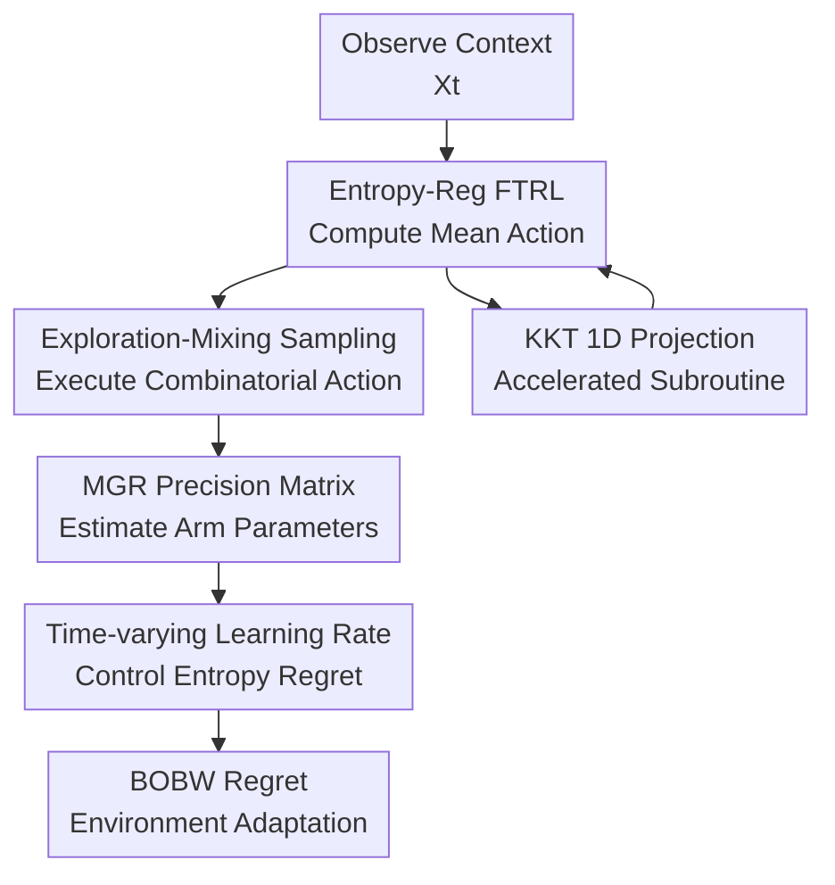

# Efficient Best-of-Both-Worlds Algorithms for Contextual Combinatorial Semi-Bandits

**Conference**: ICLR 2026  
**OpenReview**: [https://openreview.net/forum?id=OW2vWSdBgW](https://openreview.net/forum?id=OW2vWSdBgW)  
**Code**: None  
**Area**: Learning Theory / Online Learning / Bandits  
**Keywords**: Contextual Combinatorial Semi-Bandits, Best-of-Both-Worlds, FTRL, Regret Bounds, Bregman Projection  

## TL;DR
This paper proposes the first best-of-both-worlds (BOBW) algorithm for contextual combinatorial semi-bandits. By employing entropy-regularized FTRL with Matrix-Geometric-Resampling (MGR), the algorithm achieves $\tilde O(\sqrt T)$ regret in adversarial regimes and $\tilde O(\ln T)$ regret in corrupted stochastic regimes simultaneously. It further accelerates the high-dimensional projection in each round into a one-dimensional bisection root-finding problem using KKT conditions.

## Background & Motivation

**Background**: Combinatorial semi-bandits describe scenarios where a learner selects a combinatorial action from $K$ base arms per round (e.g., a recommender system displaying up to $m$ items). Unlike full-bandit feedback, semi-bandit feedback reveals the individual losses of the selected arms, allowing the minimax regret for $m$-set problems to be improved from $\tilde O(m\sqrt{KT})$ to $\tilde O(\sqrt{mKT})$. With context, user features $X_t$ are observed, and the loss for each base arm is given by a linear model $\langle X_t, \theta_{t,k} \rangle$.

**Limitations of Prior Work**: Research has historically followed two tracks. One assumes a stable stochastic environment to achieve logarithmic regret, while the other allows adversarial losses to guarantee $\tilde O(\sqrt T)$ in the worst case, often sacrificing fast convergence in stochastic settings. Best-of-both-worlds (BOBW) aims to adapt to both environments without knowing the type in advance. However, existing BOBW results either lack combinatorial structure, lack context, require enumerating exponential policy spaces, or rely on known context covariance and expensive sampling subroutines.

**Key Challenge**: Contextual combinatorial semi-bandits present three simultaneous difficulties. First, the action space is combinatorial, with the number of actions growing exponentially with $m$. Second, contextual loss estimation involves unknown covariance matrices, preventing a direct transfer of standard combinatorial semi-bandit analysis. Third, while FTRL/OSMD are theoretically elegant, they require $K$-dimensional Bregman projections onto the combinatorial action polytope in every round, which becomes a bottleneck for real-world deployment.

**Goal**: The authors aim to solve a bottleneck involving both theory and computation: design an algorithm for general contextual combinatorial semi-bandits that is agnostic to the environment (adversarial vs. stochastic), maintains $\tilde O(\sqrt T)$ regret in the adversarial regime, achieves logarithmic regret in stochastic or corrupted stochastic regimes, and ensures the core projection subroutine matches the efficiency of fast methods like FTPL.

**Key Insight**: This work adopts Follow-the-Regularized-Leader (FTRL) with negative Shannon entropy regularization because its stability properties are suitable for BOBW proofs. Instead of inverting unknown covariance matrices directly, it utilizes Matrix-Geometric-Resampling (MGR) to approximate the precision matrix. For computation, it re-examines the KKT conditions for $m$-set projections, discovering that the high-dimensional optimization depends on a single global Lagrange multiplier, solvable via one-dimensional root finding.

**Core Idea**: By combining "entropy-regularized FTRL with time-varying learning rates," "MGR loss estimation with controllable bias," and "1D KKT projection solving," the paper achieves both statistical adaptability and per-round computational efficiency in contextual combinatorial semi-bandits.

## Method

### Overall Architecture

The method consists of two layers. The first is a theoretical algorithm for contextual combinatorial semi-bandits: upon observing context, it runs entropy-regularized FTRL on the convex hull of combinatorial actions $\mathrm{conv}(\mathcal A)$ to obtain a mean action, samples a combinatorial action from $\mathcal A$, and updates base arm parameters using semi-bandit feedback. The second is a general numerical subroutine: when FTRL/OSMD requires a Bregman projection, KKT conditions are used to reduce the $K$-dimensional projection to finding the root of a scalar $\lambda$, compressing the update complexity to approximately $\tilde O(K)$.

In the protocol, there are $K$ base arms, and up to $m$ arms are selected per round. The action set is $\mathcal A \subseteq \{A \in \{0, 1\}^K : \sum_k A_k \le m\}$. The environment chooses linear loss coefficients $\theta_{t,k} \in \mathbb R^d$ and draws context $X_t \sim D$. After observing $X_t$, the learner selects $A_t$ and observes losses $\ell_t(X_t, k) = \langle X_t, \theta_{t,k} \rangle$ only for selected arms. The goal is to minimize pseudo-regret against the hindsight optimal context-dependent action $u^\star(x)$. 

It is assumed that $\mathbb E[XX^\top] = \Sigma \succ 0$, $\|X\|_2 \le 1$, $\|\theta_{t,k}\|_2 \le 1$, and losses $\in [-1, 1]$. In the adversarial regime, $\theta_{t,k}$ varies arbitrarily; in the stochastic regime, arms have fixed unknown $\theta_k$ with zero-mean noise; the corrupted stochastic regime allows $\theta_{t,k}$ to deviate from $\theta_k$ with a total budget $C$.

### Key Designs

**1. Entropy-Regularized FTRL: Learning on the Mean-Action Polytope**

Directly applying exponential weights to $\mathcal A$ is infeasible due to the exponential number of actions. This paper instead maintains a mean action $\bar A_t(X_t)$ on $\mathrm{conv}(\mathcal A)$, which has only $K$ dimensions, and finds a distribution $p_t(\cdot|X_t)$ such that $\mathbb E_{a \sim p_t}[a] = \bar A_t(X_t)$. This preserves the samposability while allowing FTRL analysis in the $K$-dimensional space.

The algorithm solves:
$$
\bar A_t(X_t) \in \arg\min_{a \in \mathrm{conv}(\mathcal A)} \sum_{s=1}^{t-1} \sum_{k=1}^K \langle X_t, \tilde\theta_{s,k} \rangle a_k + \psi_t(a),
$$
where $\psi_t(a) = -H(a)/\eta_t$ and $H(a) = -\sum_k a_k \ln a_k$. The negative entropy encourages exploration, while the cumulative loss estimation pushes toward low-loss combinations. This tension allows the self-bounding analysis required for BOBW: controlling worst-case regret in adversarial settings while suppressing suboptimal action probability to logarithmic levels in stochastic settings.

**2. Exploration Mixing and MGR Estimation: Estimating Arm Parameters under Unknown Covariance**

A challenge in contextual semi-bandits is estimating arm parameters from selective feedback. If conditional covariance $\Sigma_{t,k} = \mathbb E[(A_t)_k X_t X_t^\top | \mathcal F_{t-1}]$ were known, an unbiased estimator $\hat\theta_{t,k} = \Sigma_{t,k}^{-1} X_t \ell_t(X_t, k) (A_t)_k$ could be used. However, knowing or inverting $\Sigma_{t,k}$ is often computationally prohibitive.

The paper utilizes Matrix-Geometric-Resampling (MGR): using additional context samples to approximate the precision matrix. The learner mixes the FTRL policy $p_t$ with a uniform distribution over an exploration set $\mathcal E$ (typically singletons) with weight $\alpha_t \eta_t$:
$$
\pi_t(a|X_t) = (1 - \alpha_t \eta_t) p_t(a|X_t) + \alpha_t \eta_t \mathbf 1[a \in \mathcal E] / |\mathcal E|.
$$
This ensures eigenvalues of the arm covariance remain bounded away from zero. The MGR subroutine performs $M_t = \lceil 4K \ln(t) / (\alpha_t \eta_t \lambda_{\min}(\Sigma)) \rceil$ resamplings to construct $\hat\Sigma^+_{t,k}$. Although the estimator $\tilde\theta_{t,k}$ is biased, Lemma 2.3 proves the total bias contributes only $O(1)$ to the regret, which is sufficient for BOBW guarantees.

**3. Time-Varying Learning Rates and Ghost Context: Unifying Adversarial and Stochastic Bounds**

Standard fixed learning rates achieve $\tilde O(\sqrt T)$ for adversarial cases but fail to reach logarithmic regret in stochastic regimes. Here, $\eta_t = 1/\beta_t$ where $\beta_t$ grows adaptively based on cumulative entropy $\sum_{s=1}^t H(\bar A_s(X_s))$. In stochastic environments, as the algorithm identifies optimal actions, entropy decreases, and the self-bounding analysis limits suboptimal exploration to $O(\ln T)$. In adversarial settings, the entropy term effectively translates to $O(\sqrt T)$ regret.

To handle contextual randomness, a "ghost context" $X_0 \sim D$ is introduced to decouple the randomness of the context sequence from the parameter estimates. Lemma 2.2 decomposes the regret into a fixed-context surrogate game and an estimation bias term. Subsequent lemmas relate the entropy in the $K$-dimensional mean-action space to the sampling probability in the action distribution space to facilitate the self-bounding argument.

**4. KKT 1D Projection: Transforming the Computational Bottleneck**

For $m$-set problems ($\sum_k a_k = m, 0 \le a_k \le 1$), the FTRL/OSMD projection with a separable regularizer $F(a) = \sum_k f(a_k)$ takes the form:
$$
\min_{a \in \mathrm{conv}(\mathcal A)} \eta \langle a, \hat\ell_t \rangle + D_F(a, \bar A_t).
$$
KKT analysis reveals that all coordinates are coupled only through the Lagrange multiplier $\lambda$ of the sum constraint. Letting $c_k = \eta \hat\ell_{t,k} - f'(\bar A_{t,k})$, each coordinate follows $a_k = (f')^{-1}(-\lambda - c_k)$ subject to clipping to $[0, 1]$. The $K$-dimensional problem reduces to solving:
$$
\sum_{k=1}^K (f')^{-1}(-\lambda - c_k) = m.
$$
Algorithm 3 uses bisection to find $\lambda$. Theorem 3.1 and Corollary 3.2 show that even with an approximate oracle for $(f')^{-1}$, the error is controllable, achieving per-round complexity of $O(K \ln(\sqrt{KT})) = \tilde O(K)$.

### Loss & Training

This is an online learning algorithm rather than a supervised model. The objective is the regularized cumulative loss in the FTRL update with negative Shannon entropy $\psi_t(a) = -H(a)/\eta_t$. The sampling policy mixes FTRL output with uniform exploration $\pi_t = (1 - \alpha_t \eta_t) p_t + \alpha_t \eta_t \mathrm{Unif}(\mathcal E)$.

The main result is Theorem 2.1. In the adversarial regime, regret is:
$$
R_T = O\left(m \sqrt{K \ln(K/m) T \ln T \left(d + \frac{\ln T}{\lambda_{\min}(\Sigma)}\right)}\right).
$$
In stochastic and corrupted stochastic regimes:
$$
R_T = O\left(\frac{K \ln T \, m^{3/2} \ln((K-m)T) \left(d + \frac{\ln T}{\lambda_{\min}(\Sigma)}\right)}{\Delta_{\min}}\right),
$$
where $\Delta_{\min}$ is the minimum suboptimality gap and the corruption budget $C$ enters as an additive term.

## Key Experimental Results

### Main Results

The experiments focus on the per-round runtime of the numerical projection subroutine. Settings: $m=5, K \in \{10, \ldots, 100\}$, $N=25$ trials, losses $\in [0, 1]^K$, error tolerance $\varepsilon = 10^{-7}$. Comparisons: Bisection (Ours), Newton (Zimmert et al. 2019), and MOSEK (universal solver).

| Setup | Regularizer | Comparisons | Result |
|-------|-------------|-------------|--------|
| $m=5, K=10\ldots100$ | Tsallis ($f(x)=-\sqrt{x}$) | Bisection vs Newton vs MOSEK | Ours maintains the lowest runtime curve; bisection is best for Tsallis-type BOBW regularizers. |
| $m=5, K=10\ldots100$ | Negative Shannon ($f(x)=x\ln x$) | Bisection vs Newton vs MOSEK | Ours is consistently faster and trend-stable. |
| $K=100$ | Both | Bisection vs Newton | Bisection is nearly 10x faster at high arm counts. |
| All $K$ | Both | Bisection vs MOSEK | Bisection is approximately 5x faster; general solvers are unsuitable for per-round online updates. |

### Ablation Study

Traditional deep learning ablations are replaced with theoretical comparisons and numerical baselines to validate the two core contributions:

| Configuration | Key Metric | Insight |
|---------------|------------|---------|
| Algorithm 1: Entropy FTRL + MGR + Adaptive $\eta_t$ | Adv: $\tilde O(\sqrt T)$; Stoc: $\tilde O(\ln T)$ | First complete coverage of contextual combinatorial semi-bandit BOBW. |
| Fixed Schedule Contextual Methods | Stochastic regime results in suboptimal $\tilde O(\sqrt T)$ | Fixed schedules (e.g., Zierahn et al.) fail to achieve logarithmic stochastic bounds. |
| Standard Linear BOBW to Combinatorial | Optimizing in $2^K$ space is intractable | Linear-only BOBW cannot handle combinatorial actions efficiently. |
| Algorithm 3: KKT Bisection Projection | $\tilde O(K)$ per round | Matches FTPL efficiency while retaining FTRL's theoretical robustness. |

### Key Findings
- Contextual combinatorial semi-bandits do not require a choice between adversarial robustness and stochastic convergence.
- MGR bias is negligible ($O(1/t^2)$ per round) and does not degrade the leading regret terms.
- KKT bisection is practical and faster than Newton's method in Python implementations for $K \le 100$.
- Ghost contexts provide a clean theoretical decoupling for contextual analysis.

## Highlights & Insights
- Unified Treatment: Addresses both theoretical regret and computational efficiency simultaneously.
- Analysis Innovation: Lifting the entropy bound from mean-action space to the combinatorial action distribution space enables the application of self-bounding techniques in contextual settings.
- Pragmatic Optimization: Reducing high-dimensional convex optimization to 1D root-finding makes theoretically heavy methods (FTRL/OSMD) viable for real-time systems.

## Limitations & Future Work
- The negative Shannon entropy introduces an extra $\ln T$ factor in the adversarial bound; sharper regularizers could further tighten the gap.
- Dependence on $m$ (the combination size) is $O(m^{1.5...2})$, which may be suboptimal relative to lower bounds.
- Algorithm parameters rely on problem constants like $\lambda_{\min}(\Sigma)$ and $\Delta_{\min}$ which are difficult to estimate in real systems.
- Lack of end-to-end regret benchmarks on large-scale real-world datasets (e.g., ad click logs).

## Related Work & Insights
- **vs. Zierahn et al. (2023)**: They use MGR for adversarial regret but do not provide BOBW guarantees; this work adds time-varying rates and entropy analysis to reach logarithmic stochastic regret.
- **vs. Kuroki et al. (2024)**: They study BOBW for contextual bandits (non-combinatorial); this work generalizes to combinatorial actions by handling the exponential space via mean-action lifting.
- **vs. FTPL**: While FTPL is fast, FTRL/OSMD usually offer cleaner BOBW analysis. This work makes FTRL as computationally efficient as FTPL.

## Rating
- Novelty: ⭐⭐⭐⭐⭐ 
- Experimental Thoroughness: ⭐⭐⭐ 
- Writing Quality: ⭐⭐⭐⭐ 
- Value: ⭐⭐⭐⭐⭐ 

<!-- RELATED:START -->

- Zimmert & Seldin (2019): An Optimal Algorithm for Stochastic and Adversarial Bandits.
- Zierahn et al. (2023): Contextual Combinatorial Bandit with Interaction.
- Ito (2021): A unified approach to best-of-both-worlds analysis of FTRL.

<!-- RELATED:END -->

## Related Papers

- [\[ICLR 2026\] A Near-Optimal Best-of-Both-Worlds Algorithm for Federated Bandits](a_near-optimal_best-of-both-worlds_algorithm_for_federated_bandits.md)
- [\[ICLR 2026\] Combinatorial Rising Bandits](combinatorial_rising_bandits.md)
- [\[ICLR 2026\] Semi-Parametric Contextual Pricing with General Smoothness](semi-parametric_contextual_pricing_with_general_smoothness.md)
- [\[ICLR 2026\] Variance-Dependent Regret Lower Bounds for Contextual Bandits](variance-dependent_regret_lower_bounds_for_contextual_bandits.md)
- [\[ICLR 2026\] Queue Length Regret Bounds for Contextual Queueing Bandits](queue_length_regret_bounds_for_contextual_queueing_bandits.md)

<!-- RELATED:END -->
