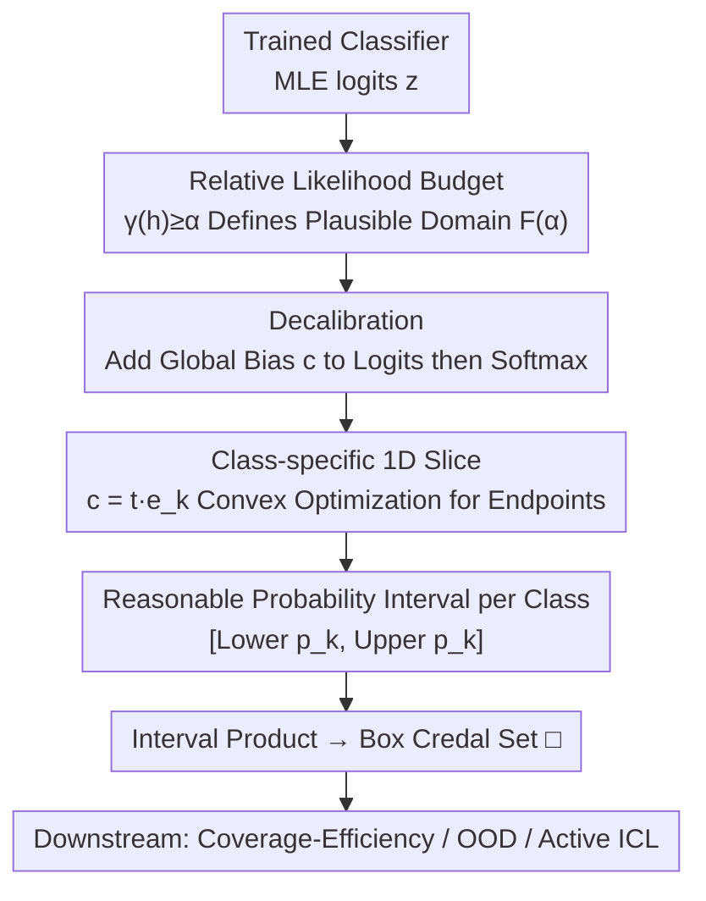

# Efficient Credal Prediction through Decalibration

**Conference**: ICLR2026  
**OpenReview**: [https://openreview.net/forum?id=BqOmsYIe7M](https://openreview.net/forum?id=BqOmsYIe7M)  
**Code**: https://github.com/pwhofman/efficient-credal-prediction  
**Area**: Uncertainty Quantification / Credal Set Prediction / Probabilistic Methods  
**Keywords**: credal set, epistemic uncertainty, relative likelihood, decalibration, post-hoc

## TL;DR
This paper proposes **decalibration**: starting from a single pre-trained model, by simply adding a global bias vector to logits and perturbing probabilities inversely within a "relative likelihood budget," it calculates a "plausible probability interval" for each class. This constructs credal sets expressing epistemic uncertainty without retraining or ensembles, marking the first application of credal prediction to foundation models like TabPFN and CLIP that cannot be easily retrained.

## Background & Motivation
**Background**: In safety-critical scenarios, models must not only predict accurately but also "know when they do not know." Uncertainty is divided into two types: aleatoric (inherent randomness in data, irreducible) and epistemic (caused by lack of knowledge, reducible with more data). Standard probabilistic classifiers output a single distribution $p(\cdot\mid x)$, which can represent aleatoric uncertainty but fails to express "how uncertain I am about this distribution itself." Credal sets (convex sets of probability distributions on a simplex) are designed to express epistemic uncertainty by outputting a family of distributions that are all "plausible."

**Limitations of Prior Work**: Existing constructions of credal sets are almost all expensive. Mainstream approaches involve training deep ensembles (CreWra, CreEns, CreNet), running Bayesian posterior sampling (CreBNN), or retraining a batch of models using relative likelihood criteria (CreRL). These pipelines often require training 10+ models, which is impractical for foundation models or multimodal systems where "training once is hard enough"—precisely where reliable uncertainty is most needed.

**Key Challenge**: Credal sets have three ideal properties: (i) statistically grounded, (ii) semantically transparent, and (iii) computationally feasible for large models. The relative likelihood approach by L\u00f6hr et al. (2025) satisfies (i) and (ii) by using likelihood ratios as a prior-independent, data-driven "evidence scale" and normalizing them to get nested, interpretable $\alpha$-cuts. **The unresolved issue is (iii) computational feasibility**: constructing an $\alpha$-cut still requires training multiple models to hit specified likelihood ratios, and these models often cluster near the MLE, making them inapplicable to large models unless $\alpha \approx 1$.

**Goal**: While **retaining the semantics of relative likelihood**, the goal is to shift the construction of credal sets from "training multiple models" to a "cheap exploration of a single model's output."

**Key Insight**: The authors borrow the idea of **calibration** for probabilistic classifiers and reverse it. Calibration "adjusts probabilities to be more correct" (closer to reality). Conversely, can one find how far a class probability can be pushed away from the MLE before it becomes "implausible" (likelihood drops below $\alpha$)? This is decalibration.

**Core Idea**: Using a minimal transformation—"adding a global bias to logits + softmax"—the model systematically pushes single-model probabilities toward "suboptimal but data-supported" directions within the relative likelihood budget $\alpha$. The extreme values reached form a plausible probability interval for each class, and the product of these intervals (box) constitutes the credal set—without retraining, without ensembles, using only logits.

## Method

### Overall Architecture
The method is called **EffCre** (Efficient Credal prediction). The input consists of the logits output by a trained probabilistic classifier (its maximum likelihood solution $h_{\mathrm{ML}}$) on the training set and query points; the output is a box credal set $\square_{x,\alpha}$ at the query point $x_q$. The entire pipeline does not touch model parameters and operates only in the output space: first, relative likelihood is used to define "what probability counts as plausible" (budget $\alpha$), then controlled perturbations are applied to logits to probe the upper and lower bounds of each class probability, finally concatenating these intervals into a credal set.

The core mechanism reformulates the classical view of "all models within a likelihood ratio ball are plausible" from a **search in parameter space** to a **post-hoc exploration in output space**. Since the budget is imposed on the training likelihood, any generated probability vector remains supported by the data to the chosen level of evidence.

### Key Designs

**1. Relative Likelihood Budget: Drawing the "Plausible" Line with Likelihood Ratios**

To ensure "plausible probabilities" have a statistical basis, authors follow the relative likelihood framework. Let $L(h)$ be the empirical likelihood of hypothesis $h$ on the training set. Define relative likelihood $\gamma(h) = L(h)/\sup_{h'}L(h') \in [0,1]$: at the MLE $\gamma=1$, and the worse the fit, the smaller $\gamma$. Notably, $-2\log\gamma(h)$ is the classical likelihood ratio statistic. Given a threshold $\alpha \in (0,1]$, all "plausible models" form an $\alpha$-cut $C_\alpha = \{h : \gamma(h) \ge \alpha\}$. Taking the per-class extrema of its image in predictive space $Q_{x,\alpha}$ yields $\underline{p}_k = \inf_{h \in C_\alpha} p_k$ and $\overline{p}_k = \sup p_k$, forming the box credal set $\square_{x,\alpha} = \{p : \underline{p}_k \le p_k \le \overline{p}_k\}$. This is prior-independent, data-driven, and has clear semantics: "probabilities reachable without sacrificing more than a ratio of $\alpha$ in training likelihood." The paper proves monotonicity (Prop. 2.1): a larger $\alpha$ leads to more nested sets and tighter intervals—corresponding to the **coverage-efficiency trade-off** in evaluation (coverage is the probability that the true distribution $p^\star$ falls in the set; efficiency is measured by $1 - \tfrac{1}{K} \sum_k (\overline{p}_k - \underline{p}_k)$).

**2. Decalibration: Adding Global Bias to Push Probabilities without Crossing the Line**

This is the engine of the paper. To explore the $\alpha$-cut without retraining, the authors start from $h_{\mathrm{ML}}$ and deliberately distort predictions towards "lower likelihood" but use budget $\alpha$ to prevent them from becoming implausible. Specifically, this is instantiated as a simple yet expressive transformation: adding the same global bias vector $c \in \mathbb{R}^K$ to the logits of every sample (both training and test), followed by a softmax:

$$p_j^{(n)}(c) = \frac{\exp(z_j^{(n)} + c_j)}{\sum_k \exp(z_k^{(n)} + c_k)}, \qquad p_j(x;c) = \frac{\exp(z_j(x) + c_j)}{\sum_k \exp(z_k(x) + c_k)}.$$

Let the change in log-likelihood be $\Delta\ell(c) = \sum_n [\log p^{(n)}_{y^{(n)}}(c) - \log p^{(n)}_{y^{(n)}}(0)]$. The plausible domain is $F(\alpha) = \{c : \Delta\ell(c) \ge \log\alpha\}$. Intuitively, $c$ performs a "controlled odds-tilt" across classes. This choice is elegant because it requires no gradients, does not change representations, and is model-agnostic, making it naturally suitable for inference-only, closed-API, or parameter-frozen large models.

**3. Convex Structure: Turning Upper Bounds into Single Convex Optimizations**

The authors prove (Prop. 3.1) that $\Delta\ell(c)$ is $C^\infty$ and **concave** (the Hessian is a negative semi-definite covariance-type matrix $-\sum_n [\mathrm{Diag}(p^{(n)}) - p^{(n)}p^{(n)\top}]$), and invariant to translations along $\mathrm{span}\{\mathbf{1}\}$. Thus $F(\alpha)$ is a convex set and is compact on the identifiable hyperplane $S = \{c : \mathbf{1}^\top c = 0\}$. The test objective $\log p_k(x;c)$ is also concave, so the **upper bound $\overline{p}_k$ is the optimal value of a single convex program** with a unique solution on $S$. However, the lower bound $\underline{p}_k$ is generally **non-convex**—it can only be attained on the boundary/extreme points of $F_S(\alpha)$ and may have multiple global extrema. Exhaustive exploration would be expensive, defeating the purpose of "efficiency."

**4. Class-specific 1D Slice: Reducing Bounds to Scalar Convex Programs**

To bypass the non-convex lower bound problem, the authors restrict perturbations to a single coordinate direction, i.e., $c = t e_k$ (only modifying the $k$-th class logit). The problem reduces to 1D: $\Delta\ell_k(t) = \Delta\ell(t e_k)$ is strictly concave, and the feasible set $F_k(\alpha) = \{t : \Delta\ell_k(t) \ge \log\alpha\}$ reduces to an interval $[t_k^-, t_k^+]$. Since $t \mapsto p_k(x; t e_k)$ is strictly monotonically increasing on $\mathbb{R}$ (Cor. 3.1), **the lower and upper bounds for that class probability are simply the values at the interval endpoints**: $\underline{p}_k = p_k(x; t_k^- e_k)$ and $\overline{p}_k = p_k(x; t_k^+ e_k)$. The endpoints themselves are found via two scalar convex programs (or bisection for $\Delta\ell_k(t) = \log\alpha$). This step transforms a non-convex boundary search into "solving two 1D equations," which is why EffCre is orders of magnitude faster than ensemble methods. All experiments use this 1D setting.

### Loss & Training
The method **does not involve any training**—this is its core selling point. All calculations are post-hoc convex optimizations or bisection root-finding, requiring only the model's logits on the training set and test points. The only "hyperparameter" is the relative likelihood budget $\alpha \in (0,1]$, used to select operating points between coverage and efficiency.

## Key Experimental Results

### Main Results
Validated across coverage-efficiency, OOD detection, in-context learning, and zero-shot classification, comparing against current SOTA credal prediction baselines (CreWra / CreEns / CreBNN / CreNet / CreRL).

| Task | Data/Model | EffCre Performance | Baselines |
|------|-----------|-------------|----------|
| Coverage-Efficiency | CIFAR-10 (+CIFAR-10H true dist.) | Pareto-dominates CreRL in high coverage; dominates CreBNN/CreWra/CreNet overall | Baselines stuck in single coverage regions |
| Coverage-Efficiency | ChaosNLI | High coverage $\approx$ CreRL, Low coverage $\approx$ CreEns; traverses full range | Baselines cannot span both regions |
| OOD Detection | ResNet18 / CIFAR-10 $\rightarrow$ SVHN etc. 5 sets | AUROC slightly lower than baselines, but **training time dropped from hours to $\approx 0$** (post-hoc) | Baselines require training 10 ensemble members |
| ICL | TabPFN / TabArena | Small sets often contain true distribution; Active ICL outperforms random sampling | Baselines inapplicable (require retraining + original data) |
| Zero-shot | CLIP/SigLIP/SigLIP-2 / CIFAR-10 | Achieves high coverage + high efficiency | Baselines computationally infeasible |

The most prominent conclusion: EffCre **spans the entire interval on the coverage-efficiency curve** (users specify any operating point), whereas each baseline can only cover a segment; meanwhile, it reduces computation by **several orders of magnitude**.

### Ablation Study

| Configuration | Key Observation | Explanation |
|------|---------|------|
| $\alpha$ Scanning (Cov.-Eff.) | $\alpha \uparrow \rightarrow$ Cov. $\downarrow$, Eff. $\uparrow$ (nesting tightens) | Verifies monotonicity of Prop. 2.1; $\alpha$ is the operating knob |
| $\alpha=0$ Validation | Still generates sufficiently dense sets | Tests if the method can reach the edges of plausible probability intervals |
| 1D vs. Coupled Bias | 1D used throughout (bounds are convex); coupled lower bound non-convexity remains open | 1D is the key trade-off for efficiency and solvability |
| Uncertainty Metric | Entropy-type EU and zero-one EU used for Active ICL | Zero-one metrics proven effective for such tasks |

### Key Findings
- **Decalibration + 1D Slicing** is the source of efficiency: it avoids expensive non-convex boundary exploration, reducing credal set construction to solving 1D convex programs.
- While slightly inferior in AUROC on OOD, the argument is that "the slight advantage of ensembles is not worth the cost for large models"—EffCre has almost zero extra training.
- First to provide credal sets for **TabPFN (in-context tabular foundation model) and CLIP-style VLMs**, architectures previously excluded from credal prediction due to lack of retraining/training data.
- Qualitatively, EffCre distinguishes between epistemic uncertainty (e.g., "ship in a shipyard," an unusual context misclassified by MLE, where all classes get wide intervals) and aleatoric uncertainty (e.g., ambiguous postures of cats/dogs where the true distribution is split between classes).

## Highlights & Insights
- **"Reverse engineering calibration" is a clever perspective**: Reversing mature probability calibration techniques yields a zero-training, model-agnostic uncertainty constructor. By adding biases at the output, it obtains epistemic uncertainty expressions that previously required training many models.
- **Convexity is designed, not accidental**: Selecting "global bias + softmax" over arbitrary post-hoc mappings is precisely because it makes the change in training log-likelihood concave and the plausible domain convex; the 1D slice then makes the lower bound convex too.
- **High Transferability**: Any frozen/API model providing logits (LLMs, multimodal encoders) can use this post-hoc credal prediction, making it practical for industrial closed-source models.
- **Credal spider plot**: A visualization proposed for interval-based credal sets with $>3$ classes, allowing direct comparison between MLE predictions and true distributions.

## Limitations & Future Work
- **Only implemented 1D (class-specific) variants**: The fully coupled multi-logit case remains open—the upper bound is convex, but the lower bound is non-convex, requiring robust relaxation/certification/approximation schemes.
- **Slightly lower OOD performance**: Accuracy is traded for magnitude-level efficiency; in scenarios with small models where training cost is irrelevant, ensemble baselines still yield higher AUROC.
- **Open-vocabulary multimodal models bring new challenges**: For models like CLIP where the label set is defined at inference, uncertainty should reflect sources from prediction, label selection, and prompt selection—current credal formalisms do not yet cover this layer.
- **Box as an outer approximation**: $\square_{x,\alpha}$ retains all per-class extrema but is an outer approximation of $Q_{x,\alpha}$, potentially slightly overestimating the set volume.

## Related Work & Insights
- **vs. CreRL (L\u00f6hr et al., 2025)**: Both use relative likelihood semantics, but CreRL still requires training a batch of models (with early stopping) to hit likelihood ratios; EffCre moves this to the output space of a single model, being orders of magnitude faster and Pareto-dominating in high coverage regions.
- **vs. Ensembles (CreWra / CreEns / CreNet)**: These rely on aggregating multiple predictors or interval-head networks, requiring full training of each member; EffCre requires zero extra training and is model-agnostic.
- **vs. Bayesian (CreBNN)**: Bayesian posterior sampling inherits prior-sensitivity and high computational burdens; EffCre is prior-independent and data-driven, Pareto-dominating CreBNN in experiments.
- **vs. Single-forward / Evidential UQ (e.g., Dirichlet head, distance features)**: Those estimate standard uncertainty and evidential methods have recently faced criticism; EffCre provides interpretable **credal sets** with relative likelihood semantics, filling the gap for "efficient credal prediction."

## Rating
- Novelty: ⭐⭐⭐⭐⭐ Reversing calibration into decalibration using logit biases and likelihood budgets is a novel and self-consistent idea.
- Experimental Thoroughness: ⭐⭐⭐⭐ Covered coverage-efficiency/OOD/ICL/zero-shot plus TabPFN/CLIP, though OOD accuracy is slightly lower.
- Writing Quality: ⭐⭐⭐⭐⭐ Theoretical propositions are clear and well-interleaved with intuition; convexity derivations are rigorous.
- Value: ⭐⭐⭐⭐⭐ High practical value by enabling affordable epistemic uncertainty for foundation models and VLMs for the first time.

<!-- RELATED:START -->

## Related Papers

- [\[ICML 2026\] Learning Credal Ensembles via Distributionally Robust Optimization](../../ICML2026/learning_theory/learning_credal_ensembles_via_distributionally_robust_optimization.md)
- [\[ICLR 2026\] Conformal Prediction for Long-Tailed Classification](conformal_prediction_for_long-tailed_classification.md)
- [\[ICLR 2026\] Branch and Bound Search for Exact MAP Inference in Credal Networks](branch_and_bound_search_for_exact_map_inference_in_credal_networks.md)
- [\[ICLR 2026\] Distribution-informed Online Conformal Prediction](distribution-informed_online_conformal_prediction.md)
- [\[ICML 2026\] MMD-Balls as Credal Sets: A PAC-Bayesian Framework for Epistemic Uncertainty in Test-Time Adaptation](../../ICML2026/learning_theory/mmd-balls_as_credal_sets_a_pac-bayesian_framework_for_epistemic_uncertainty_in_t.md)

<!-- RELATED:END -->
