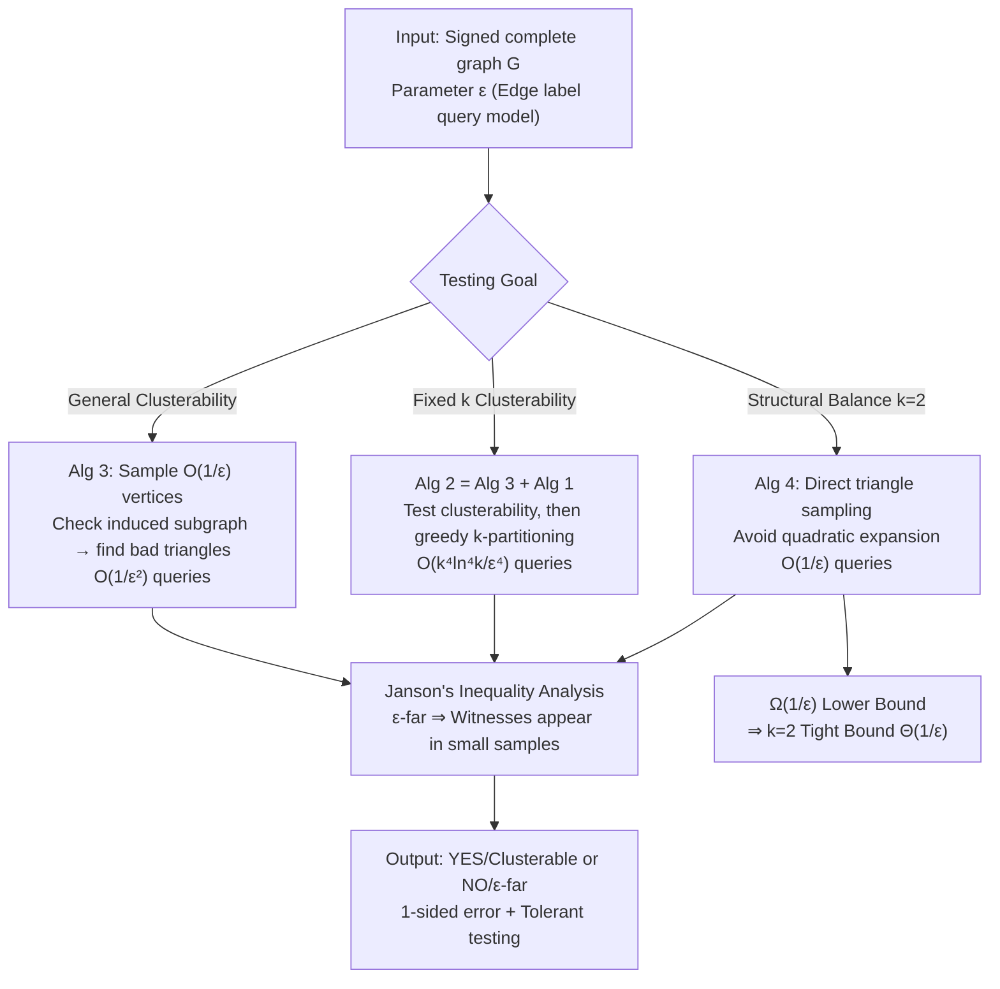

# Efficient Testing for Correlation Clustering: Improved Algorithms and Optimal Bounds

**Conference**: ICLR 2026  
**OpenReview**: [https://openreview.net/forum?id=3AFchYEwRQ](https://openreview.net/forum?id=3AFchYEwRQ)  
**Code**: Anonymous GitHub (Provided in paper, official version TBD)  
**Area**: Learning Theory / Property Testing / Correlation Clustering  
**Keywords**: Correlation Clustering, Property Testing, Sublinear Algorithms, Structural Balance, Janson's Inequality, Tight Bounds  

## TL;DR
Ours introduces a new analysis framework combining "subgraph sampling + Janson's inequality" to reduce the query complexity for testing whether a signed complete graph is (approximately) perfectly clusterable from $\tilde{O}(1/\varepsilon^7)$ to $O(1/\varepsilon^2)$. It provides the first $O(1/\varepsilon^4)$ tester for fixed $k$-clustering and a tight bound of $\Theta(1/\varepsilon)$ for structural balance ($k=2$).

## Background & Motivation
**Background**: Correlation clustering models a dataset as a signed complete graph $G=(V,E^+\cup E^-)$, where the optimal clustering is a partition that minimizes the total number of "positive edges across clusters + negative edges within clusters." It has applications in document summarization, image segmentation, and community detection in social networks; the $k=2$ special case corresponds to "strong structural balance" in sociology—stable signed networks that can be divided into two groups with only friends within groups and enemies between them.

**Limitations of Prior Work**: Most research focuses on "calculating/approximating the optimal clustering," but writing down the partition itself requires $\Omega(n)$ time. In massive network scenarios, one often only needs to know the scalar value of "how far this graph is from perfect clustering" without inspecting the entire network. This leads to **property testing**: using $o(n)$ edge label queries to distinguish whether a graph is "essentially clusterable" or "at least $\varepsilon\binom{n}{2}$ edges away from clusterable."

**Key Challenge**: The closest prior sublinear result (Adriaens & Apers 2023) required $\tilde{O}(1/\varepsilon^7)$ queries. Its analysis relied on the graph removal lemma, where the constant is a tower function of $\varepsilon$, making it practically unusable—$\varepsilon=0.01$ would require approximately $10^{14}$ operations (>2.5 hours). Furthermore, no non-trivial algorithm existed for fixed $k$ testing, and none of these upper bounds had matching lower bounds, leaving their tightness unknown.

**Goal**: Minimize the query complexity for testing correlation clustering to be as small as possible, ideally reaching tight bounds, and to fill the gap for fixed $k$.

**Key Insight**: The authors found that **the algorithm itself can be very simple** (sample $O(1/\varepsilon)$ vertices and check for "bad triangles" in the induced subgraph); the real difficulty lies in the analysis. **The key weapon is the first introduction of Janson's Inequality from random graph theory into property testing analysis**—it provides strong tail bounds even when "witness structures share vertices and are not independent," thereby bypassing the tower-function constants of the removal lemma and achieving $1/\text{poly}(\varepsilon)$ sample complexity.

## Method

### Overall Architecture
The paper revolves around three testing tasks, reusing a common "sampling-witness" skeleton: for general clusterability, sample $O(1/\varepsilon)$ vertices and check the induced subgraph ($O(1/\varepsilon^2)$ edges) for bad triangles; for fixed $k$, stack a "greedy clustering" sub-routine on the former; for $k=2$ (structural balance), perform **direct triangle sampling** to avoid quadratic expansion, achieving $O(1/\varepsilon)$ with matching lower bound proofs. The correctness of all three is guaranteed by Janson's inequality, ensuring that "if the graph is $\varepsilon$-far, a witness structure will almost certainly appear in a small sample."

### Key Designs

**1. Replacing Removal Lemma with Janson's Inequality for General Clusterability Testing (Theorem 1)**: A graph is clusterable if and only if it contains no "bad triangles" (two $(+)$ edges and one $(-)$ edge). The algorithm is simply to uniformly sample $O(1/\varepsilon)$ vertices, check their induced subgraph (approx. $O(1/\varepsilon^2)$ edges), and look for bad triangles—simple to the point of being trivial. The difficulty is proving that "if $G$ is $\varepsilon$-far, a bad triangle appears with high probability." Using Fox’s colored graph removal lemma only yields tower-function upper bounds like $\tilde{O}(\text{tower}(\log(1/\varepsilon)))$; reduction to MAX-CSP only gives a $\tilde{O}(1/\varepsilon^7)$ 2-sided error algorithm. Ours uses Janson’s Inequality $\Pr[X=0]\le\exp\!\big(\min\{-\lambda+\Delta,\,-\tfrac{\lambda^2}{\lambda+2\Delta}\}\big)$, where $\lambda=\mathbb{E}[X]$ is the expected number of witnesses in the sample, and $\Delta$ measures the correlation between witnesses due to shared vertices. When $\Delta$ is small relative to $\lambda$, it degrades to a Chernoff-like $e^{-\lambda}$; high correlation yields $e^{-\lambda^2/2\Delta}$ decay. By finely controlling the "overlap term $\Delta$," the sample complexity is pushed down to $O(1/\varepsilon^2)$, and the algorithm has **1-sided error** (clusterable always answers YES) while naturally supporting tolerant testing ($C\varepsilon^2$-near also answers YES).

**2. Two-stage "Clusterability Test + Greedy Partitioning" for Fixed $k$ Testing (Theorem 2)**: Determining $k$-clusterability adds the constraint that "the number of clusters does not exceed $k$." Ours splits this into two 1-sided algorithms: first, use Alg 3 with a stricter parameter $\delta=\varepsilon^2/(10^6 k^2\ln^2 k)$ to confirm the graph is sufficiently close to clusterable; then, use Alg 1 to greedily put sampled vertices into $k$ buckets under the "assumed clusterable" premise. For each sampled vertex $u$, check its edges with existing cluster representatives; join the first cluster with a positive edge, or start a new cluster if no positive edges are found. If more than $k$ clusters are needed, return NO. A key lemma (Lemma 3.2) guarantees: if the graph is only $\delta$-near clusterable and the sample size $s\le\frac{1}{10\sqrt\delta}$, the sampled subgraph will "not see any flipped false edges" with probability $\ge 99/100$. This is because the probability of sampling a specific false edge is $\le s^2/n^2$, and the union bound over $\le\delta\binom{n}{2}$ false edges yields $\le 1/100$. Thus, Alg 1's behavior on "near-clusterable" graphs is indistinguishable from "truly clusterable" ones. Total queries reach $O(k^4\ln^4 k/\varepsilon^4)$, which is $O(1/\varepsilon^4)$ for constant $k$, providing the first non-trivial tester for this setting.

**3. Direct Triangle Sampling + Lower Bound for Structural Balance ($k=2$) Tightness (Theorem 3/4/5)**: For structural balance ($k=2$), stable triangles are either "three positive edges" or "two negative and one positive." Instead of vertex sampling (which introduces $1/\varepsilon^2$ expansion), ours **directly samples triangles** to find "unbalanced triangles," reducing queries to $O(1/\varepsilon)$. It also provides stronger tolerant guarantees—distinguishing $\delta$-near balance ($\delta\approx O(\varepsilon)$) from $\varepsilon$-far, whereas the first two tasks only manage $O(\varepsilon^2)$-near. Finally, a Yao-style construction proves an $\Omega(1/\varepsilon)$ lower bound (Theorem 5), which holds for both general $k$ and fixed $k$. This pair of bounds provides the **first group of tight bounds** $\Theta(1/\varepsilon)$ for this problem family.

## Key Experimental Results

### Main Results Table ($\varepsilon=0.1$, Synthetic Graphs)

| Algorithm | Accuracy | Query Complexity (Sampled Edges) | Runtime (Single Graph) |
|-----------|----------|----------------------------------|------------------------|
| Test Gen CC (Alg 3) | 1.0 | 10000 | 23.8 s |
| Test Fixed k CC (Alg 1) | 1.0 | 1610 | 22.5 s |
| Test Structural Balance (Alg 4) | 1.0 | 60 | $1.3\times10^{-4}$ s |
| Baseline Adriaens & Apers (2023) | 1.0 | 900 | 1.1 s |

> For structural balance, ours uses approximately $1/15$ the sample size of the baseline and is about $10^4$ times faster. Accuracy is consistently 1.0, matching the theoretical 1-sided error.

### Ablation Study / Scalability (Alg 3, $\varepsilon=0.1$, Scaling with $n$)

| Graph Size $n$ | 10000 | 20000 | 30000 | 40000 | 50000 |
|----------------|-------|-------|-------|-------|-------|
| Test Core Time (s) | 0.011 | 0.013 | 0.015 | 0.17 | 0.20 |
| Total Time (incl. sampling, log) | 4.51 | 6.36 | 7.81 | 9.89 | 12.03 |

> Since query complexity is theoretically independent of $n$, the core testing time barely grows with size (0.011 to 0.20 s for $10^4\to 5\times10^4$). The bottleneck lies in peripheral processes like sampling.

### Key Findings
- **Synthetic Graphs**: Using 7 perturbation schemes (Pure / Uniform-noise / Hetero-noise / Cycle / Half-flip / Cluster-swap / Mixed-flip, 140 instances total, $n=5000, k=5$) to construct controllable ground-truth $\varepsilon$, all testers achieved 1.0 accuracy. Accuracy remained $>0.95$ across $\varepsilon$ from 0.05 to 0.5, with Alg 4 showing significant efficiency advantages at small $\varepsilon$.
- **Real Graphs**: On 6 SNAP real-world networks (Social/Finance/Collab/Comm, sizes 500–10000, positive=connected, negative=disconnected), testing outputs showed smooth phase transitions from "NO" to "YES" as $\varepsilon$ increased. The phase transition for structural balance was clearer than for general CC, and the transition points fell exactly after the $\varepsilon$ lower bounds estimated via signed Laplacian eigenvalues, corroborating test correctness. Tests on all real graphs took $<0.1$ s, and all real graphs were observed to be $\varepsilon$-far for $\varepsilon \le 0.3$.

## Highlights & Insights
- **Clear shift of difficulty from design to analysis**: Property testing algorithms are often simple (Goldreich & Trevisan); ours frankly states the contribution lies in analysis, delivering on the promise that "sharper analytical tools can cut complexity by 5 orders of magnitude."
- **First application of Janson's Inequality in property testing analysis**, bypassing the tower-function constants of the removal lemma. This provides a more granular subgraph testing analysis path than the "graph removal lemma," which the authors suggest may have independent value for other property testing problems.
- **Simultaneous improvement of upper bounds, first results for fixed $k$, and tight bounds for $k=2$**, essentially completing the theoretical landscape for this problem family in one paper.

## Limitations & Future Work
- **Strong Model Assumptions**: The work is based on the "labeled complete graph + adjacency matrix query" model. As noted at the end of the paper, a more realistic model is a "generic labeled graph where only some edges are signed"; extending results to this setting is an open direction.
- **Constants and Overhead**: Theoretical constants were made large for convenience in proofs (manually compressed to $\le 3$ in experiments). Scalability experiments show that total time is dominated by sampling rather than the core test, suggesting room for engineering optimization.
- **Addendum**: The authors discovered in April 2026 that the clique-collection problem in Goldreich & Ron (2011) is essentially equivalent to ours, implying $\tilde\Theta(1/\varepsilon)$ query complexity and a $\Theta(1/\varepsilon^{4/3})$ bound for non-adaptive testing. This weakens the novelty of the "first tight bound," though ours uses a different Janson-based analysis path.

## Related Work & Insights
- **Sublinear Correlation Clustering Testing**: The closest work by Adriaens & Apers (2023) used $\tilde{O}(1/\varepsilon^7)$ queries and studied the harder bounded-degree graph model ($\tilde{O}(\sqrt n/\text{poly}(\varepsilon))$); Chen et al. (2024) provided a quantum version. Ours pushes the upper bound to $O(1/\varepsilon^2)$ under adjacency matrix queries.
- **Streaming and Data Structures**: Bonchi et al. (2013) provided an $O(1/\varepsilon^2)$ data structure supporting cluster membership queries ($3\text{OPT}+\varepsilon n^2$); Assadi et al. (2023) and Ashvinkumar et al. (2023) tested CC/structural balance costs in the streaming model.
- **Solving (vs. Testing) Correlation Clustering**: Mainstream techniques like LP, pivot-based, and agreement decomposition (Bansal, Ailon, Chawla, Cohen-Addad) require $\Omega(n)$ time to output a solution, contrasting with the $o(n)$ testing in ours.
- **Insight**: When a property testing problem is "stuck" at tower-function constants due to the removal lemma, switching to tools from random graph theory that handle "correlated witnesses" (like Janson's Inequality) may be a general strategy for breaking the impasse. This experience is transferable to other subgraph/triangle-related testing problems.

## Rating
- **Novelty**: ⭐⭐⭐⭐ — First introduction of Janson's inequality to property testing, exponentially cutting queries and filling gaps for fixed $k$ and tight bounds; points deducted for overlapping with Goldreich & Ron (2011).
- **Experimental Thoroughness**: ⭐⭐⭐⭐ — Synthetic (7 schemes, 140 instances) + 6 real graphs + scalability; accuracy and phase transitions match theory, though real signed datasets and baselines are limited.
- **Writing Quality**: ⭐⭐⭐⭐ — Clear theorems, intuitive comparison tables, and honest acknowledgment of contributions and the Addendum.
- **Value**: ⭐⭐⭐⭐ — Provides closure for theoretical bounds of correlation clustering testing and offers a transferable analytical toolset for the property testing community.

<!-- RELATED:START -->

## Related Papers

- [\[NeurIPS 2025\] Improved Approximation Algorithms for Chromatic and Pseudometric-Weighted Correlation Clustering](../../NeurIPS2025/learning_theory/improved_approximation_algorithms_for_chromatic_and_pseudometric-weighted_correl.md)
- [\[ICLR 2026\] Testing Fourier Sparsity via Implicit Sensing](testing_fourier_sparsity_via_implicit_sensing.md)
- [\[ICML 2026\] Simple Algorithms for Bad Triangle Transversals with Applications to Correlation Clustering](../../ICML2026/learning_theory/simple_algorithms_for_bad_triangle_transversals_with_applications_to_correlation.md)
- [\[ICLR 2026\] Mean Estimation from Coarse Data: Characterizations and Efficient Algorithms](mean_estimation_from_coarse_data_characterizations_and_efficient_algorithms.md)
- [\[ICLR 2026\] Sublinear Spectral Clustering Oracle with Little Memory](sublinear_spectral_clustering_oracle_with_little_memory.md)

<!-- RELATED:END -->
