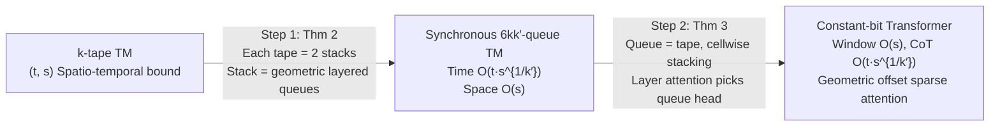

# Efficient Turing Machine Simulation with Transformers

**Conference**: ICLR 2026  
**OpenReview**: [https://openreview.net/forum?id=bxVuILo1xx](https://openreview.net/forum?id=bxVuILo1xx)  
**Code**: None (Pure theoretical paper)  
**Area**: Learning Theory / Transformer Expressivity  
**Keywords**: Turing Completeness, Chain-of-Thought, Constant-bit Transformer, Sparse Attention, Multi-queue Turing Machine  

## TL;DR
This paper demonstrates that constant-bit Transformers can simulate any multi-tape Turing Machine (TM) within an optimal $O(s(n))$ context window, utilizing only $O(s(n)^c)$ Chain-of-Thought (CoT) steps per TM step (where $c$ can be arbitrarily small). This effectively eliminates the $\Omega(s(n))$ overhead per step inherent in prior constructions and suggests that sparse attention with fixed geometric offsets is sufficient to support efficient universal computation.

## Background & Motivation

**Background**: Recent works have established the Turing completeness of Transformers—given a sufficiently long context window and number of Chain-of-Thought (CoT) steps, Transformers can simulate any Turing Machine. Specifically, Li & Wang (2025) further proved that even **constant-bit Transformers** (where the number of parameters and precision are constants independent of input length) are Turing complete, indicating that the reasoning capabilities of Transformers are "universal" in principle.

**Limitations of Prior Work**: Turing completeness only addresses "possibility," not "efficiency." All existing constant/logarithmic precision constructions (see table below) incur significant CoT overhead when simulating a single TM step. Although Li & Wang (2025) achieved the optimal $O(s(n))$ context window (exactly equal to the memory required for reasoning), simulating a single TM step requires $\Omega(s(n))$ CoT steps, leading to a total CoT length of $O(t(n)\cdot s(n))$. For many problems, this $s(n)$-fold slowdown is catastrophic, as the theoretical CoT length far exceeds observed reasoning steps in practice.

| Source | Precision | Dimension | Window | Total CoT |
|---|---|---|---|---|
| Pérez et al. (2021) | $O(\log t)$ | $O(1)$ | $n+t$ | $O(t)$ |
| Li et al. (2024) | $O(1)$ | $O(\log t)$ | $O(t\log t)$ | $O(t\log t)$ |
| Li & Wang (2025) | $O(1)$ | $O(1)$ | $s(n)$ | $O(t\cdot s)$ |
| **Ours** | $O(1)$ | $O(1)$ | $s(n)$ | $O(t\cdot s^c)$ |

**Key Challenge**: To simultaneously achieve three "optimals"—constant bits, optimal $O(s(n))$ window, and optimal CoT steps—has previously been impossible. Compressing the window to the optimum inevitably sacrificed per-step speed.

**Goal**: Without sacrificing constant bits or the optimal window, reduce the per-step slowdown from $s(n)$ to $s(n)^c$, where $c > 0$ can be made arbitrarily small by increasing the Transformer's "head-layer product" (number of attention heads × number of layers).

**Core Idea** (**Multi-queue Bridging + Geometrically Layered Stacks**): Li & Wang (2025) used a single-queue Turing Machine (Post machine) as a bridge between the TM and the Transformer. This paper generalizes the bridge to a **multi-queue Turing Machine** and designs a method to efficiently simulate a stack using geometrically increasing layered queues. This drastically reduces amortized overhead per step, while the construction naturally manifests as a "geometric offset sparse attention" pattern.

## Method

### Overall Architecture
The proof follows two steps, using a **synchronous multi-queue Turing Machine** as an intermediary bridge. Step 1 (the main technical novelty) involves efficiently reducing a multi-tape TM to a synchronous multi-queue TM. Step 2 adopts and generalizes the techniques from Li & Wang (2025) to compile the synchronous multi-queue TM into a constant-bit Transformer. Combining both yields the main theorem.

Theorem 1 (Main Theorem): Any $k$-tape TM with $(t(n), s(n))$ spatio-temporal bounds can be simulated by a constant-bit Transformer with a head-layer product $K$ and a context window $s(n)+1$. Each TM step requires only $O(s(n)^{6k/K})$ CoT steps, resulting in a total CoT length of $O(t(n)\cdot s(n)^{6k/K})$. By setting $c=6k/K$, $c$ can be made arbitrarily small by increasing $K$.

### Key Designs

**1. Geometrically Layered Queues for Stack Simulation (Core of Step 1, Theorem 2)**: Each tape is split into two stacks, and $k'$ layers of queues with geometrically increasing sizes are used to simulate one stack. Layer $i$ consists of a content queue (split into left and right half-queues) of size $2\lceil s^{1/k'}\rceil^i$ plus a buffer queue of the same size. The content queue maintains an invariant of "a segment of real symbols + a segment of dummy symbols," where the stack top always falls on the boundary between real and dummy symbols in layer 1. Deeper stack elements are stored in higher layers. Pushing an element inserts a symbol into the first dummy cell of layer 1; if full, half the content is moved to layer 2, recursing upward if necessary. Popping removes the last real symbol from layer 1; if empty, it is refilled from higher layers. The brilliance lies in **higher-layer queues being much larger but accessed much more sparsely**: a basic push/pop costs $O(s^{1/k'})$, and while moving data between layer $i-1$ and $i$ costs $O(s^{i/k'})$, it only occurs every $O(s^{(i-1)/k'})$ steps. Thus, the amortized cost per step is only $O(s^{1/k'})$. Simulating $t(n)$ steps requires $O(t(n)\cdot s^{1/k'})$ time and $O(s)$ total queue space.

**2. Threefold Improvements under Synchronous Model**: This paper adheres to the more rigorous **synchronous** multi-queue model—every queue must pop exactly one element and push exactly one element per step, with no "idling" allowed. Compared to the relaxed model of Hühne (1993) which allows idling, this work simultaneously: (i) extends results to the stricter synchronous model, (ii) reduces space complexity from $t(n)^{1+1/k'}$ to $s(n)$, and (iii) reduces time slowdown from $t(n)^{1/k'}$ to $s(n)^{1/k'}$. Synchronicity is a crucial prerequisite for the subsequent Transformer compilation—it ensures each queue size remains fixed during execution, allowing them to fit precisely within a fixed-length context window.

**3. Cellwise Stacking + Grouped Attention for Queue TM Compilation (Step 2, Theorem 3)**: Each queue is viewed as a tape infinite to the right with a bounded left end and two "heads" (front/back). The queue content is the segment between the two heads. In each step, the front head reads, both heads move right one cell, and the back head writes. $K$ tapes are stacked cellwise—the $i$-th token in the Transformer context records the contents of the $i$-th cell for all $K$ tapes. The cell pointed to by the back head corresponds to the latest token. The vocabulary is set to $V=\Sigma^K\times Q$, so tokens carry the TM state. To implement the transition function $\delta$, $K$ queues are divided into $L$ groups of $H=K/L$ each. The $\ell$-th decoding layer uses $H$ attention heads to retrieve the front symbols of each queue in the $\ell$-th group from historical tokens; the current state is retrieved from the current token, and $\delta$ is implemented via the feed-forward network. Since queue sizes are fixed, a window of $O(s_{\max})$ accommodates all content, reducing CoT steps to $O(t(n))$ per queue step.

**4. Geometric Offset Sparse Attention as a Natural Byproduct**: In the above construction, each query only attends to a few tokens at fixed relative positions—the offsets follow a geometric progression $\lceil s^{1/k'}\rceil, \lceil s^{1/k'}\rceil^2, \dots, \lceil s^{1/k'}\rceil^{k'}$ (i.e., each token only looks $1, 2, 4, 8, \dots, 2^i$ steps back). This implies each CoT token can be generated in $O(1)$ time, and simulating the TM only introduces an $O(s^c)$ per-step slowdown rather than the $t(n)$ cost of full attention. This pattern aligns closely with empirical observations that "attention is sparse and spatially clustered, with most heads focusing locally and few heads capturing structured long-range connections." It also echoes practical designs like LogSparse Transformer and PowerAttention, providing theoretical evidence that "exponentially sparse attention can enhance efficiency while maintaining universal computational power."

## Key Experimental Results

This is a **pure theoretical paper** with no empirical experiments. The core contributions are theorems and constructive proofs. Key quantitative conclusions are provided in the form of complexity:

### Main Results

| Metric | Li & Wang (2025) | Ours |
|---|---|---|
| Precision / Dimension | $O(1)$ / $O(1)$ | $O(1)$ / $O(1)$ |
| Context Window | $s(n)$ (Optimal) | $s(n)$ (Optimal) |
| CoT Overhead per Step | $\Omega(s(n))$ | $O(s(n)^c)$, $c=6k/K$ can be arbitrarily small |
| Total CoT Length | $O(t(n)\cdot s(n))$ | $O(t(n)\cdot s(n)^c)$ |
| Single-token Generation Time | Dependent on full attention | $O(1)$ (Geometric offset sparse) |

### Key Findings
- **Tunable Trade-off**: The overhead exponent per step $c=6k/K$ approaches zero as the head-layer product $K$ increases. Taking a practical scale of $K=6\times10^3$ and $k=2$, for all $s(n)\le 2^{500}$, the common ratio $\lceil s^{6k/K}\rceil=2$—meaning that under realistic parameters, the offset degenerates into standard $1,2,4,8,\dots$ binary intervals, covering almost all practically reachable space bounds.
- **Threefold Improvements in Step 1**: Synchronous model + space $t^{1+1/k'}\!\to\! s$ + time $t^{1/k'}\!\to\! s^{1/k'}$ constitutes the core technical increment over Hühne (1993). Specifically, "changing space dependence from running time $t$ to space bound $s$" is the prerequisite for the Transformer to achieve the optimal window.
- **Two Tapes are Enough**: The authors note that focusing on $k=2$ is natural because a 2-tape TM can simulate a multi-tape TM with only a logarithmic slowdown, ensuring the main conclusion holds in the most practical settings.
- **Architectural Insights**: The quadratic time complexity of full attention is not an inherent bottleneck for Transformer expressivity. Sparse geometric offset attention is sufficient to retain universal computation. This offers a counter-theoretical response to common concerns regarding "long context throughput bottlenecks."

### Complexity Summary
- **Step 1 Cost**: $O(t(n)\cdot s(n)^{1/k'})$ time, $O(k\cdot s(n))$ space, where $k'=K/(6k)$.
- **Step 2 Cost**: Window $O(s_{\max})$, CoT $O(t(n))$, with the head-layer product exactly matching the number of queues $K$.
- **Combined Results**: Window $s(n)+1$, total CoT $O(t(n)\cdot s(n)^{6k/K})$, simultaneously achieving the optimal window.

## Highlights & Insights
- **Advancing "Turing Completeness" from Qualitative to Quantitative**: While previous work answered "Can Transformers simulate a TM?", this paper answers "How slow will it be?" and nearly eliminates the critical $s(n)$ per-step overhead. Three optimal metrics (constant bits / optimal window / near-optimal CoT) are achieved simultaneously for the first time.
- **Multi-queue Bridge is Superior to Single-queue**: Generalizing Li & Wang's Post machine bridge to multiple queues allows the architectural resource of "head-layer product" to translate directly into simulation efficiency, providing a clear "resource-for-speed" knob.
- **Theory and Practice Alignment**: The emergent geometric offset sparse attention from the construction matches engineering designs like LogSparse and PowerAttention, as well as visualization phenomena of "local + sparse long-range" patterns, providing theoretical backing for the universality of such sparse architectures.
- **Elegant Amortized Analysis of Geometrically Layered Stacks**: Trading "higher layers being larger but accessed more sparsely" for an $O(s^{1/k'})$ amortized cost is the technical pivot of the entire proof.

## Limitations & Future Work
- **Pure Expressivity Result, No Learnability Guarantee**: The authors explicitly state this work only discusses "the existence of such a Transformer." Whether standard training processes can actually learn such geometric offset behavior remains an open question, and there are no empirical experiments.
- **Per-step Overhead Not Yet $O(1)$**: While $c$ can be arbitrarily small, it is not zero. Whether the per-step slowdown can be further reduced to a constant remains unsolved.
- **Non-standard Position Encoding Dependence on Known Space Bounds**: The construction uses relative PE that evolves with $n$ and assumes the space bound $s(n)$ is known a priori. Designing position encodings that can dynamically adapt to unknown space bounds is a future direction listed by the authors.
- **Idealized Model Assumptions**: Assumptions like synchronous multi-queues, hardmax, and cellwise stacking are reasonable but still distant from real-world LLMs.

## Related Work & Insights
- **Turing Completeness Lineage**: Pérez et al. (2021), Bhattamishra et al. (2020), Merrill & Sabharwal (2024), and Li & Wang (2025) have progressively reduced precision/dimension to constants. This work is the latest advancement in the "efficiency" dimension along this line.
- **Formal Language Expressivity**: Works by Hahn (2020) and Strobl et al. (2024) characterize Transformer bounds from a language recognition perspective, complementing the "computational complexity" perspective of this paper.
- **Multi-queue/Multi-tape Machine Theory**: Queue-tape simulation results from Hühne (1993) and Petersen (2013) are direct predecessors of Step 1; this work improves upon them in terms of synchronicity, time, and space.
- **Efficient Inference Practice**: This research resonates with engineering efforts to mitigate overthinking, such as length-penalty RL, variable-length SFT, and latent reasoning, theoretically suggesting that "short CoT + sparse attention" is fundamentally powerful enough.
- **Insight**: Geometric offset sparse attention may be an underrated architectural direction, worthy of validation on real LLMs for its dual promise of efficiency and universality.

## Rating
- **Novelty**: ⭐⭐⭐⭐⭐ Advances Turing completeness from qualitative to near-optimal quantitative results; both the multi-queue bridge and geometrically layered stacks are significant new constructions.
- **Experimental Thoroughness**: ⭐⭐ Pure theoretical paper with no empirical experiments, which the authors acknowledge as a limitation.
- **Writing Quality**: ⭐⭐⭐⭐ Clear complexity comparison tables, a clean two-step proof structure, and intuitive amortized analysis make the theoretical narrative highly readable.
- **Value**: ⭐⭐⭐⭐ Deepens the theoretical understanding of Transformer reasoning limits while providing architectural backing for sparse attention, offering insights for both theory and architectural design.

<!-- RELATED:START -->

## Related Papers

- [\[ICLR 2026\] Softmax Transformers are Turing-Complete](softmax_transformers_are_turing-complete.md)
- [\[ICLR 2026\] Transformers Are Inherently Succinct](transformers_are_inherently_succinct.md)
- [\[ICLR 2026\] Quantum Machine Learning Advantages Beyond Hardness of Evaluation](quantum_machine_learning_advantages_beyond_hardness_of_evaluation.md)
- [\[ICLR 2026\] Probability Distributions Computed by Autoregressive Transformers](probability_distributions_computed_by_autoregressive_transformers.md)
- [\[ICLR 2026\] In-Context Algorithm Emulation in Fixed-Weight Transformers](in-context_algorithm_emulation_in_fixed-weight_transformers.md)

<!-- RELATED:END -->
