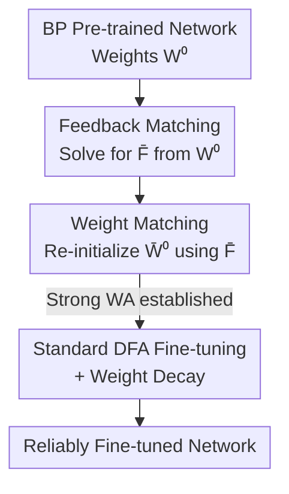

# Enabling Fine-Tuning of Direct Feedback Alignment via Feedback-Weight Matching

**Conference**: ICLR 2026  
**OpenReview**: [https://openreview.net/forum?id=ASwAmbKJHr](https://openreview.net/forum?id=ASwAmbKJHr)  
**Code**: https://github.com/eai-lab/FeedbackWeightMatching  
**Area**: Learning Theory / Biologically Plausible Training / Backpropagation-free Training  
**Keywords**: Direct Feedback Alignment, Fine-tuning, Weight Alignment, Gradient Alignment, Backpropagation Alternative

## TL;DR
This paper proposes feedback-weight matching: reconstructing DFA feedback matrices from backpropagation (BP) pre-trained weights and then re-initializing the weights using these matrices. This ensures DFA begins fine-tuning in a "strong weight alignment" state, enabling reliable fine-tuning of FCNs and Transformers for the first time (improving image classification by 7.97% over standard DFA and increasing NLP correlation from 0.10 to 0.76).

## Background & Motivation

**Background**: Direct Feedback Alignment (DFA) is a biologically plausible alternative to backpropagation (BP). BP requires sequential layer-by-layer error propagation, suffering from "weight transport" and "backward locking" issues. DFA resolves this by using a set of random feedback matrices $F_l$ to transmit the global output error $e=\hat y-y$ directly to each layer. The gradients $\delta W^{DFA}_l=-[(F_l e)\odot g'(a_l)]h_{l-1}^\top-\lambda_t W_l$ can be computed in parallel, improving training efficiency.

**Limitations of Prior Work**: Historically, DFA has been limited to "training from scratch" on fully connected networks; its application in fine-tuning (adapting pre-trained networks to new tasks) has been almost non-existent. Existing research indicates that fine-tuning BP pre-trained networks with DFA is highly unstable and performs significantly worse than BP. Some studies found that while switching from DFA to BP is stable, switching from BP to DFA leads to training failure that cannot be recovered even after many epochs. Consequently, DFA has been unable to utilize the modern "pre-train and fine-tune" paradigm.

**Key Challenge**: The efficacy of DFA depends on two metrics: Weight Alignment (WA) and Gradient Alignment (GA). When strong WA is satisfied ($W_l\propto F_l F_{l-1}^\top$), the DFA gradient direction aligns with the BP gradient (strong GA), allowing DFA to perform comparably to BP. While DFA naturally moves toward strong WA during training from scratch, **pre-trained BP weights do not possess this algebraic relationship with random feedback matrices $F_l$**. Standard DFA fine-tuning fails because the strong WA condition is almost never satisfied (Prop 3.3), resulting in weak GA.

**Goal**: Achieve reliable DFA fine-tuning by enabling the network to enter the strong WA $\to$ strong GA regime from the start.

**Key Insight**: Instead of passively waiting for alignment, **actively create it** by ensuring the feedback matrices and weights satisfy $W_l\approx F_l F_{l-1}^\top$ before fine-tuning begins.

**Core Idea**: Use pre-trained weights to reconstruct feedback matrices (feedback matching), then use these matrices to re-initialize weights (weight matching) to "force" strong WA. This is supplemented with weight decay to further reduce output error.

## Method

### Overall Architecture
The method addresses the algebraic mismatch between BP pre-trained weights and random feedback matrices. The overall flow is a concise pre-processing pipeline: upon obtaining a BP pre-trained network, the authors do **not** fine-tune immediately. Instead, they perform two matching steps: (1) solving for a set of feedback matrices $\bar F_l$ from pre-trained weights $W^0_l$ (feedback matching), and (2) re-initializing the weights as $\bar W^0_l$ using $\bar F_l$ (weight matching). This ensures $\bar W^0_l\propto \bar F_l\bar F_{l-1}^\top$ (strong WA) at step 0. Finally, **standard DFA** is used to fine-tune from $\bar W^0_l$, combined with weight decay. This pipeline only modifies initialization, keeping the DFA update rules unchanged and making it "plug-and-play."

The "diagnostic lens" used throughout is the interplay between WA and GA. WA measures the algebraic alignment (strong WA: $W_l\propto F_l F_{l-1}^\top$), while GA measures the similarity between DFA and BP gradient directions ($\cos\angle(G^{DFA},G^{BP})$). All designs aim to maximize WA at the start to maximize GA.

### Key Designs

**1. Diagnosing Fine-tuning Failure via WA/GA**
This is the starting point for all subsequent designs. The authors apply WA and GA analysis—originally used for training from scratch—to the fine-tuning scenario. They provide algebraic evidence for failure, proving (Prop 3.3) that starting from BP pre-trained weights $W^0_l$ with random feedback $F_l$, the strong WA conditions $W^t_{1<l<L}\propto F_l F_{l-1}^\top$ and $W^t_L\propto F_{l-1}^\top$ are **highly unlikely to hold**. In scratch training, alignment matrices $A^t_{l\ge2}$ converge to multiples of the identity matrix, pushing the network toward strong WA. However, in fine-tuning from "mature" BP weights, this spontaneous convergence fails, leading to weak WA and GA.

**2. Feedback Matching: Reconstructing Feedback Matrices from Pre-trained Weights**
To address the root cause of mismatch, the first step is to **fit** the feedback matrices to the pre-trained weights rather than generating them randomly. Specifically (Def 3.4 / Eq. 6), $\bar F_l$ is constructed such that:
$$\bar F_l\bar F_{l-1}^\top\approx W^0_{1<l<L},\qquad \bar F_{L-1}^\top\equiv W^0_L.$$
This decomposes middle-layer weights into products of adjacent feedback matrices using techniques like SVD or optimization. This step embeds pre-trained knowledge into the feedback matrices, making them task-aware rather than random.

**3. Weight Matching: Re-initializing Weights from Feedback Matrices**
Matching feedback matrices alone is insufficient; strong WA is a relationship. The second step (Def 3.5 / Eq. 7) re-initializes $W^0_l$ to $\bar W^0_l$ to match the reconstructed $\bar F_l$. This ensures $\bar W^t_{1<l<L}\propto\bar F_l\bar F_{l-1}^\top$ (Eq. 8) holds at $t=0$, establishing **strong WA immediately**. Prop 3.8 shows that feedback-weight matching also **directly** increases GA: in a two-layer linear network's first layer, $\cos_{FWM}\angle(F_1,W^t_2)\ge\cos_{DFA}\angle(F_1,W^t_2)$. While feedback matching preserves pre-trained knowledge, weight matching "positions" that knowledge for DFA's learning dynamics.

**4. Weight Decay: Reducing Output Error on Top of Matching**
The final piece is weight decay. While previously known to mitigate overfitting in DFA, this paper proves that weight decay, when combined with feedback-weight matching, **further reduces the network output error**. For a two-layer non-linear network (Prop 4.2), the output error satisfies:
$$\|e_{t+1}\|\le\Big(1-\tfrac{\eta\gamma}{4}-\eta\lambda_t\Big)\|e_t\|+\lambda_t\|y\|-\alpha_2 r_2,$$
conjectured to generalize to $L$ layers (Eq. 14, adding $-\sum_{l=2}^{L}\alpha_l r_l$). Here $r_l$ (Lemma 4.1) represents how much closer the re-initialized weights are to the convergence trajectory compared to the original weights. Weight decay normally introduces a side effect that increases error ($\lambda_t\|y\|-\eta\lambda_t\|e_t\|$); however, the matching-induced term $\sum_l\alpha_l r_l$ offsets this, resulting in a net reduction.

### Loss & Training
The method does not alter the DFA loss or update rules. Feedback matching and weight matching act as a one-time pre-processing step. Training then proceeds using standard DFA gradients $\delta W^{DFA}_l$, with the weight decay coefficient $\lambda_t$ as a key hyperparameter.

## Key Experimental Results

### Main Results
Experiments covered three settings: image classification with 4/6-layer FCNs, NLP (GLUE) with BERT-Tiny/Small, and image classification with ViT-Tiny/Small. Comparisons were made against standard DFA fine-tuning (DFAfine) and DFA training from scratch (DFAscratch).

| Task | Model / Setup | Metric | Standard DFA | Ours (DFAours) |
|------|------------|------|---------|-------------|
| Image (CIFAR-100→SVHN) | 6-layer FCN | Acc | 74.70 | **82.67** (+7.97) |
| NLP STSB | BERT-Small | Pearson | 0.10 | **0.76** |
| NLP CoLA | BERT-Small | Matthews | 0.06 | **0.53** |
| NLP CoLA | BERT-Tiny | Matthews | 0.00 | **0.29** |
| NLP MRPC | BERT-Small | Acc | 70.9 | **92.5** |
| Image (ImageNette) | ViT-Small | Acc | 0.210 | **0.319** |
| Image (STL-10) | ViT-Small | Acc | 0.111 | **0.247** |

On image classification, the method improves average accuracy by 2.16% over standard DFA. The advantage becomes more pronounced as **depth increases**: from 4 to 6 layers on CIFAR-100→SVHN, Ours only drops 0.20%, while standard DFA drops 4.85%. In NLP, the largest gains appear in small-sample datasets (CoLA, STSB, MRPC) which rely heavily on pre-trained weights; standard DFA fails completely on STSB/CoLA (correlation ~0).

### Key Findings
- **The causal chain of strong WA $\to$ strong GA $\to$ successful fine-tuning is verified**: DFAours maximizes WA at the start, causing GA to rise, which yields significantly higher training/test accuracy.
- **Transformers are a more challenging scenario**: Key/query/value projection layers in attention cannot be directly aligned, but aligning the subsequent dense layers significantly improves WA, GA, and overall performance.
- **Depth dependency**: Standard DFA degrades with depth during fine-tuning, whereas the proposed method remains robust, confirming that "strong WA initialization" is critical for deep architectures.

## Highlights & Insights
- **"Active Alignment" over "Passive Waiting"**: While strong WA emerges spontaneously during training from scratch, it fails during fine-tuning. This paper cleverly converts a "learning dynamics phenomenon" into an "initialization operation" through algebraic reconstruction.
- **Bi-directional Matching is essential**: Reconstructing feedback from weights AND weights from feedback is necessary to preserve pre-trained knowledge while satisfying DFA alignment conditions.
- **Synergy with Weight Decay**: Weight decay only becomes a "booster" for DFA fine-tuning when paired with feedback-weight matching. This suggests that the effectiveness of regularization is highly dependent on the initialization geometry.
- The use of WA/GA as a unified diagnostic lens provides a clear, measurable chain of "why it fails, how to fix it, and verifying the fix."

## Limitations & Future Work
- **Theory limited to shallow networks**: Strict proof for error reduction (Prop 4.2) is provided for $L=2$, while $L$-layer cases are based on Conjecture 4.3.
- **Focus on dense layers**: The alignment construction targets fully connected layers. Projections in attention operations and CNN architectures are not directly addressed.
- **Absolute performance vs. BP**: While the method makes DFA fine-tuning "viable," it still lags behind BP fine-tuning (e.g., 0.319 on ImageNette vs. much higher for BP).
- The trade-offs between using SVD versus optimization for feedback reconstruction require further exploration.

## Related Work & Insights
- **vs. Standard DFA (Nøkland, 2016)**: Standard DFA uses random matrices and fails in fine-tuning because alignment does not emerge spontaneously from BP weights.
- **vs. FA + Weight Decay (Song et al., 2021)**: They analyzed weight decay for "training from scratch." This paper is the first to analyze it in the "DFA fine-tuning" context.
- **vs. WA/GA Analysis (Refinetti et al., 2021)**: While they proposed the metrics for training dynamics, this paper applies them to demonstrate why fine-tuning requires active initialization.

## Rating
- Novelty: ⭐⭐⭐⭐⭐ First method to enable reliable DFA fine-tuning (including Transformers) via bi-directional matching.
- Experimental Thoroughness: ⭐⭐⭐⭐ Covers FCN/BERT/ViT with mechanistic verification, though absolute performance remains lower than BP.
- Writing Quality: ⭐⭐⭐⭐ Clear motivation and theoretical framework, though some proofs rely on conjectures for deeper layers.
- Value: ⭐⭐⭐⭐ Opens the "pre-train and fine-tune" paradigm for biologically plausible, parallelizable training algorithms.

<!-- RELATED:START -->

## Related Papers

- [\[ICLR 2026\] Online Learning and Equilibrium Computation with Ranking Feedback](online_learning_and_equilibrium_computation_with_ranking_feedback.md)
- [\[ICLR 2026\] Lipschitz Bandits with Stochastic Delayed Feedback](lipschitz_bandits_with_stochastic_delayed_feedback.md)
- [\[ICLR 2026\] Online Conformal Prediction with Adversarial Semi-bandit Feedback via Regret Minimization](online_conformal_prediction_with_adversarial_semi-bandit_feedback_via_regret_min.md)
- [\[ICML 2026\] Formalizing Learning from Language Feedback with Provable Guarantees](../../ICML2026/learning_theory/formalizing_learning_from_language_feedback_with_provable_guarantees.md)
- [\[ICLR 2026\] Toward Practical Equilibrium Propagation: Brain-Inspired Recurrent Neural Network with Feedback Regulation and Residual Connections](toward_practical_equilibrium_propagation_brain-inspired_recurrent_neural_network.md)

<!-- RELATED:END -->
