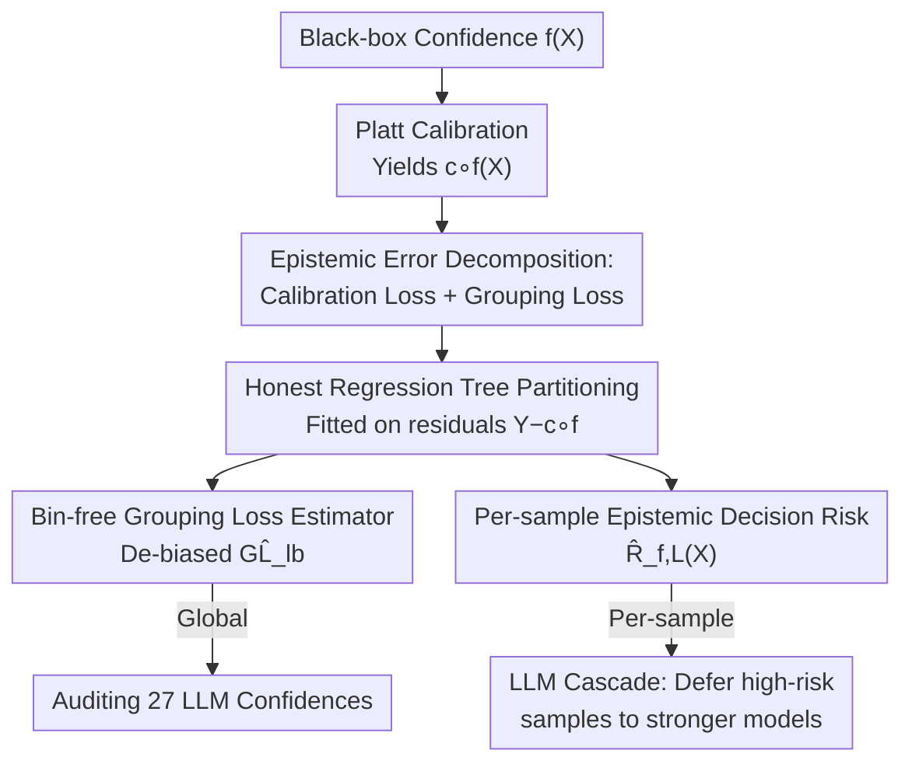

# Epistemic Uncertainty Quantification To Improve Decisions From Black-Box Models

**Conference**: ICLR2026  
**OpenReview**: [https://openreview.net/forum?id=JfiwaTxhI8](https://openreview.net/forum?id=JfiwaTxhI8)  
**Code**: To be confirmed  
**Area**: Learning Theory / Uncertainty Quantification  
**Keywords**: Epistemic uncertainty, grouping loss, calibration, decision risk, LLM cascade

## TL;DR
This paper proposes a set of **bin-free, asymptotically consistent, and sample-efficient** estimators to quantify the epistemic uncertainty remaining beyond black-box model calibration—specifically grouping loss and per-sample excess decision risk. These estimators are used to audit the confidence reliability of 27 open-source LLMs and to construct LLM cascades triggered by epistemic risk, achieving higher accuracy at a lower cost.

## Background & Motivation
**Background**: To make AI systems trustworthy, it is essential to distinguish between two types of uncertainty: **aleatoric uncertainty**, which arises from the inherent randomness of the task (where even an optimal predictor cannot be certain due to insufficient information, e.g., "will this patient relapse within six months?"), and **epistemic uncertainty**, which stems from the model's own ignorance (failing to utilize existing information optimally). Distinguishing the two is critical: aleatoric uncertainty should be reported as is, while epistemic uncertainty indicates where the model can still be improved—globally through data augmentation and fine-tuning, or locally by deferring the decision to a human expert or a stronger (but more expensive) model.

**Limitations of Prior Work**: Existing evaluation metrics only capture partial aspects. Accuracy/AUC only measure predictive signals and fail to detect over- or under-confidence; **proper scoring rules** (e.g., Brier score, log loss) can identify models with minimal epistemic error but cannot **quantify** the residual epistemic error; **calibration** compares confidence with true frequency but only provides control "on average"—a model may be well-calibrated overall yet over-confident on certain subgroups and under-confident on others, with the two canceling each other out in the average.

**Key Challenge**: For a calibrated model, the remaining epistemic error stems precisely from **error heterogeneity**—the model groups inputs with different true probabilities into the same confidence level. This component is known as **grouping loss (GL)**, the systematic piece missed by calibration metrics. However, existing grouping loss estimators (Perez-Lebel et al., 2023) rely on binning confidence scores and calculating intra-bin variance. Binning boundaries block information sharing across bins, and inputs within the same bin may represent disconnected subsets in the feature space, leading to poor sample efficiency.

**Goal**: (1) Provide a **bin-free** and asymptotically consistent grouping loss estimator; (2) Provide a **per-sample** epistemic decision risk estimator (not just averaged over level sets); (3) Apply these estimations to LLM confidence auditing and cascade decision-making.

**Core Idea**: Use a **carefully selected partition**—specifically, an honest regression tree fitted on the post-calibration residuals $Y-c\circ f(X)$—to locally estimate the difference between the true posterior and the calibrated score, thereby bypassing binning and directly estimating grouping loss and per-sample excess decision risk.

## Method

### Overall Architecture
The core problem the method solves is: how to quantify the epistemic error remaining beyond calibration for a black-box confidence score $f$ when only discrete labels $Y$ are observable and the true posterior $f^*(X)=P[Y=1\mid X]$ is unavailable. The approach is two-layered: first, establish a "decomposition" to explicitly identify the part of epistemic error missed by calibration (grouping loss); second, use a shared "partition estimation" machine to estimate this component and the per-sample decision risk; finally, apply the results to auditing and cascading.

The pipeline is: Obtain black-box confidence $\to$ Calibrate via Platt scaling to get $c\circ f$ $\to$ Fit an honest regression tree (leaves define the partition) on residuals $R=Y-c\circ f(X)$ $\to$ Calculate the de-biased grouping loss estimate $\widehat{GL}_{lb}$ and per-sample excess risk $\widehat{R}_{f,L}(X)$ using leaf-wise statistics $\to$ Use global estimates for cross-model auditing and per-sample estimates for cascade deferral.

### Key Designs

**1. Decomposing Epistemic Error: Grouping loss is what calibration misses**

The starting point is a decomposition theorem (Theorem 1, derived from Kull & Flach, 2015): for any proper scoring rule $\phi$, the expected loss can be decomposed as:

$$\underbrace{E[d_\phi(f(X),Y)]}_{\text{Expected Loss}} = \underbrace{\underbrace{E[d_\phi(f(X),c\circ f(X))]}_{\text{Calibration Loss (CL)}} + \underbrace{E[d_\phi(c\circ f(X),f^*(X))]}_{\text{Grouping Loss (GL)}}}_{\text{Epistemic Loss (EL)}} + \underbrace{E[d_\phi(f^*(X),Y)]}_{\text{Aleatoric Loss}}$$

where $c\circ f(X)=E[Y\mid f(X)]$ is the calibrated score. This formula clarifies that **Epistemic Loss = Calibration Loss + Grouping Loss**, meaning calibration metrics only cover a portion of epistemic error. When $\phi$ is the Brier score, grouping loss becomes a variance term:

$$GL = E\big[(f^*(X)-c\circ f(X))^2\big] = E_p\big[\,V[f^*(X)\mid f(X)=p]\,\big]$$

This represents the variance of the true probability $f^*(X)$ within the same confidence level set of the model—characterizing the phenomenon where the model groups inputs with different true probabilities together. This section establishes the target quantity for estimation: not performing calibration again, but quantifying the epistemic error **still remaining** after calibration.

**2. Bin-free Grouping Loss Estimator: Lower bounds via partitioning + De-biasing**

Directly using the GL definition requires binning to calculate intra-bin variance, which is sample-inefficient. This paper takes a different route: for any partition $L=\{L_j\}$ of the input space, let $r^*_j=E[Y-c\circ f(X)\mid X\in L_j]$ be the mean residual in each region. Then, the grouping loss is lower-bounded by (Proposition 2):

$$GL \ge \sum_{j=1}^{J} p_j \, r_j^{*2} \;\overset{\text{def}}{=}\; GL_{lb}(L)$$

$GL_{lb}(L)$ is the portion of grouping loss "captured" by partition $L$; the more homogeneous the regions (i.e., the closer the residual $f^*-c\circ f$ is to a constant within a region), the tighter the bound. Intuitively, a good partition should group points with **similar degrees of over/under-confidence**—noting that these points may span different confidence bins, which is the advantage of bin-free methods.

Since $r_j^{*2}$ estimated by the squared sample mean $\hat r_j^2$ is biased, the paper provides a **de-biased estimator** (Proposition 3, eq. 6):

$$\widehat{GL}_{lb} = \sum_{j=1}^{J} \hat p_j \Big( \hat r_j^2 - \tfrac{1}{n_j} \hat v_j \Big)$$

where $\hat r_j$ and $\hat v_j$ are the sample mean and variance of residuals in region $j$, and $\hat p_j=n_j/n$. The $\hat r_j^2$ term is the plug-in estimate, and $-\hat v_j/n_j$ is the bias correction. More importantly, it is **asymptotically consistent** (Proposition 4): if the partition estimate $\hat r^{(n)}$ is weakly universally consistent in $L_2$ and the number of partitions satisfies $J(n)/\sqrt{n} \to 0$, then $\widehat{GL}_{lb}^{(n)}$ converges weakly universally in $L_1$ to the true GL. This upgrades the "lower bound estimate" to an "asymptotically unbiased estimate of total grouping loss."

**3. Per-sample Epistemic Decision Risk Estimator: From sub-optimal probability to sub-optimal decision**

Estimating sub-optimality at the probability level is not enough—decisions are what matter in practice. Given a cost matrix $\Lambda \in \mathbb R^{2\times 2}$, decision theory yields an optimal threshold $t^* = \frac{\Lambda_{1,0}-\Lambda_{0,0}}{\Lambda_\Delta}$ (where $\Lambda_\Delta = \Lambda_{1,0}+\Lambda_{0,1}-\Lambda_{0,0}-\Lambda_{1,1}$). **Epistemic decision risk** is defined as the excess cost relative to an optimal model $f^*$; its oracle expression is elegant (Proposition 5):

$$R_f(X) = \begin{cases} \Lambda_\Delta \, |f^*(X)-t^*| & \text{if } \mathbf 1_{f^*(X)\ge t^*} \ne \mathbf 1_{f(X)\ge t} \\ 0 & \text{otherwise} \end{cases}$$

That is: risk exists only when the decisions of $f$ and $f^*$ **disagree**, and the risk is proportional to the distance between $f^*(X)$ and the threshold $t^*$—the further the point, the higher the cost of misclassification. Since $f^*$ is unknown, it is approximated using the partition estimate $\hat r(X)$ as a local correction to the calibrated score (Proposition 6, eq. 8):

$$\widehat R_{f,L}(X) = \begin{cases} \Lambda_\Delta \, |c\circ f(X) + \hat r(X) - t^*| & \text{if } \mathbf 1_{c\circ f(X) + \hat r(X) \ge t^*} \ne \mathbf 1_{f(X) \ge t} \\ 0 & \text{otherwise} \end{cases}$$

The error is bounded by $|R_f(X) - \widehat R_{f,L}(X)| \le |\Lambda_\Delta| \, |r(X) - \hat r_j|$—thus, the tree partition is constructed to **minimize intra-leaf residual variance** specifically to tighten this bound. The key value is that it is **per-sample** (not averaged over level sets or the whole distribution), allowing it to individually estimate "how much accuracy might be lost" for each input, directly serving cascade decisions. This differs from calibration risk $R^{CL}$, which is not necessarily non-negative point-wise (calibration might improve or worsen a single prediction); thus, this paper focuses directly on total point-wise epistemic risk rather than its decomposition.

**4. Honest Regression Trees as Partition Estimators**

Designs 2 and 3 share the same mechanism: the partition estimate $\hat r$. The paper uses **honest regression trees** (Wager & Athey, 2017)—the tree is fitted on post-calibration residuals $Y-c\circ f(X)$, where leaves define the partition, but the tree structure and leaf-wise estimates are calculated using **disjoint data subsets** to eliminate bias in leaf estimates. Data is split into: Calibration Set (10%) / Fitting Set (40%) / Evaluation Set (50%). Calibration uses Platt scaling. Trees use infinite depth with a minimum of 15 samples per leaf. For tabular data, the original feature space is used; for neural networks processing images/text, partitions are built on internal representations (e.g., last-layer hidden activations or UMAP embeddings). Compared to boosting, a single honest tree has lower variance, is more interpretable, and is better suited for "evaluation" purposes with limited samples.

### Loss & Training
The paper does not train new models but evaluates existing black-box confidences. Pipeline hyperparameters are fixed across all experiments for robustness: decision trees with infinite depth, $\ge 15$ samples per leaf; 10%/40%/50% split. Consistency results rely on two conditions from Theorems 4.1/4.2 in Györfi et al. (2002)—partition diameters tending to zero and leaf samples growing with total samples—which are reasonable for tree partitions.

## Key Experimental Results

### Main Results
**(a) Estimator Verification on Semi-synthetic Data** (TabReD Weather dataset, >16M samples, with temporal drift, where $f^*$ is known):

| Estimator | Convergence to Ground Truth | Sample Efficiency | Ground Truth GL |
|-----------|-----------------------------|-------------------|-----------------|
| Perez-Lebel et al. (2023) (Binning) | Slower convergence | Lower | 0.0041 |
| Ours $\widehat{GL}_{lb}$ (Bin-free) | Converges from below | Higher (captures more GL with same samples) | 0.0041 |

**(b) LLM Cascading** (ACSIncome, Llama 3 instruct pool):

| Comparison | Gain (Accuracy) | Cost |
|------------|-----------------|------|
| vs. Largest model (Llama 70B) | +4% | ~30% of Llama 70B cost |
| vs. Cascade using $R^{CL}$ / Prediction Router | Up to +2% higher at any cost | Lower |

### Ablation Study

| Configuration / Setting | Key Findings |
|-------------------------|--------------|
| 27 Open-source LLMs (1B–70B) across 5 ACS tasks | Grouping loss decreases as model size increases. Larger models have more reliable confidence. |
| base vs. instruct | instruct $\le$ base (GL is lower or equal). Instruction tuning reduces subgroup bias. |
| Traditional confidence threshold cascading | Ineffective in experiments. LLM calibration is poor, making threshold-based deferral unreliable. |
| Decision risk estimator vs. Perez-Lebel (2025) | Stronger correlation with average cost reduction brought by various fine-tuning methods. Better characterizes "degree of sub-optimality." |

### Key Findings
- **Grouping loss is real and significant**: Even after calibration, LLMs exhibit systematic over/under-confidence on specific demographic subgroups (e.g., underestimating high-income probability for "experienced female graduate students"), which is completely missed by calibration metrics.
- **Per-sample risk is key to cascade success**: Replacing "confidence thresholds" with "per-sample epistemic risk $\widehat R$" as the deferral trigger allows upgrading to a stronger model only on high-risk samples, outperforming the largest model by +4% at approximately 30% cost.
- **Locality enables interpretable auditing**: Leaves of the tree partition naturally provide readable groupings of "which subgroups are systematically misjudged" (Figure 1 shows subgroups defined by age/education/gender), supporting fine-grained confidence auditing.

## Highlights & Insights
- **Thoroughly explaining what calibration misses and providing estimators**: The decomposition theorem clarifies that calibration is only part of epistemic error, while grouping loss is the systematically ignored piece. This paper does more than point out the problem—it provides asymptotically consistent, sample-efficient estimators, bridging theory and practice.
- **The versatility of Bin-free + Honest Trees**: Fitting an honest tree on residuals to define partitions avoids the sample waste of binning and possesses the inherent ability to group points with similar over/under-confidence. This is transferable to any scenario requiring local posterior error estimation.
- **Per-sample Risk $\to$ Decisions**: Moving from "probabilistic sub-optimality" to "decision sub-optimality" and formulating excess decision risk as a point-wise quantity is the fundamental reason it can drive deferral. This logic is transferable to high-stakes decisions like medical Net Benefit or model routing.
- **Auditing conclusions are valuable**: Findings that GL decreases with scale and that instruction tuning reduces subgroup bias provide significant reference for understanding how LLM confidence reliability evolves with training.

## Limitations & Future Work
- **Binary Classification Setting**: The theory and estimators are currently built for binary classification $(X,Y)\in\mathcal X\times\{0,1\}$; extensions to multi-class or regression are not detailed.
- **Dependency on Partition Consistency Assumptions**: Asymptotic consistency relies on conditions like weak universal consistency of the partition estimate and $J(n)/\sqrt n \to 0$. In finite samples, whether the lower bound is tight enough and the impact of tree hyperparameters require caution (explored in the appendix).
- **Confidence Source is Out of Scope**: The paper evaluates confidence but does not study LLM confidence elicitation; for models with non-probabilistic outputs, the quality of the original confidence propagates to the estimates.
- **Requirement of Cost Matrix**: Decision risk depends on a given cost matrix $\Lambda$ and threshold, which are often difficult to define precisely in reality.

## Related Work & Insights
- **vs. MC-Dropout / Deep Ensembles**: Bayesian methods primarily capture "approximation uncertainty" (due to finite data), and their epistemic uncertainty is derived solely from the learned distribution $f$. This paper takes an "external anchor" approach, using realizations of true labels $Y$ to estimate epistemic error, which is closer to verifiable evaluation.
- **vs. Perez-Lebel et al. (2023)**: They use binning to calculate intra-bin variance for a GL lower bound. This paper uses bin-free partition estimation + de-biasing, which is more sample-efficient and aggregates similar over/under-confidence points across different confidence levels.
- **vs. Confidence Threshold / Learning-to-defer Cascades**: Traditional cascades assume reliable confidence (which fails for LLMs) or require training additional rejection functions. This paper uses per-sample epistemic decision risk as a unified, principled deferral criterion without needing extra scoring function designs.
- **vs. Net Benefit / Medical Decision Making**: Net Benefit in medicine optimizes thresholds based on calibrated scores in an average sense but does not handle heterogeneity at the subgroup or individual level. The per-sample risk in this paper fills that gap in individual-level distinguishability.

## Rating
- Novelty: ⭐⭐⭐⭐ Solid theoretical contribution by making "grouping loss missed by calibration" a bin-free, asymptotically consistent, and per-sample estimable quantity.
- Experimental Thoroughness: ⭐⭐⭐⭐ Broad coverage including semi-synthetic consistency, 27 LLM audits, and cascade deployment; multi-class extensions are left open.
- Writing Quality: ⭐⭐⭐⭐ Clear logic across decomposition, estimation, and application; definitions and propositions are complete.
- Value: ⭐⭐⭐⭐ Provides principled, quantifiable tools for confidence auditing and demand-based deferral in high-stakes scenarios.

<!-- RELATED:START -->

## Related Papers

- [\[ICLR 2026\] CLEAR: Calibrated Learning for Epistemic and Aleatoric Risk](clear_calibrated_learning_for_epistemic_and_aleatoric_risk.md)
- [\[NeurIPS 2025\] Diffusion Transformers for Imputation: Statistical Efficiency and Uncertainty Quantification](../../NeurIPS2025/learning_theory/diffusion_transformers_for_imputation_statistical_efficiency_and_uncertainty_qua.md)
- [\[ICML 2026\] MMD-Balls as Credal Sets: A PAC-Bayesian Framework for Epistemic Uncertainty in Test-Time Adaptation](../../ICML2026/learning_theory/mmd-balls_as_credal_sets_a_pac-bayesian_framework_for_epistemic_uncertainty_in_t.md)
- [\[ICLR 2026\] Navigating the Latent Space Dynamics of Neural Models](navigating_the_latent_space_dynamics_of_neural_models.md)
- [\[ICLR 2026\] Stop Guessing: Choosing the Optimization-Consistent Uncertainty Measurement for Evidential Deep Learning](stop_guessing_choosing_the_optimization-consistent_uncertainty_measurement_for_e.md)

<!-- RELATED:END -->
